# Empowering DUNE: Getting started with KRIA KR260, Vivado and Petalinux 2022.2

In this tutorial, we provide the steps to create and configurate a first PL-PS project using KRIA KR260, Vivado 2022.2 and Petalinux 2022.2

For this process, you can follow this [tutorial](https://www.hackster.io/whitney-knitter/getting-started-with-the-kria-kr260-in-vivado-2022-1-33746d).

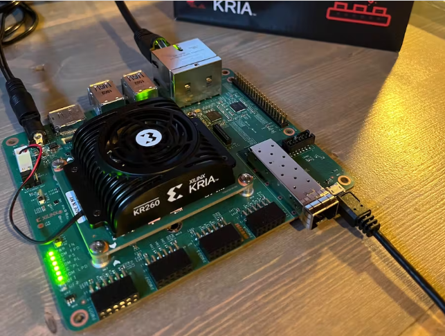

## Story

En el experimento DUNE, el sistema de deteccion de fotones DAPHNE ha psado por una evolucion en la que ha llegado al uso de SOM (System on Modules) donde se espera optener mayor compactibilidad en la implementacion de las tareas de hardware y software, mayor control del sistema y segurdad en la operacion, pues en el contexto del experimento DUNE, este sistema estara 1 km bajo tierra en las cabernas de Fermilab y de dificil acceso para posteriores servicios del sistema, por lo tanto se requiere de alta seguridad y robustes en la implementacion del sistema. Aqui toma protagonismo la KRIA KR260 como el SOM elegido para gestionar la operacion del sistema de deteccion de fotones.

En este tutorial les mostrare los pasos necesarios para iniciar a trabajar con la KRIA KR260 en sus proyectos de sistemas embebidos de alto rendimiento usando las herramientas de Vivado para construir todo el PL, la conexion con hardware embebido diseñado y la integracion con el PS el cual reuqiere de una configuracion especifica desde Vivado, pero tambienla integracion con Petalinux, un sistema operativo basado en Linux creado por Xilinx para el manejo de los sistemas FPGA.

> Vivado is the IDE for developing the hardware in Verilog or VHDL for the programmable logic design of a Xilinx FPGA. Vitis is a software development IDE for writing bare metal or Linux C/C++ applications that run on either a physical ARM-core processor or soft-core processor in the Xilinx FPGA. And PetaLinux is a set of software tools based on the open-source Yocto project for developing an embedded Linux image for Xilinx FPGAs.

### Creation of the Vivado project

First step is to open the Vivado tool, for that we need to source the software in Linux and run this using the follow code to open the IDE:

```bash
~$ source /tools/Xilinx/Vivado/2022.2/settings64.sh
~$ vivado
```

After that, we select `Create Project` and follow the projecvt wizard flow to create and initiate the project:

- Give the project the desired name, in this case we select **Kria_KR260**
- Be sure to check the option on the **Project Type** window that the **Project is an extensible Vitis platform** and **Do not specify sources at this time**, this is the first hook required for a hardware accelerated design.
- In the Part page, switch to the **Boards** tab and click Refresh, then search for **KR260**. Single click on the row for the **Kria KR260 Robotics Starter Kit** and click Next.
- The final page is just a summary of the selections just made for the project that's about to be created. Click **Finish** to create the new Vivado project.

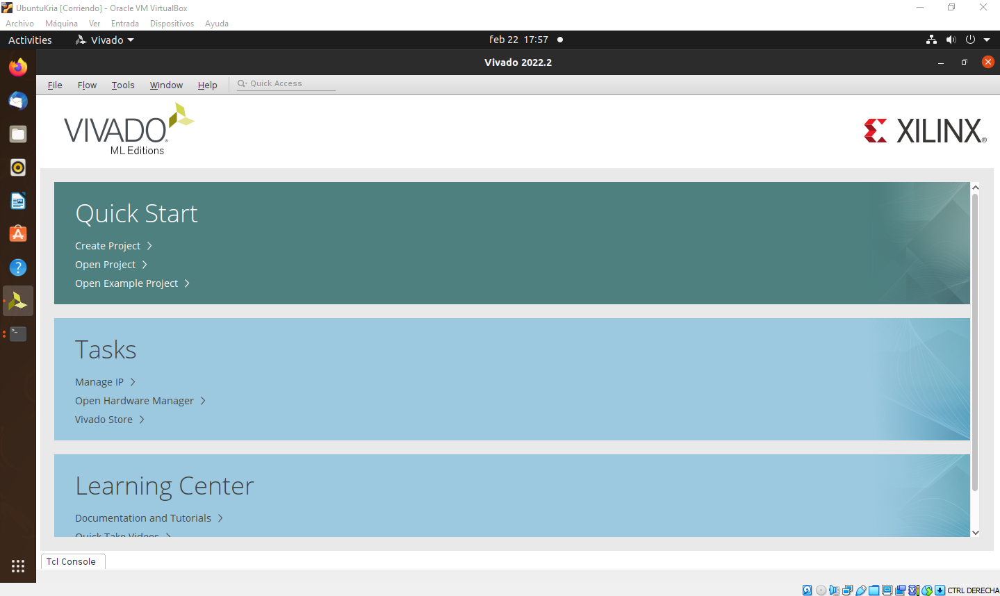

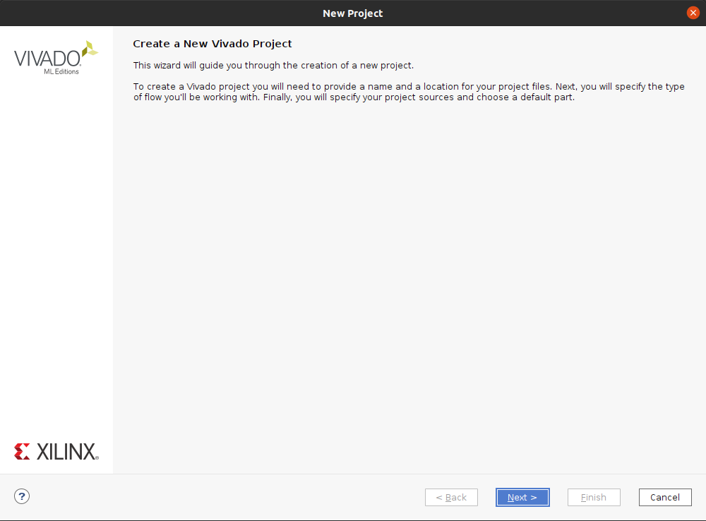
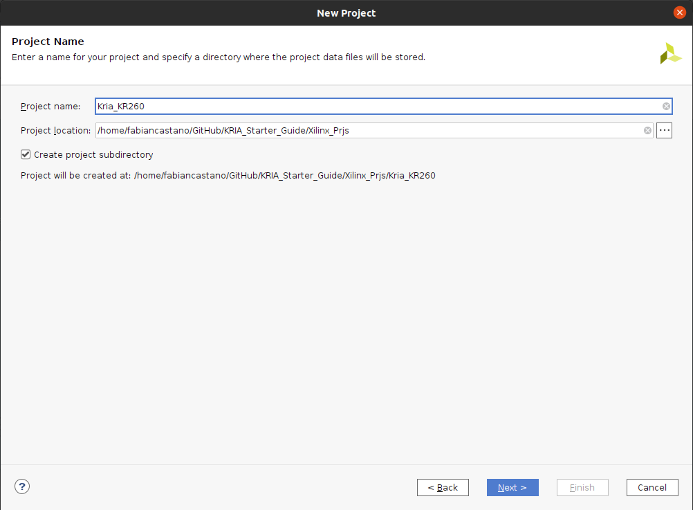

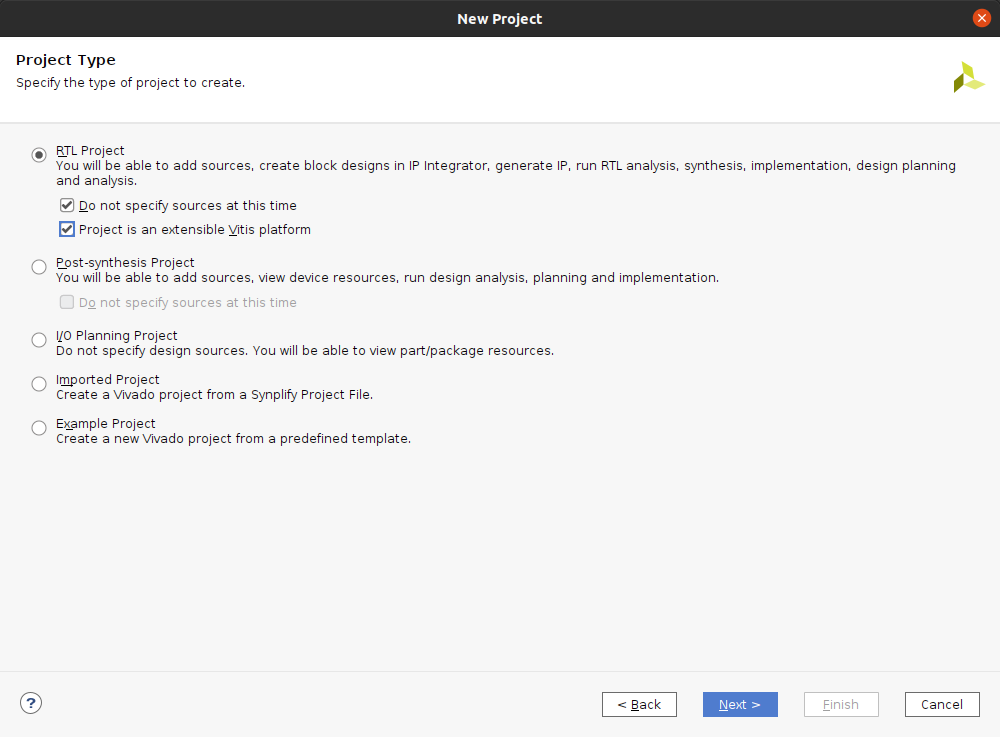

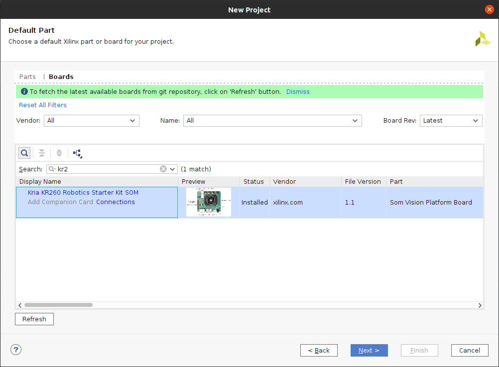

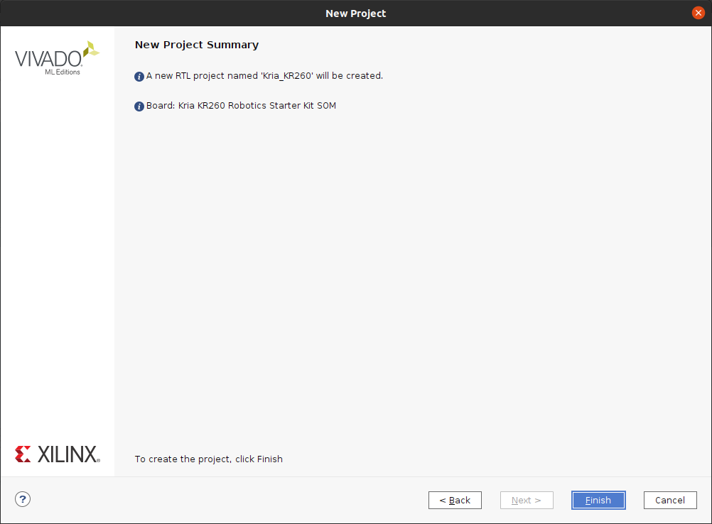

Once the project is generated, it opens to a blank project manager page.

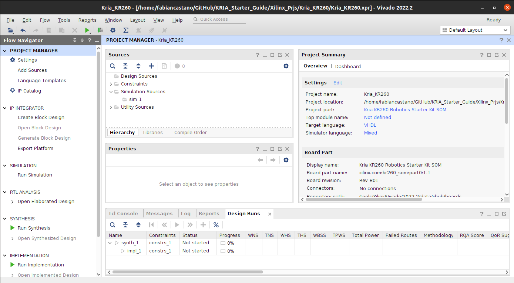

### Create Block Design

The fisrt step in a new Vivado design is to create a block design. A block design is a graphical block programming tool where each block represents a HDL code that is configured and connected together via this GUI.

In the **Project Manager** section, under the **IP Integrator** tab, select the `Create Block Design` option and give it the desired name in the following pop up window.

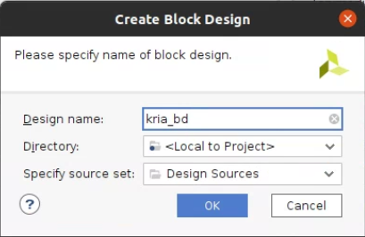

After that, an empty block design window will open:

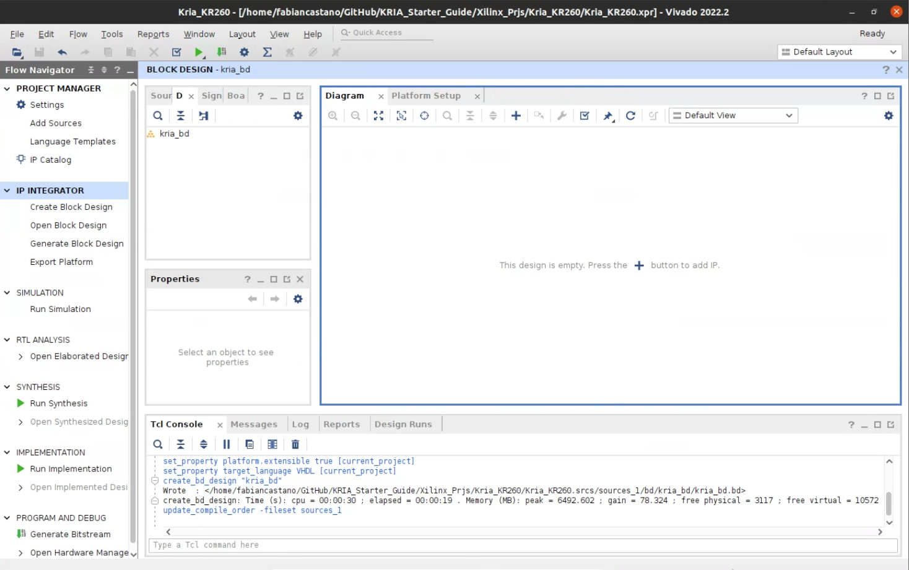

The first thing that you need to add is the processor, in the case of the KRIA, that has a physical ARM-core processor in the PS (Processor System) side, you need to add a **Zynq UltraScale+** module. For this, click on `+` button and search "*zynq*".

Double-click the `Zynq MPSoC IP` to add it to the block design. This IP block is how the ARM-core processor's hardware settings can be customized by a user in the **KRIA SoM**. A green banner will appear at the top of the **Diagram** window with the option to **Run Block Automation**. Block automation will apply the specific KR260 board presets to the Zynq MPSoC IP block.

- Click the link for **Run Block Automation** and ensure that the option to **Apply Board Preset** is checked in the window that pops up before clicking **OK**.
- Port assignation in the **Zynq UltraScale+** block will change to fit with the presets of the KR260 board after the **Run Block Automation.**

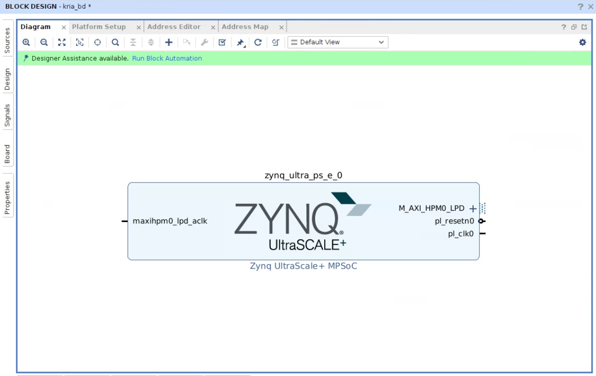

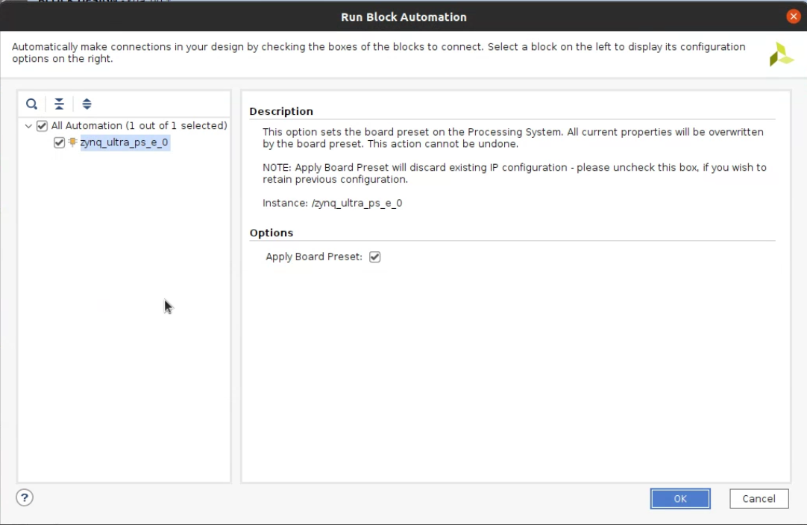

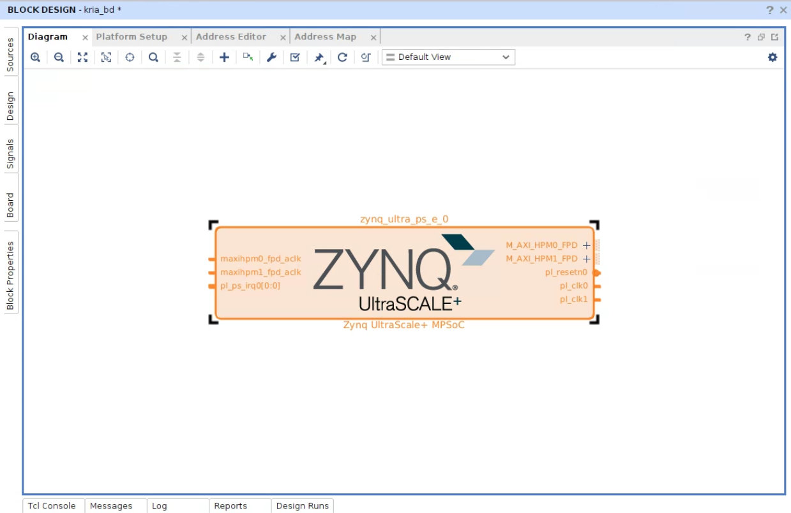

## Modify the IP Core configuration

We recommend to do a basic configuration to have hardware acceleration, which means configuring the hardware in Vivado to have access to it from the software in Vitis/PetaLinux later applying some customizations to the **Zynq UltraScale+** IP.

To customize an IP in the block design, simply double-click on it to bring up the configuration window.

Disable the two full-power high performance AXI ports in the block design and enable the low-power high performance AXI port:


This is to make sure that we will not use the two full-power high performance AXI ports in future updates of this hardware design in the block design because we want to save them solely for hardware acceleration later.

> This is something that's a little counter-intuitive about hardware acceleration in Vivado is that disabling something in the block design doesn't disable it completely in the whole project, it's still an option to enable in the Platform Setup step to make available to the software in Vitis.

### Add the Clocking Wizard IP

Next step is to add a **clocking wizard** IP to my design as a clock source controlled by the **Zynq UltraScale+** IP that can be enabled in the Platform Setup step to make available to the software in Vitis for hardware acceleration.

- Double-click the clocking wizard IP to customize it. In the `Output Clocks` tab, enable the desired number of output clocks with desired rates and change the **polarity** of the `reset` to match that of the reset coming from the **Zynq UltraScale+** IP block (which is `active low`).
- Then, connect the `pl_clk0` output from the **processor** to the `clk_in1` input of the **clocking wizard** IP, and the `pl_reset0` output from the **processor** to the `resetn` of the **clocking wizard**.


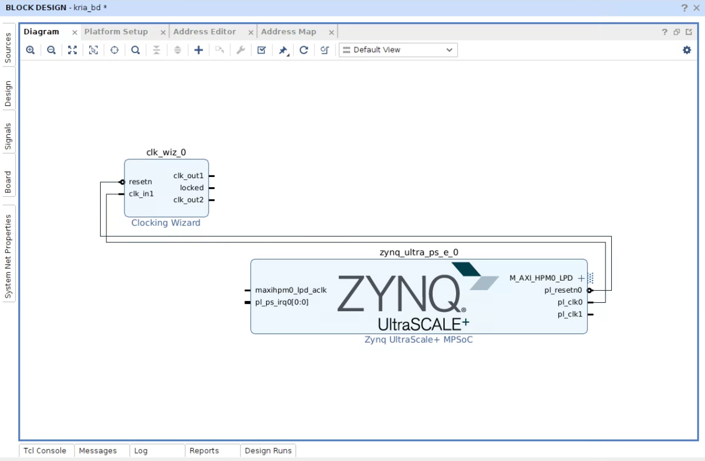

## Add the Processor System Reset IP

Add Processor System Reset IP blocks for each of the output clocks of the clocking wizard IP and connect the `ext_reset_in` of each to the `pl_reset0` output of the **Zynq UltraScale+** IP. Connect `clk_outn` of the **clocking wizard** IP to the `slowest_sync_clk` of each respective **Processor System Reset** IP.

All of the connection automation options can be ignored and they will disappear once the connections described above are made.

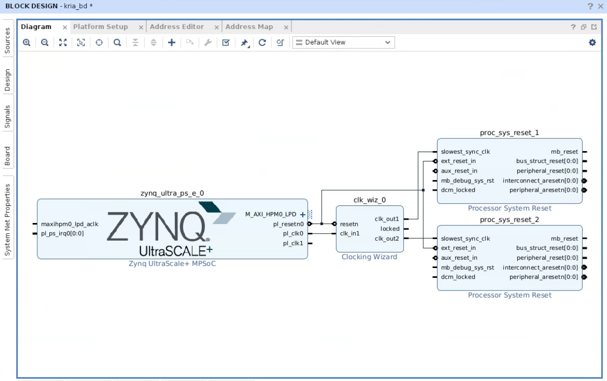

## Add AXI Interrupt Controller IP

Some sort of interrupt source is also needed for hardware accelerated designs. To meet this requirement, add an **AXI interrupt controller** IP. **AXI** is a standard interface that Xilinx uses in their designs as a connection interface for IP blocks in a hardware design because it's highly configurable and the connection process can be automated.

- After adding the **AXI interrupt controller** IP, double-click on the block and change the `Interrupt Output Connection` from **Bus** to `Single`.
- Select the **Run Connection Automation** to automatically configure and connect the **AXI interrupt controllerIP** to the **Zynq UltraScale+** IP via the AXI interface.
- Finally, connect the `irq` output from the **AXI interrupt controller** IP to the `pl_ps_irq` input of the **Zynq UltraScale+** IP.

> In the configuration window for the connection automation, select the **clock** for the AXI interface that you plan to make the default for the hardware acceleration design. In this case use 200 MHz `clk_out2` from the **clocking wizard** IP. Whichever clock you chose, be sure that the clock source for the driving bridge IP, slave interface, and master interface are all set to the same clock source.


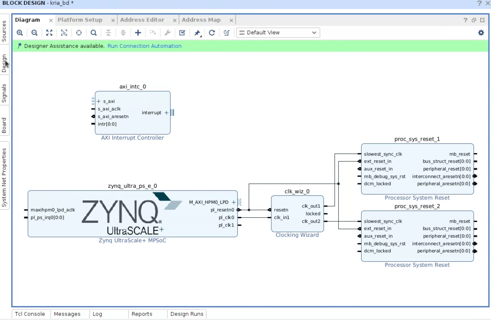


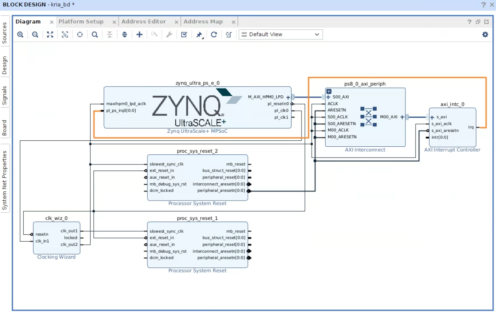

## Platform configuration

As mentioned before, in order to make hardware resources available to the software in Vitis for hardware acceleration, they need to be enabled in the **Platform Setup** tab of the block design.

- The first section in the Platform setup tab is to select the AXI ports to make available to the software in Vitis. Select everything but the low-power high performance AXI port on the **Zynq UltraScale+** IP to enable, then 8 general purpose **Master AXI interfaces** from the regular AXI interconnect as well. Make note of any names you set in the SP tag field, as that is the identifier you will call from the software in Vitis to target that specific AXI port.
- Next, select the clocks to make available to the software in Vitis. In this case, Only make the two output clocks from the clocking wizard available with the 200 MHz `clk_out2` set as the default clock.
- Enable the `irq` output from the **AXI interrupt controller** IP in the Interrupt section.
- Finally, give the platform the desired name, vendor name, and version number.

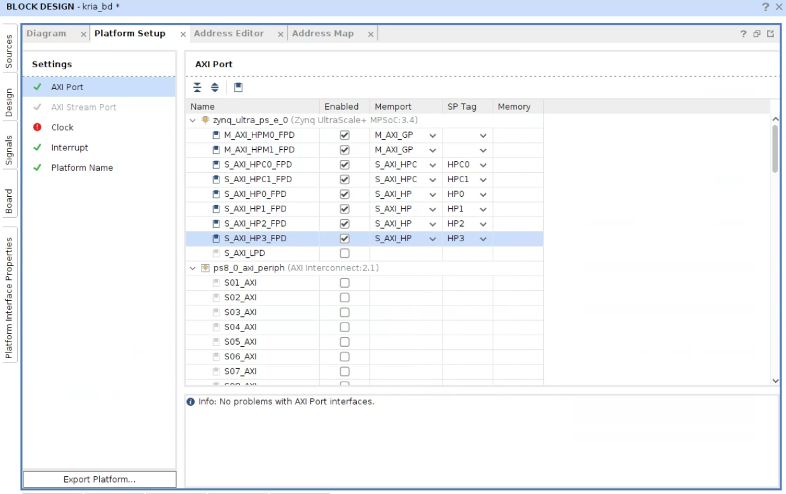
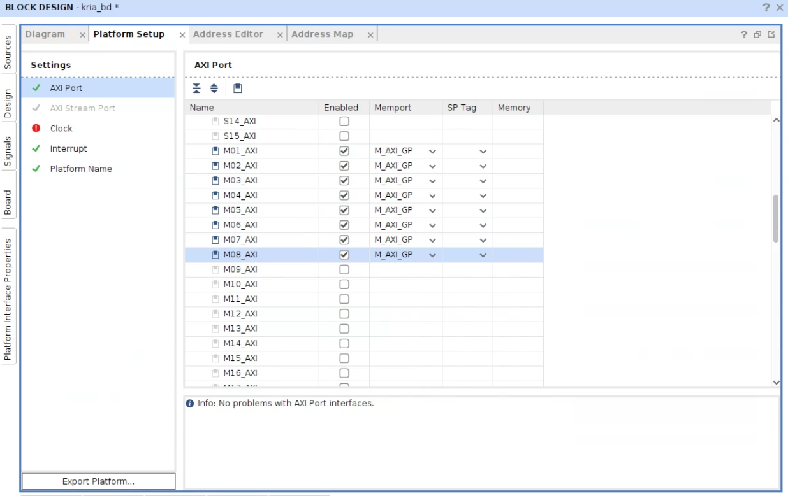

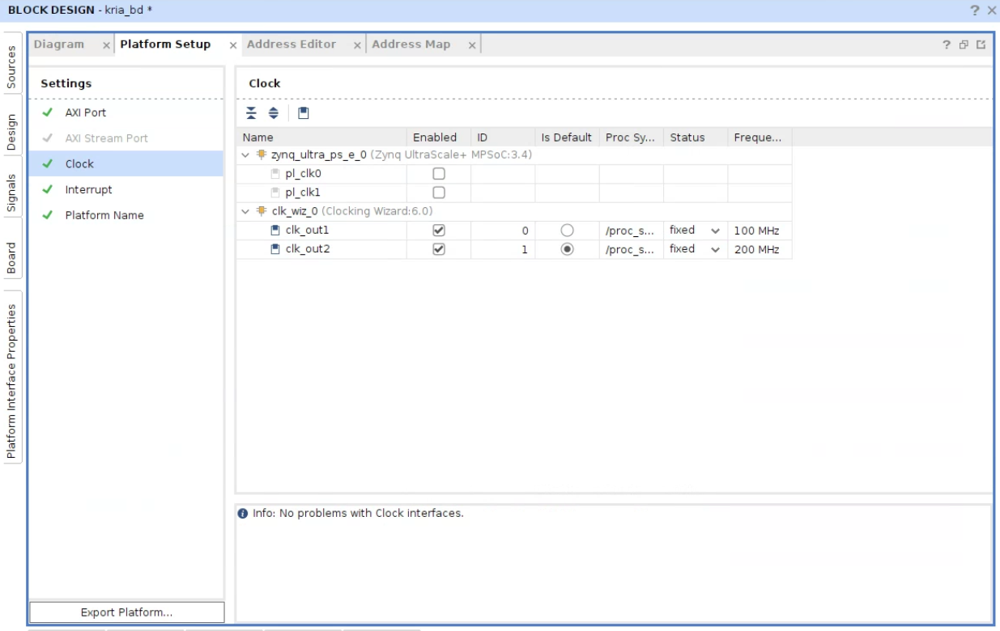

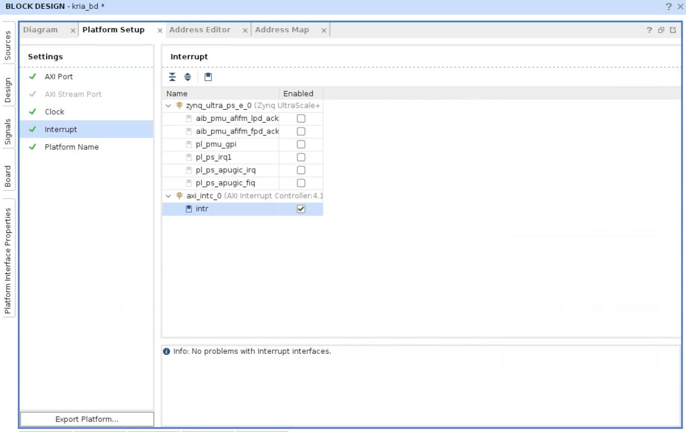

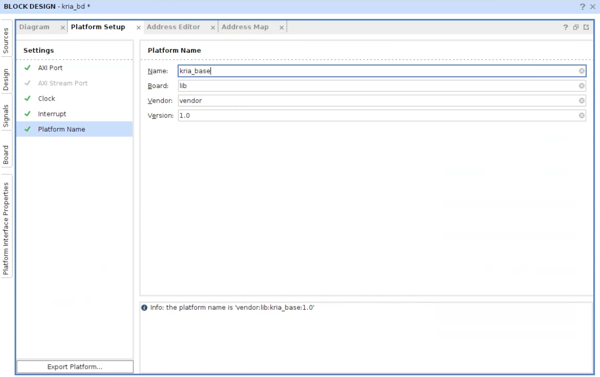

## Apply basic configuration for PS peripherals in KR260 platform

The main configuration that needs to be done is enabling the respective ports for each peripheral on the **Zynq MPSoC** chip itself. To do this, open the block design in the Vivado project and double-click on the **Zynq UltraScale+** IP block to bring up it configuration window.

> **Note**: MIO pins are dedicated interface pins on the Zynq MPSoC chips with direct connection to the ARM-cores. These pins are routed to specific packages pins of the chip that are not accessible to the PL (Programmable Logic) of the FPGA and are not changeable, so there is no need for the user to manually map a signal name to pin number in a constraints file.

> **Note**: EMIO pins are directed form the PS side throuh the PL side to the external ports of the FPGA. These pins are routed through the PL side to any pin in the FPGA making it interchangeable, so it is necessary to map the signal name to a pin number in a constrain file.

- Start with the **I/O Configuration** tab, under *Low Speed* > *Memory Interfaces*, verify the QSPI settings.
- Under *Low Speed *> *I/O Peripherals*, enable `I2C1` on MIO pins 24 - 25.
- Verify the **PMU** settings.
- Enable `SPI1` on MIO pins 6 - 11.
- Enable `UART1` on MIO pins 36 - 37.
- Enable `GPIO0` MIO and `GPIO1` MIO.
- Enable both system-wide watch dog timers `SWDT 0` and `SWDT 1` under **Processing Unit.**
- Enable all four triple timer counters (`TTC0` - `TTC3`) with the first of which outputting its wave out signal to `EMIO`.
- Under **High Speed** for the `RJ45` Ethernet ports on the KR260, enable `GEM 0` on `GT Lane0` and `GEM 1` on MIO pins 38 - 49 with its `MDIO` on MIO pins 50 -51:
- Under **USB0**, enable `USB0` on MIO pins 52 - 63 and **USB 3.0** on `GT Lane2`.
- Under **USB1**, enable `USB1` on MIO pins 64 - 75 and **USB 3.0** on `GT Lane3`.
- Configure the reset pins for the **USB** ports to use a separate MIO pin with an `active low` polarity. Put `USB 0` reset on MIO pin 76 and `USB 1` reset on MIO pin 77.
- Enable the **DisplayPort** on MIO pins 27 - 30 with a Single Lower lane selection on `GT Lane1`.
- Under *General* > *Fabric Reset Enable*, increase **Number of Fabric Resets** from 1 to 4.

There is no benefit to enabling the SATA or PCIe peripherals as they are not physically routed to anything on the Kria PCB nor KR260 PCB.

Again, **Clock Configuration** and **DDR Configuration** were taken care of by the block automation that was ran for the Zynq MPSoC IP which applied the Kria board presets.

Thus, skip to the **PS-PL Configuration** tab (PS = Processing System, PL = Programmable Logic). 


In the end, the block design tab should have check marks on each of the enabled peripherals:


To see how each of these peripherals connect on the KR260 PCB, check out and download its schematic [here](https://login.xilinx.com/app/xilinxinc_f5awsprod_1/exknv8ms950lm0Ldh0x7/sso/saml). There is a very helpful block diagram overview on the second page.

## CPU Fan Driver IP Block Design

To drive the CPU fan on the Kria with the appropriate PWM signal, the wave output of `TTC0` is used. Of the 3-bits of the `TTC0` wave out signal, only bit 0 is needed.

Add **Xslice IP** block and configure to take a 3-bit input and output the LSB, bit 0:


Connect the `Din` input of **xslice_0** to `emio_ttc0_wave_o` of the **Zynq MPSoC** IP.

Right-click on the `Dout` pin of **xslice_0** and select the option to **Make External**. This will create a port pin and connect the Dout pin to it automatically. Rename the port to `fan_en_b` and regenerate the layout.


Validate the block design, save it again, and select **Generate Block Design** from the **Flow Navigator** window. Then create a new **HDL wrapper**, selecting the option to let Vivado auto-manage (see previous post for how to create an HDL wrapper).

## CPU Fan Constrain

Add the constrain file to wire the `fan_en_b` pin, this is based on the PCB design to the KR260 board (see [schematic](https://login.xilinx.com/app/xilinxinc_f5awsprod_1/exknv8ms950lm0Ldh0x7/sso/saml)).

 Create the `fan_pinout.xdc` constrains file and add the following code and save the constrain file.

```bash
set_property BITSTREAM.GENERAL.COMPRESS TRUE [current_design]

#Fan Speed Enable
set_property PACKAGE_PIN A12 [get_ports {fan_en_b}]
set_property IOSTANDARD LVCMOS33 [get_ports {fan_en_b}]
set_property SLEW SLOW [get_ports {fan_en_b}]
set_property DRIVE 4 [get_ports {fan_en_b}]
```

## Validate and save the block design

Once the desired IP has been added/connected in the Diagram and the Platform Setup configuration completed, the overall block design needs to be validated and saved. In the Diagram tab of the block design, click the **checkbox** icon to run a design validation.

> One critical warning appears about the input interrupt not being connected on the AXI interrupt controller, which can safely be ignored in this case.


After clicking OK to dismiss the critical warning, click the **save** icon in the menu bar to save the block design.

## Disable the Incremental Synthesis

The design checkpoint files created by the default incremental synthesis option in Vivado causes issues with the hardware acceleration workflow. So before launching any sort of synthesis run, we need to disable it.

- Select **Settings** in the **Flow Navigator** window then navigate to the Synthesis tab.
- Click the three dots next to the option for **incremental synthesis** and select the option to **Disable incremental synthesis** in the following pop up window.
- Click OK in window to apply the new settings
- Also in **Bitstream** menu, select *bin* checkbox to generate `*.bit` and `*.bin` file together.
- Click OK in window to apply the new settings and return to the Vivado project.


## Generate Block Desing

The next step in a Vivado project where it is also an extensible Vitis platform is to generate the block design in it's own initial run.

Select **Generate Block Design** from the **Flow Navigator** window and change the **Synthesis Options** from Out of context per IP to **Global**.

Then click to **Generate**.


### Create HDL Wrapper

With the block design complete, validated, saved, and generated an HDL wrapper file needs to be created to instantiate it in the overall design. Luckily, Vivado can generate it automatically as well as update it automatically for us.

In the **Sources** window, right-click on the block design file and select the option to **Create HDL Wrapper**...

Then select the option to let Vivado manage the wrapper and auto-update it before clicking **OK** in the pop-up window.

After a few moments, the HDL wrapper file will appear in the Sources window.


### Generate the Bitstream

It's finally time to generate a bitstream for the design. If you're not previously familiar with FPGA design, the overall flow is synthesis, implementation (place & route), and finally the generation of a bitstream. Synthesis is the initial conversion of HDL code to a transistor logic configuration, implementation (generally referred to place & route) is the deployment of the logic design on a specific FPGA chip, and the bitstream is the final output file that's used to program the FPGA with that specific logic configuration.

You can step through and run each of these main steps manually, but Vivado will detect and run any previous steps that might be out-of-date or not yet ran.

So in this case in a new project, when I select to generate a bitstream from the Flow Navigator window, Vivado will automatically determine it needs to run synthesis and implementation prior:

Click OK to launch the runs for synthesis, implementation, and bitstream generation.

## Exportar la plataforma para el SW development

In order to use the hardware design in Vitis and/or PetaLinux to develop software, it needs to be packaged up into a platform file.

Select the option to **Export Platform** from the **Flow Navigator** window.

In the platform packaging windows, select **Hardware** for **Platform Type** (the Kria doesn't currently have emulation support) and be sure to check the option to **include the bitstream** in **Platform State**.


Finally, give the platform the desired name, vendor/version info, description, and select the desired output directory for the exported platform.

At this point, this Vivado project is the perfect base for adding custom hardware to the design and then importing into Vitis and/or PetaLinux. Next tutorial will involve how to pull this exported platform into PetaLinux 2022.2 and add hardware acceleration support to the kernel/root filesystem.
