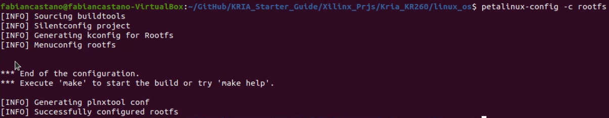

# Empowering DUNE: Creating Petalinux 2022.2 OS Image for KRIA KR260

In this tutorial, we provide the steps to create the Petalinux 2022.2 OS Image to work with KRIA KR260, Vivado 2022.2 and Petalinux 2022.2

For this process, you can follow this [tutorial](https://www.hackster.io/whitney-knitter/getting-started-with-the-kria-kr260-in-petalinux-2022-1-daec16).


### Story

En el experimento DUNE, el sistema de deteccion de fotones DAPHNE ha psado por una evolucion en la que ha llegado al uso de SOM (System on Modules) donde se espera optener mayor compactibilidad en la implementacion de las tareas de hardware y software, mayor control del sistema y segurdad en la operacion, pues en el contexto del experimento DUNE, este sistema estara 1 km bajo tierra en las cabernas de Fermilab y de dificil acceso para posteriores servicios del sistema, por lo tanto se requiere de alta seguridad y robustes en la implementacion del sistema. Aqui toma protagonismo la KRIA KR260 como el SOM elegido para gestionar la operacion del sistema de deteccion de fotones.

En este tutorial les mostrare los pasos necesarios para crear una imagen de Petalinux 2022.2, el sistema operativo que estara embebido en el PS side del SoM KRIA KR260, este contara con las configuraciones necesarias para habilitar los perifericos, algunos paquetes basicos de Linux, Python y C para correr los proyectos diseñados en el uso de sistemas embebidos de alto rtendimiento, tambien todo el sooporte de Vitis SDK para la implementacion de aplicaciones personalizadas con el stack de desarrollo de Xilinx y todas las herramientas necesarias para trabajar con este ssitema. Se explicara paso a paso como se realiza la configuracion del kernel, del root file system, tambien como se crea el proyecto desde cero, algunas modificaciones manuales necesarias para habilitar el soporte para algunos perifericos como el SPI e I2C y el empaquetado de la imagen, luego se mostrar'a como pasar un Overlay Platform creado en Vivado y como se monta en la imagen de Petalinux una vez se ha enviado a la tarjeta por SSH.

> Sometimes in Vitis 2022.2 on Ubuntu 22.04 installation project post, KRS does not support PetaLinux for the KR260, it only supports the cross compilation of an Ubuntu 22.04 image as the root filesystem. So sometimes we need to switched back to the `gcc-multilib` GNU C compiler on the host machine to be able to compile PetaLinux root filesystems. Therefore any PetaLinux projects can be done for the KR260 and could not involve KRS, and will just be accelerated applications and/or regular Linux applications.

## Upgrade the Petalinux SDK (Optional)

The BSPs for the Kria KR260 and KV260 require the Update to be applied to PetaLinux, otherwise the project will not build correctly (if at all). Start be sourcing the PetaLinux tools in the host machine environment.

```bash
source /tools/Xilinx/PetaLinux/2022.2/settings.sh
```

And upgrade the PetaLinux SDK with Update1:

```bash
petalinux-upgrade -u http://petalinux.xilinx.com/sswreleases/rel-v2022/sdkupdate/2022.2_update1/ -p "aarch64" --wget-args "--wait 1 -nH --cut-dirs=4"
```

---

## Source the Petalinux folder

To use the Petalinux Toolkit, it is necessary to source the Petalinux settings file in the main folder. To do this, it is just necessary to open a linux terminal and run the follow command:

```bash
source /tools/Xilinx/PetaLinux/2022.2/settings.sh
```

---

## Create a new Petalinux 2022.2 project for KR260 BSP

First at all, it is necessary to disable the HTTP and HTTPS proxy, this to avoid problems in the execution of Python scripts in the `petalinux-build` process. For this use the follow commands:

```bash
unset http_proxy
unset https_proxy
```

Now, change the directory into the desired location to create the PetaLinux project in. In this case, we use to create the project in the same top folder of the Vivado folder where was created the hardware design. Once in the desired directory location, create a PetaLinux project using the Kria KR260 BSP (download [here](https://www.xilinx.com/member/forms/download/xef.html?filename=xilinx-kr260-starterkit-v2022.2-10141622.bsp)), and change to the directory into it. We will named the project as `linux_os`

> In my case, I downloaded the BSP file into the `/tools/Xilinx/Petalinux/2022.2/bsp_files/` folder

Run the follow commands:

```bash
cd <project folder path>/Kria_KR260/
petalinux-create --type project -s /tools/Xilinx/PetaLinux/2022.2/bsp_files/xilinx-kr260-starterkit-v2022.2-10141622.bsp --name linux_os
cd ./linux_os/
```

Then import the hardware platform exported from Vivado that has the hooks for an accelerated design, this imports the `XSA` file and will use it as platform for **Petalinux**:

```bash
petalinux-config --get-hw-description ../
```

In the system configuration editor, start by enabling **FPGA manager**. Then set the root filesystem type to `INITRD` with the **INITRAMFS/INITRD Image name** set as **petalinux-initramfs-image**, and disable **TFTP boot** if you don't plan to use it.

```bash
FPGA Manager --> Fpga Manager[*]

Image Packaging Configuration --> Root Filesystem Type --> INITRD[*]
Image Packaging Configuration --> INITRAMFS/INITRD Image name --> petalinux-initramfs-image
Image Packaging Configuration --> Copy final images to tftpboot[]
```


Changing the image name to `petalinux-initramfs-image` (default is **petalinux-image-minimal**) is super important or the ramdisk image to mount the root filesystem in the early steps of the boot process will not be generated which will cause the root filesystem to not be persistent between power cycles on the KR260.


Exit the system configuration editor saving the changes.

---

## Pre-building Petalinux

To reduce the time in further steps, attempt to build the project for the first time befor make customizations in the kernel and the root filesystem, remember to be located in `~/Kria_KR260/linux_os$` folder path. To make the first building use the follow command:

> **Note**: This is a first iteration of the project building and takes a lot of time, in my case it was near of two hours building.

```bash
petaliunx-build
```

This is the expected output after the building process was finalized.


---

## Customize and configure the Kernel

If there are any kernel packages you would like to add, launch the kernel configuration editor and select accordingly. There is just few packages that you need to verify in the `kernel` to enable the hardware drivers support, to this you need to run the follow command and verify if the next options are enabled, remember to be located in `~/Kria_KR260/linux_os$` folder path:

```bash
petalinux-config -c kernel
```

Once the **Menu Window** is opened, we must go to the **Device Drivers** section and enable the follow drivers:

- *Device Drivers* > *I2C support* > *I2C Hardware Bus support*, Enable
  - Cadence I2C Controller
  - Xilinx I2C Controller
- *Device Drivers* > *SPI support*, Enable
  - Cadence SPI Controller
  - Cadence Quad SPI Controller
  - Xilinx SPI Controller common module
  - Xilinx ZynqMP GQSPI Controller
  - User mode SPI device driver support

```bash
Device Drivers --> I2C Support --> i2C Hardware Bus Support --> [*] Cadenve I2C Controller
Device Drivers --> I2C Support --> I2C Hardware Bus Support --> [*] Xilinx I2C Controller
Device Drivers --> SPI Support --> [*] Cadence SPI Controller
Device Drivers --> SPI Support --> [*] Cadence Quad SPI Controller
Device Drivers --> SPI Support --> [*] Xilinx SPI Controller common module
Device Drivers --> SPI Support --> [*] Xilinx ZynqMP GQSPI Controller
Device Drivers --> SPI Support --> [*] User mode SPI device driver support
```

---

## Customize and configure the root filesystem

To add the XRT support and the general packages accelerated applications will need in the root filesystem, enable the following packages if they aren't already by the KR260 BSP. To configure the `rootfs` use the follow command, remember to be located in `~/Kria_KR260/linux_os$` folder path:

```bash
petalinux-config -c rootfs
```

Once in the Menu Window, configure the follow packages in the filesystem:

- Filesystem Package > base > i2c-tools, enable:
  - i2c-tools
  - i2c-tools-dev

```bash
Filesystem Packages --> console --> utils --> git --> [*] git
Filesystem Packages --> base --> dnf --> [*] dnf
Filesystem Packages --> base --> i2c-tools --> [*] i2c-tools
Filesystem Packages --> base --> i2c-tools --> [*] i2c-tools-dev
Filesystem Packages --> x11 --> base --> libdrm --> [*] libdrm
Filesystem Packages --> x11 --> base --> libdrm --> [*] libdrm-tests
Filesystem Packages --> x11 --> base --> libdrm --> [*] libdrm-kms
Filesystem Packages --> libs --> xrt --> [*] xrt
Filesystem Packages --> libs --> xrt --> [*] xrt-dev
Filesystem Packages --> libs --> zocl --> [*] zocl
Filesystem Packages --> libs --> libgcc --> [*] libgcc
Filesystem Packages --> libs --> libgcc --> [*] libgcc-dbg
Filesystem Packages --> libs --> libgcc --> [*] libgcc-dev
Filesystem Packages --> libs --> opencl-headers --> [*] opencl-headers
Filesystem Packages --> libs --> opencl-clhpp --> [*] opencl-clhpp-dev
Filesystem Packages --> misc --> packagegroup-core-buildessential --> [*] packagegroup-core-buildessential
Filesystem Packages --> misc --> packagegroup-core-buildessential --> [*] packagegroup-core-buildessential-dev
Filesystem Packages --> misc --> python3 --> [*] python3
Filesystem Packages --> misc --> python3 --> [*] <all-others>
Petaliunx Package Groups --> packagegroup-petalinux --> [*] packagegroup-petalinux
Petaliunx Package Groups --> packagegroup-petalinux-gstreamer --> [*] packagegroup-petalinux-gstreamer
Petaliunx Package Groups --> packagegroup-petalinux-opencv --> [*] packagegroup-petalinux-opencv
Petaliunx Package Groups --> packagegroup-petalinux-v4lutils --> [*] packagegroup-petalinux-v4lutils
Petaliunx Package Groups --> packagegroup-petalinux-x11 --> [*] packagegroup-petalinux-x11
```

> **Note**: Take care of select all the tools that you need, it is just a recomendation, in Python3, select all the packages, I also recommend to search `vim` editor to work in petalinux, but also in this tutorial we will present a link with instructions to install `nano` editor.

Once the comfiguration is finished you spect to see the follow in the terminal.



## Modification of config and system_user.dtsi files to enable SPI Driver

To enable the **SPI driver** in petalinux, at this point we must to modify manually the configuration files that were generate in the configuration process. For this, please follow the following steps.

- In the `config` file that is locate in the `./linux_os/project-spec/config/` folder, we add the follow code block:

```bash
#
# SPI Config
#
CONFIG_SPI_SUN4I=y
CONFIG_SPI_SUN6I=y
CONFIG_SPI=y
CONFIG_SPI_MASTER=y
CONFIG_EXPERIMENTAL=y
CONFIG_SPI_SPIDEV=y
```

- In the `system-user.dtsi` file that is locate in the `./linux_os/project-spec/meta-user/recipes-bsp/device-tree/files/` folder, we modify the file as is shown here:

```bash
/include/ "system-conf.dtsi"
/ {
};
&spi0{
    status = "okay";
    spidev@0x00 {
        status = "okay";
        compatible = "rohm,dh2228fv";
        spi-max-frequency = <25000000>;
        reg = <0>;
    };
};
&spi1{
    status = "okay";
    spi-slave;
    slave {
        compatible = "spi-slave-time";
    };
    spidev@0x01 {
        status = "okay";
        compatible = "rohm,dh2228fv";
        spi-max-frequency = <25000000>;
        reg = <0>;
    };
};

```

This enable the use of **SPIDev driver** for the **SPI**.

## Petalinux build and Image Packaging

Rebuild the project after adding the packages to the root filesystem (and kernel if you choose), remember to be located in `~/Kria_KR260/linux_os$` folder path:

```bash
petaliunx-build
```


---

## Build the Sysroot (SDK) for the project

After the project has been built, build the SDK for the project to get a sysroot to use with Vitis to compile any custom accelerated applications later on, remember to be located in `~/Kria_KR260/linux_os$` folder path:

```bash
petaliunx-build --sdk
```

## Package the image WIC for SD Card

Once the project has been built, package the boot binary for the custom image:

```bash
petalinux-package --boot --u-boot --force
```


Then package the WIC image for the SD card:

```bash
petalinux-package --wic --images-dir images/linux/ --bootfiles "ramdisk.cpio.gz.u-boot,boot.scr,Image,system.dtb,system-zynqmp-sck-kr-g-revB.dtb" --disk-name "sda"
```


> Note that since the KR260 has the SD card connected to the Zynq FPGA via the USB controller on the KR260 carrier board, that's why we need to specify the disk name as sda.

---

## Flash SD Card

You can manually load the wic onto the SD card from the command line, but I go the lazy route and use balenaEtcher:


As point you can put the SD Card in the KRIA KR260 board and boot this, the first time it will ask for an user and to change the password, the user was assigned by default as `petalinux` and you can to use the password that you want, in the case of this example we use `petalinux` as well.

The next steps are related with the use of the hardware platform generated by Vivado to create a **Device Tree Overlay**.

---

## Generate the Device Tree Overlay from the PL Design

The device tree blob containing the overlay nodes needs to be compiled for the design, which is easily done by using the Xilinx Software Command Line Tools (**XSCT**), for this, locate in the hardware project folder (`./Kria_KR260`) and run the follow commands:

```bash
source /tools/Xilinx/Vitis/2022.1/settings64.sh
xsct
```

In the xsct environment (`xsct%`), open the exported *XSA* from Vivado and use the  `createdts` command to create the device tree source files for the PL design:

```bash
xsct% hsi::open_hw_design kria_base.xsa

xsct% createdts -hw kria_base.xsa -zocl -platform-name kria_kr260 -git-branch xlnx_rel_v2022.2 -overlay -compile -out ./dtg_kr260_v0

xsct% exit
```


After exiting **XSCT**, use the standard Linux device tree compiler (`dtc`) to compile the source files into the needed device tree blob:

```bash
dtc -@ -O dtb -o ./dtg_kr260_v0/dtg_kr260_v0/kria_kr260/psu_cortexa53_0/device_tree_domain/bsp/pl.dtbo ./dtg_kr260_v0/dtg_kr260_v0/kria_kr260/psu_cortexa53_0/device_tree_domain/bsp/pl.dtsi
```

---

## Transfer the files of the PL Design to the KR260

I like to create a folder to copy all of the necessary design files to that need to be uploaded to the KR260 for an accelerated application or PL design like this (note: the Kria_KR260 directory is the top level directory of the Vivado project):

```bash
mkdir -p overlay_file_transfer
cd ./overlay_file_transfer/
```

It’s here I’ll create the description file, `shell.json`, for the design:

```bash
~/Kria_KR260/overlay_file_transfer$ nano shell.json
```

And copy+paste the following to `shell.json`:

```json
{
  "shell_type": "XRT_FLAT",
  "num_slots": "1"
}
```

Then copy the generated device tree blob and .bin file into the folder:

```bash
cp ../dtg_kr260_v0/dtg_kr260_v0/kria_kr260/psu_cortexa53_0/device_tree_domain/bsp/pl.dtbo ./
cp ../Kria_KR260.runs/impl_1/kria_bd_wrapper.bin ./
```

Rename the device tree blob and .bin file to the same thing (the only difference should be their respect file extensions (also change the.bin extension to `.bit.bin`):

```bash
mv kria_bd_wrapper.bin kr260_overlay.bit.bin
mv pl.dtbo kr260_overlay.dtbo
```

Then, with the KR260 booted up and running with the new SD card image generated in the previous steps and connected to the local network, transfer the new PL design files to it:

```bash
scp kr260_overlay.dtbo kr260_overlay.bit.bin shell.json petalinux@xilinx-kr260-starterkit-20222:/home/petalinux
```

---

## Run PL Design on KR260

> This part of the tutorial is execute in the KRIA KR260, you need to connect to it through **SSH** using the follow command and your access password:
>
> ```bash
> ssh petalinux@xilinx-kr260-starterkit-20222
> ```

In the KRIA KR260 terminal, verify if the files are presented there, then create a directory in the `/lib/firmware/xilinx` directory with the same name as was given to the device tree blob and .bin file and copy them into it:

```bash
sudo mkdir /lib/firmware/xilinx/kr260_overlay
sudo mv kr260_overlay.dtbo kr260_overlay.bit.bin shell.json /lib/firmware/xilinx/kr260_overlay
```

At this point, the PL design will show up just like an accelerated application would using the xmutil commands:

```bash
sudo xmutil listapps
```

Unload the default application then load the PL design which flashes the PL design’s bitstream into the PL and loads its device tree overlay:

```bash
sudo xmutil unloadapp
sudo xmutil loadapp kr260_overlay
```

When the device tree overlay loads, the terminal will print out as such indicating the new device tree nodes for each of the AXI GPIO IP blocks are now present in the system.

---

Utilities installation
----------------------

To install `nano` package, follow the next [tutorial](https://www.hackster.io/sasha-falkovich/kria-kv260-petalinux-build-nano-from-source-on-the-mpsoc-8118f1).
