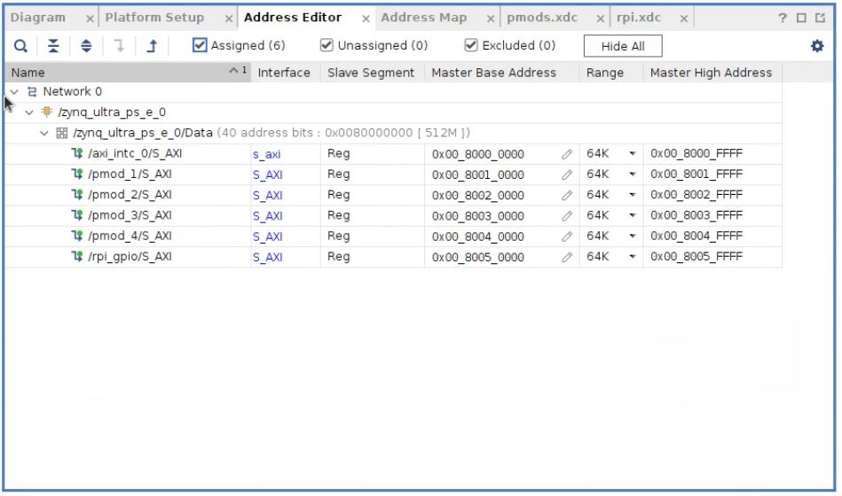

# Empowering DUNE: Support for hardware peripherals RPi+PMOD in KRIA KR260

In this tutorial, we provide the steps to create the hardware design to support the RPi and PMOD connectors, also to control these from the PS side using Vivado 2022.2 and Petalinux 2022.2

For this process, you can follow this [tutorial](https://www.hackster.io/whitney-knitter/rpi-pmod-connector-gpio-with-custom-pl-design-in-kria-kr260-53c40e).


## Story

En el experimento DUNE, el sistema de deteccion de fotones DAPHNE ha psado por una evolucion en la que ha llegado al uso de SOM (System on Modules) donde se espera optener mayor compactibilidad en la implementacion de las tareas de hardware y software, mayor control del sistema y segurdad en la operacion, pues en el contexto del experimento DUNE, este sistema estara 1 km bajo tierra en las cabernas de Fermilab y de dificil acceso para posteriores servicios del sistema, por lo tanto se requiere de alta seguridad y robustes en la implementacion del sistema. Aqui toma protagonismo la KRIA KR260 como el SOM elegido para gestionar la operacion del sistema de deteccion de fotones.

En este tutorial les mostrare los pasos necesarios para incluir algunos perifericos de control de pines externos y conexion a traves del puerto AXI, con esto agregaremos soporte para los conectores RPi y PMOD incluidos en la carrier board de la KRIA KR260. Una vez configurado el proyecto en Vivado 2022.2, realizada la sintesis y la implementacion, creado el bitstream y exportada la plataforma, se enviara esta crando el Device Tree Overlay a la KRIA KR260, se implementara el hardware embebido y se dara control a los perifericos a traves del puerto AXI desde Petalinux 2022.2.

> One of the features I was excited to get with the Kria KR260 for my robotics applications that the Kria KV260 didn’t have was the extra I/O connectors to drive various peripherals such as motors. Given that I/O mapping on an FPGA can be a bit more complex than your typical microcontroller board like the Raspberry Pi or BeagleBone, I decided to do a writeup covering how I map the I/Os of a new AMD-Xilinx development board.
>
> Furthermore since the Kria is a SoM (System on Module), I/O mapping on it has an added layer of complexity given that it spans over two separate boards: the Kria K26 base board, and the KR260 carrier board. So knowing where to look to find the info needed to fully map out a signal from a pin on a PMOD or the RPi header all the way to a package pin on the Kria’s K26 FPGA itself can seem skewed for first-time users.
>
> Finally, the PMODs and RPi header on the KR260 are connected to the programmable logic of the K26 versus the MIO/EMIO pins that most of the other peripherals are connected to. This requires a modification of the block design (or addition of HDL code) in Vivado to add the logic for the desired interface to each of the connectors. Which means a new bitstream will be generated and corresponding hardware node in the device tree will also be required.
>
> For those not familiar, the boot process of the Kria’s embedded Linux image boots the ARM-core processors of the Zynq MPSoC in the K26 FPGA before flashing a bitstream onto its programmable logic (PL). Thus any hardware nodes in the device tree for things located in the PL have to be loaded as a device tree overlay later, otherwise the boot process would freeze looking for device tree nodes that aren’t present in the system yet since the PL has yet to be programmed. This is why there is no device tree packaged into the default boot binary (boot.bin) for the Kria boards you download from the [K26 SoM wiki](https://xilinx-wiki.atlassian.net/wiki/spaces/A/pages/1641152513/Kria+K26+SOM#Boot-Firmware-Updates).
>
> Now it’s definitely possible to reconfigure a PetaLinux project built from the KR260/KV260 BSP to change the boot sequence to program the PL during boot and package a device tree into the boot binary. It’s also possible to just create a Petalinux project from scratch configured in this manner as well, but a PetaLinux project for the Kria boards is still complex enough that it’s much easier/faster to modify a project created from a BSP (which is why I will not do a project tutorial for KR260/KV260 Petalinux project built from scratch, 99% of it would just be copy+pasting stuff from a project built using the BSP). However, I’ve found the easiest solution is to load the device tree overlay the exact same way as I would for an accelerated application and be on my merry way, which is what I will be demonstrating in this project.

## Download KR260 schematic

The schematic for the KR260 carrier board (XTP743) can be found [here](https://www.xilinx.com/member/forms/download/design-license.html?cid=bad0ada6-9a32-427e-a793-c68fed567427&filename=xtp743-kr260-schematic.zip). It must be downloaded directly from AMD-Xilinx’s site since a user agreement must be digitally signed prior to downloading.

The schematic for the Kria K26 base board is not publicly available given it’s a commercial product and not just a development part. However, there is a master pinout constraints file included in the download of the KR260 schematic that provides the necessary information for signal mapping.

## Modify the block design in Vivado 2022.2

As I mentioned previously, since the PMOD and RPi headers are connected via the PL, the block design in Vivado needs to be updated to add the specific interface desired for each connector. Constrains files also need to be added to specify the package pins on the FPGA. I will use a copy of the previous Vivado project created to configurate the PS side to run Petalinux as was shown in the previous posts. To do this, you just need to go to the porject menu and save as a copy o this project.

Now, I will use **AXI GPIO** IP block for everything, I’m not going to cover the RPi special functions at the moment, but you would simply add the appropriate IPs for each special function like I2C or SPI. So I added 5 **AXI GPIO** IP blocks to the block design: four are one channel of 8 bits for **PMOD** connectors and the fifth is one channel of 28 bits for **RPi** connector.


Once added, run the corresponding **Connection Automation** that appeared, leaving all selections for clock as the default.


Validate the block design and save it, then **generate** the block design again.

Create a new HDL wrapper by right-clicking on the block design file in the Hierarchy tab of the Sources window and selecting **Create HDL Wrapper**. Select to either allow Vivado to auto-manage it or allow for user edits.

## Add Constrains

With the signal names pulled up to the top level HDL file, they need to be connected to specific package pins on the FPGA via constrain files.

I added two new constraints files to the design (*Add Sources* > *Add or create constraints* > *Create File*), one for the PMODs and one for the RPi header. Everything could definitely be in the same constraints file, it complies the same way regardless. I personally find it easier to keep things organized by separating out the different type of connectors into separate constraints files.

The tricky thing about the IO of the PMOD on the KR260 is that the PMOD IO numbering is different from the physical connector’s pin numbering is done, especially since pin 1 and pin 8 on the connector match up with PMOD IO1 and PMOD IO8, but the rest of the connector’s pin alternate sides while the PMOD IOs go across the connectors:


In the follow table, it is provide a mapping of the PMOD outputs and the SoM pin name:


Since the PMOD IO signal names go across the connectors, that’s how is structured in the constraints file with each broken up into the “**upper**” and “**lower**” IOs (also see constraints files attached below).


In the case of RPi connector it was made something similar to map the pins of the SoM and the output pins of the FPGA:


You’ll notice I also went back and added the Sysfs GPIO numbers to the spreadsheet once they registered in the Linux system (explained in last section). I highly recommend some sort of overall documentation system as such for designs like this because this would be a nightmare to reverse engineer a few weeks/months later.

Here, it is the constrain file for the PMODs:

```bash
##################### PMOD 1 Upper ###################################
set_property PACKAGE_PIN H12 [get_ports {pmod1_io_tri_io[0]}]
set_property IOSTANDARD LVCMOS33 [get_ports {pmod1_io_tri_io[0]}]

set_property PACKAGE_PIN E10 [get_ports {pmod1_io_tri_io[1]}]
set_property IOSTANDARD LVCMOS33 [get_ports {pmod1_io_tri_io[1]}]

set_property PACKAGE_PIN D10 [get_ports {pmod1_io_tri_io[2]}]
set_property IOSTANDARD LVCMOS33 [get_ports {pmod1_io_tri_io[2]}]

set_property PACKAGE_PIN C11 [get_ports {pmod1_io_tri_io[3]}]
set_property IOSTANDARD LVCMOS33 [get_ports {pmod1_io_tri_io[3]}]

##################### PMOD 1 Lower ###################################
set_property PACKAGE_PIN B10 [get_ports {pmod1_io_tri_io[4]}]
set_property IOSTANDARD LVCMOS33 [get_ports {pmod1_io_tri_io[4]}]

set_property PACKAGE_PIN E12 [get_ports {pmod1_io_tri_io[5]}]
set_property IOSTANDARD LVCMOS33 [get_ports {pmod1_io_tri_io[5]}]

set_property PACKAGE_PIN D11 [get_ports {pmod1_io_tri_io[6]}]
set_property IOSTANDARD LVCMOS33 [get_ports {pmod1_io_tri_io[6]}]

set_property PACKAGE_PIN B11 [get_ports {pmod1_io_tri_io[7]}]
set_property IOSTANDARD LVCMOS33 [get_ports {pmod1_io_tri_io[7]}]


##################### PMOD 2 Upper ###################################
set_property PACKAGE_PIN J11 [get_ports {pmod2_io_tri_io[0]}]
set_property IOSTANDARD LVCMOS33 [get_ports {pmod2_io_tri_io[0]}]

set_property PACKAGE_PIN J10 [get_ports {pmod2_io_tri_io[1]}]
set_property IOSTANDARD LVCMOS33 [get_ports {pmod2_io_tri_io[1]}]

set_property PACKAGE_PIN K13 [get_ports {pmod2_io_tri_io[2]}]
set_property IOSTANDARD LVCMOS33 [get_ports {pmod2_io_tri_io[2]}]

set_property PACKAGE_PIN K12 [get_ports {pmod2_io_tri_io[3]}]
set_property IOSTANDARD LVCMOS33 [get_ports {pmod2_io_tri_io[3]}]

##################### PMOD 2 Lower ###################################
set_property PACKAGE_PIN H11 [get_ports {pmod2_io_tri_io[4]}]
set_property IOSTANDARD LVCMOS33 [get_ports {pmod2_io_tri_io[4]}]

set_property PACKAGE_PIN G10 [get_ports {pmod2_io_tri_io[5]}]
set_property IOSTANDARD LVCMOS33 [get_ports {pmod2_io_tri_io[5]}]

set_property PACKAGE_PIN F12 [get_ports {pmod2_io_tri_io[6]}]
set_property IOSTANDARD LVCMOS33 [get_ports {pmod2_io_tri_io[6]}]

set_property PACKAGE_PIN F11 [get_ports {pmod2_io_tri_io[7]}]
set_property IOSTANDARD LVCMOS33 [get_ports {pmod2_io_tri_io[7]}]


##################### PMOD 3 Upper ###################################
set_property PACKAGE_PIN AE12 [get_ports {pmod3_io_tri_io[0]}]
set_property IOSTANDARD LVCMOS33 [get_ports {pmod3_io_tri_io[0]}]

set_property PACKAGE_PIN AF12 [get_ports {pmod3_io_tri_io[1]}]
set_property IOSTANDARD LVCMOS33 [get_ports {pmod3_io_tri_io[1]}]

set_property PACKAGE_PIN AG10 [get_ports {pmod3_io_tri_io[2]}]
set_property IOSTANDARD LVCMOS33 [get_ports {pmod3_io_tri_io[2]}]

set_property PACKAGE_PIN AH10 [get_ports {pmod3_io_tri_io[3]}]
set_property IOSTANDARD LVCMOS33 [get_ports {pmod3_io_tri_io[3]}]

##################### PMOD 3 Lower ###################################
set_property PACKAGE_PIN AF11 [get_ports {pmod3_io_tri_io[4]}]
set_property IOSTANDARD LVCMOS33 [get_ports {pmod3_io_tri_io[4]}]

set_property PACKAGE_PIN AG11 [get_ports {pmod3_io_tri_io[5]}]
set_property IOSTANDARD LVCMOS33 [get_ports {pmod3_io_tri_io[5]}]

set_property PACKAGE_PIN AH12 [get_ports {pmod3_io_tri_io[6]}]
set_property IOSTANDARD LVCMOS33 [get_ports {pmod3_io_tri_io[6]}]

set_property PACKAGE_PIN AH11 [get_ports {pmod3_io_tri_io[7]}]
set_property IOSTANDARD LVCMOS33 [get_ports {pmod3_io_tri_io[7]}]


##################### PMOD 4 Upper ###################################
set_property PACKAGE_PIN AC12 [get_ports {pmod4_io_tri_io[0]}]
set_property IOSTANDARD LVCMOS33 [get_ports {pmod4_io_tri_io[0]}]

set_property PACKAGE_PIN AD12 [get_ports {pmod4_io_tri_io[1]}]
set_property IOSTANDARD LVCMOS33 [get_ports {pmod4_io_tri_io[1]}]

set_property PACKAGE_PIN AE10 [get_ports {pmod4_io_tri_io[2]}]
set_property IOSTANDARD LVCMOS33 [get_ports {pmod4_io_tri_io[2]}]

set_property PACKAGE_PIN AF10 [get_ports {pmod4_io_tri_io[3]}]
set_property IOSTANDARD LVCMOS33 [get_ports {pmod4_io_tri_io[3]}]

##################### PMOD 3 Lower ###################################
set_property PACKAGE_PIN AD11 [get_ports {pmod4_io_tri_io[4]}]
set_property IOSTANDARD LVCMOS33 [get_ports {pmod4_io_tri_io[4]}]

set_property PACKAGE_PIN AD10 [get_ports {pmod4_io_tri_io[5]}]
set_property IOSTANDARD LVCMOS33 [get_ports {pmod4_io_tri_io[5]}]

set_property PACKAGE_PIN AA11 [get_ports {pmod4_io_tri_io[6]}]
set_property IOSTANDARD LVCMOS33 [get_ports {pmod4_io_tri_io[6]}]

set_property PACKAGE_PIN AA10 [get_ports {pmod4_io_tri_io[7]}]
set_property IOSTANDARD LVCMOS33 [get_ports {pmod4_io_tri_io[7]}]
```

And this is the constrain file for the RPi connector:

```bash
##################### Raspberry Pi GPIO Header #######################
### AXI GPIO ###
set_property PACKAGE_PIN AD15 [get_ports {rpi_gpio_tri_io[0]}]
set_property IOSTANDARD LVCMOS33 [get_ports {rpi_gpio_tri_io[0]}]

set_property PACKAGE_PIN AD14 [get_ports {rpi_gpio_tri_io[1]}]
set_property IOSTANDARD LVCMOS33 [get_ports {rpi_gpio_tri_io[1]}]

set_property PACKAGE_PIN AE15 [get_ports {rpi_gpio_tri_io[2]}]
set_property IOSTANDARD LVCMOS33 [get_ports {rpi_gpio_tri_io[2]}]

set_property PACKAGE_PIN AE14 [get_ports {rpi_gpio_tri_io[3]}]
set_property IOSTANDARD LVCMOS33 [get_ports {rpi_gpio_tri_io[3]}]

set_property PACKAGE_PIN AG14 [get_ports {rpi_gpio_tri_io[4]}]
set_property IOSTANDARD LVCMOS33 [get_ports {rpi_gpio_tri_io[4]}]

set_property PACKAGE_PIN AH14 [get_ports {rpi_gpio_tri_io[5]}]
set_property IOSTANDARD LVCMOS33 [get_ports {rpi_gpio_tri_io[5]}]

set_property PACKAGE_PIN AG13 [get_ports {rpi_gpio_tri_io[6]}]
set_property IOSTANDARD LVCMOS33 [get_ports {rpi_gpio_tri_io[6]}]

set_property PACKAGE_PIN AH13 [get_ports {rpi_gpio_tri_io[7]}]
set_property IOSTANDARD LVCMOS33 [get_ports {rpi_gpio_tri_io[7]}]

set_property PACKAGE_PIN AC14 [get_ports {rpi_gpio_tri_io[8]}]
set_property IOSTANDARD LVCMOS33 [get_ports {rpi_gpio_tri_io[8]}]

set_property PACKAGE_PIN AC13 [get_ports {rpi_gpio_tri_io[9]}]
set_property IOSTANDARD LVCMOS33 [get_ports {rpi_gpio_tri_io[9]}]

set_property PACKAGE_PIN AE13 [get_ports {rpi_gpio_tri_io[10]}]
set_property IOSTANDARD LVCMOS33 [get_ports {rpi_gpio_tri_io[10]}]

set_property PACKAGE_PIN AF13 [get_ports {rpi_gpio_tri_io[11]}]
set_property IOSTANDARD LVCMOS33 [get_ports {rpi_gpio_tri_io[11]}]

set_property PACKAGE_PIN AA13 [get_ports {rpi_gpio_tri_io[12]}]
set_property IOSTANDARD LVCMOS33 [get_ports {rpi_gpio_tri_io[12]}]

set_property PACKAGE_PIN AB13 [get_ports {rpi_gpio_tri_io[13]}]
set_property IOSTANDARD LVCMOS33 [get_ports {rpi_gpio_tri_io[13]}]

set_property PACKAGE_PIN W14 [get_ports {rpi_gpio_tri_io[14]}]
set_property IOSTANDARD LVCMOS33 [get_ports {rpi_gpio_tri_io[14]}]

set_property PACKAGE_PIN W13 [get_ports {rpi_gpio_tri_io[15]}]
set_property IOSTANDARD LVCMOS33 [get_ports {rpi_gpio_tri_io[15]}]

set_property PACKAGE_PIN AB15 [get_ports {rpi_gpio_tri_io[16]}]
set_property IOSTANDARD LVCMOS33 [get_ports {rpi_gpio_tri_io[16]}]

set_property PACKAGE_PIN AB14 [get_ports {rpi_gpio_tri_io[17]}]
set_property IOSTANDARD LVCMOS33 [get_ports {rpi_gpio_tri_io[17]}]

set_property PACKAGE_PIN Y14 [get_ports {rpi_gpio_tri_io[18]}]
set_property IOSTANDARD LVCMOS33 [get_ports {rpi_gpio_tri_io[18]}]

set_property PACKAGE_PIN Y13 [get_ports {rpi_gpio_tri_io[19]}]
set_property IOSTANDARD LVCMOS33 [get_ports {rpi_gpio_tri_io[19]}]

set_property PACKAGE_PIN W12 [get_ports {rpi_gpio_tri_io[20]}]
set_property IOSTANDARD LVCMOS33 [get_ports {rpi_gpio_tri_io[20]}]

set_property PACKAGE_PIN W11 [get_ports {rpi_gpio_tri_io[21]}]
set_property IOSTANDARD LVCMOS33 [get_ports {rpi_gpio_tri_io[21]}]

set_property PACKAGE_PIN Y12 [get_ports {rpi_gpio_tri_io[22]}]
set_property IOSTANDARD LVCMOS33 [get_ports {rpi_gpio_tri_io[22]}]

set_property PACKAGE_PIN AA12 [get_ports {rpi_gpio_tri_io[23]}]
set_property IOSTANDARD LVCMOS33 [get_ports {rpi_gpio_tri_io[23]}]

set_property PACKAGE_PIN Y9 [get_ports {rpi_gpio_tri_io[24]}]
set_property IOSTANDARD LVCMOS33 [get_ports {rpi_gpio_tri_io[24]}]

set_property PACKAGE_PIN AA8 [get_ports {rpi_gpio_tri_io[25]}]
set_property IOSTANDARD LVCMOS33 [get_ports {rpi_gpio_tri_io[25]}]

set_property PACKAGE_PIN AB10 [get_ports {rpi_gpio_tri_io[26]}]
set_property IOSTANDARD LVCMOS33 [get_ports {rpi_gpio_tri_io[26]}]

set_property PACKAGE_PIN AB9 [get_ports {rpi_gpio_tri_io[27]}]
set_property IOSTANDARD LVCMOS33 [get_ports {rpi_gpio_tri_io[27]}]
```

## Generate Bitstream with Binary file included

By default, Vivado generates only a `.bit` file for the bitstream, which contains extra configuration info that’s not needed in this case since the ARM processor is already booted when the bitstream is being flashed onto the PL. So the option for Vivado to also generate a `.bin` file for the bitstream needs to be enabled. Open Settings from the **Flow Navigator** window, then in the **Bitstream** tab, enable the option for **-bin_file** (this will cause a `<design_name>.bin` file to be generated and output into `/<Vivado project>/<Vivado project>.runs/impl_1/`):

Run synthesis, implementation, and generate bitstream for the design, as well as export the platform the same way as before.

## Generate the Device Tree Overlay from the PL Design

The device tree blob containing the overlay nodes needs to be compiled for the design, which is easily done by using the Xilinx Software Command Line Tools (**XSCT**), for this, locate in the hardware project folder (`./Kria_KR260`) and run the follow commands:

```bash
source /tools/Xilinx/Vitis/2022.1/settings64.sh
xsct
```

In the xsct environment (`xsct%`), open the exported *XSA* from Vivado and use the  `createdts` command to create the device tree source files for the PL design:

```bash
xsct% hsi::open_hw_design kria_base.xsa

xsct% createdts -hw kria_base.xsa -zocl -platform-name kria_kr260 -git-branch xlnx_rel_v2022.2 -overlay -compile -out ./dtg_kr260_v0

xsct% exit
```


After exiting **XSCT**, use the standard Linux device tree compiler (`dtc`) to compile the source files into the needed device tree blob:

```bash
dtc -@ -O dtb -o ./dtg_kr260_v0/dtg_kr260_v0/kria_kr260/psu_cortexa53_0/device_tree_domain/bsp/pl.dtbo ./dtg_kr260_v0/dtg_kr260_v0/kria_kr260/psu_cortexa53_0/device_tree_domain/bsp/pl.dtsi
```

---

## Transfer the files of the PL Design to the KR260

I like to create a folder to copy all of the necessary design files to that need to be uploaded to the KR260 for an accelerated application or PL design like this (note: the Kria_KR260 directory is the top level directory of the Vivado project):

```bash
mkdir -p gpio_file_transfer
cd ./gpio_file_transfer/
```

It’s here I’ll create the description file, `shell.json`, for the design:

```bash
~/Kria_KR260/gpio_file_transfer$ nano shell.json
```

And copy+paste the following to `shell.json`:

```json
{
  "shell_type": "XRT_FLAT",
  "num_slots": "1"
}
```

Then copy the generated device tree blob and .bin file into the folder:

```bash
cp ../dtg_kr260_v0/dtg_kr260_v0/kria_kr260/psu_cortexa53_0/device_tree_domain/bsp/pl.dtbo ./
cp ../Kria_KR260.runs/impl_1/kria_bd_wrapper.bin ./
```

Rename the device tree blob and .bin file to the same thing (the only difference should be their respect file extensions (also change the.bin extension to `.bit.bin`):

```bash
mv kria_bd_wrapper.bin kr260_gpio.bit.bin
mv pl.dtbo kr260_gpio.dtbo
```

Then, with the KR260 booted up and running with the new SD card image generated in the previous steps and connected to the local network, transfer the new PL design files to it:

```bash
scp kr260_gpio.dtbo kr260_gpio.bit.bin shell.json petalinux@xilinx-kr260-starterkit-20222:/home/petalinux
```

---

## Run PL Design on KR260

> This part of the tutorial is execute in the KRIA KR260, you need to connect to it through **SSH** using the follow command and your access password:
>
> ```bash
> ssh petalinux@xilinx-kr260-starterkit-20222
> ```

In the KRIA KR260 terminal, verify if the files are presented there, then create a directory in the `/lib/firmware/xilinx` directory with the same name as was given to the device tree blob and .bin file and copy them into it:

```bash
sudo mkdir /lib/firmware/xilinx/kr260_gpio
sudo mv kr260_gpio.dtbo kr260_gpio.bit.bin shell.json /lib/firmware/xilinx/kr260_gpio
```

At this point, the PL design will show up just like an accelerated application would using the xmutil commands:

```bash
sudo xmutil listapps
```

Unload the default application then load the PL design which flashes the PL design’s bitstream into the PL and loads its device tree overlay:

```bash
sudo xmutil unloadapp
sudo xmutil loadapp kr260_gpio
```

When the device tree overlay loads, the terminal will print out as such indicating the new device tree nodes for each of the AXI GPIO IP blocks are now present in the system.

## Testing the GPIO

Using the Sysfs driver, list out the GPIO available in the system:

```bash
ls /sys/class/gpio/
export  gpiochip0  gpiochip440  gpiochip468  gpiochip476  gpiochip484  gpiochip492  gpiochip500  gpiochip508  unexport
```

You can print the label for each to determine what each gpiochip number correlates to:

```bash
xilinx-kr260-starterkit-20222:~$ cat /sys/class/gpio/gpiochip440/label
80050000.gpio
xilinx-kr260-starterkit-20222:~$ cat /sys/class/gpio/gpiochip468/label
80040000.gpio
xilinx-kr260-starterkit-20222:~$ cat /sys/class/gpio/gpiochip476/label
80030000.gpio
xilinx-kr260-starterkit-20222:~$ cat /sys/class/gpio/gpiochip484/label
80020000.gpio
xilinx-kr260-starterkit-20222:~$ cat /sys/class/gpio/gpiochip492/label
80010000.gpio
xilinx-kr260-starterkit-20222:~$ cat /sys/class/gpio/gpiochip0/label
zynqmp_gpio
xilinx-kr260-starterkit-20222:~$ cat /sys/class/gpio/gpiochip500/label
slg7xl45106
xilinx-kr260-starterkit-20222:~$ cat /sys/class/gpio/gpiochip508/label
firmware:zynqmp-firmware:gpio
```

The Zynq MPSoC MIO pins are gpiochip0, gpiochip508 is the ZynqMPSoC modepin GPIO controller, and gpiochip500 is the KR260’s I2C GPO reset controller. These three gpiochips are standard to the KR260 and will always be there, and you don’t need to mess with them.

The other gpiochips (gpiochip440, gpiochip468, gpiochip476, gpiochip484, and gpiochip492 in my case) all have the corresponding AXI GPIO’s address from the Vivado block design address editor as their label. So for example, I can now see that the AXI GPIO for the RPi header (address 0x8005_0000) is gpiochip440. And since I have that AXI GPIO IP configured for 28 inout pins, that means RPi_GPIO0 on the AXI GPIO for the RPi header is GPIO 440 in the Sysfs driver, RPi_GPIO1 is GPIO 441, and so on up to RPi_GPIO27 which is GPIO 467.



I attached 8 LEDs to the 8 I/O of PMOD4 which is gpiochip476 and exported each IO as an output pin. Which again means PMOD4 IO1 is 476 through PMOD 4 IO8 which is 483:

```bash
echo 476 | sudo tee /sys/class/gpio/export
echo out | sudo tee /sys/class/gpio/gpio476/direction
echo 477 | sudo tee /sys/class/gpio/export
echo out | sudo tee /sys/class/gpio/gpio477/direction
echo 478 | sudo tee /sys/class/gpio/export
echo out | sudo tee /sys/class/gpio/gpio478/direction
echo 479 | sudo tee /sys/class/gpio/export
echo out | sudo tee /sys/class/gpio/gpio479/direction
echo 480 | sudo tee /sys/class/gpio/export
echo out | sudo tee /sys/class/gpio/gpio480/direction
echo 481 | sudo tee /sys/class/gpio/export
echo out | sudo tee /sys/class/gpio/gpio481/direction
echo 482 | sudo tee /sys/class/gpio/export
echo out | sudo tee /sys/class/gpio/gpio482/direction
```

I then simply went through each toggling them on and off to verify the expected LED turned on/off:

```bash
echo 1 | sudo tee /sys/class/gpio/gpio476/value
echo 0 | sudo tee /sys/class/gpio/gpio476/value
.
.
.
echo 1 | sudo tee /sys/class/gpio/gpio483/value
echo 0 | sudo tee /sys/class/gpio/gpio483/value
```


The GPIO will stay present in the system so long as the PL design is loaded as the current application. You can run any basic (not accelerated) Linux application utilizing them at this point. If the KR260 is power cycled, it will manually need to be reloaded.

After testing LEDs on the other PMOD connectors, I did discover that the grounds for each of the PMODs is not common to each other even though they appear to be on the schematic (meaning I had to connect a ground pin from each PMOD to my breadboard if I wanted to drive an LED from that respective PMOD). So if your external circuit is depending on a common ground between each of the PMODs and RPi header, it will be up to that external circuit to make those connections.

---

## Using Python script to blinking LEDs

This part of the tutorial is based on the following [link](https://www.hackster.io/whitney-knitter/lego-land-rover-defender-robot-with-kria-kr260-f8974f)


First of all, you need to provide the permissions to petalinux user to execute system commands from a Python script, for this you need to do a owner change:

```bash
sudo chown petalinux:petalinux -R /sys/class/gpio/*
echo 480 > /sys/class/gpio/export
sudo chown petalinux:petalinux -R /sys/class/gpio/gpio480/*
echo 481 > /sys/class/gpio/export
sudo chown petalinux:petalinux -R /sys/class/gpio/gpio481/*
echo 482 > /sys/class/gpio/export
sudo chown petalinux:petalinux -R /sys/class/gpio/gpio482/*
```

Now you can to use the command without superuser `sudo`:

```bash
echo out > /sys/class/gpio/gpio480/direction
echo out > /sys/class/gpio/gpio481/direction
echo in > /sys/class/gpio/gpio482/direction

echo 1 > /sys/class/gpio/gpio480/value
echo 0 > /sys/class/gpio/gpio480/value
```

Now create a Python Script using the follow commands:

```bash
mkdir python_test
cd python_test
nano gpio_test.py
```

In the script, copy the follow code:

`gpio_test.py`

```python
import os
import sys
import time
import subprocess
import multiprocessing

for i in range(0,10):
    os.system('echo 1 > /sys/class/gpio/gpio492/value') # Turn on the led
    time.sleep(1)
    os.system('echo 0 > /sys/class/gpio/gpio492/value') # Turn off the led
    time.sleep(1)

    # also we can to read the state of a pin in case it is an input
    gpio_in_pin = open('/sys/class/gpio/gpio493/value', 'r')
    gpio_in = gpio_in_pin.read()
    print('entrada = ', gpio_in)

    if int(gpio_in) == 1:
        os.system('echo 1 > /sys/class/gpio/gpio494/value')
    else:
        os.system('echo 0 > /sys/class/gpio/gpio494/value')

```

Finally, run the script:

```bash
python gpio_test.py
```

With this we can see how the Leds begin to blink for 20 seconds.

## Code Automation

Also, we can to generate a bash script to automate the permision, the upload of the overlay and the python script running, this file is called `led_test.sh`

```bash
echo "################################################"
echo " ------ Configuracion de salidas -----"
echo "################################################"

echo petalinux | sudo -S xmutil unloadapp  # despues del echo va el password para el "sudo" y el comando>
echo petalinux | sudo -S xmutil loadapp kr260_gpio
echo petalinux | sudo -S chown petalinux:petalinux -R /sys/class/gpio/*
echo 439 > /sys/class/gpio/export
echo petalinux | sudo -S chown petalinux:petalinux -R /sys/class/gpio/gpio439/*

echo out > /sys/class/gpio/gpio439/direction

echo "################################################"
echo " ------ Inicio de prueba python ------ "
echo "################################################"

python gpio_test.py

echo "################################################"
echo " ------ Finalizacion de prueba ------ "
echo "################################################"
```

## Pins Mapping

The pin mapping between KR260 and the K26 SoM is a little bit confusing, but here there is a quick guide about how you can to map the pinout taking into account the connections between the modules KR260 and the KRIA SoM.

Take into account the [schematic](https://www.xilinx.com/member/forms/download/design-license.html?cid=bad0ada6-9a32-427e-a793-c68fed567427&filename=xtp743-kr260-schematic.zip) of the carrier board KR260, in this appears the connections with the different peripherals of the carrier board.

Specifically we will centered in the connection of the Mezanine ports.


Now, we can to look some peripherals like the PMOD connectors, the RPi and the User Leds.

#### User LEDs


#### PMODs


#### RPi Holder


Finally, we can uase the follow `constrains.xdc` for search and mapping the PL pins.

```bash
# Xilinx design constraints (XDC) file for Kria K26 SOM - Rev 1

#Other net   PACKAGE_PIN U12      - GND                       Bank   0 - DXN
#Other net   PACKAGE_PIN P12      - VCC_PLADC                 Bank   0 - VCCADC
#Other net   PACKAGE_PIN P13      - PLADC_AGND                Bank   0 - GNDADC
#Other net   PACKAGE_PIN U13      - GND                       Bank   0 - DXP
#Other net   PACKAGE_PIN T13      - PLADC_AGND                Bank   0 - VREFP
#Other net   PACKAGE_PIN R12      - PLADC_AGND                Bank   0 - VREFN
#Other net   PACKAGE_PIN R13      - VAUX_5V0_P                Bank   0 - VP
#Other net   PACKAGE_PIN T12      - VAUX_5V0_N                Bank   0 - VN
#Other net   PACKAGE_PIN U7       - FPGA_PUDC_B               Bank   0 - PUDC_B
#Other net   PACKAGE_PIN W7       - FPGA_POR_OVERRIDE         Bank   0 - POR_OVERRIDE
set_property PACKAGE_PIN L13      [get_ports "No Connect"] ;# Bank  46 VCCO - VCC_PL_1V80 - IO_L12N_AD0N_46
set_property PACKAGE_PIN L14      [get_ports "No Connect"] ;# Bank  46 VCCO - VCC_PL_1V80 - IO_L12P_AD0P_46
set_property PACKAGE_PIN J14      [get_ports "No Connect"] ;# Bank  46 VCCO - VCC_PL_1V80 - IO_L11N_AD1N_46
set_property PACKAGE_PIN K14      [get_ports "No Connect"] ;# Bank  46 VCCO - VCC_PL_1V80 - IO_L11P_AD1P_46
set_property PACKAGE_PIN H13      [get_ports "No Connect"] ;# Bank  46 VCCO - VCC_PL_1V80 - IO_L10N_AD2N_46
set_property PACKAGE_PIN H14      [get_ports "No Connect"] ;# Bank  46 VCCO - VCC_PL_1V80 - IO_L10P_AD2P_46
set_property PACKAGE_PIN G14      [get_ports "No Connect"] ;# Bank  46 VCCO - VCC_PL_1V80 - IO_L9N_AD3N_46
set_property PACKAGE_PIN G15      [get_ports "No Connect"] ;# Bank  46 VCCO - VCC_PL_1V80 - IO_L9P_AD3P_46
set_property PACKAGE_PIN E15      [get_ports "No Connect"] ;# Bank  46 VCCO - VCC_PL_1V80 - IO_L8N_HDGC_AD4N_46
set_property PACKAGE_PIN F15      [get_ports "No Connect"] ;# Bank  46 VCCO - VCC_PL_1V80 - IO_L8P_HDGC_AD4P_46
set_property PACKAGE_PIN F13      [get_ports "No Connect"] ;# Bank  46 VCCO - VCC_PL_1V80 - IO_L7N_HDGC_AD5N_46
set_property PACKAGE_PIN G13      [get_ports "No Connect"] ;# Bank  46 VCCO - VCC_PL_1V80 - IO_L7P_HDGC_AD5P_46
set_property PACKAGE_PIN E13      [get_ports "No Connect"] ;# Bank  46 VCCO - VCC_PL_1V80 - IO_L6N_HDGC_AD6N_46
set_property PACKAGE_PIN E14      [get_ports "No Connect"] ;# Bank  46 VCCO - VCC_PL_1V80 - IO_L6P_HDGC_AD6P_46
set_property PACKAGE_PIN D14      [get_ports "No Connect"] ;# Bank  46 VCCO - VCC_PL_1V80 - IO_L5N_HDGC_AD7N_46
set_property PACKAGE_PIN D15      [get_ports "No Connect"] ;# Bank  46 VCCO - VCC_PL_1V80 - IO_L5P_HDGC_AD7P_46
set_property PACKAGE_PIN C13      [get_ports "No Connect"] ;# Bank  46 VCCO - VCC_PL_1V80 - IO_L4N_AD8N_46
set_property PACKAGE_PIN C14      [get_ports "No Connect"] ;# Bank  46 VCCO - VCC_PL_1V80 - IO_L4P_AD8P_46
set_property PACKAGE_PIN A13      [get_ports "No Connect"] ;# Bank  46 VCCO - VCC_PL_1V80 - IO_L3N_AD9N_46
set_property PACKAGE_PIN B13      [get_ports "No Connect"] ;# Bank  46 VCCO - VCC_PL_1V80 - IO_L3P_AD9P_46
set_property PACKAGE_PIN A14      [get_ports "No Connect"] ;# Bank  46 VCCO - VCC_PL_1V80 - IO_L2N_AD10N_46
set_property PACKAGE_PIN B14      [get_ports "No Connect"] ;# Bank  46 VCCO - VCC_PL_1V80 - IO_L2P_AD10P_46
set_property PACKAGE_PIN A15      [get_ports "No Connect"] ;# Bank  46 VCCO - VCC_PL_1V80 - IO_L1N_AD11N_46
set_property PACKAGE_PIN B15      [get_ports "No Connect"] ;# Bank  46 VCCO - VCC_PL_1V80 - IO_L1P_AD11P_46
set_property PACKAGE_PIN C12      [get_ports "RSV_FPGA_C12"] ;# Bank  45 VCCO - som240_1_b13 - IO_L12N_AD8N_45
set_property PACKAGE_PIN D12      [get_ports "RSV_FPGA_D12"] ;# Bank  45 VCCO - som240_1_b13 - IO_L12P_AD8P_45
set_property PACKAGE_PIN A11      [get_ports "No Connect"] ;# Bank  45 VCCO - som240_1_b13 - IO_L11N_AD9N_45
set_property PACKAGE_PIN A12      [get_ports "som240_1_c24"] ;# Bank  45 VCCO - som240_1_b13 - IO_L11P_AD9P_45
set_property PACKAGE_PIN A10      [get_ports "som240_1_c23"] ;# Bank  45 VCCO - som240_1_b13 - IO_L10N_AD10N_45
set_property PACKAGE_PIN B11      [get_ports "som240_1_c22"] ;# Bank  45 VCCO - som240_1_b13 - IO_L10P_AD10P_45
set_property PACKAGE_PIN B10      [get_ports "som240_1_b20"] ;# Bank  45 VCCO - som240_1_b13 - IO_L9N_AD11N_45
set_property PACKAGE_PIN C11      [get_ports "som240_1_d22"] ;# Bank  45 VCCO - som240_1_b13 - IO_L9P_AD11P_45
set_property PACKAGE_PIN D11      [get_ports "som240_1_b22"] ;# Bank  45 VCCO - som240_1_b13 - IO_L8N_HDGC_45
set_property PACKAGE_PIN E12      [get_ports "som240_1_b21"] ;# Bank  45 VCCO - som240_1_b13 - IO_L8P_HDGC_45
set_property PACKAGE_PIN D10      [get_ports "som240_1_d21"] ;# Bank  45 VCCO - som240_1_b13 - IO_L7N_HDGC_45
set_property PACKAGE_PIN E10      [get_ports "som240_1_d20"] ;# Bank  45 VCCO - som240_1_b13 - IO_L7P_HDGC_45
set_property PACKAGE_PIN F11      [get_ports "som240_1_a15"] ;# Bank  45 VCCO - som240_1_b13 - IO_L6N_HDGC_45
set_property PACKAGE_PIN F12      [get_ports "som240_1_c20"] ;# Bank  45 VCCO - som240_1_b13 - IO_L6P_HDGC_45
set_property PACKAGE_PIN F10      [get_ports "som240_1_d17"] ;# Bank  45 VCCO - som240_1_b13 - IO_L5N_HDGC_45
set_property PACKAGE_PIN G11      [get_ports "som240_1_d16"] ;# Bank  45 VCCO - som240_1_b13 - IO_L5P_HDGC_45
set_property PACKAGE_PIN H12      [get_ports "som240_1_a17"] ;# Bank  45 VCCO - som240_1_b13 - IO_L4N_AD12N_45
set_property PACKAGE_PIN J12      [get_ports "som240_1_a16"] ;# Bank  45 VCCO - som240_1_b13 - IO_L4P_AD12P_45
set_property PACKAGE_PIN G10      [get_ports "som240_1_c19"] ;# Bank  45 VCCO - som240_1_b13 - IO_L3N_AD13N_45
set_property PACKAGE_PIN H11      [get_ports "som240_1_c18"] ;# Bank  45 VCCO - som240_1_b13 - IO_L3P_AD13P_45
set_property PACKAGE_PIN K12      [get_ports "som240_1_b18"] ;# Bank  45 VCCO - som240_1_b13 - IO_L2N_AD14N_45
set_property PACKAGE_PIN K13      [get_ports "som240_1_b17"] ;# Bank  45 VCCO - som240_1_b13 - IO_L2P_AD14P_45
set_property PACKAGE_PIN J10      [get_ports "som240_1_b16"] ;# Bank  45 VCCO - som240_1_b13 - IO_L1N_AD15N_45
set_property PACKAGE_PIN J11      [get_ports "som240_1_d18"] ;# Bank  45 VCCO - som240_1_b13 - IO_L1P_AD15P_45
set_property PACKAGE_PIN AA12     [get_ports "som240_2_a60"] ;# Bank  44 VCCO - som240_2_d59 - IO_L12N_AD8N_44
set_property PACKAGE_PIN Y12      [get_ports "som240_2_a59"] ;# Bank  44 VCCO - som240_2_d59 - IO_L12P_AD8P_44
set_property PACKAGE_PIN W11      [get_ports "som240_2_a58"] ;# Bank  44 VCCO - som240_2_d59 - IO_L11N_AD9N_44
set_property PACKAGE_PIN W12      [get_ports "som240_2_a56"] ;# Bank  44 VCCO - som240_2_d59 - IO_L11P_AD9P_44
set_property PACKAGE_PIN Y13      [get_ports "som240_2_a55"] ;# Bank  44 VCCO - som240_2_d59 - IO_L10N_AD10N_44
set_property PACKAGE_PIN Y14      [get_ports "som240_2_a54"] ;# Bank  44 VCCO - som240_2_d59 - IO_L10P_AD10P_44
set_property PACKAGE_PIN W13      [get_ports "som240_2_b56"] ;# Bank  44 VCCO - som240_2_d59 - IO_L9N_AD11N_44
set_property PACKAGE_PIN W14      [get_ports "som240_2_b54"] ;# Bank  44 VCCO - som240_2_d59 - IO_L9P_AD11P_44
set_property PACKAGE_PIN AB14     [get_ports "som240_2_b58"] ;# Bank  44 VCCO - som240_2_d59 - IO_L8N_HDGC_44
set_property PACKAGE_PIN AB15     [get_ports "som240_2_b57"] ;# Bank  44 VCCO - som240_2_d59 - IO_L8P_HDGC_44
set_property PACKAGE_PIN AB13     [get_ports "som240_2_b53"] ;# Bank  44 VCCO - som240_2_d59 - IO_L7N_HDGC_44
set_property PACKAGE_PIN AA13     [get_ports "som240_2_b52"] ;# Bank  44 VCCO - som240_2_d59 - IO_L7P_HDGC_44
set_property PACKAGE_PIN AC13     [get_ports "som240_2_c58"] ;# Bank  44 VCCO - som240_2_d59 - IO_L6N_HDGC_44
set_property PACKAGE_PIN AC14     [get_ports "som240_2_c56"] ;# Bank  44 VCCO - som240_2_d59 - IO_L6P_HDGC_44
set_property PACKAGE_PIN AD14     [get_ports "som240_2_d53"] ;# Bank  44 VCCO - som240_2_d59 - IO_L5N_HDGC_44
set_property PACKAGE_PIN AD15     [get_ports "som240_2_d52"] ;# Bank  44 VCCO - som240_2_d59 - IO_L5P_HDGC_44
set_property PACKAGE_PIN AF13     [get_ports "som240_2_c60"] ;# Bank  44 VCCO - som240_2_d59 - IO_L4N_AD12N_44
set_property PACKAGE_PIN AE13     [get_ports "som240_2_c59"] ;# Bank  44 VCCO - som240_2_d59 - IO_L4P_AD12P_44
set_property PACKAGE_PIN AH13     [get_ports "som240_2_c55"] ;# Bank  44 VCCO - som240_2_d59 - IO_L3N_AD13N_44
set_property PACKAGE_PIN AG13     [get_ports "som240_2_c54"] ;# Bank  44 VCCO - som240_2_d59 - IO_L3P_AD13P_44
set_property PACKAGE_PIN AH14     [get_ports "som240_2_d58"] ;# Bank  44 VCCO - som240_2_d59 - IO_L2N_AD14N_44
set_property PACKAGE_PIN AG14     [get_ports "som240_2_d57"] ;# Bank  44 VCCO - som240_2_d59 - IO_L2P_AD14P_44
set_property PACKAGE_PIN AE14     [get_ports "som240_2_d56"] ;# Bank  44 VCCO - som240_2_d59 - IO_L1N_AD15N_44
set_property PACKAGE_PIN AE15     [get_ports "som240_2_d54"] ;# Bank  44 VCCO - som240_2_d59 - IO_L1P_AD15P_44
set_property PACKAGE_PIN AB9      [get_ports "som240_2_a52"] ;# Bank  43 VCCO - som240_2_b59 - IO_L12N_AD0N_43
set_property PACKAGE_PIN AB10     [get_ports "som240_2_a51"] ;# Bank  43 VCCO - som240_2_b59 - IO_L12P_AD0P_43
set_property PACKAGE_PIN AA8      [get_ports "som240_2_a50"] ;# Bank  43 VCCO - som240_2_b59 - IO_L11N_AD1N_43
set_property PACKAGE_PIN Y9       [get_ports "som240_2_a48"] ;# Bank  43 VCCO - som240_2_b59 - IO_L11P_AD1P_43
set_property PACKAGE_PIN Y10      [get_ports "som240_2_a47"] ;# Bank  43 VCCO - som240_2_b59 - IO_L10N_AD2N_43
set_property PACKAGE_PIN W10      [get_ports "som240_2_a46"] ;# Bank  43 VCCO - som240_2_b59 - IO_L10P_AD2P_43
set_property PACKAGE_PIN AA10     [get_ports "som240_2_b48"] ;# Bank  43 VCCO - som240_2_b59 - IO_L9N_AD3N_43
set_property PACKAGE_PIN AA11     [get_ports "som240_2_b46"] ;# Bank  43 VCCO - som240_2_b59 - IO_L9P_AD3P_43
set_property PACKAGE_PIN AC11     [get_ports "som240_2_b50"] ;# Bank  43 VCCO - som240_2_b59 - IO_L8N_HDGC_AD4N_43
set_property PACKAGE_PIN AB11     [get_ports "som240_2_b49"] ;# Bank  43 VCCO - som240_2_b59 - IO_L8P_HDGC_AD4P_43
set_property PACKAGE_PIN AD10     [get_ports "som240_2_b45"] ;# Bank  43 VCCO - som240_2_b59 - IO_L7N_HDGC_AD5N_43
set_property PACKAGE_PIN AD11     [get_ports "som240_2_b44"] ;# Bank  43 VCCO - som240_2_b59 - IO_L7P_HDGC_AD5P_43
set_property PACKAGE_PIN AD12     [get_ports "som240_2_c50"] ;# Bank  43 VCCO - som240_2_b59 - IO_L6N_HDGC_AD6N_43
set_property PACKAGE_PIN AC12     [get_ports "som240_2_c48"] ;# Bank  43 VCCO - som240_2_b59 - IO_L6P_HDGC_AD6P_43
set_property PACKAGE_PIN AF12     [get_ports "som240_2_d45"] ;# Bank  43 VCCO - som240_2_b59 - IO_L5N_HDGC_AD7N_43
set_property PACKAGE_PIN AE12     [get_ports "som240_2_d44"] ;# Bank  43 VCCO - som240_2_b59 - IO_L5P_HDGC_AD7P_43
set_property PACKAGE_PIN AF10     [get_ports "som240_2_c52"] ;# Bank  43 VCCO - som240_2_b59 - IO_L4N_AD8N_43
set_property PACKAGE_PIN AE10     [get_ports "som240_2_c51"] ;# Bank  43 VCCO - som240_2_b59 - IO_L4P_AD8P_43
set_property PACKAGE_PIN AH11     [get_ports "som240_2_c47"] ;# Bank  43 VCCO - som240_2_b59 - IO_L3N_AD9N_43
set_property PACKAGE_PIN AH12     [get_ports "som240_2_c46"] ;# Bank  43 VCCO - som240_2_b59 - IO_L3P_AD9P_43
set_property PACKAGE_PIN AG11     [get_ports "som240_2_d50"] ;# Bank  43 VCCO - som240_2_b59 - IO_L2N_AD10N_43
set_property PACKAGE_PIN AF11     [get_ports "som240_2_d49"] ;# Bank  43 VCCO - som240_2_b59 - IO_L2P_AD10P_43
set_property PACKAGE_PIN AH10     [get_ports "som240_2_d48"] ;# Bank  43 VCCO - som240_2_b59 - IO_L1N_AD11N_43
set_property PACKAGE_PIN AG10     [get_ports "som240_2_d46"] ;# Bank  43 VCCO - som240_2_b59 - IO_L1P_AD11P_43
set_property PACKAGE_PIN B9       [get_ports "No Connect"] ;# Bank  66 VCCO - som240_1_d1 - IO_L24N_T3U_N11_66
set_property PACKAGE_PIN C9       [get_ports "No Connect"] ;# Bank  66 VCCO - som240_1_d1 - IO_L24P_T3U_N10_66
set_property PACKAGE_PIN A8       [get_ports "No Connect"] ;# Bank  66 VCCO - som240_1_d1 - IO_L23N_T3U_N9_66
set_property PACKAGE_PIN A9       [get_ports "No Connect"] ;# Bank  66 VCCO - som240_1_d1 - IO_L23P_T3U_N8_66
set_property PACKAGE_PIN B8       [get_ports "No Connect"] ;# Bank  66 VCCO - som240_1_d1 - IO_L22N_T3U_N7_DBC_AD0N_66
set_property PACKAGE_PIN C8       [get_ports "No Connect"] ;# Bank  66 VCCO - som240_1_d1 - IO_L22P_T3U_N6_DBC_AD0P_66
set_property PACKAGE_PIN A6       [get_ports "No Connect"] ;# Bank  66 VCCO - som240_1_d1 - IO_L21N_T3L_N5_AD8N_66
set_property PACKAGE_PIN A7       [get_ports "No Connect"] ;# Bank  66 VCCO - som240_1_d1 - IO_L21P_T3L_N4_AD8P_66
set_property PACKAGE_PIN B6       [get_ports "No Connect"] ;# Bank  66 VCCO - som240_1_d1 - IO_L20N_T3L_N3_AD1N_66
set_property PACKAGE_PIN C6       [get_ports "No Connect"] ;# Bank  66 VCCO - som240_1_d1 - IO_L20P_T3L_N2_AD1P_66
set_property PACKAGE_PIN A5       [get_ports "RSV_FPGA_A5"] ;# Bank  66 VCCO - som240_1_d1 - IO_L19N_T3L_N1_DBC_AD9N_66
set_property PACKAGE_PIN B5       [get_ports "RSV_FPGA_B5"] ;# Bank  66 VCCO - som240_1_d1 - IO_L19P_T3L_N0_DBC_AD9P_66
set_property PACKAGE_PIN C7       [get_ports "No Connect"] ;# Bank  66 VCCO - som240_1_d1 - IO_T3U_N12_66
set_property PACKAGE_PIN E7       [get_ports "No Connect"] ;# Bank  66 VCCO - som240_1_d1 - IO_T2U_N12_66
set_property PACKAGE_PIN D9       [get_ports "No Connect"] ;# Bank  66 VCCO - som240_1_d1 - IO_L18N_T2U_N11_AD2N_66
set_property PACKAGE_PIN E9       [get_ports "No Connect"] ;# Bank  66 VCCO - som240_1_d1 - IO_L18P_T2U_N10_AD2P_66
set_property PACKAGE_PIN E8       [get_ports "som240_1_d14"] ;# Bank  66 VCCO - som240_1_d1 - IO_L17N_T2U_N9_AD10N_66
set_property PACKAGE_PIN F8       [get_ports "som240_1_d13"] ;# Bank  66 VCCO - som240_1_d1 - IO_L17P_T2U_N8_AD10P_66
set_property PACKAGE_PIN F7       [get_ports "som240_1_a13"] ;# Bank  66 VCCO - som240_1_d1 - IO_L16N_T2U_N7_QBC_AD3N_66
set_property PACKAGE_PIN G8       [get_ports "som240_1_a12"] ;# Bank  66 VCCO - som240_1_d1 - IO_L16P_T2U_N6_QBC_AD3P_66
set_property PACKAGE_PIN F6       [get_ports "som240_1_a10"] ;# Bank  66 VCCO - som240_1_d1 - IO_L15N_T2L_N5_AD11N_66
set_property PACKAGE_PIN G6       [get_ports "som240_1_a9"] ;# Bank  66 VCCO - som240_1_d1 - IO_L15P_T2L_N4_AD11P_66
set_property PACKAGE_PIN D5       [get_ports "som240_1_b11"] ;# Bank  66 VCCO - som240_1_d1 - IO_L14N_T2L_N3_GC_66
set_property PACKAGE_PIN E5       [get_ports "som240_1_b10"] ;# Bank  66 VCCO - som240_1_d1 - IO_L14P_T2L_N2_GC_66
set_property PACKAGE_PIN D6       [get_ports "som240_1_c13"] ;# Bank  66 VCCO - som240_1_d1 - IO_L13N_T2L_N1_GC_QBC_66
set_property PACKAGE_PIN D7       [get_ports "som240_1_c12"] ;# Bank  66 VCCO - som240_1_d1 - IO_L13P_T2L_N0_GC_QBC_66
set_property PACKAGE_PIN C2       [get_ports "som240_1_a7"] ;# Bank  66 VCCO - som240_1_d1 - IO_L12N_T1U_N11_GC_66
set_property PACKAGE_PIN C3       [get_ports "som240_1_a6"] ;# Bank  66 VCCO - som240_1_d1 - IO_L12P_T1U_N10_GC_66
set_property PACKAGE_PIN C4       [get_ports "som240_1_d11"] ;# Bank  66 VCCO - som240_1_d1 - IO_L11N_T1U_N9_GC_66
set_property PACKAGE_PIN D4       [get_ports "som240_1_d10"] ;# Bank  66 VCCO - som240_1_d1 - IO_L11P_T1U_N8_GC_66
set_property PACKAGE_PIN A4       [get_ports "som240_1_c10"] ;# Bank  66 VCCO - som240_1_d1 - IO_L10N_T1U_N7_QBC_AD4N_66
set_property PACKAGE_PIN B4       [get_ports "som240_1_c9"] ;# Bank  66 VCCO - som240_1_d1 - IO_L10P_T1U_N6_QBC_AD4P_66
set_property PACKAGE_PIN A3       [get_ports "som240_1_b8"] ;# Bank  66 VCCO - som240_1_d1 - IO_L9N_T1L_N5_AD12N_66
set_property PACKAGE_PIN B3       [get_ports "som240_1_b7"] ;# Bank  66 VCCO - som240_1_d1 - IO_L9P_T1L_N4_AD12P_66
set_property PACKAGE_PIN A1       [get_ports "som240_1_a4"] ;# Bank  66 VCCO - som240_1_d1 - IO_L8N_T1L_N3_AD5N_66
set_property PACKAGE_PIN A2       [get_ports "som240_1_a3"] ;# Bank  66 VCCO - som240_1_d1 - IO_L8P_T1L_N2_AD5P_66
set_property PACKAGE_PIN B1       [get_ports "som240_1_b2"] ;# Bank  66 VCCO - som240_1_d1 - IO_L7N_T1L_N1_QBC_AD13N_66
set_property PACKAGE_PIN C1       [get_ports "som240_1_b1"] ;# Bank  66 VCCO - som240_1_d1 - IO_L7P_T1L_N0_QBC_AD13P_66
set_property PACKAGE_PIN D2       [get_ports "No Connect"] ;# Bank  66 VCCO - som240_1_d1 - IO_T1U_N12_66
set_property PACKAGE_PIN G4       [get_ports "N36723843"] ;# Bank  66 VCCO - som240_1_d1 - IO_T0U_N12_VRP_66
set_property PACKAGE_PIN F5       [get_ports "No Connect"] ;# Bank  66 VCCO - som240_1_d1 - IO_L6N_T0U_N11_AD6N_66
set_property PACKAGE_PIN G5       [get_ports "No Connect"] ;# Bank  66 VCCO - som240_1_d1 - IO_L6P_T0U_N10_AD6P_66
set_property PACKAGE_PIN E3       [get_ports "som240_1_b5"] ;# Bank  66 VCCO - som240_1_d1 - IO_L5N_T0U_N9_AD14N_66
set_property PACKAGE_PIN E4       [get_ports "som240_1_b4"] ;# Bank  66 VCCO - som240_1_d1 - IO_L5P_T0U_N8_AD14P_66
set_property PACKAGE_PIN F3       [get_ports "som240_1_c7"] ;# Bank  66 VCCO - som240_1_d1 - IO_L4N_T0U_N7_DBC_AD7N_66
set_property PACKAGE_PIN G3       [get_ports "som240_1_c6"] ;# Bank  66 VCCO - som240_1_d1 - IO_L4P_T0U_N6_DBC_AD7P_66
set_property PACKAGE_PIN E2       [get_ports "som240_1_d5"] ;# Bank  66 VCCO - som240_1_d1 - IO_L3N_T0L_N5_AD15N_66
set_property PACKAGE_PIN F2       [get_ports "som240_1_d4"] ;# Bank  66 VCCO - som240_1_d1 - IO_L3P_T0L_N4_AD15P_66
set_property PACKAGE_PIN D1       [get_ports "som240_1_d8"] ;# Bank  66 VCCO - som240_1_d1 - IO_L2N_T0L_N3_66
set_property PACKAGE_PIN E1       [get_ports "som240_1_d7"] ;# Bank  66 VCCO - som240_1_d1 - IO_L2P_T0L_N2_66
set_property PACKAGE_PIN F1       [get_ports "som240_1_c4"] ;# Bank  66 VCCO - som240_1_d1 - IO_L1N_T0L_N1_DBC_66
set_property PACKAGE_PIN G1       [get_ports "som240_1_c3"] ;# Bank  66 VCCO - som240_1_d1 - IO_L1P_T0L_N0_DBC_66
#Other net   PACKAGE_PIN G9       - No Connect                Bank  66 - VREF_66
set_property PACKAGE_PIN H8       [get_ports "som240_2_a27"] ;# Bank  65 VCCO - som240_2_a44 - IO_L24N_T3U_N11_PERSTN0_65
set_property PACKAGE_PIN H9       [get_ports "som240_2_a26"] ;# Bank  65 VCCO - som240_2_a44 - IO_L24P_T3U_N10_PERSTN1_I2C_SDA_65
set_property PACKAGE_PIN J9       [get_ports "som240_2_c24"] ;# Bank  65 VCCO - som240_2_a44 - IO_L23N_T3U_N9_65
set_property PACKAGE_PIN K9       [get_ports "som240_2_c23"] ;# Bank  65 VCCO - som240_2_a44 - IO_L23P_T3U_N8_I2C_SCLK_65
set_property PACKAGE_PIN K7       [get_ports "som240_2_d25"] ;# Bank  65 VCCO - som240_2_a44 - IO_L22N_T3U_N7_DBC_AD0N_65
set_property PACKAGE_PIN K8       [get_ports "som240_2_d24"] ;# Bank  65 VCCO - som240_2_a44 - IO_L22P_T3U_N6_DBC_AD0P_65
set_property PACKAGE_PIN H7       [get_ports "som240_2_a24"] ;# Bank  65 VCCO - som240_2_a44 - IO_L21N_T3L_N5_AD8N_65
set_property PACKAGE_PIN J7       [get_ports "som240_2_a23"] ;# Bank  65 VCCO - som240_2_a44 - IO_L21P_T3L_N4_AD8P_65
set_property PACKAGE_PIN H6       [get_ports "RSV_FPGA_H6"] ;# Bank  65 VCCO - som240_2_a44 - IO_L20N_T3L_N3_AD1N_65
set_property PACKAGE_PIN J6       [get_ports "RSV_FPGA_J6"] ;# Bank  65 VCCO - som240_2_a44 - IO_L20P_T3L_N2_AD1P_65
set_property PACKAGE_PIN J4       [get_ports "som240_2_a12"] ;# Bank  65 VCCO - som240_2_a44 - IO_L19N_T3L_N1_DBC_AD9N_65
set_property PACKAGE_PIN J5       [get_ports "som240_2_a11"] ;# Bank  65 VCCO - som240_2_a44 - IO_L19P_T3L_N0_DBC_AD9P_65
set_property PACKAGE_PIN K5       [get_ports "No Connect"] ;# Bank  65 VCCO - som240_2_a44 - IO_T3U_N12_65
set_property PACKAGE_PIN P9       [get_ports "No Connect"] ;# Bank  65 VCCO - som240_2_a44 - IO_T2U_N12_65
set_property PACKAGE_PIN L8       [get_ports "No Connect"] ;# Bank  65 VCCO - som240_2_a44 - IO_L18N_T2U_N11_AD2N_65
set_property PACKAGE_PIN M8       [get_ports "No Connect"] ;# Bank  65 VCCO - som240_2_a44 - IO_L18P_T2U_N10_AD2P_65
set_property PACKAGE_PIN N8       [get_ports "som240_2_c15"] ;# Bank  65 VCCO - som240_2_a44 - IO_L17N_T2U_N9_AD10N_65
set_property PACKAGE_PIN N9       [get_ports "som240_2_c14"] ;# Bank  65 VCCO - som240_2_a44 - IO_L17P_T2U_N8_AD10P_65
set_property PACKAGE_PIN P6       [get_ports "som240_2_c21"] ;# Bank  65 VCCO - som240_2_a44 - IO_L16N_T2U_N7_QBC_AD3N_65
set_property PACKAGE_PIN P7       [get_ports "som240_2_c20"] ;# Bank  65 VCCO - som240_2_a44 - IO_L16P_T2U_N6_QBC_AD3P_65
set_property PACKAGE_PIN N6       [get_ports "som240_2_a18"] ;# Bank  65 VCCO - som240_2_a44 - IO_L15N_T2L_N5_AD11N_65
set_property PACKAGE_PIN N7       [get_ports "som240_2_a17"] ;# Bank  65 VCCO - som240_2_a44 - IO_L15P_T2L_N4_AD11P_65
set_property PACKAGE_PIN L5       [get_ports "som240_2_b22"] ;# Bank  65 VCCO - som240_2_a44 - IO_L14N_T2L_N3_GC_65
set_property PACKAGE_PIN M6       [get_ports "som240_2_b21"] ;# Bank  65 VCCO - som240_2_a44 - IO_L14P_T2L_N2_GC_65
set_property PACKAGE_PIN L6       [get_ports "som240_2_b13"] ;# Bank  65 VCCO - som240_2_a44 - IO_L13N_T2L_N1_GC_QBC_65
set_property PACKAGE_PIN L7       [get_ports "som240_2_b12"] ;# Bank  65 VCCO - som240_2_a44 - IO_L13P_T2L_N0_GC_QBC_65
set_property PACKAGE_PIN L2       [get_ports "som240_2_d19"] ;# Bank  65 VCCO - som240_2_a44 - IO_L12N_T1U_N11_GC_65
set_property PACKAGE_PIN L3       [get_ports "som240_2_d18"] ;# Bank  65 VCCO - som240_2_a44 - IO_L12P_T1U_N10_GC_65
set_property PACKAGE_PIN K3       [get_ports "som240_2_c12"] ;# Bank  65 VCCO - som240_2_a44 - IO_L11N_T1U_N9_GC_65
set_property PACKAGE_PIN K4       [get_ports "som240_2_c11"] ;# Bank  65 VCCO - som240_2_a44 - IO_L11P_T1U_N8_GC_65
set_property PACKAGE_PIN H3       [get_ports "som240_2_a15"] ;# Bank  65 VCCO - som240_2_a44 - IO_L10N_T1U_N7_QBC_AD4N_65
set_property PACKAGE_PIN H4       [get_ports "som240_2_a14"] ;# Bank  65 VCCO - som240_2_a44 - IO_L10P_T1U_N6_QBC_AD4P_65
set_property PACKAGE_PIN J2       [get_ports "som240_2_b16"] ;# Bank  65 VCCO - som240_2_a44 - IO_L9N_T1L_N5_AD12N_65
set_property PACKAGE_PIN K2       [get_ports "som240_2_b15"] ;# Bank  65 VCCO - som240_2_a44 - IO_L9P_T1L_N4_AD12P_65
set_property PACKAGE_PIN H1       [get_ports "som240_2_a21"] ;# Bank  65 VCCO - som240_2_a44 - IO_L8N_T1L_N3_AD5N_65
set_property PACKAGE_PIN J1       [get_ports "som240_2_a20"] ;# Bank  65 VCCO - som240_2_a44 - IO_L8P_T1L_N2_AD5P_65
set_property PACKAGE_PIN K1       [get_ports "som240_2_b19"] ;# Bank  65 VCCO - som240_2_a44 - IO_L7N_T1L_N1_QBC_AD13N_65
set_property PACKAGE_PIN L1       [get_ports "som240_2_b18"] ;# Bank  65 VCCO - som240_2_a44 - IO_L7P_T1L_N0_QBC_AD13P_65
set_property PACKAGE_PIN H2       [get_ports "No Connect"] ;# Bank  65 VCCO - som240_2_a44 - IO_T1U_N12_65
set_property PACKAGE_PIN W9       [get_ports "N36724136"] ;# Bank  65 VCCO - som240_2_a44 - IO_T0U_N12_VRP_65
set_property PACKAGE_PIN T6       [get_ports "No Connect"] ;# Bank  65 VCCO - som240_2_a44 - IO_L6N_T0U_N11_AD6N_65
set_property PACKAGE_PIN R6       [get_ports "No Connect"] ;# Bank  65 VCCO - som240_2_a44 - IO_L6P_T0U_N10_AD6P_65
set_property PACKAGE_PIN T7       [get_ports "som240_2_d22"] ;# Bank  65 VCCO - som240_2_a44 - IO_L5N_T0U_N9_AD14N_65
set_property PACKAGE_PIN R7       [get_ports "som240_2_d21"] ;# Bank  65 VCCO - som240_2_a44 - IO_L5P_T0U_N8_AD14P_65
set_property PACKAGE_PIN T8       [get_ports "som240_2_b25"] ;# Bank  65 VCCO - som240_2_a44 - IO_L4N_T0U_N7_DBC_AD7N_65
set_property PACKAGE_PIN R8       [get_ports "som240_2_b24"] ;# Bank  65 VCCO - som240_2_a44 - IO_L4P_T0U_N6_DBC_AD7P_SMBALERT_65
set_property PACKAGE_PIN V8       [get_ports "som240_2_c18"] ;# Bank  65 VCCO - som240_2_a44 - IO_L3N_T0L_N5_AD15N_65
set_property PACKAGE_PIN U8       [get_ports "som240_2_c17"] ;# Bank  65 VCCO - som240_2_a44 - IO_L3P_T0L_N4_AD15P_65
set_property PACKAGE_PIN V9       [get_ports "som240_2_d13"] ;# Bank  65 VCCO - som240_2_a44 - IO_L2N_T0L_N3_65
set_property PACKAGE_PIN U9       [get_ports "som240_2_d12"] ;# Bank  65 VCCO - som240_2_a44 - IO_L2P_T0L_N2_65
set_property PACKAGE_PIN Y8       [get_ports "som240_2_d16"] ;# Bank  65 VCCO - som240_2_a44 - IO_L1N_T0L_N1_DBC_65
set_property PACKAGE_PIN W8       [get_ports "som240_2_d15"] ;# Bank  65 VCCO - som240_2_a44 - IO_L1P_T0L_N0_DBC_65
#Other net   PACKAGE_PIN R9       - No Connect                Bank  65 - VREF_65
set_property PACKAGE_PIN AG1      [get_ports "No Connect"] ;# Bank  64 VCCO - som240_2_c44 - IO_L24N_T3U_N11_64
set_property PACKAGE_PIN AF1      [get_ports "No Connect"] ;# Bank  64 VCCO - som240_2_c44 - IO_L24P_T3U_N10_64
set_property PACKAGE_PIN AH1      [get_ports "som240_2_a33"] ;# Bank  64 VCCO - som240_2_c44 - IO_L23N_T3U_N9_64
set_property PACKAGE_PIN AH2      [get_ports "som240_2_a32"] ;# Bank  64 VCCO - som240_2_c44 - IO_L23P_T3U_N8_64
set_property PACKAGE_PIN AF2      [get_ports "som240_2_b40"] ;# Bank  64 VCCO - som240_2_c44 - IO_L22N_T3U_N7_DBC_AD0N_64
set_property PACKAGE_PIN AE2      [get_ports "som240_2_b39"] ;# Bank  64 VCCO - som240_2_c44 - IO_L22P_T3U_N6_DBC_AD0P_64
set_property PACKAGE_PIN AF3      [get_ports "som240_2_c27"] ;# Bank  64 VCCO - som240_2_c44 - IO_L21N_T3L_N5_AD8N_64
set_property PACKAGE_PIN AE3      [get_ports "som240_2_c26"] ;# Bank  64 VCCO - som240_2_c44 - IO_L21P_T3L_N4_AD8P_64
set_property PACKAGE_PIN AH3      [get_ports "som240_2_b34"] ;# Bank  64 VCCO - som240_2_c44 - IO_L20N_T3L_N3_AD1N_64
set_property PACKAGE_PIN AG3      [get_ports "som240_2_b33"] ;# Bank  64 VCCO - som240_2_c44 - IO_L20P_T3L_N2_AD1P_64
set_property PACKAGE_PIN AH4      [get_ports "som240_2_a39"] ;# Bank  64 VCCO - som240_2_c44 - IO_L19N_T3L_N1_DBC_AD9N_64
set_property PACKAGE_PIN AG4      [get_ports "som240_2_a38"] ;# Bank  64 VCCO - som240_2_c44 - IO_L19P_T3L_N0_DBC_AD9P_64
set_property PACKAGE_PIN AE4      [get_ports "No Connect"] ;# Bank  64 VCCO - som240_2_c44 - IO_T3U_N12_64
set_property PACKAGE_PIN AB5      [get_ports "No Connect"] ;# Bank  64 VCCO - som240_2_c44 - IO_T2U_N12_64
set_property PACKAGE_PIN AC1      [get_ports "No Connect"] ;# Bank  64 VCCO - som240_2_c44 - IO_L18N_T2U_N11_AD2N_64
set_property PACKAGE_PIN AB1      [get_ports "No Connect"] ;# Bank  64 VCCO - som240_2_c44 - IO_L18P_T2U_N10_AD2P_64
set_property PACKAGE_PIN AC2      [get_ports "som240_2_a36"] ;# Bank  64 VCCO - som240_2_c44 - IO_L17N_T2U_N9_AD10N_64
set_property PACKAGE_PIN AB2      [get_ports "som240_2_a35"] ;# Bank  64 VCCO - som240_2_c44 - IO_L17P_T2U_N8_AD10P_64
set_property PACKAGE_PIN AD1      [get_ports "som240_2_b31"] ;# Bank  64 VCCO - som240_2_c44 - IO_L16N_T2U_N7_QBC_AD3N_64
set_property PACKAGE_PIN AD2      [get_ports "som240_2_b30"] ;# Bank  64 VCCO - som240_2_c44 - IO_L16P_T2U_N6_QBC_AD3P_64
set_property PACKAGE_PIN AB3      [get_ports "som240_2_c36"] ;# Bank  64 VCCO - som240_2_c44 - IO_L15N_T2L_N5_AD11N_64
set_property PACKAGE_PIN AB4      [get_ports "som240_2_c35"] ;# Bank  64 VCCO - som240_2_c44 - IO_L15P_T2L_N4_AD11P_64
set_property PACKAGE_PIN AC3      [get_ports "som240_2_c33"] ;# Bank  64 VCCO - som240_2_c44 - IO_L14N_T2L_N3_GC_64
set_property PACKAGE_PIN AC4      [get_ports "som240_2_c32"] ;# Bank  64 VCCO - som240_2_c44 - IO_L14P_T2L_N2_GC_64
set_property PACKAGE_PIN AD4      [get_ports "som240_2_c30"] ;# Bank  64 VCCO - som240_2_c44 - IO_L13N_T2L_N1_GC_QBC_64
set_property PACKAGE_PIN AD5      [get_ports "som240_2_c29"] ;# Bank  64 VCCO - som240_2_c44 - IO_L13P_T2L_N0_GC_QBC_64
set_property PACKAGE_PIN AF5      [get_ports "som240_2_c42"] ;# Bank  64 VCCO - som240_2_c44 - IO_L12N_T1U_N11_GC_64
set_property PACKAGE_PIN AE5      [get_ports "som240_2_c41"] ;# Bank  64 VCCO - som240_2_c44 - IO_L12P_T1U_N10_GC_64
set_property PACKAGE_PIN AF6      [get_ports "som240_2_d28"] ;# Bank  64 VCCO - som240_2_c44 - IO_L11N_T1U_N9_GC_64
set_property PACKAGE_PIN AF7      [get_ports "som240_2_d27"] ;# Bank  64 VCCO - som240_2_c44 - IO_L11P_T1U_N8_GC_64
set_property PACKAGE_PIN AG5      [get_ports "som240_2_a30"] ;# Bank  64 VCCO - som240_2_c44 - IO_L10N_T1U_N7_QBC_AD4N_64
set_property PACKAGE_PIN AG6      [get_ports "som240_2_a29"] ;# Bank  64 VCCO - som240_2_c44 - IO_L10P_T1U_N6_QBC_AD4P_64
set_property PACKAGE_PIN AH7      [get_ports "som240_2_b37"] ;# Bank  64 VCCO - som240_2_c44 - IO_L9N_T1L_N5_AD12N_64
set_property PACKAGE_PIN AH8      [get_ports "som240_2_b36"] ;# Bank  64 VCCO - som240_2_c44 - IO_L9P_T1L_N4_AD12P_64
set_property PACKAGE_PIN AG8      [get_ports "som240_2_b28"] ;# Bank  64 VCCO - som240_2_c44 - IO_L8N_T1L_N3_AD5N_64
set_property PACKAGE_PIN AF8      [get_ports "som240_2_b27"] ;# Bank  64 VCCO - som240_2_c44 - IO_L8P_T1L_N2_AD5P_64
set_property PACKAGE_PIN AH9      [get_ports "som240_2_c39"] ;# Bank  64 VCCO - som240_2_c44 - IO_L7N_T1L_N1_QBC_AD13N_64
set_property PACKAGE_PIN AG9      [get_ports "som240_2_c38"] ;# Bank  64 VCCO - som240_2_c44 - IO_L7P_T1L_N0_QBC_AD13P_64
set_property PACKAGE_PIN AH6      [get_ports "No Connect"] ;# Bank  64 VCCO - som240_2_c44 - IO_T1U_N12_64
set_property PACKAGE_PIN AD6      [get_ports "N36723887"] ;# Bank  64 VCCO - som240_2_c44 - IO_T0U_N12_VRP_64
set_property PACKAGE_PIN AC6      [get_ports "RSV_FPGA_AC6"] ;# Bank  64 VCCO - som240_2_c44 - IO_L6N_T0U_N11_AD6N_64
set_property PACKAGE_PIN AB6      [get_ports "RSV_FPGA_AB6"] ;# Bank  64 VCCO - som240_2_c44 - IO_L6P_T0U_N10_AD6P_64
set_property PACKAGE_PIN AC7      [get_ports "som240_2_d40"] ;# Bank  64 VCCO - som240_2_c44 - IO_L5N_T0U_N9_AD14N_64
set_property PACKAGE_PIN AB7      [get_ports "som240_2_d39"] ;# Bank  64 VCCO - som240_2_c44 - IO_L5P_T0U_N8_AD14P_64
set_property PACKAGE_PIN AE7      [get_ports "som240_2_a42"] ;# Bank  64 VCCO - som240_2_c44 - IO_L4N_T0U_N7_DBC_AD7N_64
set_property PACKAGE_PIN AD7      [get_ports "som240_2_a41"] ;# Bank  64 VCCO - som240_2_c44 - IO_L4P_T0U_N6_DBC_AD7P_64
set_property PACKAGE_PIN AC8      [get_ports "som240_2_d37"] ;# Bank  64 VCCO - som240_2_c44 - IO_L3N_T0L_N5_AD15N_64
set_property PACKAGE_PIN AB8      [get_ports "som240_2_d36"] ;# Bank  64 VCCO - som240_2_c44 - IO_L3P_T0L_N4_AD15P_64
set_property PACKAGE_PIN AE8      [get_ports "som240_2_d31"] ;# Bank  64 VCCO - som240_2_c44 - IO_L2N_T0L_N3_64
set_property PACKAGE_PIN AE9      [get_ports "som240_2_d30"] ;# Bank  64 VCCO - som240_2_c44 - IO_L2P_T0L_N2_64
set_property PACKAGE_PIN AD9      [get_ports "som240_2_d34"] ;# Bank  64 VCCO - som240_2_c44 - IO_L1N_T0L_N1_DBC_64
set_property PACKAGE_PIN AC9      [get_ports "som240_2_d33"] ;# Bank  64 VCCO - som240_2_c44 - IO_L1P_T0L_N0_DBC_64
#Other net   PACKAGE_PIN AA7      - No Connect                Bank  64 - VREF_64
set_property PACKAGE_PIN Y1       [get_ports "som240_2_b10"] ;# Bank 224 - MGTHRXN0_224
set_property PACKAGE_PIN V1       [get_ports "som240_2_d2"] ;# Bank 224 - MGTHRXN1_224
set_property PACKAGE_PIN T1       [get_ports "som240_2_b2"] ;# Bank 224 - MGTHRXN2_224
set_property PACKAGE_PIN P1       [get_ports "som240_2_d6"] ;# Bank 224 - MGTHRXN3_224
set_property PACKAGE_PIN Y2       [get_ports "som240_2_b9"] ;# Bank 224 - MGTHRXP0_224
set_property PACKAGE_PIN V2       [get_ports "som240_2_d1"] ;# Bank 224 - MGTHRXP1_224
set_property PACKAGE_PIN T2       [get_ports "som240_2_b1"] ;# Bank 224 - MGTHRXP2_224
set_property PACKAGE_PIN P2       [get_ports "som240_2_d5"] ;# Bank 224 - MGTHRXP3_224
set_property PACKAGE_PIN W3       [get_ports "som240_2_d10"] ;# Bank 224 - MGTHTXN0_224
set_property PACKAGE_PIN U3       [get_ports "som240_2_c8"] ;# Bank 224 - MGTHTXN1_224
set_property PACKAGE_PIN R3       [get_ports "som240_2_b6"] ;# Bank 224 - MGTHTXN2_224
set_property PACKAGE_PIN N3       [get_ports "som240_2_a4"] ;# Bank 224 - MGTHTXN3_224
set_property PACKAGE_PIN W4       [get_ports "som240_2_d9"] ;# Bank 224 - MGTHTXP0_224
set_property PACKAGE_PIN U4       [get_ports "som240_2_c7"] ;# Bank 224 - MGTHTXP1_224
set_property PACKAGE_PIN R4       [get_ports "som240_2_b5"] ;# Bank 224 - MGTHTXP2_224
set_property PACKAGE_PIN N4       [get_ports "som240_2_a3"] ;# Bank 224 - MGTHTXP3_224
set_property PACKAGE_PIN Y5       [get_ports "som240_2_c4"] ;# Bank 224 - MGTREFCLK0N_224
set_property PACKAGE_PIN Y6       [get_ports "som240_2_c3"] ;# Bank 224 - MGTREFCLK0P_224
set_property PACKAGE_PIN V5       [get_ports "som240_2_a8"] ;# Bank 224 - MGTREFCLK1N_224
set_property PACKAGE_PIN V6       [get_ports "som240_2_a7"] ;# Bank 224 - MGTREFCLK1P_224
set_property PACKAGE_PIN N2       [get_ports "MGTRREF"] ;# Bank 224 - MGTRREF_R
#Other net   PACKAGE_PIN N1       - MGTAVTTRCAL               Bank 224 - MGTAVTTRCAL_R
#Other net   PACKAGE_PIN AG15     - MIO0_QSPI_CLK             Bank 500 - PS_MIO0
#Other net   PACKAGE_PIN AG16     - MIO1_QSPI_DQ1             Bank 500 - PS_MIO1
#Other net   PACKAGE_PIN AD17     - MIO10_SPI_MISO            Bank 500 - PS_MIO10
#Other net   PACKAGE_PIN AE17     - MIO11_SPI_MOSI            Bank 500 - PS_MIO11
#Other net   PACKAGE_PIN AC17     - som240_1_c28              Bank 500 - PS_MIO12
#Other net   PACKAGE_PIN AH18     - MIO13_EMMC_DAT0           Bank 500 - PS_MIO13
#Other net   PACKAGE_PIN AG18     - MIO14_EMMC_DAT1           Bank 500 - PS_MIO14
#Other net   PACKAGE_PIN AE18     - MIO15_EMMC_DAT2           Bank 500 - PS_MIO15
#Other net   PACKAGE_PIN AF18     - MIO16_EMMC_DAT3           Bank 500 - PS_MIO16
#Other net   PACKAGE_PIN AC18     - MIO17_EMMC_DAT4           Bank 500 - PS_MIO17
#Other net   PACKAGE_PIN AC19     - MIO18_EMMC_DAT5           Bank 500 - PS_MIO18
#Other net   PACKAGE_PIN AE19     - MIO19_EMMC_DAT6           Bank 500 - PS_MIO19
#Other net   PACKAGE_PIN AF15     - MIO2_QSPI_DQ2             Bank 500 - PS_MIO2
#Other net   PACKAGE_PIN AD19     - MIO20_EMMC_DAT7           Bank 500 - PS_MIO20
#Other net   PACKAGE_PIN AC21     - MIO21_EMMC_CMD            Bank 500 - PS_MIO21
#Other net   PACKAGE_PIN AB20     - FPGA_MIO22_EMMC_CLK       Bank 500 - PS_MIO22
#Other net   PACKAGE_PIN AB18     - MIO23_EMMC_RST_B          Bank 500 - PS_MIO23
#Other net   PACKAGE_PIN AB19     - som240_1_c26              Bank 500 - PS_MIO24
#Other net   PACKAGE_PIN AB21     - som240_1_c27              Bank 500 - PS_MIO25
#Other net   PACKAGE_PIN AH15     - MIO3_QSPI_DQ3             Bank 500 - PS_MIO3
#Other net   PACKAGE_PIN AH16     - MIO4_QSPI_DQ0             Bank 500 - PS_MIO4
#Other net   PACKAGE_PIN AD16     - MIO5_QSPI_CS_B            Bank 500 - PS_MIO5
#Other net   PACKAGE_PIN AF16     - MIO6_SPI_CLK              Bank 500 - PS_MIO6
#Other net   PACKAGE_PIN AH17     - MIO7_LED1                 Bank 500 - PS_MIO7
#Other net   PACKAGE_PIN AF17     - MIO8_LED2                 Bank 500 - PS_MIO8
#Other net   PACKAGE_PIN AC16     - MIO9_SPI_CS_B             Bank 500 - PS_MIO9
#Other net   PACKAGE_PIN L15      - som240_1_d28              Bank 501 - PS_MIO26
#Other net   PACKAGE_PIN J15      - som240_1_d29              Bank 501 - PS_MIO27
#Other net   PACKAGE_PIN K15      - som240_1_d30              Bank 501 - PS_MIO28
#Other net   PACKAGE_PIN G16      - som240_1_c30              Bank 501 - PS_MIO29
#Other net   PACKAGE_PIN F16      - som240_1_c31              Bank 501 - PS_MIO30
#Other net   PACKAGE_PIN H16      - som240_1_c32              Bank 501 - PS_MIO31
#Other net   PACKAGE_PIN J16      - RSV_FPGA_MIO32            Bank 501 - PS_MIO32
#Other net   PACKAGE_PIN L16      - RSV_FPGA_MIO33            Bank 501 - PS_MIO33
#Other net   PACKAGE_PIN L17      - MIO34_PS_PWR_EN           Bank 501 - PS_MIO34
#Other net   PACKAGE_PIN H17      - som240_1_b28              Bank 501 - PS_MIO35
#Other net   PACKAGE_PIN K17      - som240_1_b29              Bank 501 - PS_MIO36
#Other net   PACKAGE_PIN J17      - som240_1_b30              Bank 501 - PS_MIO37
#Other net   PACKAGE_PIN H18      - som240_1_b32              Bank 501 - PS_MIO38
#Other net   PACKAGE_PIN H19      - som240_1_b33              Bank 501 - PS_MIO39
#Other net   PACKAGE_PIN K18      - som240_1_b34              Bank 501 - PS_MIO40
#Other net   PACKAGE_PIN J19      - som240_1_a34              Bank 501 - PS_MIO41
#Other net   PACKAGE_PIN L18      - som240_1_a35              Bank 501 - PS_MIO42
#Other net   PACKAGE_PIN K19      - som240_1_a36              Bank 501 - PS_MIO43
#Other net   PACKAGE_PIN J20      - som240_1_d32              Bank 501 - PS_MIO44
#Other net   PACKAGE_PIN K20      - som240_1_d33              Bank 501 - PS_MIO45
#Other net   PACKAGE_PIN L20      - som240_1_d34              Bank 501 - PS_MIO46
#Other net   PACKAGE_PIN H21      - som240_1_c34              Bank 501 - PS_MIO47
#Other net   PACKAGE_PIN J21      - som240_1_c35              Bank 501 - PS_MIO48
#Other net   PACKAGE_PIN M18      - som240_1_c36              Bank 501 - PS_MIO49
#Other net   PACKAGE_PIN M19      - som240_1_b36              Bank 501 - PS_MIO50
#Other net   PACKAGE_PIN L21      - som240_1_b37              Bank 501 - PS_MIO51
#Other net   PACKAGE_PIN G18      - som240_1_d36              Bank 502 - PS_MIO52
#Other net   PACKAGE_PIN D16      - som240_1_d37              Bank 502 - PS_MIO53
#Other net   PACKAGE_PIN F17      - som240_1_d38              Bank 502 - PS_MIO54
#Other net   PACKAGE_PIN B16      - som240_1_c38              Bank 502 - PS_MIO55
#Other net   PACKAGE_PIN C16      - som240_1_c39              Bank 502 - PS_MIO56
#Other net   PACKAGE_PIN A16      - som240_1_c40              Bank 502 - PS_MIO57
#Other net   PACKAGE_PIN F18      - som240_1_b40              Bank 502 - PS_MIO58
#Other net   PACKAGE_PIN E17      - som240_1_b41              Bank 502 - PS_MIO59
#Other net   PACKAGE_PIN C17      - som240_1_b42              Bank 502 - PS_MIO60
#Other net   PACKAGE_PIN D17      - som240_1_a38              Bank 502 - PS_MIO61
#Other net   PACKAGE_PIN A17      - som240_1_a39              Bank 502 - PS_MIO62
#Other net   PACKAGE_PIN E18      - som240_1_a40              Bank 502 - PS_MIO63
#Other net   PACKAGE_PIN E19      - som240_1_d40              Bank 502 - PS_MIO64
#Other net   PACKAGE_PIN A18      - som240_1_d41              Bank 502 - PS_MIO65
#Other net   PACKAGE_PIN G19      - som240_1_d42              Bank 502 - PS_MIO66
#Other net   PACKAGE_PIN B18      - som240_1_c42              Bank 502 - PS_MIO67
#Other net   PACKAGE_PIN C18      - som240_1_c43              Bank 502 - PS_MIO68
#Other net   PACKAGE_PIN D19      - som240_1_c44              Bank 502 - PS_MIO69
#Other net   PACKAGE_PIN C19      - som240_1_b44              Bank 502 - PS_MIO70
#Other net   PACKAGE_PIN B19      - som240_1_b45              Bank 502 - PS_MIO71
#Other net   PACKAGE_PIN G20      - som240_1_b46              Bank 502 - PS_MIO72
#Other net   PACKAGE_PIN G21      - som240_1_a42              Bank 502 - PS_MIO73
#Other net   PACKAGE_PIN D20      - som240_1_a43              Bank 502 - PS_MIO74
#Other net   PACKAGE_PIN A19      - som240_1_a44              Bank 502 - PS_MIO75
#Other net   PACKAGE_PIN B20      - som240_1_d44              Bank 502 - PS_MIO76
#Other net   PACKAGE_PIN F20      - som240_1_d45              Bank 502 - PS_MIO77
#Other net   PACKAGE_PIN M21      - PS_DONE                   Bank 503 - PS_DONE
#Other net   PACKAGE_PIN P17      - som240_1_b24              Bank 503 - PS_ERROR_OUT
#Other net   PACKAGE_PIN M20      - som240_1_b25              Bank 503 - PS_ERROR_STATUS
#Other net   PACKAGE_PIN P21      - PS_INIT_B                 Bank 503 - PS_INIT_B
#Other net   PACKAGE_PIN R19      - som240_1_a25              Bank 503 - PS_JTAG_TCK
#Other net   PACKAGE_PIN R18      - som240_1_a24              Bank 503 - PS_JTAG_TDI
#Other net   PACKAGE_PIN T21      - som240_1_a23              Bank 503 - PS_JTAG_TDO
#Other net   PACKAGE_PIN N21      - som240_1_a22              Bank 503 - PS_JTAG_TMS
#Other net   PACKAGE_PIN P19      - som240_1_a27              Bank 503 - PS_MODE0
#Other net   PACKAGE_PIN P20      - som240_1_a28              Bank 503 - PS_MODE1
#Other net   PACKAGE_PIN R20      - som240_1_a29              Bank 503 - PS_MODE2
#Other net   PACKAGE_PIN T20      - som240_1_a30              Bank 503 - PS_MODE3
#Other net   PACKAGE_PIN N17      - PS_PADI                   Bank 503 - PS_PADI
#Other net   PACKAGE_PIN N18      - PS_PADO                   Bank 503 - PS_PADO
#Other net   PACKAGE_PIN P16      - som240_1_c15              Bank 503 - PS_POR_B
#Other net   PACKAGE_PIN R17      - PS_PROG_B                 Bank 503 - PS_PROG_B
#Other net   PACKAGE_PIN R16      - PS_REF_CLK                Bank 503 - PS_REF_CLK
#Other net   PACKAGE_PIN N19      - som240_1_c16              Bank 503 - PS_SRST_B
#Other net   PACKAGE_PIN W28      - DDR4_C0_A0                Bank 504 - PS_DDR_A0
#Other net   PACKAGE_PIN Y28      - DDR4_C0_A1                Bank 504 - PS_DDR_A1
#Other net   PACKAGE_PIN AA25     - DDR4_C0_A10               Bank 504 - PS_DDR_A10
#Other net   PACKAGE_PIN AA26     - DDR4_C0_A11               Bank 504 - PS_DDR_A11
#Other net   PACKAGE_PIN AB25     - DDR4_C0_A12               Bank 504 - PS_DDR_A12
#Other net   PACKAGE_PIN AB26     - DDR4_C0_A13               Bank 504 - PS_DDR_A13
#Other net   PACKAGE_PIN AB24     - DDR4_C0_WE_B              Bank 504 - PS_DDR_A14
#Other net   PACKAGE_PIN AC24     - DDR4_C0_CAS_B             Bank 504 - PS_DDR_A15
#Other net   PACKAGE_PIN AC23     - DDR4_C0_RAS_B             Bank 504 - PS_DDR_A16
#Other net   PACKAGE_PIN AC22     - No Connect                Bank 504 - PS_DDR_A17
#Other net   PACKAGE_PIN AB28     - DDR4_C0_A2                Bank 504 - PS_DDR_A2
#Other net   PACKAGE_PIN AA28     - DDR4_C0_A3                Bank 504 - PS_DDR_A3
#Other net   PACKAGE_PIN Y27      - DDR4_C0_A4                Bank 504 - PS_DDR_A4
#Other net   PACKAGE_PIN AA27     - DDR4_C0_A5                Bank 504 - PS_DDR_A5
#Other net   PACKAGE_PIN Y22      - DDR4_C0_A6                Bank 504 - PS_DDR_A6
#Other net   PACKAGE_PIN AA23     - DDR4_C0_A7                Bank 504 - PS_DDR_A7
#Other net   PACKAGE_PIN AA22     - DDR4_C0_A8                Bank 504 - PS_DDR_A8
#Other net   PACKAGE_PIN AB23     - DDR4_C0_A9                Bank 504 - PS_DDR_A9
#Other net   PACKAGE_PIN Y23      - DDR4_C0_ACT_B             Bank 504 - PS_DDR_ACT_N
#Other net   PACKAGE_PIN U25      - DDR4_C0_ALERT_B           Bank 504 - PS_DDR_ALERT_N
#Other net   PACKAGE_PIN V23      - DDR4_C0_BA0               Bank 504 - PS_DDR_BA0
#Other net   PACKAGE_PIN W22      - DDR4_C0_BA1               Bank 504 - PS_DDR_BA1
#Other net   PACKAGE_PIN W24      - DDR4_C0_BG0               Bank 504 - PS_DDR_BG0
#Other net   PACKAGE_PIN V22      - No Connect                Bank 504 - PS_DDR_BG1
#Other net   PACKAGE_PIN W25      - DDR4_C0_CK0_T             Bank 504 - PS_DDR_CK0
#Other net   PACKAGE_PIN Y24      - No Connect                Bank 504 - PS_DDR_CK1
#Other net   PACKAGE_PIN V28      - DDR4_C0_CKE0              Bank 504 - PS_DDR_CKE0
#Other net   PACKAGE_PIN V27      - No Connect                Bank 504 - PS_DDR_CKE1
#Other net   PACKAGE_PIN W26      - DDR4_C0_CK0_C             Bank 504 - PS_DDR_CK_N0
#Other net   PACKAGE_PIN Y25      - No Connect                Bank 504 - PS_DDR_CK_N1
#Other net   PACKAGE_PIN W27      - DDR4_C0_CS0_B             Bank 504 - PS_DDR_CS_N0
#Other net   PACKAGE_PIN V26      - No Connect                Bank 504 - PS_DDR_CS_N1
#Other net   PACKAGE_PIN AG20     - DDR4_C0_DM_B0             Bank 504 - PS_DDR_DM0
#Other net   PACKAGE_PIN AE23     - DDR4_C0_DM_B1             Bank 504 - PS_DDR_DM1
#Other net   PACKAGE_PIN AE25     - DDR4_C0_DM_B2             Bank 504 - PS_DDR_DM2
#Other net   PACKAGE_PIN AE28     - DDR4_C0_DM_B3             Bank 504 - PS_DDR_DM3
#Other net   PACKAGE_PIN R23      - DDR4_C0_DM_B4             Bank 504 - PS_DDR_DM4
#Other net   PACKAGE_PIN H23      - DDR4_C0_DM_B5             Bank 504 - PS_DDR_DM5
#Other net   PACKAGE_PIN L27      - DDR4_C0_DM_B6             Bank 504 - PS_DDR_DM6
#Other net   PACKAGE_PIN H26      - DDR4_C0_DM_B7             Bank 504 - PS_DDR_DM7
#Other net   PACKAGE_PIN T26      - No Connect                Bank 504 - PS_DDR_DM8
#Other net   PACKAGE_PIN AD21     - DDR4_C0_DQ5               Bank 504 - PS_DDR_DQ0
#Other net   PACKAGE_PIN AE20     - DDR4_C0_DQ1               Bank 504 - PS_DDR_DQ1
#Other net   PACKAGE_PIN AE22     - DDR4_C0_DQ13              Bank 504 - PS_DDR_DQ10
#Other net   PACKAGE_PIN AD22     - DDR4_C0_DQ15              Bank 504 - PS_DDR_DQ11
#Other net   PACKAGE_PIN AH23     - DDR4_C0_DQ8               Bank 504 - PS_DDR_DQ12
#Other net   PACKAGE_PIN AH24     - DDR4_C0_DQ10              Bank 504 - PS_DDR_DQ13
#Other net   PACKAGE_PIN AE24     - DDR4_C0_DQ11              Bank 504 - PS_DDR_DQ14
#Other net   PACKAGE_PIN AG24     - DDR4_C0_DQ14              Bank 504 - PS_DDR_DQ15
#Other net   PACKAGE_PIN AC26     - DDR4_C0_DQ23              Bank 504 - PS_DDR_DQ16
#Other net   PACKAGE_PIN AD26     - DDR4_C0_DQ17              Bank 504 - PS_DDR_DQ17
#Other net   PACKAGE_PIN AD25     - DDR4_C0_DQ19              Bank 504 - PS_DDR_DQ18
#Other net   PACKAGE_PIN AD24     - DDR4_C0_DQ21              Bank 504 - PS_DDR_DQ19
#Other net   PACKAGE_PIN AD20     - DDR4_C0_DQ7               Bank 504 - PS_DDR_DQ2
#Other net   PACKAGE_PIN AG26     - DDR4_C0_DQ16              Bank 504 - PS_DDR_DQ20
#Other net   PACKAGE_PIN AH25     - DDR4_C0_DQ22              Bank 504 - PS_DDR_DQ21
#Other net   PACKAGE_PIN AH26     - DDR4_C0_DQ18              Bank 504 - PS_DDR_DQ22
#Other net   PACKAGE_PIN AG25     - DDR4_C0_DQ20              Bank 504 - PS_DDR_DQ23
#Other net   PACKAGE_PIN AH27     - DDR4_C0_DQ26              Bank 504 - PS_DDR_DQ24
#Other net   PACKAGE_PIN AH28     - DDR4_C0_DQ28              Bank 504 - PS_DDR_DQ25
#Other net   PACKAGE_PIN AF28     - DDR4_C0_DQ30              Bank 504 - PS_DDR_DQ26
#Other net   PACKAGE_PIN AG28     - DDR4_C0_DQ24              Bank 504 - PS_DDR_DQ27
#Other net   PACKAGE_PIN AC27     - DDR4_C0_DQ29              Bank 504 - PS_DDR_DQ28
#Other net   PACKAGE_PIN AD27     - DDR4_C0_DQ31              Bank 504 - PS_DDR_DQ29
#Other net   PACKAGE_PIN AF20     - DDR4_C0_DQ0               Bank 504 - PS_DDR_DQ3
#Other net   PACKAGE_PIN AD28     - DDR4_C0_DQ27              Bank 504 - PS_DDR_DQ30
#Other net   PACKAGE_PIN AC28     - DDR4_C0_DQ25              Bank 504 - PS_DDR_DQ31
#Other net   PACKAGE_PIN T22      - DDR4_C0_DQ39              Bank 504 - PS_DDR_DQ32
#Other net   PACKAGE_PIN R22      - DDR4_C0_DQ37              Bank 504 - PS_DDR_DQ33
#Other net   PACKAGE_PIN P22      - DDR4_C0_DQ35              Bank 504 - PS_DDR_DQ34
#Other net   PACKAGE_PIN N22      - DDR4_C0_DQ33              Bank 504 - PS_DDR_DQ35
#Other net   PACKAGE_PIN T23      - DDR4_C0_DQ38              Bank 504 - PS_DDR_DQ36
#Other net   PACKAGE_PIN P24      - DDR4_C0_DQ32              Bank 504 - PS_DDR_DQ37
#Other net   PACKAGE_PIN R24      - DDR4_C0_DQ34              Bank 504 - PS_DDR_DQ38
#Other net   PACKAGE_PIN N24      - DDR4_C0_DQ36              Bank 504 - PS_DDR_DQ39
#Other net   PACKAGE_PIN AH21     - DDR4_C0_DQ2               Bank 504 - PS_DDR_DQ4
#Other net   PACKAGE_PIN H24      - DDR4_C0_DQ41              Bank 504 - PS_DDR_DQ40
#Other net   PACKAGE_PIN J24      - DDR4_C0_DQ43              Bank 504 - PS_DDR_DQ41
#Other net   PACKAGE_PIN M24      - DDR4_C0_DQ44              Bank 504 - PS_DDR_DQ42
#Other net   PACKAGE_PIN K24      - DDR4_C0_DQ40              Bank 504 - PS_DDR_DQ43
#Other net   PACKAGE_PIN J22      - DDR4_C0_DQ47              Bank 504 - PS_DDR_DQ44
#Other net   PACKAGE_PIN H22      - DDR4_C0_DQ45              Bank 504 - PS_DDR_DQ45
#Other net   PACKAGE_PIN K22      - DDR4_C0_DQ46              Bank 504 - PS_DDR_DQ46
#Other net   PACKAGE_PIN L22      - DDR4_C0_DQ42              Bank 504 - PS_DDR_DQ47
#Other net   PACKAGE_PIN M25      - DDR4_C0_DQ52              Bank 504 - PS_DDR_DQ48
#Other net   PACKAGE_PIN M26      - DDR4_C0_DQ48              Bank 504 - PS_DDR_DQ49
#Other net   PACKAGE_PIN AH20     - DDR4_C0_DQ4               Bank 504 - PS_DDR_DQ5
#Other net   PACKAGE_PIN L25      - DDR4_C0_DQ54              Bank 504 - PS_DDR_DQ50
#Other net   PACKAGE_PIN L26      - DDR4_C0_DQ50              Bank 504 - PS_DDR_DQ51
#Other net   PACKAGE_PIN K28      - DDR4_C0_DQ53              Bank 504 - PS_DDR_DQ52
#Other net   PACKAGE_PIN L28      - DDR4_C0_DQ55              Bank 504 - PS_DDR_DQ53
#Other net   PACKAGE_PIN M28      - DDR4_C0_DQ51              Bank 504 - PS_DDR_DQ54
#Other net   PACKAGE_PIN N28      - DDR4_C0_DQ49              Bank 504 - PS_DDR_DQ55
#Other net   PACKAGE_PIN J28      - DDR4_C0_DQ59              Bank 504 - PS_DDR_DQ56
#Other net   PACKAGE_PIN K27      - DDR4_C0_DQ56              Bank 504 - PS_DDR_DQ57
#Other net   PACKAGE_PIN H28      - DDR4_C0_DQ57              Bank 504 - PS_DDR_DQ58
#Other net   PACKAGE_PIN H27      - DDR4_C0_DQ62              Bank 504 - PS_DDR_DQ59
#Other net   PACKAGE_PIN AH19     - DDR4_C0_DQ6               Bank 504 - PS_DDR_DQ6
#Other net   PACKAGE_PIN G26      - DDR4_C0_DQ61              Bank 504 - PS_DDR_DQ60
#Other net   PACKAGE_PIN G25      - DDR4_C0_DQ63              Bank 504 - PS_DDR_DQ61
#Other net   PACKAGE_PIN K25      - DDR4_C0_DQ60              Bank 504 - PS_DDR_DQ62
#Other net   PACKAGE_PIN J25      - DDR4_C0_DQ58              Bank 504 - PS_DDR_DQ63
#Other net   PACKAGE_PIN T28      - No Connect                Bank 504 - PS_DDR_DQ64
#Other net   PACKAGE_PIN R28      - No Connect                Bank 504 - PS_DDR_DQ65
#Other net   PACKAGE_PIN P28      - No Connect                Bank 504 - PS_DDR_DQ66
#Other net   PACKAGE_PIN P27      - No Connect                Bank 504 - PS_DDR_DQ67
#Other net   PACKAGE_PIN P26      - No Connect                Bank 504 - PS_DDR_DQ68
#Other net   PACKAGE_PIN R25      - No Connect                Bank 504 - PS_DDR_DQ69
#Other net   PACKAGE_PIN AG19     - DDR4_C0_DQ3               Bank 504 - PS_DDR_DQ7
#Other net   PACKAGE_PIN P25      - No Connect                Bank 504 - PS_DDR_DQ70
#Other net   PACKAGE_PIN T25      - No Connect                Bank 504 - PS_DDR_DQ71
#Other net   PACKAGE_PIN AF22     - DDR4_C0_DQ9               Bank 504 - PS_DDR_DQ8
#Other net   PACKAGE_PIN AH22     - DDR4_C0_DQ12              Bank 504 - PS_DDR_DQ9
#Other net   PACKAGE_PIN AG21     - DDR4_C0_DQS0_C            Bank 504 - PS_DDR_DQS_N0
#Other net   PACKAGE_PIN AG23     - DDR4_C0_DQS1_C            Bank 504 - PS_DDR_DQS_N1
#Other net   PACKAGE_PIN AF26     - DDR4_C0_DQS2_C            Bank 504 - PS_DDR_DQS_N2
#Other net   PACKAGE_PIN AF27     - DDR4_C0_DQS3_C            Bank 504 - PS_DDR_DQS_N3
#Other net   PACKAGE_PIN M23      - DDR4_C0_DQS4_C            Bank 504 - PS_DDR_DQS_N4
#Other net   PACKAGE_PIN K23      - DDR4_C0_DQS5_C            Bank 504 - PS_DDR_DQS_N5
#Other net   PACKAGE_PIN N27      - DDR4_C0_DQS6_C            Bank 504 - PS_DDR_DQS_N6
#Other net   PACKAGE_PIN J27      - DDR4_C0_DQS7_C            Bank 504 - PS_DDR_DQS_N7
#Other net   PACKAGE_PIN T27      - No Connect                Bank 504 - PS_DDR_DQS_N8
#Other net   PACKAGE_PIN AF21     - DDR4_C0_DQS0_T            Bank 504 - PS_DDR_DQS_P0
#Other net   PACKAGE_PIN AF23     - DDR4_C0_DQS1_T            Bank 504 - PS_DDR_DQS_P1
#Other net   PACKAGE_PIN AF25     - DDR4_C0_DQS2_T            Bank 504 - PS_DDR_DQS_P2
#Other net   PACKAGE_PIN AE27     - DDR4_C0_DQS3_T            Bank 504 - PS_DDR_DQS_P3
#Other net   PACKAGE_PIN N23      - DDR4_C0_DQS4_T            Bank 504 - PS_DDR_DQS_P4
#Other net   PACKAGE_PIN L23      - DDR4_C0_DQS5_T            Bank 504 - PS_DDR_DQS_P5
#Other net   PACKAGE_PIN N26      - DDR4_C0_DQS6_T            Bank 504 - PS_DDR_DQS_P6
#Other net   PACKAGE_PIN J26      - DDR4_C0_DQS7_T            Bank 504 - PS_DDR_DQS_P7
#Other net   PACKAGE_PIN R27      - No Connect                Bank 504 - PS_DDR_DQS_P8
#Other net   PACKAGE_PIN U28      - DDR4_C0_ODT0              Bank 504 - PS_DDR_ODT0
#Other net   PACKAGE_PIN U26      - No Connect                Bank 504 - PS_DDR_ODT1
#Other net   PACKAGE_PIN V24      - DDR4_C0_PARITY            Bank 504 - PS_DDR_PARITY
#Other net   PACKAGE_PIN U23      - DDR4_C0_RESET_B           Bank 504 - PS_DDR_RAM_RST_N
#Other net   PACKAGE_PIN U24      - BANK504_DDR4_ZQ           Bank 504 - PS_DDR_ZQ
#Other net   PACKAGE_PIN F28      - som240_1_a56              Bank 505 - PS_MGTRRXN0_505
#Other net   PACKAGE_PIN D28      - som240_1_c56              Bank 505 - PS_MGTRRXN1_505
#Other net   PACKAGE_PIN B28      - som240_1_b54              Bank 505 - PS_MGTRRXN2_505
#Other net   PACKAGE_PIN A26      - som240_1_d50              Bank 505 - PS_MGTRRXN3_505
#Other net   PACKAGE_PIN F27      - som240_1_a55              Bank 505 - PS_MGTRRXP0_505
#Other net   PACKAGE_PIN D27      - som240_1_c55              Bank 505 - PS_MGTRRXP1_505
#Other net   PACKAGE_PIN B27      - som240_1_b53              Bank 505 - PS_MGTRRXP2_505
#Other net   PACKAGE_PIN A25      - som240_1_d49              Bank 505 - PS_MGTRRXP3_505
#Other net   PACKAGE_PIN E26      - som240_1_b58              Bank 505 - PS_MGTRTXN0_505
#Other net   PACKAGE_PIN D24      - som240_1_a48              Bank 505 - PS_MGTRTXN1_505
#Other net   PACKAGE_PIN C26      - som240_1_d58              Bank 505 - PS_MGTRTXN2_505
#Other net   PACKAGE_PIN B24      - som240_1_c52              Bank 505 - PS_MGTRTXN3_505
#Other net   PACKAGE_PIN E25      - som240_1_b57              Bank 505 - PS_MGTRTXP0_505
#Other net   PACKAGE_PIN D23      - som240_1_a47              Bank 505 - PS_MGTRTXP1_505
#Other net   PACKAGE_PIN C25      - som240_1_d57              Bank 505 - PS_MGTRTXP2_505
#Other net   PACKAGE_PIN B23      - som240_1_c51              Bank 505 - PS_MGTRTXP3_505
#Other net   PACKAGE_PIN F24      - som240_1_c48              Bank 505 - PS_MGTREFCLK0N_505
#Other net   PACKAGE_PIN F23      - som240_1_c47              Bank 505 - PS_MGTREFCLK0P_505
#Other net   PACKAGE_PIN E22      - som240_1_b50              Bank 505 - PS_MGTREFCLK1N_505
#Other net   PACKAGE_PIN E21      - som240_1_b49              Bank 505 - PS_MGTREFCLK1P_505
#Other net   PACKAGE_PIN C22      - som240_1_d54              Bank 505 - PS_MGTREFCLK2N_505
#Other net   PACKAGE_PIN C21      - som240_1_d53              Bank 505 - PS_MGTREFCLK2P_505
#Other net   PACKAGE_PIN A22      - som240_1_a52              Bank 505 - PS_MGTREFCLK3N_505
#Other net   PACKAGE_PIN A21      - som240_1_a51              Bank 505 - PS_MGTREFCLK3P_505
#Other net   PACKAGE_PIN F22      - PS_GTRREF_505             Bank 505 - PS_MGTRREF_505
#Other net   PACKAGE_PIN AC10     - som240_2_b59              Bank  43 - VCCO_43
#Other net   PACKAGE_PIN AG12     - som240_2_b59              Bank  43 - VCCO_43
#Other net   PACKAGE_PIN AA14     - som240_2_d59              Bank  44 - VCCO_44
#Other net   PACKAGE_PIN AD13     - som240_2_d59              Bank  44 - VCCO_44
#Other net   PACKAGE_PIN B12      - som240_1_b13              Bank  45 - VCCO_45
#Other net   PACKAGE_PIN E11      - som240_1_b13              Bank  45 - VCCO_45
#Other net   PACKAGE_PIN C15      - VCC_PL_1V80               Bank  46 - VCCO_46
#Other net   PACKAGE_PIN F14      - VCC_PL_1V80               Bank  46 - VCCO_46
#Other net   PACKAGE_PIN AC5      - som240_2_c44              Bank  64 - VCCO_64
#Other net   PACKAGE_PIN AD8      - som240_2_c44              Bank  64 - VCCO_64
#Other net   PACKAGE_PIN AG7      - som240_2_c44              Bank  64 - VCCO_64
#Other net   PACKAGE_PIN H5       - som240_2_a44              Bank  65 - VCCO_65
#Other net   PACKAGE_PIN J3       - som240_2_a44              Bank  65 - VCCO_65
#Other net   PACKAGE_PIN L4       - som240_2_a44              Bank  65 - VCCO_65
#Other net   PACKAGE_PIN B7       - som240_1_d1               Bank  66 - VCCO_66
#Other net   PACKAGE_PIN D3       - som240_1_d1               Bank  66 - VCCO_66
#Other net   PACKAGE_PIN E6       - som240_1_d1               Bank  66 - VCCO_66
#Other net   PACKAGE_PIN AB17     - VCC_PS_1V80               Bank 500 - VCCO_PSIO0_500
#Other net   PACKAGE_PIN AE16     - VCC_PS_1V80               Bank 500 - VCCO_PSIO0_500
#Other net   PACKAGE_PIN AG17     - VCC_PS_1V80               Bank 500 - VCCO_PSIO0_500
#Other net   PACKAGE_PIN H20      - VCC_PS_1V80               Bank 501 - VCCO_PSIO1_501
#Other net   PACKAGE_PIN L19      - VCC_PS_1V80               Bank 501 - VCCO_PSIO1_501
#Other net   PACKAGE_PIN D18      - VCC_PS_1V80               Bank 502 - VCCO_PSIO2_502
#Other net   PACKAGE_PIN G17      - VCC_PS_1V80               Bank 502 - VCCO_PSIO2_502
#Other net   PACKAGE_PIN M17      - VCC_PS_1V80               Bank 503 - VCCO_PSIO3_503
#Other net   PACKAGE_PIN P18      - VCC_PS_1V80               Bank 503 - VCCO_PSIO3_503
#Other net   PACKAGE_PIN AB22     - VCC_PS_1V20               Bank 504 - VCCO_PSDDR_504
#Other net   PACKAGE_PIN AD23     - VCC_PS_1V20               Bank 504 - VCCO_PSDDR_504
#Other net   PACKAGE_PIN AF24     - VCC_PS_1V20               Bank 504 - VCCO_PSDDR_504
#Other net   PACKAGE_PIN P23      - VCC_PS_1V20               Bank 504 - VCCO_PSDDR_504
#Other net   PACKAGE_PIN T24      - VCC_PS_1V20               Bank 504 - VCCO_PSDDR_504
#Other net   PACKAGE_PIN V25      - VCC_PS_1V20               Bank 504 - VCCO_PSDDR_504
#Other net   PACKAGE_PIN Y26      - VCC_PS_1V20               Bank 504 - VCCO_PSDDR_504
#Other net   PACKAGE_PIN A20      - GND                       Bank 999 - GND
#Other net   PACKAGE_PIN A24      - GND                       Bank 999 - GND
#Other net   PACKAGE_PIN A27      - GND                       Bank 999 - GND
#Other net   PACKAGE_PIN A28      - GND                       Bank 999 - GND
#Other net   PACKAGE_PIN AA1      - GND                       Bank 999 - GND
#Other net   PACKAGE_PIN AA19     - GND                       Bank 999 - GND
#Other net   PACKAGE_PIN AA2      - GND                       Bank 999 - GND
#Other net   PACKAGE_PIN AA24     - GND                       Bank 999 - GND
#Other net   PACKAGE_PIN AA3      - GND                       Bank 999 - GND
#Other net   PACKAGE_PIN AA4      - GND                       Bank 999 - GND
#Other net   PACKAGE_PIN AA5      - GND                       Bank 999 - GND
#Other net   PACKAGE_PIN AA6      - GND                       Bank 999 - GND
#Other net   PACKAGE_PIN AA9      - GND                       Bank 999 - GND
#Other net   PACKAGE_PIN AB12     - GND                       Bank 999 - GND
#Other net   PACKAGE_PIN AB27     - GND                       Bank 999 - GND
#Other net   PACKAGE_PIN AC15     - GND                       Bank 999 - GND
#Other net   PACKAGE_PIN AC20     - GND                       Bank 999 - GND
#Other net   PACKAGE_PIN AC25     - GND                       Bank 999 - GND
#Other net   PACKAGE_PIN AD18     - GND                       Bank 999 - GND
#Other net   PACKAGE_PIN AD3      - GND                       Bank 999 - GND
#Other net   PACKAGE_PIN AE1      - GND                       Bank 999 - GND
#Other net   PACKAGE_PIN AE11     - GND                       Bank 999 - GND
#Other net   PACKAGE_PIN AE21     - GND                       Bank 999 - GND
#Other net   PACKAGE_PIN AE26     - GND                       Bank 999 - GND
#Other net   PACKAGE_PIN AE6      - GND                       Bank 999 - GND
#Other net   PACKAGE_PIN AF14     - GND                       Bank 999 - GND
#Other net   PACKAGE_PIN AF19     - GND                       Bank 999 - GND
#Other net   PACKAGE_PIN AF4      - GND                       Bank 999 - GND
#Other net   PACKAGE_PIN AF9      - GND                       Bank 999 - GND
#Other net   PACKAGE_PIN AG2      - GND                       Bank 999 - GND
#Other net   PACKAGE_PIN AG22     - GND                       Bank 999 - GND
#Other net   PACKAGE_PIN AG27     - GND                       Bank 999 - GND
#Other net   PACKAGE_PIN AH5      - GND                       Bank 999 - GND
#Other net   PACKAGE_PIN B17      - GND                       Bank 999 - GND
#Other net   PACKAGE_PIN B2       - GND                       Bank 999 - GND
#Other net   PACKAGE_PIN B21      - GND                       Bank 999 - GND
#Other net   PACKAGE_PIN B25      - GND                       Bank 999 - GND
#Other net   PACKAGE_PIN B26      - GND                       Bank 999 - GND
#Other net   PACKAGE_PIN C10      - GND                       Bank 999 - GND
#Other net   PACKAGE_PIN C20      - GND                       Bank 999 - GND
#Other net   PACKAGE_PIN C24      - GND                       Bank 999 - GND
#Other net   PACKAGE_PIN C27      - GND                       Bank 999 - GND
#Other net   PACKAGE_PIN C28      - GND                       Bank 999 - GND
#Other net   PACKAGE_PIN C5       - GND                       Bank 999 - GND
#Other net   PACKAGE_PIN D13      - GND                       Bank 999 - GND
#Other net   PACKAGE_PIN D21      - GND                       Bank 999 - GND
#Other net   PACKAGE_PIN D26      - GND                       Bank 999 - GND
#Other net   PACKAGE_PIN D8       - GND                       Bank 999 - GND
#Other net   PACKAGE_PIN E16      - GND                       Bank 999 - GND
#Other net   PACKAGE_PIN E20      - GND                       Bank 999 - GND
#Other net   PACKAGE_PIN E24      - GND                       Bank 999 - GND
#Other net   PACKAGE_PIN E27      - GND                       Bank 999 - GND
#Other net   PACKAGE_PIN E28      - GND                       Bank 999 - GND
#Other net   PACKAGE_PIN F19      - GND                       Bank 999 - GND
#Other net   PACKAGE_PIN F21      - GND                       Bank 999 - GND
#Other net   PACKAGE_PIN F25      - GND                       Bank 999 - GND
#Other net   PACKAGE_PIN F26      - GND                       Bank 999 - GND
#Other net   PACKAGE_PIN F4       - GND                       Bank 999 - GND
#Other net   PACKAGE_PIN F9       - GND                       Bank 999 - GND
#Other net   PACKAGE_PIN G12      - GND                       Bank 999 - GND
#Other net   PACKAGE_PIN G2       - GND                       Bank 999 - GND
#Other net   PACKAGE_PIN G22      - GND                       Bank 999 - GND
#Other net   PACKAGE_PIN G23      - GND                       Bank 999 - GND
#Other net   PACKAGE_PIN G24      - GND                       Bank 999 - GND
#Other net   PACKAGE_PIN G27      - GND                       Bank 999 - GND
#Other net   PACKAGE_PIN G28      - GND                       Bank 999 - GND
#Other net   PACKAGE_PIN G7       - GND                       Bank 999 - GND
#Other net   PACKAGE_PIN H10      - GND                       Bank 999 - GND
#Other net   PACKAGE_PIN H15      - GND                       Bank 999 - GND
#Other net   PACKAGE_PIN H25      - GND                       Bank 999 - GND
#Other net   PACKAGE_PIN J13      - GND                       Bank 999 - GND
#Other net   PACKAGE_PIN J18      - GND                       Bank 999 - GND
#Other net   PACKAGE_PIN J23      - GND                       Bank 999 - GND
#Other net   PACKAGE_PIN J8       - GND                       Bank 999 - GND
#Other net   PACKAGE_PIN K11      - GND                       Bank 999 - GND
#Other net   PACKAGE_PIN K16      - GND                       Bank 999 - GND
#Other net   PACKAGE_PIN K21      - GND                       Bank 999 - GND
#Other net   PACKAGE_PIN K26      - GND                       Bank 999 - GND
#Other net   PACKAGE_PIN K6       - GND                       Bank 999 - GND
#Other net   PACKAGE_PIN L24      - GND                       Bank 999 - GND
#Other net   PACKAGE_PIN L9       - GND                       Bank 999 - GND
#Other net   PACKAGE_PIN M1       - GND                       Bank 999 - GND
#Other net   PACKAGE_PIN M2       - GND                       Bank 999 - GND
#Other net   PACKAGE_PIN M22      - GND                       Bank 999 - GND
#Other net   PACKAGE_PIN M27      - GND                       Bank 999 - GND
#Other net   PACKAGE_PIN M3       - GND                       Bank 999 - GND
#Other net   PACKAGE_PIN M4       - GND                       Bank 999 - GND
#Other net   PACKAGE_PIN M5       - GND                       Bank 999 - GND
#Other net   PACKAGE_PIN M7       - GND                       Bank 999 - GND
#Other net   PACKAGE_PIN N10      - GND                       Bank 999 - GND
#Other net   PACKAGE_PIN N12      - GND                       Bank 999 - GND
#Other net   PACKAGE_PIN N14      - GND                       Bank 999 - GND
#Other net   PACKAGE_PIN N20      - GND                       Bank 999 - GND
#Other net   PACKAGE_PIN N25      - GND                       Bank 999 - GND
#Other net   PACKAGE_PIN N5       - GND                       Bank 999 - GND
#Other net   PACKAGE_PIN P11      - GND                       Bank 999 - GND
#Other net   PACKAGE_PIN P3       - GND                       Bank 999 - GND
#Other net   PACKAGE_PIN P5       - GND                       Bank 999 - GND
#Other net   PACKAGE_PIN P8       - GND                       Bank 999 - GND
#Other net   PACKAGE_PIN R1       - GND                       Bank 999 - GND
#Other net   PACKAGE_PIN R15      - GND                       Bank 999 - GND
#Other net   PACKAGE_PIN R2       - GND                       Bank 999 - GND
#Other net   PACKAGE_PIN R21      - GND                       Bank 999 - GND
#Other net   PACKAGE_PIN R26      - GND                       Bank 999 - GND
#Other net   PACKAGE_PIN R5       - GND                       Bank 999 - GND
#Other net   PACKAGE_PIN T10      - GND                       Bank 999 - GND
#Other net   PACKAGE_PIN T14      - GND                       Bank 999 - GND
#Other net   PACKAGE_PIN T19      - GND                       Bank 999 - GND
#Other net   PACKAGE_PIN T3       - GND                       Bank 999 - GND
#Other net   PACKAGE_PIN T5       - GND                       Bank 999 - GND
#Other net   PACKAGE_PIN T9       - GND                       Bank 999 - GND
#Other net   PACKAGE_PIN U1       - GND                       Bank 999 - GND
#Other net   PACKAGE_PIN U11      - GND                       Bank 999 - GND
#Other net   PACKAGE_PIN U17      - GND                       Bank 999 - GND
#Other net   PACKAGE_PIN U2       - GND                       Bank 999 - GND
#Other net   PACKAGE_PIN U22      - GND                       Bank 999 - GND
#Other net   PACKAGE_PIN U27      - GND                       Bank 999 - GND
#Other net   PACKAGE_PIN U6       - GND                       Bank 999 - GND
#Other net   PACKAGE_PIN V13      - GND                       Bank 999 - GND
#Other net   PACKAGE_PIN V15      - GND                       Bank 999 - GND
#Other net   PACKAGE_PIN V3       - GND                       Bank 999 - GND
#Other net   PACKAGE_PIN V7       - GND                       Bank 999 - GND
#Other net   PACKAGE_PIN W1       - GND                       Bank 999 - GND
#Other net   PACKAGE_PIN W18      - GND                       Bank 999 - GND
#Other net   PACKAGE_PIN W2       - GND                       Bank 999 - GND
#Other net   PACKAGE_PIN W23      - GND                       Bank 999 - GND
#Other net   PACKAGE_PIN W6       - GND                       Bank 999 - GND
#Other net   PACKAGE_PIN Y11      - GND                       Bank 999 - GND
#Other net   PACKAGE_PIN Y16      - GND                       Bank 999 - GND
#Other net   PACKAGE_PIN Y3       - GND                       Bank 999 - GND
#Other net   PACKAGE_PIN Y7       - GND                       Bank 999 - GND
#Other net   PACKAGE_PIN W20      - PSADC_AGND                Bank 999 - GND_PSADC
#Other net   PACKAGE_PIN V4       - VCC_PL_MGTAVCC            Bank 999 - MGTAVCC_R
#Other net   PACKAGE_PIN Y4       - VCC_PL_MGTAVCC            Bank 999 - MGTAVCC_R
#Other net   PACKAGE_PIN P4       - VCC_PL_MGTAVTT            Bank 999 - MGTAVTT_R
#Other net   PACKAGE_PIN T4       - VCC_PL_MGTAVTT            Bank 999 - MGTAVTT_R
#Other net   PACKAGE_PIN U5       - VCC_PL_MGTVCCAUX          Bank 999 - MGTVCCAUX_R
#Other net   PACKAGE_PIN W5       - VCC_PL_MGTVCCAUX          Bank 999 - MGTVCCAUX_R
#Other net   PACKAGE_PIN B22      - VCC_PS_GTRAVCC            Bank 999 - PS_MGTRAVCC
#Other net   PACKAGE_PIN D22      - VCC_PS_GTRAVCC            Bank 999 - PS_MGTRAVCC
#Other net   PACKAGE_PIN A23      - VCC_PS_GTRAVTT            Bank 999 - PS_MGTRAVTT
#Other net   PACKAGE_PIN C23      - VCC_PS_GTRAVTT            Bank 999 - PS_MGTRAVTT
#Other net   PACKAGE_PIN D25      - VCC_PS_GTRAVTT            Bank 999 - PS_MGTRAVTT
#Other net   PACKAGE_PIN E23      - VCC_PS_GTRAVTT            Bank 999 - PS_MGTRAVTT
#Other net   PACKAGE_PIN M16      - VCC_PL_1V80               Bank 999 - VCCAUX
#Other net   PACKAGE_PIN N16      - VCC_PL_1V80               Bank 999 - VCCAUX
#Other net   PACKAGE_PIN M13      - VCC_PL_1V80               Bank 999 - VCCAUX_IO
#Other net   PACKAGE_PIN M14      - VCC_PL_1V80               Bank 999 - VCCAUX_IO
#Other net   PACKAGE_PIN M15      - VCC_PL_1V80               Bank 999 - VCCAUX_IO
#Other net   PACKAGE_PIN L11      - VCC_PL_0V85               Bank 999 - VCCBRAM
#Other net   PACKAGE_PIN L12      - VCC_PL_0V85               Bank 999 - VCCBRAM
#Other net   PACKAGE_PIN M11      - VCC_PL_0V85               Bank 999 - VCCBRAM
#Other net   PACKAGE_PIN M12      - VCC_PL_0V85               Bank 999 - VCCBRAM
#Other net   PACKAGE_PIN N11      - VCC_PL_0V72               Bank 999 - VCCINT
#Other net   PACKAGE_PIN N13      - VCC_PL_0V72               Bank 999 - VCCINT
#Other net   PACKAGE_PIN N15      - VCC_PL_0V72               Bank 999 - VCCINT
#Other net   PACKAGE_PIN P10      - VCC_PL_0V72               Bank 999 - VCCINT
#Other net   PACKAGE_PIN P14      - VCC_PL_0V72               Bank 999 - VCCINT
#Other net   PACKAGE_PIN P15      - VCC_PL_0V72               Bank 999 - VCCINT
#Other net   PACKAGE_PIN R10      - VCC_PL_0V72               Bank 999 - VCCINT
#Other net   PACKAGE_PIN R11      - VCC_PL_0V72               Bank 999 - VCCINT
#Other net   PACKAGE_PIN R14      - VCC_PL_0V72               Bank 999 - VCCINT
#Other net   PACKAGE_PIN T11      - VCC_PL_0V72               Bank 999 - VCCINT
#Other net   PACKAGE_PIN T15      - VCC_PL_0V72               Bank 999 - VCCINT
#Other net   PACKAGE_PIN U10      - VCC_PL_0V72               Bank 999 - VCCINT
#Other net   PACKAGE_PIN U14      - VCC_PL_0V72               Bank 999 - VCCINT
#Other net   PACKAGE_PIN U15      - VCC_PL_0V72               Bank 999 - VCCINT
#Other net   PACKAGE_PIN V10      - VCC_PL_0V72               Bank 999 - VCCINT
#Other net   PACKAGE_PIN V11      - VCC_PL_0V72               Bank 999 - VCCINT
#Other net   PACKAGE_PIN V12      - VCC_PL_0V72               Bank 999 - VCCINT
#Other net   PACKAGE_PIN V14      - VCC_PL_0V72               Bank 999 - VCCINT
#Other net   PACKAGE_PIN K10      - VCC_PL_0V85               Bank 999 - VCCINT_IO
#Other net   PACKAGE_PIN L10      - VCC_PL_0V85               Bank 999 - VCCINT_IO
#Other net   PACKAGE_PIN M10      - VCC_PL_0V85               Bank 999 - VCCINT_IO
#Other net   PACKAGE_PIN M9       - VCC_PL_0V85               Bank 999 - VCCINT_IO
#Other net   PACKAGE_PIN U21      - VCCINT_VCU                Bank 999 - VCCINT_VCU
#Other net   PACKAGE_PIN V20      - VCCINT_VCU                Bank 999 - VCCINT_VCU
#Other net   PACKAGE_PIN V21      - VCCINT_VCU                Bank 999 - VCCINT_VCU
#Other net   PACKAGE_PIN W21      - VCCINT_VCU                Bank 999 - VCCINT_VCU
#Other net   PACKAGE_PIN Y21      - VCCINT_VCU                Bank 999 - VCCINT_VCU
#Other net   PACKAGE_PIN Y20      - VCC_PSADC                 Bank 999 - VCC_PSADC
#Other net   PACKAGE_PIN U19      - VCC_PS_1V80               Bank 999 - VCC_PSAUX
#Other net   PACKAGE_PIN U20      - VCC_PS_1V80               Bank 999 - VCC_PSAUX
#Other net   PACKAGE_PIN V19      - VCC_PS_1V80               Bank 999 - VCC_PSAUX
#Other net   PACKAGE_PIN W19      - VCC_PS_1V80               Bank 999 - VCC_PSAUX
#Other net   PACKAGE_PIN Y18      - som240_1_a1               Bank 999 - VCC_PSBATT
#Other net   PACKAGE_PIN U16      - VCC_PSDDR_PLL             Bank 999 - VCC_PSDDR_PLL
#Other net   PACKAGE_PIN U18      - VCC_PSDDR_PLL             Bank 999 - VCC_PSDDR_PLL
#Other net   PACKAGE_PIN AA15     - VCC_PS_0V85               Bank 999 - VCC_PSINTFP
#Other net   PACKAGE_PIN AA16     - VCC_PS_0V85               Bank 999 - VCC_PSINTFP
#Other net   PACKAGE_PIN AA17     - VCC_PS_0V85               Bank 999 - VCC_PSINTFP
#Other net   PACKAGE_PIN AA18     - VCC_PS_0V85               Bank 999 - VCC_PSINTFP
#Other net   PACKAGE_PIN AB16     - VCC_PS_0V85               Bank 999 - VCC_PSINTFP
#Other net   PACKAGE_PIN Y15      - VCC_PS_0V85               Bank 999 - VCC_PSINTFP
#Other net   PACKAGE_PIN Y17      - VCC_PS_0V85               Bank 999 - VCC_PSINTFP
#Other net   PACKAGE_PIN AA20     - VCC_PS_0V85               Bank 999 - VCC_PSINTFP_DDR
#Other net   PACKAGE_PIN AA21     - VCC_PS_0V85               Bank 999 - VCC_PSINTFP_DDR
#Other net   PACKAGE_PIN Y19      - VCC_PS_0V85               Bank 999 - VCC_PSINTFP_DDR
#Other net   PACKAGE_PIN V16      - VCC_PS_0V85               Bank 999 - VCC_PSINTLP
#Other net   PACKAGE_PIN V17      - VCC_PS_0V85               Bank 999 - VCC_PSINTLP
#Other net   PACKAGE_PIN V18      - VCC_PS_0V85               Bank 999 - VCC_PSINTLP
#Other net   PACKAGE_PIN W15      - VCC_PS_0V85               Bank 999 - VCC_PSINTLP
#Other net   PACKAGE_PIN W16      - VCC_PS_0V85               Bank 999 - VCC_PSINTLP
#Other net   PACKAGE_PIN W17      - VCC_PS_0V85               Bank 999 - VCC_PSINTLP
#Other net   PACKAGE_PIN T16      - VCC_PS_1V20               Bank 999 - VCC_PSPLL
#Other net   PACKAGE_PIN T17      - VCC_PS_1V20               Bank 999 - VCC_PSPLL
#Other net   PACKAGE_PIN T18      - VCC_PS_1V20               Bank 999 - VCC_PSPLL

```

Then, we can to map the user leds pins as follow.

| Name | Peripheral pin | KR260 carrier pin | K26 Kria pin |
| ---- | -------------- | ----------------- | ------------ |
| UF1  | HPA14P         | D13               | F8           |
| UF2  | HPA14N         | D14               | E8           |

Map between periperal and mezanine connector


Map between mezanine connector and KRIA SoM


