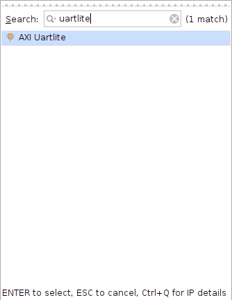
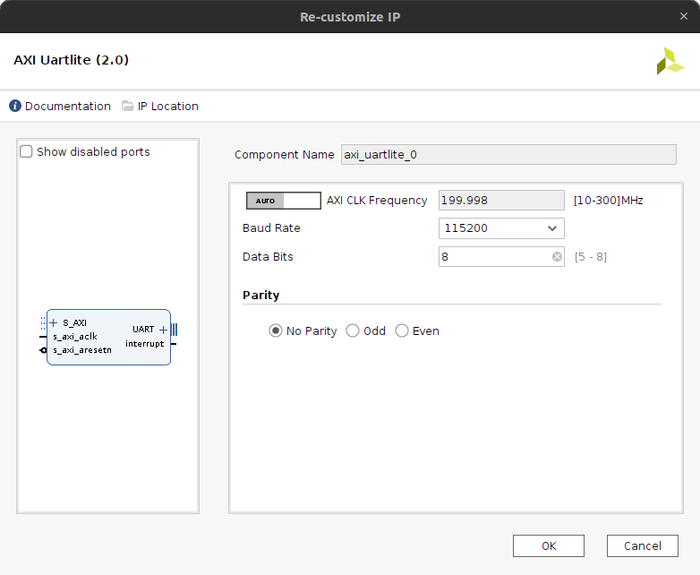
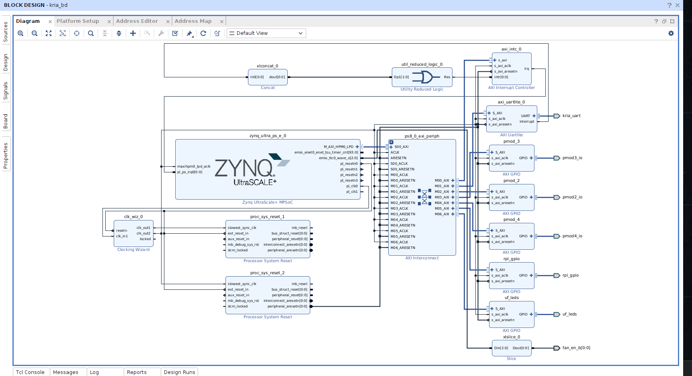
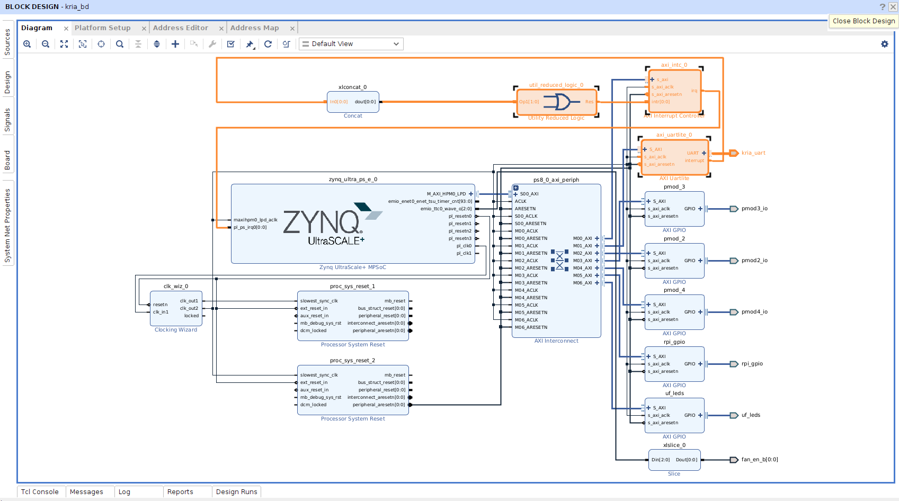
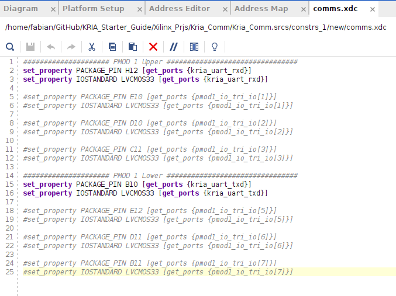
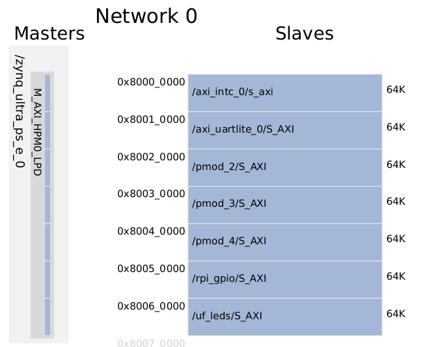
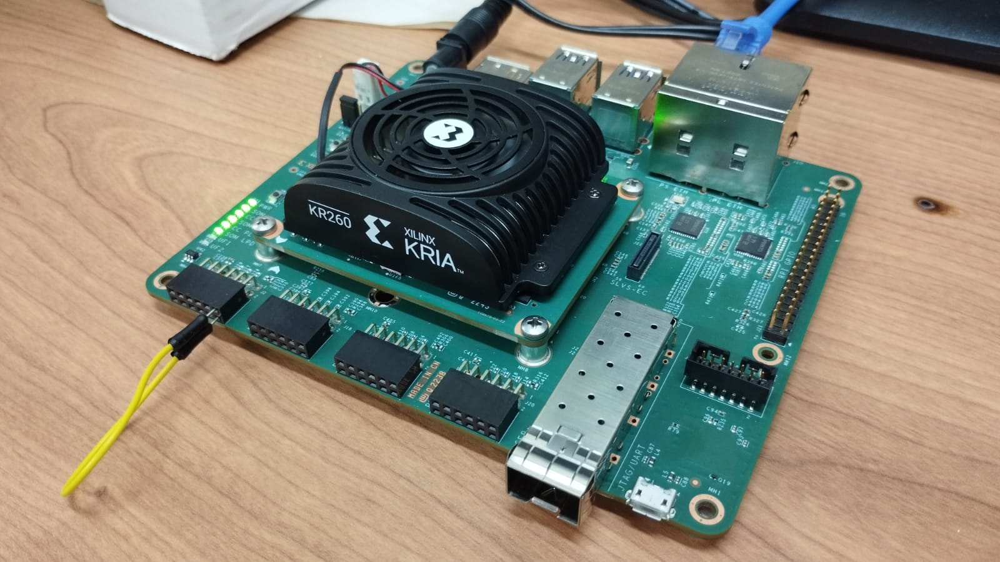

# Empowering DUNE: AXI_UARTLite using Petalinux 2022.2 in KRIA KR260

In this tutorial, we provide the steps to create the hardware design to support the AXI UARTLite IP and interact with Petalinux 2022.2, the design is made using Vivado 2022.2 and Petalinux 2022.2

For this process, you can follow this [tutorial](https://www.hackster.io/LogicTronix/kria-kr260-rpi-sensehat-petalinux-tutorial-part-i-42329b).


## Story

En el experimento DUNE, el sistema de deteccion de fotones DAPHNE ha psado por una evolucion en la que ha llegado al uso de SOM (System on Modules) donde se espera optener mayor compactibilidad en la implementacion de las tareas de hardware y software, mayor control del sistema y segurdad en la operacion, pues en el contexto del experimento DUNE, este sistema estara 1 km bajo tierra en las cabernas de Fermilab y de dificil acceso para posteriores servicios del sistema, por lo tanto se requiere de alta seguridad y robustes en la implementacion del sistema. Aqui toma protagonismo la KRIA KR260 como el SOM elegido para gestionar la operacion del sistema de deteccion de fotones.

En este tutorial les mostrare los pasos necesarios para incluir el periferico AXI UARTLite en el PL, este periferico se conecta al PS a traves del puerto AXI, se le asignara una direccion en el mapa de memoria de Petalinux, pero al mismo tiempo se montara un driver gestionado por el Device Tree lo cual permitira que este hardware sea visible en la lista de dispositivos en /dev. Una vez configurado el proyecto en Vivado 2022.2, realizada la sintesis y la implementacion, creado el bitstream y exportada la plataforma, se enviara esta crando el Device Tree Overlay a la KRIA KR260, se implementara el hardware embebido y se dara control a los perifericos a traves del puerto AXI desde Petalinux 2022.2.

> Tambien visitar los siguientes links con información importante:
>
> - Configuracion [UARTLite en Linux](https://xilinx-wiki.atlassian.net/wiki/pages/viewpage.action?pageId=63373739)

## Resumen

This post is a follow on to it (using that same Vivado 2022.1 project created in that post) that covers how to add some of the specific hardware IPCores for implementation of UART, SPI and I2C communication in KR260 board.

## UART Peripheral implementation

To implement the **UART** as an IP Core in the PL side and use it in the KRIA KR260 using Petalines, we need to add the **AXI UartLite** IP. We search the IP in the *IP Catalog* and add it to the block design.



We can to configure the IP Core making double clic in the block. In this example we just modify the **Baud Rate** at `115200`, you can to make the changes that you consider necessary to your specific project.



Afther this, perform the connections for the IP, you can to use the **Automatic connection** tool that appears in the upper part of the block design window that will connect the **AXI** Interface, but also you need to connect the **Interrupt** to the PS side in the **ZYNQ UltraScale+**.

- For this connection you can to use the `Concat` block and connect it to the **AXI Interrupt Controller** IP.
- Also, right clic on `UART` port in **AXI UartLite** IP and `Make External`, associate an appropiate name as for example `kria_uart`.

> We are using a block design made on this [tutorial](https://www.hackster.io/fabioc9675/empowering-dune-support-for-hard-peripherals-rpi-pmod-kria-505ded).
>
> We will use two additional IPCORE blocks for this purpose. Firstly, the `Concat` block will be used to concatenate all possible interrupts into a single bus. The output of the Concat block will be connected to the `Utility Reduced Logic` block configured as a `OR` gate. The output of this block will be connected to the `AXI Interrupt Controller`, which in turn will be connected to the PS (Processing System).

The block design must looks like follow:





---

## Constrains definition

In this example, we will use the **PMOD1** connector to do the connection of the `UART` Peripheral to the exterior of the KRIA.


Create the constrains file `comm_uart.xdc` using the following pinout

```bash
##################### PMOD 1 Upper ###################################
set_property PACKAGE_PIN H12 [get_ports {kria_uart_rxd}]
set_property IOSTANDARD LVCMOS33 [get_ports {kria_uart_rxd}]

#set_property PACKAGE_PIN E10 [get_ports {pmod1_io_tri_io[1]}]
#set_property IOSTANDARD LVCMOS33 [get_ports {pmod1_io_tri_io[1]}]

#set_property PACKAGE_PIN D10 [get_ports {pmod1_io_tri_io[2]}]
#set_property IOSTANDARD LVCMOS33 [get_ports {pmod1_io_tri_io[2]}]

#set_property PACKAGE_PIN C11 [get_ports {pmod1_io_tri_io[3]}]
#set_property IOSTANDARD LVCMOS33 [get_ports {pmod1_io_tri_io[3]}]

##################### PMOD 1 Lower ###################################
set_property PACKAGE_PIN B10 [get_ports {kria_uart_txd}]
set_property IOSTANDARD LVCMOS33 [get_ports {kria_uart_txd}]

#set_property PACKAGE_PIN E12 [get_ports {pmod1_io_tri_io[5]}]
#set_property IOSTANDARD LVCMOS33 [get_ports {pmod1_io_tri_io[5]}]

#set_property PACKAGE_PIN D11 [get_ports {pmod1_io_tri_io[6]}]
#set_property IOSTANDARD LVCMOS33 [get_ports {pmod1_io_tri_io[6]}]

#set_property PACKAGE_PIN B11 [get_ports {pmod1_io_tri_io[7]}]
#set_property IOSTANDARD LVCMOS33 [get_ports {pmod1_io_tri_io[7]}]

```



Once at this point, we can to do the **synthesis**, **implementation** and **bitstream generation** that will be load to the PL side. This generates an address map for the **AXI** interface, this address interface can be accessed from the PS side using `devmem` command from linux.



---

## Generacion de Device Tree Overlay para el PL

Se sigue el tutorial 4 para este paso.

The device tree blob containing the overlay nodes needs to be compiled for the design, which is easily done by using the Xilinx Software Command Line Tools (**XSCT**):

```bash
~/Kria_KR260$ source /tools/Xilinx/Vitis/2022.2/settings64.sh
~/Kria_KR260$ xsct
```

Open the exported XSA from Vivado and use the `createdts` command to create the device tree source files for the PL design:

```bash
xsct% hsi::open_hw_design kria_base.xsa

xsct% createdts -hw kria_base.xsa -zocl -platform-name kria_kr260 -git-branch xlnx_rel_v2022.2 -overlay -compile -out ./dtg_kr260_v0

xsct% exit
```

After exiting **XSCT**, use the standard Linux device tree compiler (dtc) to compile the source files into the needed device tree blob:

```bash
~/Kria_KR260$ dtc -@ -O dtb -o ./dtg_kr260_v0/dtg_kr260_v0/kria_kr260/psu_cortexa53_0/device_tree_domain/bsp/pl.dtbo ./dtg_kr260_v0/dtg_kr260_v0/kria_kr260/psu_cortexa53_0/device_tree_domain/bsp/pl.dtsi
```

---

## Transferir los archivos del PL Design a KR260

I like to create a folder to copy all of the necessary design files to that need to be uploaded to the KR260 for an accelerated application or PL design like this (note: the Kria_KR260 directory is the top level directory of the Vivado project):

```bash
~/Kria_KR260$ mkdir -p comm_file_transfer
~/Kria_KR260$ cd ./comm_file_transfer/
```

It’s here I’ll create the description file, `shell.json`, for the design:

```bash
~/Kria_KR260/comm_file_transfer$ nano shell.json
```

And copy+paste the following to `shell.json`:

```json
{
  "shell_type": "XRT_FLAT",
  "num_slots": "1"
}
```

Then copy the generated device tree blob and .bin file into the folder:

```bash
~/Kria_KR260/comm_file_transfer$ cp ../dtg_kr260_v0/dtg_kr260_v0/kria_kr260/psu_cortexa53_0/device_tree_domain/bsp/pl.dtbo ./
~/Kria_KR260/comm_file_transfer$ cp ../Kria_KR260.runs/impl_1/kria_bd_wrapper.bin ./
```

Rename the device tree blob and .bin file to the same thing (the only difference should be their respect file extensions (also change the.bin extension to `.bit.bin`):

```bash
~/Kria_KR260/comm_file_transfer$ mv kria_bd_wrapper.bin kr260_comm.bit.bin
~/Kria_KR260/comm_file_transfer$ mv pl.dtbo kr260_comm.dtbo
```

Then, with the KR260 booted up and running with the new SD card image generated in the previous steps and connected to the local network, transfer the new PL design files to it:

```bash
~/Kria_KR260/comm_file_transfer$ scp kr260_comm.dtbo kr260_comm.bit.bin shell.json petalinux@<KR260’s IP address>:/home/petalinux
```

---

## Run PL Design on KR260

After the files have been successfully transferred to the KR260, create a directory in the `/lib/firmware/xilinx` directory with the same name as was given to the device tree blob and.bin file and copy them into it:

```bash
xilinx-kr260-starterkit-20222:~$ sudo mkdir /lib/firmware/xilinx/kr260_comm
xilinx-kr260-starterkit-20222:~$ mv kr260_comm.dtbo kr260_comm.bit.bin shell.json /lib/firmware/xilinx/kr260_comm
```

At this point, the PL design will show up just like an accelerated application would using the xmutil commands:

```bash
xilinx-kr260-starterkit-20222:~$ sudo xmutil listapps
```

Unload the default application then load the PL design which flashes the PL design’s bitstream into the PL and loads its device tree overlay:

```bash
xilinx-kr260-starterkit-20222:~$ sudo xmutil unloadapp
xilinx-kr260-starterkit-20222:~$ sudo xmutil loadapp kr260_comm
```

Once here, you an to verify the **serial port** added in the PS side using the following command:

```bash
xilinx-kr260-starterkit-20222:~$ dmesg | grep serial
```

You must to receive the follow answer in the console:

```bash
[    4.217686] ff010000.serial: ttyPS1 at MMIO 0xff010000 (irq = 60, base_baud = 6249999) is a xuartps
[   11.179198] systemd[1]: Created slice Slice /system/serial-getty.
[ 6683.166373] 80010000.serial: ttyUL0 at MMIO 0x80010000 (irq = 74, base_baud = 0) is a uartlite
```

Where `ttyUL0` corresponds to the peripheral with `0x80010000` address as was indicated for the AXI address map, this is the **AXI UartLite** IP.

Also, you need to modify the permissions for the device using the following command:

```bash
sudo chmod 777 /dev/ttyUL0
```

---

## Testing UartLite

To perform this test, we will make the follow connection in loop between the `txd` and `rxd` pins, with this we can to verify the write and the read at the same time through the communication channel.



Also, we can to use the follow `Python` code, this code use the `pyserial` library, we can to install the library with the following command.

```python
python -m pip install pyserial
```

### Python code

Create the `Serial_test.py` file and copy the follow script.

```python
# Testing Uartlite with petalinux and python using KRIA
import serial

# configuration of serial port
ser = serial.Serial()
ser.port = "/dev/ttyUL0"
ser.baudrate = 115200

# open the port and begin the test
ser.open()  # open the port
ser.flush()  # clean the buffer

# Send data to Uartlite
n = ser.write('Hi, this is a KRIA test'.encode())
dato = ser.read(n).decode()  # read data from serial
print(dato)

ser.close()  # close the serial port
```

To run the script just use `python Serial_test.py` and you must to receive the follow:

```
Hi, this is a KRIA test
```

This is the first of a serie of three tutorials where we will show how to configure `UART`, `I2C` and `SPI` interfaces from the PL and use it with the PS.
