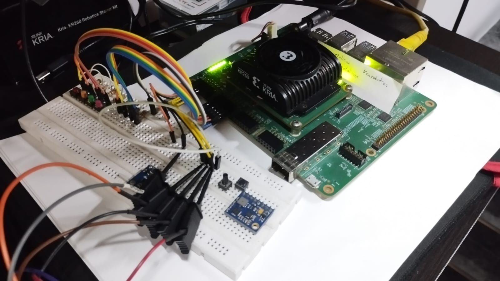
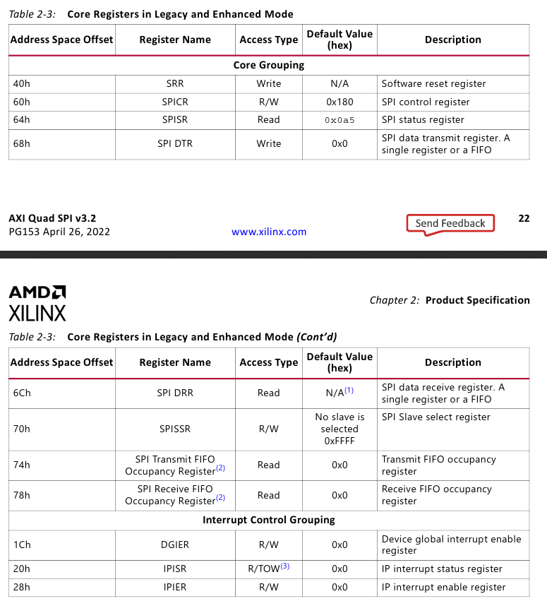
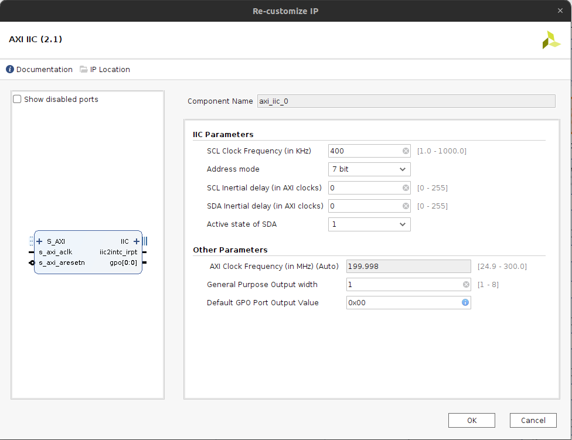
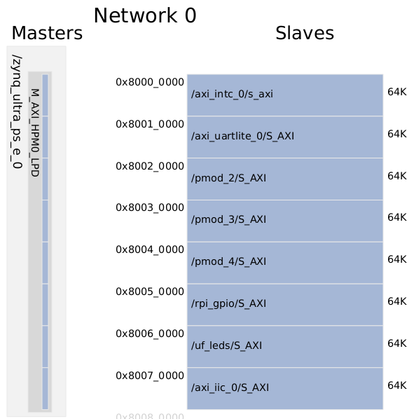
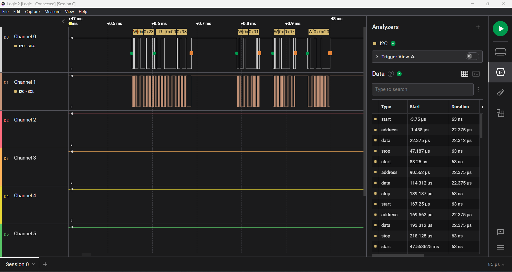
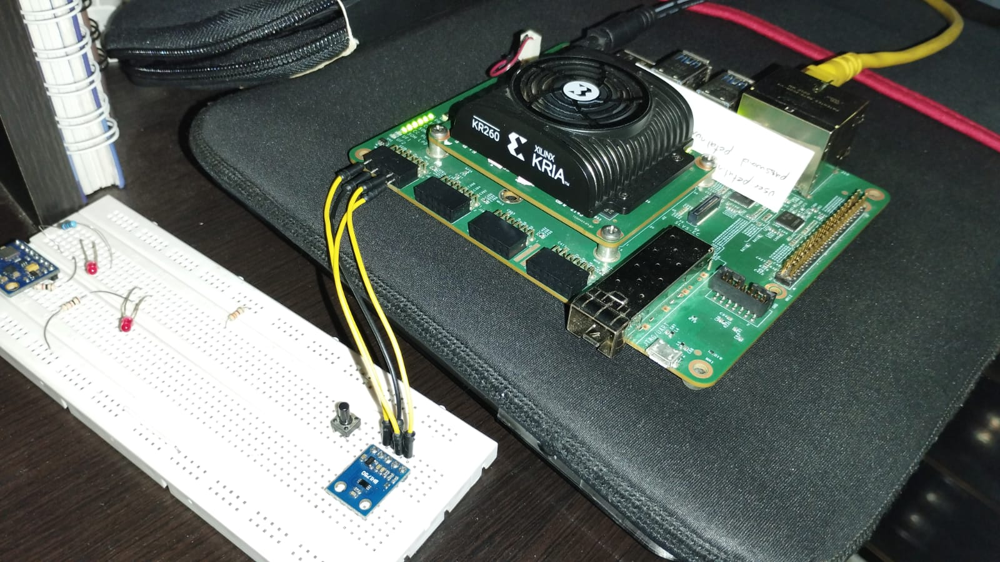
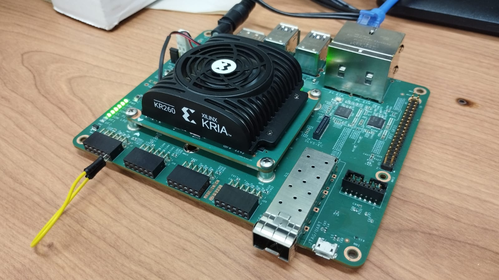

# Empowering DUNE: AXI_Quad_SPI using Petalinux 2022.2 in KRIA KR260

In this tutorial, we provide the steps to create the hardware design to support the AXI Quad SPI IP and interact with SPI peripherals using Petalinux 2022.2, the design is made using Vivado 2022.2 and Petalinux 2022.2

## Tutorial paso a paso

Para este proceso seguir el siguiente [tutorial](https://www.hackster.io/LogicTronix/kria-kr260-rpi-sensehat-petalinux-tutorial-part-i-42329b).


## Story

En el experimento DUNE, el sistema de deteccion de fotones DAPHNE ha psado por una evolucion en la que ha llegado al uso de SOM (System on Modules) donde se espera optener mayor compactibilidad en la implementacion de las tareas de hardware y software, mayor control del sistema y segurdad en la operacion, pues en el contexto del experimento DUNE, este sistema estara 1 km bajo tierra en las cabernas de Fermilab y de dificil acceso para posteriores servicios del sistema, por lo tanto se requiere de alta seguridad y robustes en la implementacion del sistema. Aqui toma protagonismo la KRIA KR260 como el SOM elegido para gestionar la operacion del sistema de deteccion de fotones.

En este tutorial les mostrare los pasos necesarios para incluir el periferico AXI Quad SPI en el PL para comunicarse con diferentes chips de interface SPI, este periferico se conecta al PS a traves del puerto AXI, se le asignara una direccion en el mapa de memoria de Petalinux, pero al mismo tiempo se montara un driver gestionado por el Device Tree lo cual permitira que este hardware sea visible en la lista de dispositivos en /dev y se pueda interactuar con el a traves del SPIDev driver. Una vez configurado el proyecto en Vivado 2022.2, realizada la sintesis y la implementacion, creado el bitstream y exportada la plataforma, se enviara esta crando el Device Tree Overlay a la KRIA KR260, se implementara el hardware embebido y se dara control a los perifericos a traves del puerto AXI desde Petalinux 2022.2.

- Configuracion [SPI en Linux](https://xilinx-wiki.atlassian.net/wiki/spaces/A/pages/18842255/Linux+SPI+Driver)

### Resumen

This post is a follow on to it (using that same Vivado 2022.2 project created in that post) that covers how to add some of the specific hardware IPCores for implementation of SPI communication in KR260 board.

## Implementation of AXI_Quad_SPI peripheral

Para implementar el SPI usando la tarjeta Kria Robotics agregaremos el IPCORE `AXI Quad SPI`. Lo buscamos en el buscador de IPCORE y lo agregamos al proyecto.

Configuramos el IPCORE dando doble clic en el bloque, en esta seleccion solo modificaremos el `Mode` a `Standard` y `Transaction Width` en `8`, tambien seleccionaremos  `Enable Master Mode`.


Luego realizamos la conexión del IPCORE, en este caso solo daremos clic derecho sobre la etiqueta del `SPI_0` y luego `Make external`. Tambien es necesario conectar la interrupción del `SPI `al PS side del ZYNQ UltraSCALE+ a traves del bloque `xlconcat_0`.


En este caso se amplia el tamaño del bloque concat, se puede realizar la conexion directa del `Concat` al `AXI Interrupt Controller` y este se ajusta de forma automatica. Este luego ira al PS.

---

## Definición de Constrains

En este ejemplo utilizaremos el conector PMOD1 para realizar la conexion del SPI hacia el exterior de la KRIA.


Luego se crea el archivo de constrains `comm_spi.xdc` usando los siguientes pines

```bash
##################### PMOD 1 Upper ################################
set_property PACKAGE_PIN H12 [get_ports {kria_uart_rxd}]   
set_property IOSTANDARD LVCMOS33 [get_ports {kria_uart_rxd}] 
                                                       
set_property PACKAGE_PIN E10 [get_ports {kria_i2c_sda_io}]   
set_property IOSTANDARD LVCMOS33 [get_ports {kria_i2c_sda_io}] 
set_property PULLUP TRUE [get_ports {kria_i2c_sda_io}]
                                                       
set_property PACKAGE_PIN D10 [get_ports {kria_spi_io0_io}]   
set_property IOSTANDARD LVCMOS33 [get_ports {kria_spi_io0_io}] 
                                                       
set_property PACKAGE_PIN C11 [get_ports {kria_spi_ss_io[0]}]   
set_property IOSTANDARD LVCMOS33 [get_ports {kria_spi_ss_io[0]}] 
                                                       
##################### PMOD 1 Lower ################################
set_property PACKAGE_PIN B10 [get_ports {kria_uart_txd}]   
set_property IOSTANDARD LVCMOS33 [get_ports {kria_uart_txd}] 
                                                       
set_property PACKAGE_PIN E12 [get_ports {kria_i2c_scl_io}]   
set_property IOSTANDARD LVCMOS33 [get_ports {kria_i2c_scl_io}] 
set_property PULLUP TRUE [get_ports {kria_i2c_scl_io}]
                                                       
set_property PACKAGE_PIN D11 [get_ports {kria_spi_sck_io}]   
set_property IOSTANDARD LVCMOS33 [get_ports {kria_spi_sck_io}] 
                                                       
set_property PACKAGE_PIN B11 [get_ports {kria_spi_io1_io}]   
set_property IOSTANDARD LVCMOS33 [get_ports {kria_spi_io1_io}] 

```

> **Nota**: En este archivo de definiciones de constrains tambien se encuentran las definiciones para el UART y para el IIC.

Una vez en este punto, se procede a realizar la sintesis, implementacion y generacion de bitstream para ser cargado en el `PL`. esto generará un mapa de direcciones para el AXI por medio de los cuales se realizará la prueba de funcionamiento en la KRIA.


Como se puede observar, la direccion asignada al `axi_quad_spi` es la `0x80080000`, nosotros podemos interactuar con esta direccion usando el comando `devmem`, mas adelante en este tutorial se mostrará una forma de hacerlo.

Una vez finalizada la compilacion, generamos el bitstream y exportamos la plataforma con el nombre `kria_spi_base.xsa`

---

## Generacion de Device Tree Overlay para el PL

En la carpeta raiz del proyecto agregaremos los siguientes archivos:

- `xsct_config.tcl`

```bash
hsi::open_hw_design kria_spi_base.xsa
createdts -hw kria_spi_base.xsa -zocl -platform-name kr260_spi -git-branch xlnx_rel_v2022.2 -overlay -compile -out ./dtg_kr260_v0
exit
```

Este archivo contiene los comandos que se ejecutaran por el **Xilinx Source Commands Tool** para la creacion del **Device Tree**.

Luego, en una terminal ejecutaremos los siguientes comandos

```bash
source /tools/Xilinx/Vitis/2022.2/settings64.sh
cd /home/fabian/GitHub/KRIA_Starter_Guide/Xilinx_Prjs/Kria_SPI/
xsct xsct_config.tcl
```

Esto creará el archivo `pl.dtsi` el cual contiene la informacion del device tree, este archivo se encuentra en la direccion `./dtg_kr260_v0/dtg_kr260_v0/kr260_spi/psu_cortexa53_0/device_tree_domain/bsp/pl.dtsi`, nosotros debemos modificar este archivo para incluir el soporte `SPIDev` en el device tree, el archivo originalmente contendra el siguiente bloque de codigo que describe el `axi_quad_spi`.

```bash
axi_quad_spi_0: axi_quad_spi@80080000 {
	bits-per-word = <8>;
	clock-names = "ext_spi_clk", "s_axi_aclk";
	clocks = <&zynqmp_clk 71>, <&misc_clk_0>;
	compatible = "xlnx,axi-quad-spi-3.2", "xlnx,xps-spi-2.00.a";
	fifo-size = <16>;
	interrupt-names = "ip2intc_irpt";
	interrupt-parent = <&axi_intc_0>;
	interrupts = <0 0>;
	num-cs = <0x1>;
	reg = <0x0 0x80080000 0x0 0x10000>;
	xlnx,num-ss-bits = <0x1>;
	xlnx,spi-mode = <0>;
};
```

Luego, debemos modificar este bloque de codigo para agregar el soporte `SPIDev` agregando el siguiente bloque de codigo, este deberia lucir como sigue:

```bash
axi_quad_spi_0: axi_quad_spi@80080000 {
	bits-per-word = <8>;
	clock-names = "ext_spi_clk", "s_axi_aclk";
	clocks = <&zynqmp_clk 71>, <&misc_clk_0>;
	compatible = "xlnx,axi-quad-spi-3.2", "xlnx,xps-spi-2.00.a";
	fifo-size = <16>;
	interrupt-names = "ip2intc_irpt";
	interrupt-parent = <&axi_intc_0>;
	interrupts = <0 0>;
	num-cs = <0x1>;
	reg = <0x0 0x80080000 0x0 0x10000>;
	xlnx,num-ss-bits = <0x1>;
	xlnx,spi-mode = <0>;
	spidev@0x00 {
		status = "okay";
		compatible = "rohm,dh2228fv";
		spi-max-frequency = <25000000>;
		reg = <0>;
	};
};
```

Una vez finalizada esta configuracion, procedemos a creat el device tree `pl.dtbo` usando los siguientes comandos:

- `DT_generation.sh`

```bash
echo ""
echo ""
echo "#############################################################################"
echo "Compilacion del device tree"
echo "#############################################################################"
echo ""
echo ""

source /tools/Xilinx/Vitis/2022.2/settings64.sh
cd /home/fabian/GitHub/KRIA_Starter_Guide/Xilinx_Prjs/Kria_SPI/

dtc -@ -O dtb -o ./dtg_kr260_v0/dtg_kr260_v0/kr260_spi/psu_cortexa53_0/device_tree_domain/bsp/pl.dtbo ./dtg_kr260_v0/dtg_kr260_v0/kr260_spi/psu_cortexa53_0/device_tree_domain/bsp/pl.dtsi
cd /home/fabian/GitHub/KRIA_Starter_Guide/Xilinx_Prjs/Kria_SPI/spi_file_transfer/
cp ../dtg_kr260_v0/dtg_kr260_v0/kr260_spi/psu_cortexa53_0/device_tree_domain/bsp/pl.dtbo ./ & cp ../Kria_SPI.runs/impl_1/kria_bd_wrapper.bin ./
mv kria_bd_wrapper.bin kr260_spi.bit.bin
mv pl.dtbo kr260_spi.dtbo

echo ""
echo ""
echo "#############################################################################"
echo "Envio de archivos a la Kria"
echo "#############################################################################"
echo ""
echo ""

echo petalinux | scp kr260_spi.bit.bin kr260_spi.dtbo shell.json petalinux@192.168.1.12:/home/petalinux
```

Este script permite cargar el device tree a la Kria.

---

## Run PL Design on KR260

After the files have been successfully transferred to the KR260, create a directory in the `/lib/firmware/xilinx` directory with the same name as was given to the device tree blob and .bin file and copy them into it:

```bash
xilinx-kr260-starterkit-20222:~$ sudo mkdir /lib/firmware/xilinx/kr260_spi
xilinx-kr260-starterkit-20222:~$ sudo mv kr260_spi.dtbo kr260_spi.bit.bin shell.json /lib/firmware/xilinx/kr260_spi
```

At this point, the PL design will show up just like an accelerated application would using the xmutil commands:

```bash
xilinx-kr260-starterkit-20222:~$ sudo xmutil listapps
```

Unload the default application then load the PL design which flashes the PL design’s bitstream into the PL and loads its device tree overlay:

```bash
xilinx-kr260-starterkit-20222:~$ sudo xmutil unloadapp
xilinx-kr260-starterkit-20222:~$ sudo xmutil loadapp kr260_spi
```

Una vez aqui, ya puede verificar el montaje del **SPI** decive en el PS mediante el siguiente comando:

```bash
xilinx-kr260-starterkit-20222:~$ ls /dev | grep spi
```

Debe recibir la siguiente respuesta:

```bash
xilinx-kr260-starterkit-20222:~$ ls /dev | grep spi
spidev3.0
```

Donde `spidev3.0` corresponde al periferico agregado para controlar el SPI desde el PS.

Tambien es necesario darle los permisos necesarios para ejecutar y controlar el periferico

```bash
sudo chmod 777 /dev/spidev3.0
```

Con esto ya tenemos acceso a controlar el periferico `AXI_QUAD_SPI` desde el PS.

---

## Testing AXI Quad SPI

Para realizar este test realizaremos la siguiente conexion, realizaremos un loop entre el `MOSI` y el `MISO` para leer los datos enviados desde el PS.



Realizaremos la instalacion del paquete `spidev` de `python` utilizando el siguiente comando.

```python
python -m pip install spidev
```

### Código de Python

Se creará el archivo `spitest.py` con el siguiente script.

```python
#!/usr/bin/env python3
# vim: expandtab ts=4 sw=4

import spidev

# Carga del objeto spi
spi = spidev.SpiDev()   
# Apertura del spi en el Bus 3 y el dispositivo 0   
spi.open(3, 0)  
# Configuracion del reloj a 5 MHz   
spi.max_speed_hz = 5000   
# Configuracion del modo de operacion del spi   
spi.mode = 0b01  

# Codificacion del mensaje a enviar en ASCII
data = 'FABIAN'.encode('utf-8')  
# Transferencia, realiza escritura y lectura del bufer, solo dispara un cs por el mensaje completo 
rec=spi.xfer(data)   
print(rec)  

```

Como respuesta a este codigo se recibe `[70, 65, 66, 73, 65, 78]`, los cuales representan en el codigo ASCII `['F', 'A', 'B', 'I', 'A', 'N']`

Tambien podemos observar los pulsos enviados por el periferico a traves de un Logic Analyzer


---

### Uso del comando devmem para interactura con el SPI

Es posible interactuar con el periferico spi a traves del uso del comando `devmem` de Linux, para esto es necesario conocer la direccion asignada al periferico (en nuestro caso `0x80080000`) y el mapeo de registros del IP, esta informacion se encuentra disponible en la documentacion del IP, a continuacion se muestra el mapa de registros extraido desde la documentacion oficial.



Y asiciado a esto se encuentra un  mapa de bits, el cual los invito a consultarlo en la documentacion oficial para que puedan configurar el SPI como mejor se ajuste a su aplicacion. A continuacion se deja un codigo que muestra la interaccion con el `axi_quad_spi` usando `devmem`.

```bash
#!/bin/sh

# 1. Basic Initialization
echo ""
echo "Read and clear interrupts"
devmem 0x80080020                                # to clear interrupts - 1
devmem 0x80080070 32 0xffffffff                  # clear SS - 1
devmem 0x80080060 32 0x180 # 0x1e6                       # inhibit transaction -1

# 2. Setup for multi-byte
# ~> Default is fine: devmem 0x8008001C 32 0x00000000           # configure DGIER (Device Global Int En Reg) - 2
# ~> Default is fine: devmem 0x80080028 32 0x00000000           # configure IPIER (IP Int En Reg) - 2

# 3. and 4.
devmem 0x80080060 32 0x00000000          # write data to master SPICR

# 5. Select the slave
devmem 0x80080070 32 0xfffffffe          # set SS - 5

# 6. and 7. Send Transaction
devmem 0x80080068 8 0xDE
devmem 0x80080068 8 0xAD
devmem 0x80080068 8 0xBE
devmem 0x80080068 8 0xEF
devmem 0x80080068 8 0x40
devmem 0x80080068 8 0x48

# deactivate SS
# devmem 0x80080070 32 0xffffffff          # set SS - 5

echo "read status"
devmem 0x80080064

echo "read Data"
devmem 0x8008006C
devmem 0x8008006C
devmem 0x8008006C
devmem 0x8008006C
devmem 0x8008006C
devmem 0x8008006C

echo ""
echo "Read out buffer occupancy: x \+ 1 = number of bytes"
devmem 0x80080074                                        # read out fifo - 6 and 7

echo ""
echo "Send buffer"
devmem 0x80080060 32 0x86                                # write data to master SPICR - 8

echo ""
echo "Read and clear interrupts"
devmem 0x80080020

echo ""
echo "Read and clear interrupts"
devmem 0x80080064                                        # Read SPISR reg - 11 and 12

```

---

### Configuracion automatica del periferico

Para correr el codigo crearemos el siguiente archivo `spi_config.sh` de bash para configurar, montar y probar el periferico serial.

```bash
echo "################################################"
echo " ------ Configuracion de Comunicaciones -----"
echo "################################################"

echo petalinux | sudo -S xmutil unloadapp  # despues del echo va el password para el "sudo" y el comando>
echo petalinux | sudo -S xmutil loadapp kr260_spi
echo petalinux | sudo -S chown petalinux:petalinux /dev/spidev3.0
echo petalinux | sudo -S chown petalinux:petalinux /dev/i2c-7
echo petalinux | sudo -S chown petalinux:petalinux /dev/ttyUL0
echo petalinux | sudo -S chmod 777 /dev/spidev3.0
echo petalinux | sudo -S chmod 777 /dev/i2c-7
echo petalinux | sudo -S chmod 777 /dev/ttyUL0

echo "################################################"
echo " ------ Inicio de prueba serial python ------ "
echo "################################################"

python Serial_test.py

echo "################################################"
echo " ------ Finalizacion de prueba serial ------ "
echo "################################################"


echo "################################################"
echo " ------ Inicio de prueba iic python ------ "
echo "################################################"

python bh1750_iic.py

echo "################################################"
echo " ------ Finalizacion de prueba iic ------ "
echo "################################################"


echo "################################################"
echo " ------ Inicio de prueba spi python ------ "
echo "################################################"

python spitest.py

echo "################################################"
echo " ------ Finalizacion de prueba spi ------ "
echo "################################################"
```

---

# Empowering DUNE: AXI_IIC using Petalinux 2022.2 in KRIA KR260

In this tutorial, we provide the steps to create the hardware design to support the AXI IIC IP and interact with I2C peripherals using Petalinux 2022.2, the design is made using Vivado 2022.2 and Petalinux 2022.2

For this process, you can follow this [tutorial](https://www.hackster.io/LogicTronix/kria-kr260-rpi-sensehat-petalinux-tutorial-part-i-42329b).


## Story

En el experimento DUNE, el sistema de deteccion de fotones DAPHNE ha psado por una evolucion en la que ha llegado al uso de SOM (System on Modules) donde se espera optener mayor compactibilidad en la implementacion de las tareas de hardware y software, mayor control del sistema y segurdad en la operacion, pues en el contexto del experimento DUNE, este sistema estara 1 km bajo tierra en las cabernas de Fermilab y de dificil acceso para posteriores servicios del sistema, por lo tanto se requiere de alta seguridad y robustes en la implementacion del sistema. Aqui toma protagonismo la KRIA KR260 como el SOM elegido para gestionar la operacion del sistema de deteccion de fotones.

En este tutorial les mostrare los pasos necesarios para incluir el periferico AXI IIC en el PL parea comunicarse con diferentes chips de interface I2C, este periferico se conecta al PS a traves del puerto AXI, se le asignara una direccion en el mapa de memoria de Petalinux, pero al mismo tiempo se montara un driver gestionado por el Device Tree lo cual permitira que este hardware sea visible en la lista de dispositivos en /dev. Una vez configurado el proyecto en Vivado 2022.2, realizada la sintesis y la implementacion, creado el bitstream y exportada la plataforma, se enviara esta crando el Device Tree Overlay a la KRIA KR260, se implementara el hardware embebido y se dara control a los perifericos a traves del puerto AXI desde Petalinux 2022.2.

> Tambien visitar los siguientes links con información importante:
>
> - Configuracion [I2C en Linux](https://xilinx-wiki.atlassian.net/wiki/spaces/A/pages/18841974/Linux+I2C+Driver)

## IIC Peripheral implementation

To implement the **I2C** as an IP Core in the PL side and use it in the KRIA KR260 using Petalines, we need to add the **AXI IIC** IP. We search the IP in the *IP Catalog* and add it to the block design.

We can to configure the IP Core making double clic in the block. In this example we just modify the **SCL Clock** at `400 kHz` and the **Address mode** to `7 bits`. You can to make the changes that you consider necessary to your specific project.



Afther this, perform the connections for the IP, you can to use the **Automatic connection** tool that appears in the upper part of the block design window that will connect the **AXI** Interface, but also you need to connect the **Interrupt** to the PS side in the **ZYNQ UltraScale+**.


In this case, the option to add more interrupts to the PS is to add more entrances in the **Concat** IP block, afther this it is possible to do a direct connection between **Concat** ant the **AXI Interrupt Controller**.

---

## Constrains definition

In this example, we will use the **PMOD1** connector to do the connection of the `UART` Peripheral to the exterior of the KRIA.


Create the constrains file `comms.xdc` using the following pinout

> We also have the definitions of UART because this project is a continuation of this [tutorial](https://www.hackster.io/fabioc9675/empowering-dune-axi-uartlite-using-petalinux-2022-2-in-kria-7e11cf).

```bash
##################### PMOD 1 Upper ################################
set_property PACKAGE_PIN H12 [get_ports {kria_uart_rxd}]
set_property IOSTANDARD LVCMOS33 [get_ports {kria_uart_rxd}]

set_property PACKAGE_PIN E10 [get_ports {kria_i2c_sda_io}]
set_property IOSTANDARD LVCMOS33 [get_ports {kria_i2c_sda_io}]
set_property PULLUP TRUE [get_ports {kria_i2c_sda_io}]

#set_property PACKAGE_PIN D10 [get_ports {pmod1_io_tri_io[2]}]
#set_property IOSTANDARD LVCMOS33 [get_ports {pmod1_io_tri_io[2]}]

#set_property PACKAGE_PIN C11 [get_ports {pmod1_io_tri_io[3]}]
#set_property IOSTANDARD LVCMOS33 [get_ports {pmod1_io_tri_io[3]}]

##################### PMOD 1 Lower ################################
set_property PACKAGE_PIN B10 [get_ports {kria_uart_txd}]
set_property IOSTANDARD LVCMOS33 [get_ports {kria_uart_txd}]

set_property PACKAGE_PIN E12 [get_ports {kria_i2c_scl_io}]
set_property IOSTANDARD LVCMOS33 [get_ports {kria_i2c_scl_io}]
set_property PULLUP TRUE [get_ports {kria_i2c_scl_io}]

#set_property PACKAGE_PIN D11 [get_ports {pmod1_io_tri_io[6]}]
#set_property IOSTANDARD LVCMOS33 [get_ports {pmod1_io_tri_io[6]}]

#set_property PACKAGE_PIN B11 [get_ports {pmod1_io_tri_io[7]}]
#set_property IOSTANDARD LVCMOS33 [get_ports {pmod1_io_tri_io[7]}]

```


Once at this point, we can to do the **synthesis**, **implementation** and **bitstream generation** that will be load to the PL side. This generates an address map for the **AXI** interface, this address interface can be accessed from the PS side using `devmem` command from linux.



Export the platform and name it as `kria_i2c_base.xsa`.

## Generacion de Device Tree Overlay para el PL

En la carpeta raiz del proyecto agregaremos los siguientes archivos, tenga en cuenta que el nombre de la plataforma generada para este proyecto es `kria_i2c_base.xsa`:

- `xsct_config.tcl`

```bash
hsi::open_hw_design kria_i2c_base.xsa
createdts -hw kria_i2c_base.xsa -zocl -platform-name kr260_i2c -git-branch xlnx_rel_v2022.2 -overlay -compile -out ./dtg_kr260_v0
exit
```

Este archivo contiene los comandos que se ejecutaran por el **Xilinx Source Commands Tool** para la creacion del **Device Tree**.

El siguiente archivo ejecutara los comandos de terminal necesarios para generar el Device Tree de forma automatica y enviarlos a la tarjeta KRIA. revise el script y modifique las partes que sean necesarias para que se ajusten a su proyecto, como por ejemplo la direccion IP de la tarjeta KRIA.

- `DT_generation.sh`

```bash
echo ""
echo ""
echo "#############################################################################"
echo "Creacion del device tree"
echo "#############################################################################"
echo ""
echo ""

source /tools/Xilinx/Vitis/2022.2/settings64.sh
cd ./Kria_I2C/
xsct xsct_config.tcl

echo ""
echo ""
echo "#############################################################################"
echo "Compilacion del device tree"
echo "#############################################################################"
echo ""
echo ""

dtc -@ -O dtb -o ./dtg_kr260_v0/dtg_kr260_v0/kr260_i2c/psu_cortexa53_0/device_tree_domain/bsp/pl.dtbo ./dtg_kr260_v0/dtg_kr260_v0/kr260_i2c/psu_cortexa53_0/device_tree_domain/bsp/pl.dtsi
cd ./i2c_file_transfer/
cp ../dtg_kr260_v0/dtg_kr260_v0/kr260_i2c/psu_cortexa53_0/device_tree_domain/bsp/pl.dtbo ./ & cp ../Kria_I2C.runs/impl_1/kria_bd_wrapper.bin ./
mv kria_bd_wrapper.bin kr260_i2c.bit.bin
mv pl.dtbo kr260_i2c.dtbo

echo ""
echo ""
echo "#############################################################################"
echo "Envio de archivos a la Kria"
echo "#############################################################################"
echo ""
echo ""

echo petalinux | scp kr260_i2c.bit.bin kr260_i2c.dtbo shell.json petalinux@192.168.1.12:/home/petalinux
```

Este script permite cargar el device tree a la Kria.

---

## Run PL Design on KR260

After the files have been successfully transferred to the KR260, create a directory in the `/lib/firmware/xilinx` directory with the same name as was given to the device tree blob and .bin file and copy them into it:

```bash
xilinx-kr260-starterkit-20222:~$ sudo mkdir /lib/firmware/xilinx/kr260_i2c
xilinx-kr260-starterkit-20222:~$ sudo mv kr260_i2c.dtbo kr260_i2c.bit.bin shell.json /lib/firmware/xilinx/kr260_i2c
```

At this point, the PL design will show up just like an accelerated application would using the xmutil commands:

```bash
xilinx-kr260-starterkit-20222:~$ sudo xmutil listapps
```

Unload the default application then load the PL design which flashes the PL design’s bitstream into the PL and loads its device tree overlay:

```bash
xilinx-kr260-starterkit-20222:~$ sudo xmutil unloadapp
xilinx-kr260-starterkit-20222:~$ sudo xmutil loadapp kr260_i2c
```

Once here, you an to verify the **iic** device added in the PS side using the following command:

```bash
xilinx-kr260-starterkit-20222:~$ i2cdetect -l
```

You must to receive the follow answer in the console:

```bash
i2c-1   unknown         Cadence I2C at ff030000                 N/A
i2c-2   unknown         ZynqMP DP AUX                           N/A
i2c-3   unknown         i2c-1-mux (chan_id 0)                   N/A
i2c-4   unknown         i2c-1-mux (chan_id 1)                   N/A
i2c-5   unknown         i2c-1-mux (chan_id 2)                   N/A
i2c-6   unknown         i2c-1-mux (chan_id 3)                   N/A
i2c-7   i2c             xiic-i2c 80070000.i2c                   I2C adapter
```

Where `i2c-7` corresponds to the peripheral with `0x80070000` address as was indicated for the AXI address map, this is the **AXI IIC** IP.

Tambien es necesario darle los permisos necesarios para ejecutar y controlar el periferico

```bash
sudo chmod 777 /dev/i2c-7
```

Para verificar los dispositivos conectados utilizamos el siguiente comando:

```bash
i2cdetect -y -r 7
```

Y obtenemos la siguiente respuesta, en este caso tenemos un dispositivo conectado en la direccion `23`.

```bash
     0  1  2  3  4  5  6  7  8  9  a  b  c  d  e  f
00:                         -- -- -- -- -- -- -- --
10: -- -- -- -- -- -- -- -- -- -- -- -- -- -- -- --
20: -- -- -- 23 -- -- -- -- -- -- -- -- -- -- -- --
30: -- -- -- -- -- -- -- -- -- -- -- -- -- -- -- --
40: -- -- -- -- -- -- -- -- -- -- -- -- -- -- -- --
50: -- -- -- -- -- -- -- -- -- -- -- -- -- -- -- --
60: -- -- -- -- -- -- -- -- -- -- -- -- -- -- -- --
70: -- -- -- -- -- -- -- --
```

Al mismo tiempo podemos observar las señales con ayuda de un Logic Analyzer:



---

## Testing AXI IIC

Para realizar este test realizaremos la siguiente conexion, utilizaremos un modulo `BH1750` de medicion de intensidad de luz para las pruebas.



Realizaremos la instalacion del paquete `SMBus` de `python` utilizando el siguiente comando.

```python
python -m pip install smbus
```

### Código de Python

Se creará el archivo `bh1750_iic.py` con el siguiente script.

```python
#!/usr/bin/env python2
# vim: expandtab ts=4 sw=4
# Inspired by http://www.raspberrypi-spy.co.uk/2015/03/bh1750fvi-i2c-digital-light-intensity-sensor/


import smbus
import time

class BH1750():
    """ Implement BH1750 communication. """
    # Define some constants from the datasheet
    POWER_DOWN = 0x00 # No active state
    POWER_ON   = 0x01 # Power on
    RESET      = 0x07 # Reset data register value
    # Start measurement at 4lx resolution. Time typically 16ms.
    CONTINUOUS_LOW_RES_MODE = 0x13
    # Start measurement at 1lx resolution. Time typically 120ms
    CONTINUOUS_HIGH_RES_MODE_1 = 0x10
    # Start measurement at 0.5lx resolution. Time typically 120ms
    CONTINUOUS_HIGH_RES_MODE_2 = 0x11
    # Start measurement at 1lx resolution. Time typically 120ms
    # Device is automatically set to Power Down after measurement.
    ONE_TIME_HIGH_RES_MODE_1 = 0x20
    # Start measurement at 0.5lx resolution. Time typically 120ms
    # Device is automatically set to Power Down after measurement.
    ONE_TIME_HIGH_RES_MODE_2 = 0x21
    # Start measurement at 1lx resolution. Time typically 120ms
    # Device is automatically set to Power Down after measurement.
    ONE_TIME_LOW_RES_MODE = 0x23

    def __init__(self, bus, addr=0x23):
        self.bus = bus
        self.addr = addr
        self.power_down()
        self.set_sensitivity()

    def _set_mode(self, mode):
        self.mode = mode
        self.bus.write_byte(self.addr, self.mode)

    def power_down(self):
        self._set_mode(self.POWER_DOWN)

    def power_on(self):
        self._set_mode(self.POWER_ON)

    def reset(self):
        self.power_on() #It has to be powered on before resetting
        self._set_mode(self.RESET)

    def cont_low_res(self):
        self._set_mode(self.CONTINUOUS_LOW_RES_MODE)

    def cont_high_res(self):
        self._set_mode(self.CONTINUOUS_HIGH_RES_MODE_1)

    def cont_high_res2(self):
        self._set_mode(self.CONTINUOUS_HIGH_RES_MODE_2)

    def oneshot_low_res(self):
        self._set_mode(self.ONE_TIME_LOW_RES_MODE)

    def oneshot_high_res(self):
        self._set_mode(self.ONE_TIME_HIGH_RES_MODE_1)

    def oneshot_high_res2(self):
        self._set_mode(self.ONE_TIME_HIGH_RES_MODE_2)

    def set_sensitivity(self, sensitivity=69):
        """ Set the sensor sensitivity.
            Valid values are 31 (lowest) to 254 (highest), default is 69.
        """
        if sensitivity < 31:
            self.mtreg = 31
        elif sensitivity > 254:
            self.mtreg = 254
        else:
            self.mtreg = sensitivity
        self.power_on()
        self._set_mode(0x40 | (self.mtreg >> 5))
        self._set_mode(0x60 | (self.mtreg & 0x1f))
        self.power_down()

    def get_result(self):
        """ Return current measurement result in lx. """
        data = self.bus.read_word_data(self.addr, self.mode)
        count = data >> 8 | (data&0xff)<<8
        mode2coeff =  2 if (self.mode & 0x03) == 0x01 else 1
        ratio = 1/(1.2 * (self.mtreg/69.0) * mode2coeff)
        return ratio*count

    def wait_for_result(self, additional=0):
        basetime = 0.018 if (self.mode & 0x03) == 0x03 else 0.128
        time.sleep(basetime * (self.mtreg/69.0) + additional)

    def do_measurement(self, mode, additional_delay=0):
        """
        Perform complete measurement using command
        specified by parameter mode with additional
        delay specified in parameter additional_delay.
        Return output value in Lx.
        """
        self.reset()
        self._set_mode(mode)
        self.wait_for_result(additional=additional_delay)
        return self.get_result()

    def measure_low_res(self, additional_delay=0):
        return self.do_measurement(self.ONE_TIME_LOW_RES_MODE, additional_delay)

    def measure_high_res(self, additional_delay=0):
        return self.do_measurement(self.ONE_TIME_HIGH_RES_MODE_1, additional_delay)

    def measure_high_res2(self, additional_delay=0):
        return self.do_measurement(self.ONE_TIME_HIGH_RES_MODE_2, additional_delay)


def main():

    #bus = smbus.SMBus(0) # Rev 1 Pi uses 0
    bus = smbus.SMBus(7)  # Rev 2 Pi uses 1
    sensor = BH1750(bus)


    print("Sensitivity: {:d}".format(sensor.mtreg))
    for measurefunc, name in [(sensor.measure_low_res, "Low Res "),
                              (sensor.measure_high_res, "HighRes "),
                              (sensor.measure_high_res2, "HighRes2")]:
        print("{} Light Level : {:3.2f} lx".format(name, measurefunc()))
    print("--------")
    sensor.set_sensitivity((sensor.mtreg + 10) % 255)
    time.sleep(1)


if __name__=="__main__":
    main()
```

### Configuracion automatica del periferico

Para correr el codigo crearemos el siguiente archivo `iic_config.sh` de bash para configurar, montar y probar el periferico serial.

```bash
echo "################################################"
echo " ------ Configuracion de Comunicaciones -----"
echo "################################################"

echo petalinux | sudo -S xmutil unloadapp  # despues del echo va el password para el "sudo" y el comando>
echo petalinux | sudo -S xmutil loadapp kr260_i2c
echo petalinux | sudo -S chown petalinux:petalinux /dev/i2c-7
echo petalinux | sudo -S chown petalinux:petalinux /dev/ttyUL0
echo petalinux | sudo -S chmod 777 /dev/i2c-7
echo petalinux | sudo -S chmod 777 /dev/ttyUL0

echo "################################################"
echo " ------ Inicio de prueba serial python ------ "
echo "################################################"

python Serial_test.py

echo "################################################"
echo " ------ Finalizacion de prueba serial ------ "
echo "################################################"


echo "################################################"
echo " ------ Inicio de prueba iic python ------ "
echo "################################################"

python bh1750_iic.py

echo "################################################"
echo " ------ Finalizacion de prueba iic ------ "
echo "################################################"
```

## Generacion de Device Tree Overlay para el PL

Se sigue el tutorial 4 para este paso.

The device tree blob containing the overlay nodes needs to be compiled for the design, which is easily done by using the Xilinx Software Command Line Tools (**XSCT**):

```bash
~/Kria_KR260$ source /tools/Xilinx/Vitis/2022.2/settings64.sh
~/Kria_KR260$ xsct
```

Open the exported XSA from Vivado and use the `createdts` command to create the device tree source files for the PL design:

```bash
xsct% hsi::open_hw_design kria_base.xsa

xsct% createdts -hw kria_base.xsa -zocl -platform-name kria_kr260 -git-branch xlnx_rel_v2022.2 -overlay -compile -out ./dtg_kr260_v0

xsct% exit
```

After exiting **XSCT**, use the standard Linux device tree compiler (dtc) to compile the source files into the needed device tree blob:

```bash
~/Kria_KR260$ dtc -@ -O dtb -o ./dtg_kr260_v0/dtg_kr260_v0/kria_kr260/psu_cortexa53_0/device_tree_domain/bsp/pl.dtbo ./dtg_kr260_v0/dtg_kr260_v0/kria_kr260/psu_cortexa53_0/device_tree_domain/bsp/pl.dtsi
```

---

## Transferir los archivos del PL Design a KR260

I like to create a folder to copy all of the necessary design files to that need to be uploaded to the KR260 for an accelerated application or PL design like this (note: the Kria_KR260 directory is the top level directory of the Vivado project):

```bash
~/Kria_KR260$ mkdir -p comm_file_transfer
~/Kria_KR260$ cd ./comm_file_transfer/
```

It’s here I’ll create the description file, `shell.json`, for the design:

```bash
~/Kria_KR260/comm_file_transfer$ nano shell.json
```

And copy+paste the following to `shell.json`:

```json
{
  "shell_type": "XRT_FLAT",
  "num_slots": "1"
}
```

Then copy the generated device tree blob and .bin file into the folder:

```bash
~/Kria_KR260/comm_file_transfer$ cp ../dtg_kr260_v0/dtg_kr260_v0/kria_kr260/psu_cortexa53_0/device_tree_domain/bsp/pl.dtbo ./
~/Kria_KR260/comm_file_transfer$ cp ../Kria_KR260.runs/impl_1/kria_bd_wrapper.bin ./
```

Rename the device tree blob and .bin file to the same thing (the only difference should be their respect file extensions (also change the.bin extension to `.bit.bin`):

```bash
~/Kria_KR260/comm_file_transfer$ mv kria_bd_wrapper.bin kr260_comm.bit.bin
~/Kria_KR260/comm_file_transfer$ mv pl.dtbo kr260_comm.dtbo
```

Then, with the KR260 booted up and running with the new SD card image generated in the previous steps and connected to the local network, transfer the new PL design files to it:

```bash
~/Kria_KR260/comm_file_transfer$ scp kr260_comm.dtbo kr260_comm.bit.bin shell.json petalinux@<KR260’s IP address>:/home/petalinux
```

---

## Run PL Design on KR260

After the files have been successfully transferred to the KR260, create a directory in the `/lib/firmware/xilinx` directory with the same name as was given to the device tree blob and.bin file and copy them into it:

```bash
xilinx-kr260-starterkit-20222:~$ sudo mkdir /lib/firmware/xilinx/kr260_comm
xilinx-kr260-starterkit-20222:~$ mv kr260_comm.dtbo kr260_comm.bit.bin shell.json /lib/firmware/xilinx/kr260_comm
```

At this point, the PL design will show up just like an accelerated application would using the xmutil commands:

```bash
xilinx-kr260-starterkit-20222:~$ sudo xmutil listapps
```

Unload the default application then load the PL design which flashes the PL design’s bitstream into the PL and loads its device tree overlay:

```bash
xilinx-kr260-starterkit-20222:~$ sudo xmutil unloadapp
xilinx-kr260-starterkit-20222:~$ sudo xmutil loadapp kr260_comm
```

Once here, you an to verify the **serial port** added in the PS side using the following command:

```bash
xilinx-kr260-starterkit-20222:~$ dmesg | grep serial
```

You must to receive the follow answer in the console:

```bash
[    4.217686] ff010000.serial: ttyPS1 at MMIO 0xff010000 (irq = 60, base_baud = 6249999) is a xuartps
[   11.179198] systemd[1]: Created slice Slice /system/serial-getty.
[ 6683.166373] 80010000.serial: ttyUL0 at MMIO 0x80010000 (irq = 74, base_baud = 0) is a uartlite
```

Where `ttyUL0` corresponds to the peripheral with `0x80010000` address as was indicated for the AXI address map, this is the **AXI UartLite** IP.

Also, you need to modify the permissions for the device using the following command:

```bash
sudo chmod 777 /dev/ttyUL0
```

---

## Testing UartLite

To perform this test, we will make the follow connection in loop between the `txd` and `rxd` pins, with this we can to verify the write and the read at the same time through the communication channel.



Also, we can to use the follow `Python` code, this code use the `pyserial` library, we can to install the library with the following command.

```python
python -m pip install pyserial
```

### Python code

Create the `Serial_test.py` file and copy the follow script.

```python
# Testing Uartlite with petalinux and python using KRIA
import serial

# configuration of serial port
ser = serial.Serial()
ser.port = "/dev/ttyUL0"
ser.baudrate = 115200

# open the port and begin the test
ser.open()  # open the port
ser.flush()  # clean the buffer

# Send data to Uartlite
n = ser.write('Hi, this is a KRIA test'.encode())
dato = ser.read(n).decode()  # read data from serial
print(dato)

ser.close()  # close the serial port
```

To run the script just use `python Serial_test.py` and you must to receive the follow:

```
Hi, this is a KRIA test
```

This is the first of a serie of three tutorials where we will show how to configure `UART`, `I2C` and `SPI` interfaces from the PL and use it with the PS.

---

# Agregar soporte de I2C perifericos de comunicación a Kria KR260 usando Vivado 2022.2

## Tutorial paso a paso

Para este proceso seguir el siguiente [tutorial](https://www.hackster.io/LogicTronix/kria-kr260-rpi-sensehat-petalinux-tutorial-part-i-42329b).


Tambien visitar los siguientes links con información importante:

- Configuracion [UARTLite en Linux](https://xilinx-wiki.atlassian.net/wiki/pages/viewpage.action?pageId=63373739)
- Configuracion [SPI en Linux](https://xilinx-wiki.atlassian.net/wiki/spaces/A/pages/18842255/Linux+SPI+Driver)
- Configuracion [I2C en Linux](https://xilinx-wiki.atlassian.net/wiki/spaces/A/pages/18841974/Linux+I2C+Driver)

### Resumen

This post is a follow on to it (using that same Vivado 2022.2 project created in that post) that covers how to add some of the specific hardware IPCores for implementation of I2C communication in KR260 board.

---

# Agregar soporte de SPI perifericos de comunicación a Kria KR260 usando Vivado 2022.2

## Tutorial paso a paso

Para este proceso seguir el siguiente [tutorial](https://www.hackster.io/LogicTronix/kria-kr260-rpi-sensehat-petalinux-tutorial-part-i-42329b).


Tambien visitar los siguientes links con información importante:

- Configuracion [UARTLite en Linux](https://xilinx-wiki.atlassian.net/wiki/pages/viewpage.action?pageId=63373739)
- Configuracion [SPI en Linux](https://xilinx-wiki.atlassian.net/wiki/spaces/A/pages/18842255/Linux+SPI+Driver)
- Configuracion [I2C en Linux](https://xilinx-wiki.atlassian.net/wiki/spaces/A/pages/18841974/Linux+I2C+Driver)

### Resumen

This post is a follow on to it (using that same Vivado 2022.2 project created in that post) that covers how to add some of the specific hardware IPCores for implementation of SPI communication in KR260 board.

## Implementación de periferico soporte AXI_QUAD_SPI

Para implementar el SPI usando la tarjeta Kria Robotics agregaremos el IPCORE `AXI Quad SPI`. Lo buscamos en el buscador de IPCORE y lo agregamos al proyecto.

Configuramos el IPCORE dando doble clic en el bloque, en esta seleccion solo modificaremos el `Mode` a `Standard` y `Transaction Width` en `8`, tambien seleccionaremos  `Enable Master Mode`.


Luego realizamos la conexión del IPCORE, en este caso solo daremos clic derecho sobre la etiqueta del `SPI_0` y luego `Make external`. Tambien es necesario conectar la interrupción del `SPI `al PS side del ZYNQ UltraSCALE+ a traves del bloque `xlconcat_0`.


En este caso se amplia el tamaño del bloque concat, se puede realizar la conexion directa del `Concat` al `AXI Interrupt Controller` y este se ajusta de forma automatica. Este luego ira al PS.

---

## Definición de Constrains

En este ejemplo utilizaremos el conector PMOD1 para realizar la conexion del SPI hacia el exterior de la KRIA.


Luego se crea el archivo de constrains `comm_spi.xdc` usando los siguientes pines

```bash
##################### PMOD 1 Upper ################################
set_property PACKAGE_PIN H12 [get_ports {kria_uart_rxd}]   
set_property IOSTANDARD LVCMOS33 [get_ports {kria_uart_rxd}] 
                                         
set_property PACKAGE_PIN E10 [get_ports {kria_i2c_sda_io}]   
set_property IOSTANDARD LVCMOS33 [get_ports {kria_i2c_sda_io}] 
set_property PULLUP TRUE [get_ports {kria_i2c_sda_io}]
                                         
set_property PACKAGE_PIN D10 [get_ports {kria_spi_io0_io}]   
set_property IOSTANDARD LVCMOS33 [get_ports {kria_spi_io0_io}] 
                                         
set_property PACKAGE_PIN C11 [get_ports {kria_spi_ss_io[0]}]   
set_property IOSTANDARD LVCMOS33 [get_ports {kria_spi_ss_io[0]}] 
                                         
##################### PMOD 1 Lower ################################
set_property PACKAGE_PIN B10 [get_ports {kria_uart_txd}]   
set_property IOSTANDARD LVCMOS33 [get_ports {kria_uart_txd}] 
                                         
set_property PACKAGE_PIN E12 [get_ports {kria_i2c_scl_io}]   
set_property IOSTANDARD LVCMOS33 [get_ports {kria_i2c_scl_io}] 
set_property PULLUP TRUE [get_ports {kria_i2c_scl_io}]
                                         
set_property PACKAGE_PIN D11 [get_ports {kria_spi_sck_io}]   
set_property IOSTANDARD LVCMOS33 [get_ports {kria_spi_sck_io}] 
                                         
set_property PACKAGE_PIN B11 [get_ports {kria_spi_io1_io}]   
set_property IOSTANDARD LVCMOS33 [get_ports {kria_spi_io1_io}] 

```

> **Nota**: En este archivo de definiciones de constrains tambien se encuentran las definiciones para el UART y para el IIC.

Una vez en este punto, se procede a realizar la sintesis, implementacion y generacion de bitstream para ser cargado en el `PL`. esto generará un mapa de direcciones para el AXI por medio de los cuales se realizará la prueba de funcionamiento en la KRIA.


Como se puede observar, la direccion asignada al `axi_quad_spi` es la `0x80080000`, nosotros podemos interactuar con esta direccion usando el comando `devmem`, mas adelante en este tutorial se mostrará una forma de hacerlo.

Una vez finalizada la compilacion, generamos el bitstream y exportamos la plataforma con el nombre `kria_spi_base.xsa`

---

## Generacion de Device Tree Overlay para el PL

En la carpeta raiz del proyecto agregaremos los siguientes archivos:

- `xsct_config.tcl`

```bash
hsi::open_hw_design kria_spi_base.xsa
createdts -hw kria_spi_base.xsa -zocl -platform-name kr260_spi -git-branch xlnx_rel_v2022.2 -overlay -compile -out ./dtg_kr260_v0
exit
```

Este archivo contiene los comandos que se ejecutaran por el **Xilinx Source Commands Tool** para la creacion del **Device Tree**.

Luego, en una terminal ejecutaremos los siguientes comandos

```bash
source /tools/Xilinx/Vitis/2022.2/settings64.sh
cd /home/fabian/GitHub/KRIA_Starter_Guide/Xilinx_Prjs/Kria_SPI/
xsct xsct_config.tcl
```

Esto creará el archivo `pl.dtsi` el cual contiene la informacion del device tree, este archivo se encuentra en la direccion `./dtg_kr260_v0/dtg_kr260_v0/kr260_spi/psu_cortexa53_0/device_tree_domain/bsp/pl.dtsi`, nosotros debemos modificar este archivo para incluir el soporte `SPIDev` en el device tree, el archivo originalmente contendra el siguiente bloque de codigo que describe el `axi_quad_spi`.

```bash
axi_quad_spi_0: axi_quad_spi@80080000 {
	bits-per-word = <8>;
	clock-names = "ext_spi_clk", "s_axi_aclk";
	clocks = <&zynqmp_clk 71>, <&misc_clk_0>;
	compatible = "xlnx,axi-quad-spi-3.2", "xlnx,xps-spi-2.00.a";
	fifo-size = <16>;
	interrupt-names = "ip2intc_irpt";
	interrupt-parent = <&axi_intc_0>;
	interrupts = <0 0>;
	num-cs = <0x1>;
	reg = <0x0 0x80080000 0x0 0x10000>;
	xlnx,num-ss-bits = <0x1>;
	xlnx,spi-mode = <0>;
};
```

Luego, debemos modificar este bloque de codigo para agregar el soporte `SPIDev` agregando el siguiente bloque de codigo, este deberia lucir como sigue:

```bash
axi_quad_spi_0: axi_quad_spi@80080000 {
	bits-per-word = <8>;
	clock-names = "ext_spi_clk", "s_axi_aclk";
	clocks = <&zynqmp_clk 71>, <&misc_clk_0>;
	compatible = "xlnx,axi-quad-spi-3.2", "xlnx,xps-spi-2.00.a";
	fifo-size = <16>;
	interrupt-names = "ip2intc_irpt";
	interrupt-parent = <&axi_intc_0>;
	interrupts = <0 0>;
	num-cs = <0x1>;
	reg = <0x0 0x80080000 0x0 0x10000>;
	xlnx,num-ss-bits = <0x1>;
	xlnx,spi-mode = <0>;
	spidev@0x00 {
		status = "okay";
		compatible = "rohm,dh2228fv";
		spi-max-frequency = <25000000>;
		reg = <0>;
	};
};
```

Una vez finalizada esta configuracion, procedemos a creat el device tree `pl.dtbo` usando los siguientes comandos:

- `DT_generation.sh`

```bash
echo ""
echo ""
echo "#############################################################################"
echo "Compilacion del device tree"
echo "#############################################################################"
echo ""
echo ""

source /tools/Xilinx/Vitis/2022.2/settings64.sh
cd /home/fabian/GitHub/KRIA_Starter_Guide/Xilinx_Prjs/Kria_SPI/

dtc -@ -O dtb -o ./dtg_kr260_v0/dtg_kr260_v0/kr260_spi/psu_cortexa53_0/device_tree_domain/bsp/pl.dtbo ./dtg_kr260_v0/dtg_kr260_v0/kr260_spi/psu_cortexa53_0/device_tree_domain/bsp/pl.dtsi
cd /home/fabian/GitHub/KRIA_Starter_Guide/Xilinx_Prjs/Kria_SPI/spi_file_transfer/
cp ../dtg_kr260_v0/dtg_kr260_v0/kr260_spi/psu_cortexa53_0/device_tree_domain/bsp/pl.dtbo ./ & cp ../Kria_SPI.runs/impl_1/kria_bd_wrapper.bin ./
mv kria_bd_wrapper.bin kr260_spi.bit.bin
mv pl.dtbo kr260_spi.dtbo

echo ""
echo ""
echo "#############################################################################"
echo "Envio de archivos a la Kria"
echo "#############################################################################"
echo ""
echo ""

echo petalinux | scp kr260_spi.bit.bin kr260_spi.dtbo shell.json petalinux@192.168.1.12:/home/petalinux
```

Este script permite cargar el device tree a la Kria.

---

## Run PL Design on KR260

After the files have been successfully transferred to the KR260, create a directory in the `/lib/firmware/xilinx` directory with the same name as was given to the device tree blob and .bin file and copy them into it:

```bash
xilinx-kr260-starterkit-20222:~$ sudo mkdir /lib/firmware/xilinx/kr260_spi
xilinx-kr260-starterkit-20222:~$ sudo mv kr260_spi.dtbo kr260_spi.bit.bin shell.json /lib/firmware/xilinx/kr260_spi
```

At this point, the PL design will show up just like an accelerated application would using the xmutil commands:

```bash
xilinx-kr260-starterkit-20222:~$ sudo xmutil listapps
```

Unload the default application then load the PL design which flashes the PL design’s bitstream into the PL and loads its device tree overlay:

```bash
xilinx-kr260-starterkit-20222:~$ sudo xmutil unloadapp
xilinx-kr260-starterkit-20222:~$ sudo xmutil loadapp kr260_spi
```

Una vez aqui, ya puede verificar el montaje del **SPI** decive en el PS mediante el siguiente comando:

```bash
xilinx-kr260-starterkit-20222:~$ ls /dev | grep spi
```

Debe recibir la siguiente respuesta:

```bash
xilinx-kr260-starterkit-20222:~$ ls /dev | grep spi
spidev3.0
```

Donde `spidev3.0` corresponde al periferico agregado para controlar el SPI desde el PS.

Tambien es necesario darle los permisos necesarios para ejecutar y controlar el periferico

```bash
sudo chmod 777 /dev/spidev3.0
```

Con esto ya tenemos acceso a controlar el periferico `AXI_QUAD_SPI` desde el PS.

---

## Testing AXI Quad SPI

Para realizar este test realizaremos la siguiente conexion, realizaremos un loop entre el `MOSI` y el `MISO` para leer los datos enviados desde el PS.


Realizaremos la instalacion del paquete `spidev` de `python` utilizando el siguiente comando.

```python
python -m pip install spidev
```

### Código de Python

Se creará el archivo `spitest.py` con el siguiente script.

```python
#!/usr/bin/env python3
# vim: expandtab ts=4 sw=4

import spidev

# Carga del objeto spi
spi = spidev.SpiDev()   
# Apertura del spi en el Bus 3 y el dispositivo 0   
spi.open(3, 0)  
# Configuracion del reloj a 5 MHz   
spi.max_speed_hz = 5000   
# Configuracion del modo de operacion del spi   
spi.mode = 0b01  

# Codificacion del mensaje a enviar en ASCII
data = 'FABIAN'.encode('utf-8')  
# Transferencia, realiza escritura y lectura del bufer, solo dispara un cs por el mensaje completo 
rec=spi.xfer(data)   
print(rec)  

```

Como respuesta a este codigo se recibe `[70, 65, 66, 73, 65, 78]`, los cuales representan en el codigo ASCII `['F', 'A', 'B', 'I', 'A', 'N']`

Tambien podemos observar los pulsos enviados por el periferico a traves de un Logic Analyzer


---

### Uso del comando devmem para interactura con el SPI

Es posible interactuar con el periferico spi a traves del uso del comando `devmem` de Linux, para esto es necesario conocer la direccion asignada al periferico (en nuestro caso `0x80080000`) y el mapeo de registros del IP, esta informacion se encuentra disponible en la documentacion del IP, a continuacion se muestra el mapa de registros extraido desde la documentacion oficial.


Y asiciado a esto se encuentra un  mapa de bits, el cual los invito a consultarlo en la documentacion oficial para que puedan configurar el SPI como mejor se ajuste a su aplicacion. A continuacion se deja un codigo que muestra la interaccion con el `axi_quad_spi` usando `devmem`.

```bash
#!/bin/sh

# 1. Basic Initialization
echo ""
echo "Read and clear interrupts"
devmem 0x80080020                                # to clear interrupts - 1
devmem 0x80080070 32 0xffffffff                  # clear SS - 1
devmem 0x80080060 32 0x180 # 0x1e6                       # inhibit transaction -1

# 2. Setup for multi-byte
# ~> Default is fine: devmem 0x8008001C 32 0x00000000           # configure DGIER (Device Global Int En Reg) - 2
# ~> Default is fine: devmem 0x80080028 32 0x00000000           # configure IPIER (IP Int En Reg) - 2

# 3. and 4.
devmem 0x80080060 32 0x00000000          # write data to master SPICR

# 5. Select the slave
devmem 0x80080070 32 0xfffffffe          # set SS - 5

# 6. and 7. Send Transaction
devmem 0x80080068 8 0xDE
devmem 0x80080068 8 0xAD
devmem 0x80080068 8 0xBE
devmem 0x80080068 8 0xEF
devmem 0x80080068 8 0x40
devmem 0x80080068 8 0x48

# deactivate SS
# devmem 0x80080070 32 0xffffffff          # set SS - 5

echo "read status"
devmem 0x80080064

echo "read Data"
devmem 0x8008006C
devmem 0x8008006C
devmem 0x8008006C
devmem 0x8008006C
devmem 0x8008006C
devmem 0x8008006C

echo ""
echo "Read out buffer occupancy: x \+ 1 = number of bytes"
devmem 0x80080074                                        # read out fifo - 6 and 7

echo ""
echo "Send buffer"
devmem 0x80080060 32 0x86                                # write data to master SPICR - 8

echo ""
echo "Read and clear interrupts"
devmem 0x80080020

echo ""
echo "Read and clear interrupts"
devmem 0x80080064                                        # Read SPISR reg - 11 and 12

```

---

### Configuracion automatica del periferico

Para correr el codigo crearemos el siguiente archivo `spi_config.sh` de bash para configurar, montar y probar el periferico serial.

```bash
echo "################################################"
echo " ------ Configuracion de Comunicaciones -----"
echo "################################################"

echo petalinux | sudo -S xmutil unloadapp  # despues del echo va el password para el "sudo" y el comando>
echo petalinux | sudo -S xmutil loadapp kr260_spi
echo petalinux | sudo -S chown petalinux:petalinux /dev/spidev3.0
echo petalinux | sudo -S chown petalinux:petalinux /dev/i2c-7
echo petalinux | sudo -S chown petalinux:petalinux /dev/ttyUL0
echo petalinux | sudo -S chmod 777 /dev/spidev3.0
echo petalinux | sudo -S chmod 777 /dev/i2c-7
echo petalinux | sudo -S chmod 777 /dev/ttyUL0

echo "################################################"
echo " ------ Inicio de prueba serial python ------ "
echo "################################################"

python Serial_test.py

echo "################################################"
echo " ------ Finalizacion de prueba serial ------ "
echo "################################################"


echo "################################################"
echo " ------ Inicio de prueba iic python ------ "
echo "################################################"

python bh1750_iic.py

echo "################################################"
echo " ------ Finalizacion de prueba iic ------ "
echo "################################################"


echo "################################################"
echo " ------ Inicio de prueba spi python ------ "
echo "################################################"

python spitest.py

echo "################################################"
echo " ------ Finalizacion de prueba spi ------ "
echo "################################################"
```

---
