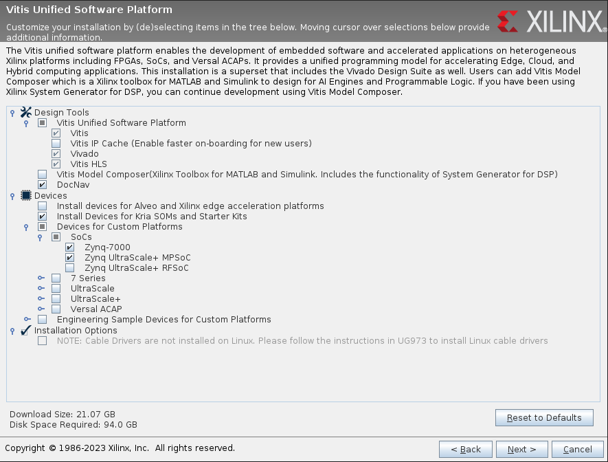
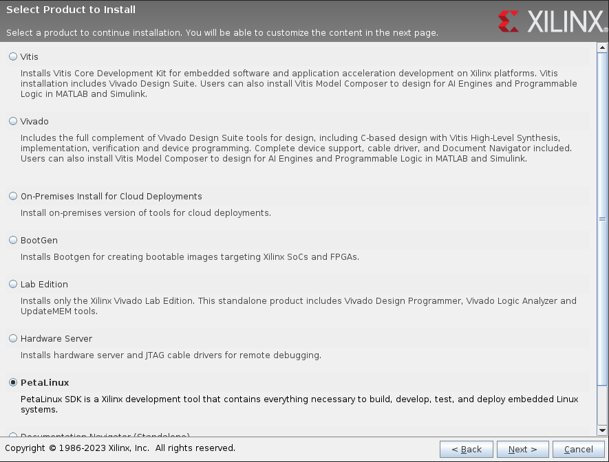

# Instalación de Vivado, Vitis y Petalinux

## Instalación de máquina virtual de Linux

Para este proceso seguir el siguiente [tutorial](https://www.hackster.io/whitney-knitter/installing-vivado-vitis-petalinux-2021-2-on-ubuntu-18-04-0d0fdf).

En nuestro proceso de instalación utilizaremos una maquina virtual de Ubunto corriendo en Windows.

En este caso utilizaremos [VirtualBox 6](https://www.virtualbox.org/wiki/Download_Old_Builds_6_1), e instalaremos el [Ubuntu 20.04.5 LTS](https://releases.ubuntu.com/focal/) desde la pagina oficial de Linux, se deben seguir algunos tutoriales de Youtube para que quede bien configurada la maquina virtual:

-   Como instalar Ubuntu en la maquina virtual [link](https://youtu.be/x5MhydijWmc)
-   Como compartir archivos entre Ubuntu y Windows [link](https://youtu.be/Mzd5i48OAiU)

### Configuraciones necesarias para Ubuntu 22.04 LTS

Basado en el siguiente [Tutorial](https://www.hackster.io/whitney-knitter/vitis-petalinux-2022-1-krs-1-0-install-on-ubuntu-22-04-145c1b)

En el caso de Ubuntu 22.04 LTS es necesario realizar las siguientes configuraciones previas para preparar el sistema operativo para recibir Vivado y Vitis:

Start by enabling the 32-bit architecture in the system, and set the shell to bash (by default it's configured to dash on a fresh install of Ubuntu):

```bash
~$ sudo dpkg --add-architecture i386
~$ sudo dpkg-reconfigure dash
```

Next install the following package dependencies. I've put them in the most optimal copy+paste order here (you're welcome);

```bash
~$ sudo apt-get install iproute2 make libncurses5-dev tftpd libselinux1 wget diffstat chrpath socat tar unzip gzip tofrodos
~$ sudo apt-get install debianutils iputils-ping libegl1-mesa libsdl1.2-dev pylint python3 python2 cpio tftpd gnupg zlib1g:i386 haveged perl
~$ sudo apt-get install lib32stdc++6 libgtk2.0-0:i386 libfontconfig1:i386 libx11-6:i386 libxext6:i386 libxrender1:i386 libsm6:i386
~$ sudo apt-get install xinetd gawk gcc net-tools ncurses-dev openssl libssl-dev flex bison xterm autoconf libtool texinfo zlib1g-dev
~$ sudo apt-get install gcc-multilib build-essential automake screen putty pax g++ python3-pip xz-utils python3-git python3-jinja2 python3-pexpect
~$ sudo apt-get install liberror-perl mtd-utils xtrans-dev libxcb-randr0-dev libxcb-xtest0-dev libxcb-xinerama0-dev libxcb-shape0-dev libxcb-xkb-dev
~$ sudo apt-get install openssh-server util-linux sysvinit-utils google-perftools
~$ sudo apt-get install libncurses5 libncurses5-dev libncursesw5-dev libncurses5:i386 libtinfo5
~$ sudo apt-get install libstdc++6:i386 libgtk2.0-0:i386 dpkg-dev:i386
~$ ~$ sudo apt-get install ocl-icd-libopencl1 opencl-headers ocl-icd-opencl-dev
```

## Instalación de Paquetes

primero es necesario ejecutar los siguientes comandos de Linux para garantizar la estabilidad en la instalacion delos software de Xilinx

```bash
sudo apt-get install libtinfo5
sudo apt install libncurses5
```

Adicionalmente, y como dice el tutorial, es necesario instalar algunos paquetes de linux para la compilacion de Petalinux:

```bash
sudo apt-get install lib32stdc++6
sudo apt-get install libgtk2.0-0:i386
sudo apt-get install libfontconfig1:i386
sudo apt-get install libx11-6:i386
sudo apt-get install libxext6:i386
sudo apt-get install libxrender1:i386
sudo apt-get install libsm6:i386
sudo apt-get install libqtgui4:i386
sudo apt-get install xinetd
sudo apt-get install iproute2
sudo apt-get install gawk
sudo apt-get install gcc
sudo apt-get install net-tools
sudo apt-get install ncurses-dev
sudo apt-get install openssl
sudo apt-get install libssl-dev
sudo apt-get install flex
sudo apt-get install bison
sudo apt-get install xterm
sudo apt-get install autoconf
sudo apt-get install libtool
sudo apt-get install texinfo
sudo apt-get install zlib1g-dev
sudo apt-get install gcc-multilib
sudo apt-get install build-essential
sudo apt-get install automake
sudo apt-get install screen
sudo apt-get install putty
sudo apt-get install pax
sudo apt-get install g++
sudo apt-get install python3-pip
sudo apt-get install xz-utils
sudo apt-get install python3-git
sudo apt-get install python3-jinja2
sudo apt-get install python3-pexpect
sudo apt-get install debianutils
sudo apt-get install iputils-ping
sudo apt-get install libegl1-mesa
sudo apt-get install libsdl1.2-dev
sudo apt-get install pylint3
sudo apt-get install python3
sudo apt-get install cpio
sudo apt-get install tftpd-hpa
sudo apt-get install gnupg
sudo apt-get install zlib1g:i386
sudo apt-get install haveged
sudo apt-get install perl
sudo apt-get install liberror-perl
sudo apt-get install mtd-utils
sudo apt-get install xtrans-dev
sudo apt-get install libxcb-randr0-dev
sudo apt-get install libxcb-xtest0-dev
sudo apt-get install libxcb-xinerama0-dev
sudo apt-get install libxcb-shape0-dev
sudo apt-get install libxcb-xkb-dev
sudo apt-get install openssh-server
sudo apt-get install util-linux
sudo apt-get install sysvinit-utils
sudo apt-get install cython
sudo apt-get install google-perftools
```

### Creacion del TFTP Server

PetaLinux also requires a TFTP server service to support TFTP booting on a target system. In the /etc/xinetd.d/ directory create a TFTP service file:

```sh
~$ sudo nano /etc/xinetd.d/tftp
```

y configurar este como:

```txt
service tftp
    {
    protocol = udp
    port = 69
    socket_type = dgram
    wait = yes
    user = nobody
    server = /usr/sbin/in.tftpd
    server_args = /tftpboot
    disable = no
    }
```

Then create the directory for the TFTP service to pull files from during the target boot process such as the boot image file (BOOT.bin), kernel, device tree, etc. Give the directory the appropriate permissions and give ownership to the same user specified in the TFTP service.

```sh
~$ sudo mkdir /tftpboot
~$ sudo chmod -R 777 /tftpboot
~$ sudo chown -R nobody /tftpboot
```

Stop and restart the host machine's extended internet services for these changes to take effect.

```sh
~$ sudo /etc/init.d/xinetd stop
~$ sudo /etc/init.d/xinetd start
```

## Instalacion de Vivado y Vitis

Descargar desde el centro de [descargas de Xilinx](https://www.xilinx.com/support/download/index.html/content/xilinx/en/downloadNav/vitis.html) el software [Xilinx Unified Installer 2022.2: Linux Self Extracting Web Installer](https://www.xilinx.com/member/forms/download/xef.html?filename=Xilinx_Unified_2022.2_1014_8888_Lin64.bin), luego para correr el instalador se debe ejecutar en un terminal el siguiente comando:

```bash
sudo chmod 777 ./Downloads/Xilinx_Unified_2022.2_1014_8888_Lin64.bin
sudo bash /Downloads/Xilinx_Unified_2022.2_1014_8888_Lin64.bin
```

Seleccionar los paquetes necesarios para la instalación:



Una vez instalados tanto Vitis como Vivado, ya pueden ser servidos y ejecutados

Ejecución de Vivado:

```bash
source /tools/Xilinx/Vivado/2021.2/settings64.sh
vivado
```

Ejecución de Vitis:

```bash
source /tools/Xilinx/Vitis/2021.2/settings64.sh
vitis
```

### Instalación del paquete para PYNQ

Descargar la informacion del repositorio GitHub de al [PYNQ-Z1](https://github.com/cathalmccabe/pynq-z1_board_files), luego crear la carpeta `board_files` en `boards` y copiar el contenido de la PYNQ-Z1.

```bash
cd /tools/Xilinx/Vivado/2022.2/data/boards
sudo mkdir board_files
cd /home/<User Name>/Downloads/
sudo cp -R pynq-z1_board_files-master/pynq-z1/ /tools/Xilinx/Vivado/2022.2/data/boards/board_files/
```

## Instalacion de drivers para las tarjetas (Cable drivers)

Next, the various Xilinx programmer cable drivers need to be installed. Be sure to disconnect any that are currently connected to the host machine prior to running the installation script:

```bash
~$ cd /tools/Xilinx/Vivado/2022.2/data/xicom/cable_drivers/lin64/install_script/install_drivers/

sudo ./install_drivers
```

## Instalacion de Petalinux

Usar el instalador de Vivado para descargar la imagen de Petalinux o descargar la imagen de [Petalinux](https://www.xilinx.com/member/forms/download/xef.html?filename=petalinux-v2022.2-10141622-installer.run) desde la pagina oficial de [Xilinx](https://www.xilinx.com/support/download/index.html/content/xilinx/en/downloadNav/embedded-design-tools.html):



You can install the PetaLinux mostly wherever you prefer, but I like to keep all of the Xilinx tools in the same place so I create a PetaLinux directory in the same directory Vivado and Vitis installed to following the version format as well.

Give the directory 755 permissions (making the folder globally read-execute):

```bash
sudo chmod -R 755 /tools/Xilinx/PetaLinux/2022.2/
```

Give the PetaLinux installer 777 permissions:

```bash
sudo chmod 777 ./tools/Xilinx/PetaLinux/2022.2/bin/petalinux-v2022.2-final-installer.run
```

Change ownership of the directory you’re installing PetaLinux in to the user:

```bash
sudo chown -R <user>:<user> /tools/Xilinx/PetaLinux/2022.2/
```

Run the PetaLinux installer:

```bash
cd /tools/Xilinx/PetaLinux/2022.2/bin/
./petalinux-v2022.2-final-installer.run -d /tools/Xilinx/PetaLinux/2022.2
```

Then test the installation by turning Webtalk on/off:

```bash
source /tools/Xilinx/PetaLinux/2021.2/settings.sh
petalinux-util --webtalk off
petalinux-util --webtalk on
```

It's worth noting that a PetaLinux project can not be built offline without access to the internet unless specifically configured to do so. This involves downloading the proper repositories locally to your machine and pointing the PetaLinux project to it, which I'll cover in a different post. This is something that you'll have to do to each PetaLinux project individually that you want to be able to run a build on offline.

### Descarga del soporte 'bsp' para SOM Kria y KR260

Este soporte se puede descargar desde la pagina oficial de [Xilinx](https://www.xilinx.com/support/download/index.html/content/xilinx/en/downloadNav/embedded-design-tools.html):

-   Kria K26 SOM BSP [Link de descarga](https://www.xilinx.com/member/forms/download/xef.html?filename=xilinx-k26-som-v2022.2-10141622.bsp)
-   Kria KV260 Starter Kit BSP [Link de descarga](https://www.xilinx.com/member/forms/download/xef.html?filename=xilinx-kv260-starterkit-v2022.2-10141622.bsp)
-   Kria KR260 Starter Kit BSP [Link de descarga](https://www.xilinx.com/member/forms/download/xef.html?filename=xilinx-kr260-starterkit-v2022.2-10141622.bsp)

### Nota

tener especial cuidado en las versiones, si se instala el Vivado y el Vitis 2022.2, tambien se debe descargar la misma versión para Petalinux.
