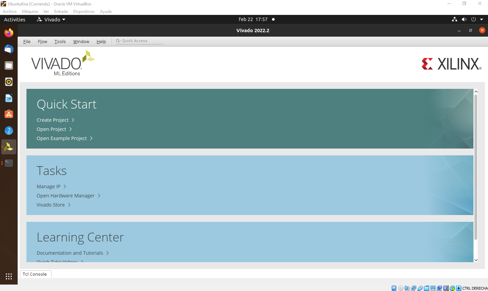
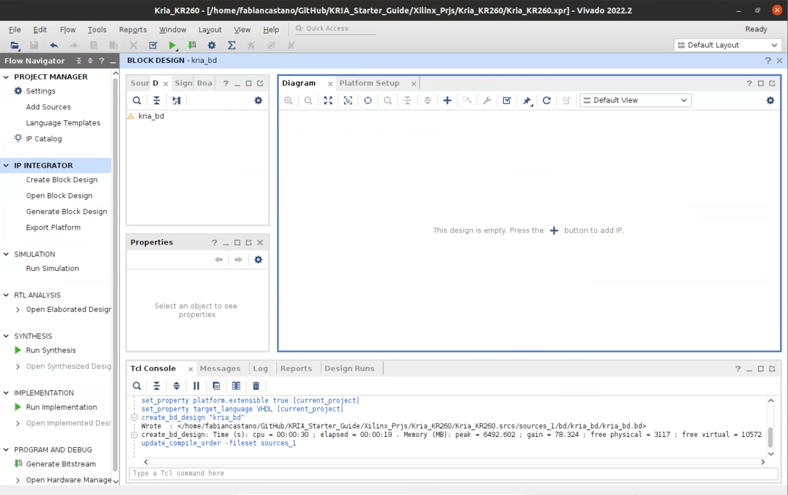
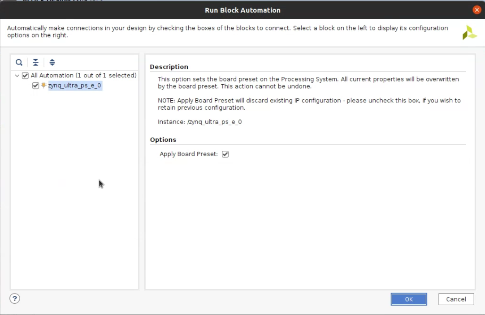
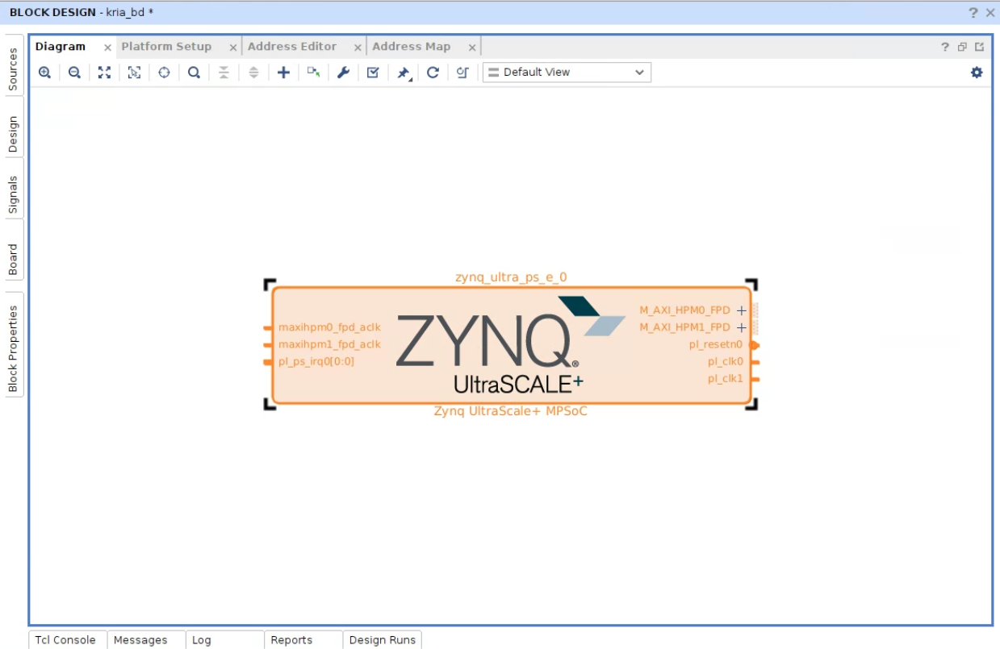
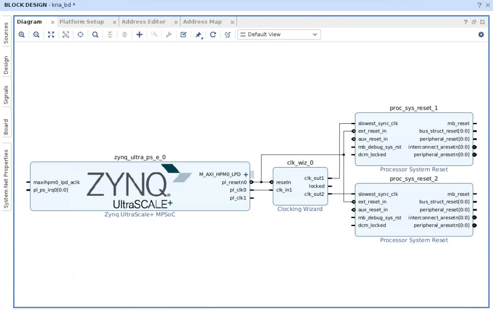
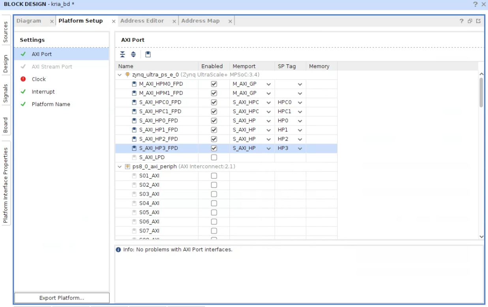
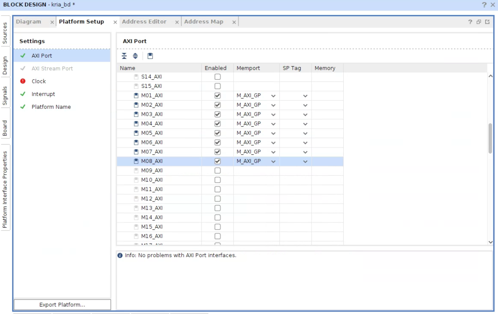
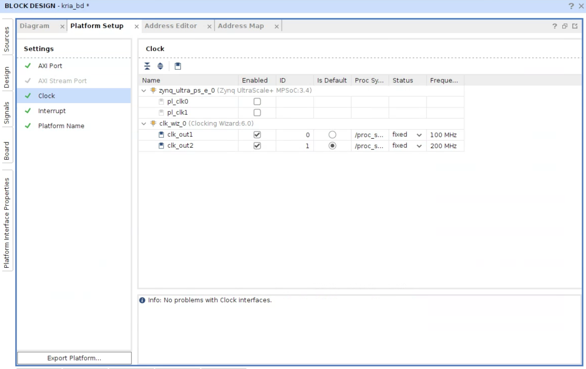

# Primeros pasos con la Kria KR260 en Vivado 2022.2

## Tutorial paso a paso

Para este proceso seguir el siguiente [tutorial](https://www.hackster.io/whitney-knitter/getting-started-with-the-kria-kr260-in-vivado-2022-1-33746d).


### Resumen

While the Kria KR260 can be used straight out of the box with no previous FPGA design experience, I think it's import to provide the resources for those interested in getting into FPGA design using their Kria KR260.

There are three main development tools in the Xilinx ecosystem: Vivado, Vitis, and PetaLinux. Vivado is the IDE for developing the hardware in Verilog or VHDL for the programmable logic design of a Xilinx FPGA. Vitis is a software development IDE for writing bare metal or Linux C/C++ applications that run on either a physical ARM-core processor or soft-core processor in the Xilinx FPGA. And PetaLinux is a set of software tools based on the open-source Yocto project for developing an embedded Linux image for Xilinx FPGAs.

Since both Vitis and PetaLinux need a base hardware design for the software to run on, Vivado is the starting point for any custom FPGA design on a Xilinx chip. So this project walks through the entire process of creating a custom hardware design in Vivado for the Kria KR260 development SoM board including the hooks for hardware acceleration and making note of where a user can add to the design.

### Creacion del proyecto en Vivado

Primero debemos dar Source a la direccion de vivado y abrir el GUI:

```bash
~$ source /tools/Xilinx/Vivado/2022.2/settings64.sh
~$ vivado
```

Luego seleccionar crear nuevo proyecto



Walking through the project setup pages, give the project the desired name, en este caso sera **Kria_KR260** and select the desired directory for it.


Be sure to check the option on the **Project Type** window that the **Project is an extensible Vitis platform**, this is the first hook required for a hardware accelerated design.


Vivado comes with board preset files you can select to set the base configuration in a project that are necessary for any FPGA development board (such as DDR pin-out and configuration) and needs to be setup for every project regardless of a user's custom design. In the Default Part page, switch to the Boards tab and click Refresh, then search for kr260. Single click on the row for the Kria KR260 Robotics Starter Kit and click Next.


The final page is just a summary of the selections just made for the project that's about to be created. Click Finish to create the new Vivado project.


Once the project is generated, it opens to a blank project manager page.


### Creacion del Block Design

First things first in a new Vivado design is to create a block design. A block design is a graphical block programming tool where each block represents a chunk of HDL code that is configured and connected together via this GUI. It's the easiest way for a user not already familiar with any HDL language to get started in FPGA design.

In the **Project Manager** window under the **IP Integrator** tab, select the **Create Block Design** option and give it the desired name in the following pop up window.


Despues de unos momentos, una ventana de block design en blanco se abrira:



The first thing that needs to be defined in a block design is the processor. In the case of the Kria, it has a physical ARM-core processor built into the fabric of the programmable logic. To instantiate it in the block design to be able to configure it and connect other IP blocks to it, click the `+` button in the Diagram window and search for "zynq".

Double-click the Zynq MPSoC IP to add it to the block design. This IP block is how the ARM-core processor's hardware settings can be customized by a user in the Kria SoM. A green banner will appear at the top of the **Diagram** window with the option to **Run Block Automation**. Block automation will apply the specific KR260 board presets to the Zynq MPSoC IP block.


Click the link for **Run Block Automation** and ensure that the option to **Apply Board Preset** is checked in the window that pops up before clicking **OK**.



Los puertos en el IP block **Zynq UltraScale+** cambiaran un poco con la aplicacion de los presets del board KR260 luego del **Run Block Automation:**



### Modificacion de la configuracion del IP Core

Since I'm adding hooks for hardware acceleration (which means configuring the hardware here in Vivado so that I'll have access to it from the software in Vitis/PetaLinux later) there are a few customizations to the Zynq UltraScale+ IP.

To customize an IP in the block design, simply double-click on it to bring up the configuration window.

What I'm doing is simply disabling the two full-power high performance AXI ports in the block design and enabling the low-power high performance AXI port:


This is simply to make sure that I don't ever accidentally use the two full-power high performance AXI ports in future updates of this hardware design in the block design because I want them saved solely for hardware acceleration later on (which is addressed later on in the Platform Setup step).

This is something that's a little counter-intuitive about hardware acceleration in Vivado is that disabling something in the block design doesn't disable it completely in the whole project, it's still an option to enable in the Platform Setup step to make available to the software in Vitis.

### Agregar el Clocking Wizard IP

Next I'm adding a **clocking wizard** IP to my design as a clock source controlled by the Zynq UltraScale+ IP that I can enable in the Platform Setup step to make available to the software in Vitis for hardware acceleration.

Double-click the clocking wizard IP to customize it. In the Output Clocks tab, enable the desired number of output clocks with desired rates and change the polarity of the reset to match that of the reset coming from the Zynq UltraScale+ IP block (which is active low).


Ahora conecte la salida `pl_clk0` del procesador a la entrada `clk_in1` del clocking wizard IP, y el `pl_reset0` del procesador al `resetn` del clocking wizard.


### Agregar el Processor System Reset IP

Add Processor System Reset IP blocks for each of the output clocks of the clocking wizard IP and connect the `ext_reset_in` of each to the `pl_reset0` output of the Zynq UltraScale+ IP. Connect `clk_outn` of the clocking wizard IP to the `slowest_sync_clk` of each respective Processor System Reset IP.

All of the connection automation options can be ignored and they will disappear once the connections described above are made.



### Agregar AXI Interrupt Controller IP

Some sort of interrupt source is also needed for hardware accelerated designs. To meet this requirement, add an **AXI interrupt controller IP**. AXI is a standard interface that Xilinx uses in their designs as a connection interface for IP blocks in a hardware design because it's highly configurable and the connection process can be automated.


After adding the AXI interrupt controller IP, double-click on the block and change the **Interrupt Output Connection** from **Bus** to **Single**.


Then select the option to Run Connection Automation which will automatically configure and connect the AXI interrupt controller to the Zynq UltraScale+ IP via the AXI interface.

In the configuration window for the connection automation, select the clock for the AXI interface that you plan to make the default for the hardware acceleration design. In my case, that is the 200 MHz clk_out2 from the clocking wizard IP. Whichever clock you chose, be sure that the clock source for the driving bridge IP, slave interface, and master interface are all set to the same clock source.


Finally, connect the `irq` output from the **AXI interrupt controller** IP to the `pl_ps_irq` input of the Zynq UltraScale+ IP.


## Configuracion de la plataforma

As mentioned before, in order to make hardware resources available to the software in Vitis for hardware acceleration, they need to be enabled in the **Platform Setup** tab of the block design.

The first section in the Platform setup tab is to select the AXI ports to make available to the software in Vitis. I selected everything but the low-power high performance AXI port on the Zynq UltraScale+ IP to enable, then 8 general purpose master AXI interfaces from the regular AXI interconnect as well. Make note of any names you set in the SP tag field, as that is the identifier you will call from the software in Vitis to target that specific AXI port.




Next, select the clocks to make available to the software in Vitis. In this case, I'm only making the two output clocks from the clocking wizard available with the 200 MHz `clk_out2` set as the default clock.



Enable the `irq` output from the AXI interrupt controller in the Interrupt section.


Finally, give the platform the desired name, vendor name, and version number.


## Validar y guardar ek bloque de diseño

Once the desired IP has been added/connected in the Diagram and the Platform Setup configuration completed, the overall block design needs to be validated and saved.

In the Diagram tab of the block design, click the checkbox icon to run a design validation.

One critical warning appears about the input interrupt not being connected on the AXI interrupt controller, which can safely be ignored in this case.


After clicking OK to dismiss the critical warning, click the save icon in the menu bar to save the block design.

## Deshabilitar la Incremental Synthesis

I've found that the design checkpoint files created by the default incremental synthesis option in Vivado causes issues with the hardware acceleration workflow. So before launching any sort of synthesis run, I like to disable it.

Select **Settings** in the **Flow Navigator** window then navigate to the Synthesis tab.


Click the three dots next to the option for **incremental synthesis** and select the option to **Disable incremental synthesis** in the following pop up window.


Click OK in both windows to apply the new settings and return to the Vivado project.


## Generate Block Desing

The next step in a Vivado project where it is also an extensible Vitis platform is to generate the block design in it's own initial run.

Select **Generate Block Design** from the **Flow Navigator** window and change the **Synthesis Options** from Out of context per IP to **Global**.


Luego de clic en **Generate**

### Create HDL Wrapper

With the block design complete, validated, saved, and generated an HDL wrapper file needs to be created to instantiate it in the overall design. Luckily, Vivado can generate it automatically as well as update it automatically for us.

In the **Sources** window, right-click on the block design file and select the option to **Create HDL Wrapper**...

Then select the option to let Vivado manage the wrapper and auto-update it before clicking **OK** in the pop-up window.

After a few moments, the HDL wrapper file will appear in the Sources window.


### Generate the Bitstream

It's finally time to generate a bitstream for the design. If you're not previously familiar with FPGA design, the overall flow is synthesis, implementation (place & route), and finally the generation of a bitstream. Synthesis is the initial conversion of HDL code to a transistor logic configuration, implementation (generally referred to place & route) is the deployment of the logic design on a specific FPGA chip, and the bitstream is the final output file that's used to program the FPGA with that specific logic configuration.

You can step through and run each of these main steps manually, but Vivado will detect and run any previous steps that might be out-of-date or not yet ran.

So in this case in a new project, when I select to generate a bitstream from the Flow Navigator window, Vivado will automatically determine it needs to run synthesis and implementation prior:

Click OK to launch the runs for synthesis, implementation, and bitstream generation.

## Exportar la plataforma para el SW development

In order to use the hardware design in Vitis and/or PetaLinux to develop software, it needs to be packaged up into a platform file.

Select the option to **Export Platform** from the **Flow Navigator** window.

In the platform packaging windows, select **Hardware** for **Platform Type** (the Kria doesn't currently have emulation support) and be sure to check the option to **include the bitstream** in **Platform State**.


Finally, give the platform the desired name, vendor/version info, description, and select the desired output directory for the exported platform.

Since this post is already plenty long enough, I'll continue with the software development in Vitis in a follow up post.
