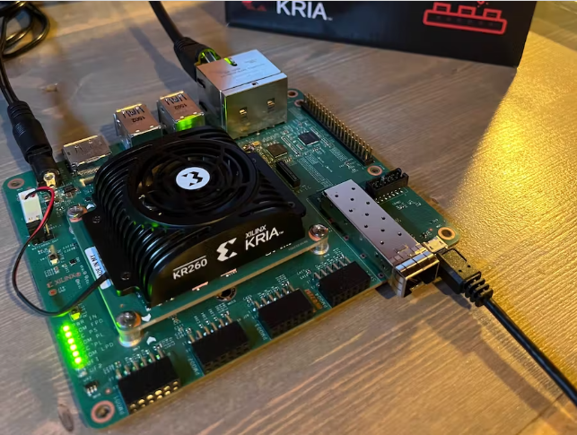
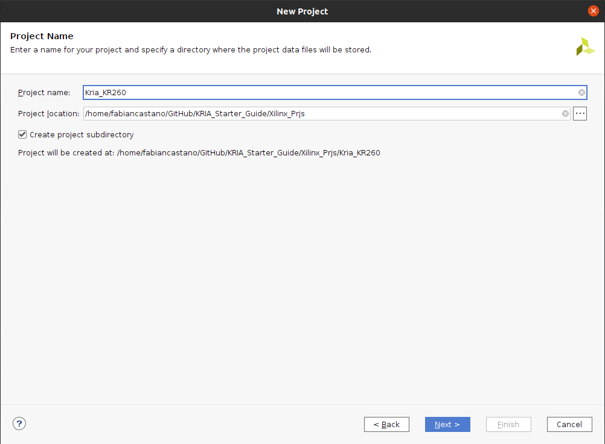
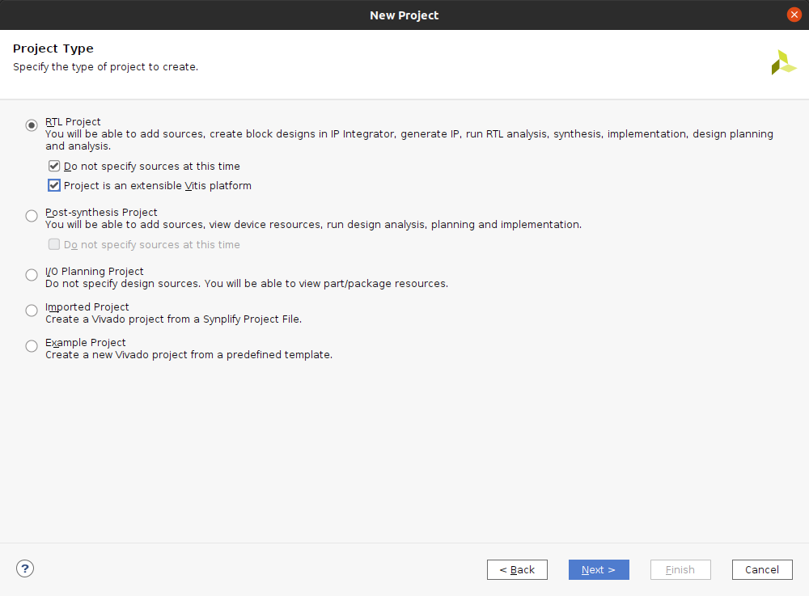
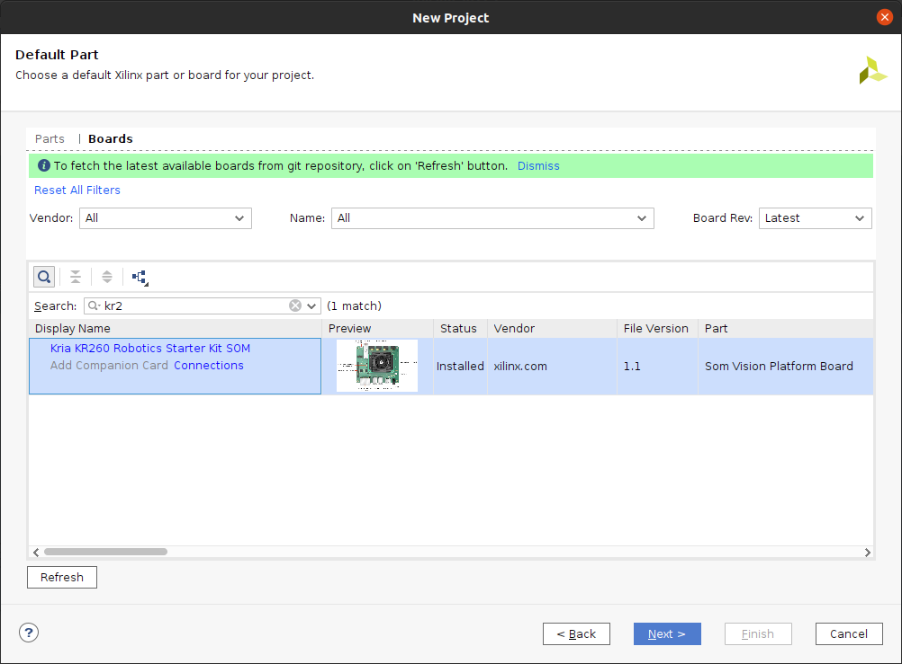
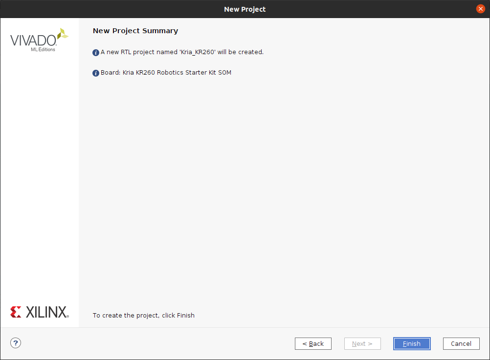

# Primeros pasos con la Kria KR260 en Vivado 2022.2

## Tutorial paso a paso

Para este proceso seguir el siguiente [tutorial](https://www.hackster.io/whitney-knitter/getting-started-with-the-kria-kr260-in-vivado-2022-1-33746d).



### Resumen

While the Kria KR260 can be used straight out of the box with no previous FPGA design experience, I think it's import to provide the resources for those interested in getting into FPGA design using their Kria KR260.

There are three main development tools in the Xilinx ecosystem: Vivado, Vitis, and PetaLinux. Vivado is the IDE for developing the hardware in Verilog or VHDL for the programmable logic design of a Xilinx FPGA. Vitis is a software development IDE for writing bare metal or Linux C/C++ applications that run on either a physical ARM-core processor or soft-core processor in the Xilinx FPGA. And PetaLinux is a set of software tools based on the open-source Yocto project for developing an embedded Linux image for Xilinx FPGAs.

Since both Vitis and PetaLinux need a base hardware design for the software to run on, Vivado is the starting point for any custom FPGA design on a Xilinx chip. So this project walks through the entire process of creating a custom hardware design in Vivado for the Kria KR260 development SoM board including the hooks for hardware acceleration and making note of where a user can add to the design.

### Creacion del proyecto en Vivado

Primero debemos dar Source a la direccion de vivado y abrir el GUI:

```bash
~$ source /tools/Xilinx/Vivado/2022.2/settings64.sh
~$ vivado
```

Luego seleccionar crear nuevo proyecto


Walking through the project setup pages, give the project the desired name, en este caso sera **Kria_KR260** and select the desired directory for it.




Be sure to check the option on the **Project Type** window that the **Project is an extensible Vitis platform**, this is the first hook required for a hardware accelerated design.



Vivado comes with board preset files you can select to set the base configuration in a project that are necessary for any FPGA development board (such as DDR pin-out and configuration) and needs to be setup for every project regardless of a user's custom design. In the Default Part page, switch to the Boards tab and click Refresh, then search for kr260. Single click on the row for the Kria KR260 Robotics Starter Kit and click Next.



The final page is just a summary of the selections just made for the project that's about to be created. Click Finish to create the new Vivado project.



Once the project is generated, it opens to a blank project manager page.


### Creacion del Block Design
