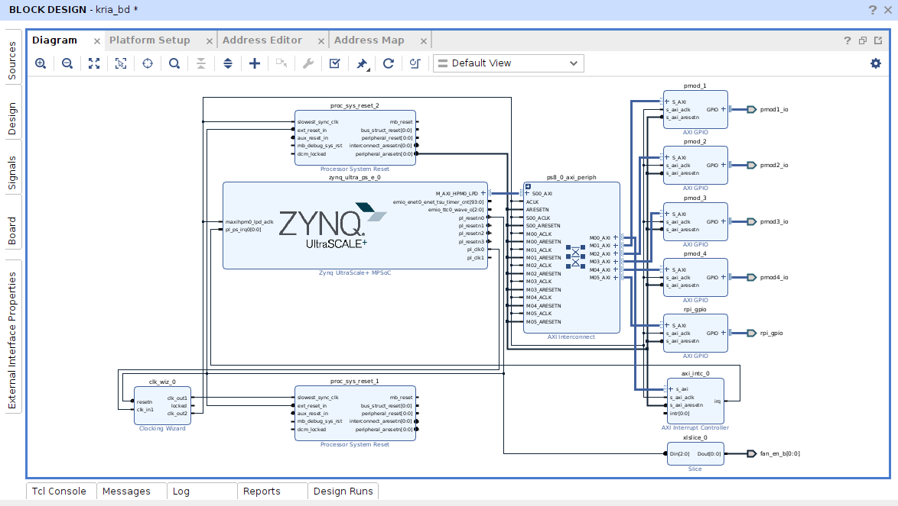

# Soporte del conector RPi+PMOD en Kria KR260, PL Design

## Tutorial paso a paso

Para este proceso seguir el siguiente [tutorial](https://www.hackster.io/whitney-knitter/rpi-pmod-connector-gpio-with-custom-pl-design-in-kria-kr260-53c40e).

### Resumen

One of the features I was excited to get with the Kria KR260 for my robotics applications that the Kria KV260 didn’t have was the extra I/O connectors to drive various peripherals such as motors. Given that I/O mapping on an FPGA can be a bit more complex than your typical microcontroller board like the Raspberry Pi or BeagleBone, I decided to do a writeup covering how I map the I/Os of a new AMD-Xilinx development board.

Furthermore since the Kria is a SoM (System on Module), I/O mapping on it has an added layer of complexity given that it spans over two separate boards: the Kria K26 base board, and the KR260 carrier board. So knowing where to look to find the info needed to fully map out a signal from a pin on a PMOD or the RPi header all the way to a package pin on the Kria’s K26 FPGA itself can seem skewed for first-time users.

Finally, the PMODs and RPi header on the KR260 are connected to the programmable logic of the K26 versus the MIO/EMIO pins that most of the other peripherals are connected to (as outlined in my previous post here. This requires a modification of the block design (or addition of HDL code) in Vivado to add the logic for the desired interface to each of the connectors. Which means a new bitstream will be generated and corresponding hardware node in the device tree will also be required.

For those not familiar, the boot process of the Kria’s embedded Linux image boots the ARM-core processors of the Zynq MPSoC in the K26 FPGA before flashing a bitstream onto its programmable logic (PL). Thus any hardware nodes in the device tree for things located in the PL have to be loaded as a device tree overlay later, otherwise the boot process would freeze looking for device tree nodes that aren’t present in the system yet since the PL has yet to be programmed. This is why there is no device tree packaged into the default boot binary (boot.bin) for the Kria boards you download from the [K26 SoM wiki](https://xilinx-wiki.atlassian.net/wiki/spaces/A/pages/1641152513/Kria+K26+SOM#Boot-Firmware-Updates).

Now it’s definitely possible to reconfigure a PetaLinux project built from the KR260/KV260 BSP to change the boot sequence to program the PL during boot and package a device tree into the boot binary. It’s also possible to just create a PetaLinux project from scratch configured in this manner as well, but a PetaLinux project for the Kria boards is still complex enough that it’s much easier/faster to modify a project created from a BSP (which is why I will not do a project tutorial for KR260/KV260 PetaLinux project built from scratch, 99% of it would just be copy+pasting stuff from a project built using the BSP). However, I’ve found the easiest solution is to load the device tree overlay the exact same way as I would for an accelerated application and be on my merry way, which is what I will be demonstrating in this project.

### Descargar el esquematico de KR260

The schematic for the KR260 carrier board (XTP743) can be found [here](https://www.xilinx.com/member/forms/download/design-license.html?cid=bad0ada6-9a32-427e-a793-c68fed567427&filename=xtp743-kr260-schematic.zip). It must be downloaded directly from AMD-Xilinx’s site since a user agreement must be digitally signed prior to downloading.

The schematic for the Kria K26 base board is not publicly available given it’s a commercial product and not just a development part. However, there is a master pinout constraints file included in the download of the KR260 schematic that provides the necessary information for signal mapping.

## Modificar el bloque de diseño en Vivado

As I mentioned previously, since the PMOD and RPi headers are connected via the PL, the block design in Vivado needs to be updated to add the specific interface desired for each connector. Constraints file(s) also need to be added to specify the package pins on the FPGA. I’m starting with the Vivado project I previously created for the KR260 in this previous project post.

I’m going to just use AXI GPIO block for everything, I’m not going to cover the RPi special functions at the moment, but you would simply add the appropriate IPs for each special function like I2C or SPI. So I added 5 AXI GPIO IP blocks to the block design: four are one channel of 8 bits and the fifth is one channel of 28 bits.

Once added, run the corresponding connection automation that appeared, leaving all selections for clock as the default.

Validate the block design and save it, then generate the block design again.

Create a new HDL wrapper by right-clicking on the block design file in the Hierarchy tab of the Sources window and selecting Create HDL Wrapper.

Select to either allow Vivado to auto-manage it or allow for user edits. I personally chose the latter so I could make the code a bit more readable since I don’t like the way that Vivado auto-generates the code for AXI GPIO that’s configured as inout signals, but this has zero impact on how the design actually functions and is just a personal choice to make it easier for myself to use with other custom code in the future.

## Agregar Constrains
