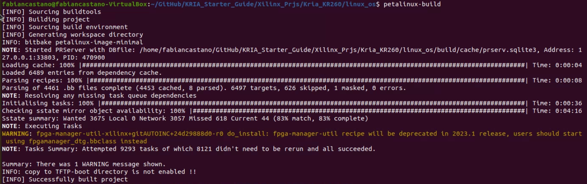
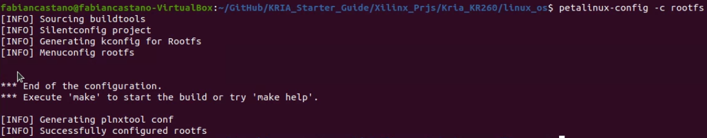
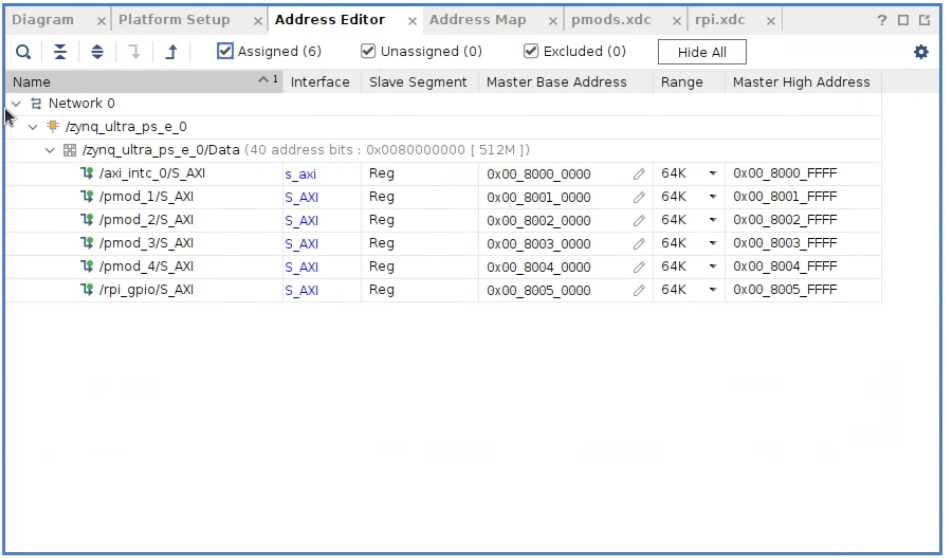

# Primeros pasos con Kria KR260 en Petalinux 2022.2

## Tutorial paso a paso

Para este proceso seguir el siguiente [tutorial](https://www.hackster.io/whitney-knitter/getting-started-with-the-kria-kr260-in-petalinux-2022-1-daec16).


### Resumen

Continuing on with my getting started series for the Kria KR260 Robotics Starter kit, I'm covering how to create an embedded Linux image for it using PetaLinux with the appropriate hooks enabled for FPGA accelerated applications to be developed for it later on using Vitis.

As I explained in my Vitis 2022.1 on Ubuntu 22.04 installation project post, KRS does not support PetaLinux for the KR260, it only supports the cross compilation of an Ubuntu 22.04 image as the root filesystem. So I have switched back to the `gcc-multilib` GNU C compiler on my host machine to be able to compile PetaLinux root filesystems. Therefore any PetaLinux projects I will be doing for the KR260 will not involve KRS, and will just be accelerated applications and/or regular Linux applications.

## Paso opcional (Yo no lo realice)

### Upgrade Petalinux SDK

The BSPs for the Kria KR260 and KV260 require the Update1 to be applied to PetaLinux, otherwise the project will not build correctly (if at all). Start be sourcing the PetaLinux tools in the host machine environment.

```bash
~$ source /tools/Xilinx/PetaLinux/2022.2/settings.sh
```

And upgrade the PetaLinux eSDK with Update1:

```bash
~$ petalinux-upgrade -u http://petalinux.xilinx.com/sswreleases/rel-v2022/sdkupdate/2022.2_update1/ -p "aarch64" --wget-args "--wait 1 -nH --cut-dirs=4"
```

---

## Source the Petalinux folder

Para realizar la compilacion de Petalinux es necesario hacer source de la carpeta contenedora de Petalinux, para eso utilizamos el siguiente comando

```bash
~$ source /tools/Xilinx/PetaLinux/2022.2/settings.sh
```

---

## Creacion de un proyecto Petalinux para KR260 BSP

Primero es necesario desactivar los proxy http y https, para que no presente problemas con la ejecucion de scripts de python en la construccion de PetaLinux.

```bash
~$ unset http_proxy
~$ unset https_proxy
```

Change directories into the desired location to create the PetaLinux project in. I personally like to create my PetaLinux projects in the top level directory of the corresponding Vivado project I'm pulling the hardware design in from. Once in the desired directory location, create a PetaLinux project using the Kria KR260 BSP (download here), and change directories into it.

```bash
~$ cd <repository path>/Kria_KR260/
~/Kria_KR260$ petalinux-create --type project -s /tools/Xilinx/PetaLinux/2022.2/bsp_files/xilinx-kr260-starterkit-v2022.2-10141622.bsp --name linux_os
~/Kria_KR260$ cd ./linux_os/
```

Then import the hardware platform exported from Vivado that has the hooks for an accelerated design, esto importará el archivo XSA y lo utilizará como plataforma para Petalinux:

```bash
~/Kria_KR260/linux_os$ petalinux-config --get-hw-description ../
```

In the system configuration editor, start by enabling **FPGA manager** (which I'm not totally sure why the FPGA manager isn't enabled by default in the BSP since the KR260 definitely needs it for the device tree overlay functionality).

Then set the root filesystem type to `INITRD` with the **INITRAMFS/INITRD Image name** set as **petalinux-initramfs-image**, and disable TFTP boot if you don't plan to use it.

```bash
FPGA Manager --> Fpga Manager[*]

Image Packaging Configuration --> Root Filesystem Type --> INITRD[*]
Image Packaging Configuration --> INITRAMFS/INITRD Image name --> petalinux-initramfs-image
Image Packaging Configuration --> Copy final images to tftpboot[]
```


Changing the image name to `petalinux-initramfs-image` (default is **petalinux-image-minimal**) is super important or the ramdisk image to mount the root filesystem in the early steps of the boot process will not be generated which will cause the root filesystem to not be persistent between power cycles on the KR260.


Exit the system configuration editor, opting to save the changes.

---

### Construccion de PetaLinux

Then attempt to build the project for the first time. Esta es una primera iteracion de la construccion del proyecto.

```bash
~/Kria_KR260/linux_os$ petaliunx-build
```



This first build took a little over two hours for me; this PetaLinux project for the KR260 is very large, and with all of the required libraries it's just a lot right now. I'm sure there will be an improvement in some future iterations.

Which I why I recommend running that first build before customizing the root filesystem and/or kernel at all to add any packages. The subsequent build after that first one do execute within a few minutes since it's just adding on the extra packages.

---

## Customize & Add XRT Support

If there are any kernel packages you would like to add, launch the kernel configuration editor and select accordingly:

---

### Configuracion del Kernel

There aren't any extra things I'm adding to the KR260 kernel outside of what the BSP enables by default so I skipped straight to the root filesystem configuration editor to add support for acceleration and XRT.

para configurar el kernel se utiliza el siguiente comando:

```bash
~/Kria_KR260/linux_os$ petalinux-config -c kernel
```

en este menu se debe ir a Drivers y habilitar los drivers necesarios

-   Device Drivers > I2C support > I2C Hardware Bus support, habilitar
    -   Cadence I2C Controller
    -   Xilinx I2C Controller

---

### Configuracion del root file system

To add the XRT support and the general packages accelerated applications will need in the root filesystem, enable the following packages if they aren't already by the KR260 BSP:

Para configurar el root file system se utiliza el siguiente comando:

```bash
~/Kria_KR260/linux_os$ petalinux-config -c rootfs
```

en este menu se deben configurar los paquetes del filesystem:

-   Filesystem Package > base > i2c-tools, habilitar
    -   i2c-tools
    -   i2c-tools-dev

```bash
Filesystem Packages --> console --> utils --> git --> [*] git
Filesystem Packages --> base --> dnf --> [*] dnf
Filesystem Packages --> base --> i2c-tools --> [*] i2c-tools
Filesystem Packages --> base --> i2c-tools --> [*] i2c-tools-dev
Filesystem Packages --> x11 --> base --> libdrm --> [*] libdrm
Filesystem Packages --> x11 --> base --> libdrm --> [*] libdrm-tests
Filesystem Packages --> x11 --> base --> libdrm --> [*] libdrm-kms
Filesystem Packages --> libs --> xrt --> [*] xrt
Filesystem Packages --> libs --> xrt --> [*] xrt-dev
Filesystem Packages --> libs --> zocl --> [*] zocl
Filesystem Packages --> libs --> opencl-headers --> [*] opencl-headers
Filesystem Packages --> libs --> opencl-clhpp --> [*] opencl-clhpp-dev
Petaliunx Package Groups --> packagegroup-petalinux --> [*] packagegroup-petalinux
Petaliunx Package Groups --> packagegroup-petalinux-gstreamer --> [*] packagegroup-petalinux-gstreamer
Petaliunx Package Groups --> packagegroup-petalinux-opencv --> [*] packagegroup-petalinux-opencv
Petaliunx Package Groups --> packagegroup-petalinux-v4lutils --> [*] packagegroup-petalinux-v4lutils
Petaliunx Package Groups --> packagegroup-petalinux-x11 --> [*] packagegroup-petalinux-x11
```



Rebuild the project after adding the packages to the root filesystem (and kernel if you choose):

```bash
~/Kria_KR260/linux_os$ petaliunx-build
```

---

## Construir Sysroot (SDK) para el proyecto

After the project has been built, build the SDK for the project to get a sysroot to use with Vitis to compile any custom accelerated applications later on:

```bash
~/Kria_KR260/linux_os$ petaliunx-build --sdk
```

---

## Empaquetar Imagen WIC para SD Card

Once the project has been built, package the boot binary for the custom image:

```bash
~/Kria_KR260/linux_os$ petalinux-package --boot --u-boot --force
```

Then package the WIC image for the SD card:

```bash
~/Kria_KR260/linux_os$ petalinux-package --wic --images-dir images/linux/ --bootfiles "ramdisk.cpio.gz.u-boot,boot.scr,Image,system.dtb,system-zynqmp-sck-kr-g-revB.dtb" --disk-name "sda"
```

Note that since the KR260 has the SD card connected to the Zynq FPGA via the USB controller on the KR260 carrier board, that's why we need to specify the disk name as sda.

---

## Flash SD Card

You can manually load the wic onto the SD card from the command line, but I go the lazy route and use balenaEtcher:


---

## Generar el Device Tree Overlay para el PL Design

The device tree blob containing the overlay nodes needs to be compiled for the design, which is easily done by using the Xilinx Software Command Line Tools (**XSCT**):

```bash
~/Kria_KR260$ source /tools/Xilinx/Vitis/2022.1/settings64.sh
~/Kria_KR260$ xsct
```

Open the exported XSA from Vivado and use the `createdts` command to create the device tree source files for the PL design:

```bash
xsct% hsi::open_hw_design ../kria_base.xsa

xsct% createdts -hw ../kria_base.xsa -zocl -platform-name kria_kr260 -git-branch xlnx_rel_v2022.1 -overlay -compile -out ./dtg_kr260_v0

xsct% exit
```

After exiting **XSCT**, use the standard Linux device tree compiler (dtc) to compile the source files into the needed device tree blob:

```bash
~/Kria_KR260$ dtc -@ -O dtb -o ./dtg_kr260_v0/dtg_kr260_v0/kria_kr260/psu_cortexa53_0/device_tree_domain/bsp/pl.dtbo ./dtg_kr260_v0/dtg_kr260_v0/kria_kr260/psu_cortexa53_0/device_tree_domain/bsp/pl.dtsi
```

---

## Transferir los archivos del PL Design a KR260

I like to create a folder to copy all of the necessary design files to that need to be uploaded to the KR260 for an accelerated application or PL design like this (note: the Kria_KR260 directory is the top level directory of the Vivado project):

```bash
~/Kria_KR260$ mkdir -p gpio_file_transfer
~/Kria_KR260$ cd ./gpio_file_transfer/
```

It’s here I’ll create the description file, shell.json, for the design:

```bash
~/Kria_KR260/gpio_file_transfer$ nano shell.json
```

And copy+paste the following to `shell.json`:

```json
{
    "shell_type": "XRT_FLAT",
    "num_slots": "1"
}
```

Then copy the generated device tree blob and .bin file into the folder:

```bash
~/Kria_KR260/gpio_file_transfer$ cp ../dtg_kr260_v0/dtg_kr260_v0/kria_kr260/psu_cortexa53_0/device_tree_domain/bsp/pl.dtbo ./
~/Kria_KR260/gpio_file_transfer$ cp ../Kria_KR260.runs/impl_1/kr260_top.bin ./
```

Rename the device tree blob and .bin file to the same thing (the only difference should be their respect file extensions (also change the.bin extension to `.bit.bin`):

```bash
~/Kria_KR260/gpio_file_transfer$ mv kr260_top.bin kr260_gpio.bit.bin
~/Kria_KR260/gpio_file_transfer$ mv pl.dtbo kr260_gpio.dtbo
```

Then, with the KR260 booted up and running with the new SD card image generated in the previous steps and connected to the local network, transfer the new PL design files to it:

```bash
~/Kria_KR260/gpio_file_transfer$ scp kr260_gpio.dtbo kr260_gpio.bit.bin shell.json petalinux@<KR260’s IP address>:/home/petalinux
```

---

## Run PL Design on KR260

After the files have been successfully transferred to the KR260, create a directory in the `/lib/firmware/xilinx` directory with the same name as was given to the device tree blob and.bin file and copy them into it:

```bash
xilinx-kr260-starterkit-20222:~$ sudo mkdir /lib/firmware/xilinx/kr260_gpio
xilinx-kr260-starterkit-20222:~$ cp kr260_gpio.dtbo kr260_gpio.bit.bin shell.json /lib/firmware/xilinx/kr260_gpio
```

At this point, the PL design will show up just like an accelerated application would using the xmutil commands:

```bash
xilinx-kr260-starterkit-20222:~$ sudo xmutil listapps
```

Unload the default application then load the PL design which flashes the PL design’s bitstream into the PL and loads its device tree overlay:

```bash
xilinx-kr260-starterkit-20222:~$ sudo xmutil unloadapp
xilinx-kr260-starterkit-20222:~$ sudo xmutil loadapp kr260_gpio
```

When the device tree overlay loads, the terminal will print out as such indicating the new device tree nodes for each of the AXI GPIO IP blocks are now present in the system.

---

## Testing the GPIO

Using the Sysfs driver, list out the GPIO available in the system:

```bash
xilinx-kr260-starterkit-20222:~$ ls /sys/class/gpio/
export  gpiochip0  gpiochip440  gpiochip468  gpiochip476  gpiochip484  gpiochip492  gpiochip500  gpiochip508  unexport
```

You can print the label for each to determine what each gpiochip number correlates to:

```bash
xilinx-kr260-starterkit-20222:~$ cat /sys/class/gpio/gpiochip440/label
80050000.gpio
xilinx-kr260-starterkit-20222:~$ cat /sys/class/gpio/gpiochip468/label
80040000.gpio
xilinx-kr260-starterkit-20222:~$ cat /sys/class/gpio/gpiochip476/label
80030000.gpio
xilinx-kr260-starterkit-20222:~$ cat /sys/class/gpio/gpiochip484/label
80020000.gpio
xilinx-kr260-starterkit-20222:~$ cat /sys/class/gpio/gpiochip492/label
80010000.gpio
xilinx-kr260-starterkit-20222:~$ cat /sys/class/gpio/gpiochip0/label
zynqmp_gpio
xilinx-kr260-starterkit-20222:~$ cat /sys/class/gpio/gpiochip500/label
slg7xl45106
xilinx-kr260-starterkit-20222:~$ cat /sys/class/gpio/gpiochip508/label
firmware:zynqmp-firmware:gpio
```

The Zynq MPSoC MIO pins are gpiochip0, gpiochip508 is the ZynqMPSoC modepin GPIO controller, and gpiochip500 is the KR260’s I2C GPO reset controller. These three gpiochips are standard to the KR260 and will always be there, and you don’t need to mess with them.

The other gpiochips (gpiochip440, gpiochip468, gpiochip476, gpiochip484, and gpiochip492 in my case) all have the corresponding AXI GPIO’s address from the Vivado block design address editor as their label. So fro example, I can now see that the AXI GPIO for the RPi header (address 0x8005_0000) is gpiochip440. And since I have that AXI GPIO IP configured for 28 inout pins, that means RPi_GPIO0 on the AXI GPIO for the RPi header is GPIO 440 in the Sysfs driver, RPi_GPIO1 is GPIO 441, and so on up to RPi_GPIO27 which is GPIO 467.



I attached 8 LEDs to the 8 I/O of PMOD4 which is gpiochip476 and exported each IO as an output pin. Which again means PMOD4 IO1 is 476 through PMOD 4 IO8 which is 483:

```bash
xilinx-kr260-starterkit-20222:~$ echo 476 | sudo tee /sys/class/gpio/export
xilinx-kr260-starterkit-20222:~$ echo out | sudo tee /sys/class/gpio/gpio 476/direction
xilinx-kr260-starterkit-20222:~$ echo 477 | sudo tee /sys/class/gpio/export
xilinx-kr260-starterkit-20222:~$ echo out | sudo tee /sys/class/gpio/gpio477/direction
xilinx-kr260-starterkit-20222:~$ echo 478 | sudo tee /sys/class/gpio/export
xilinx-kr260-starterkit-20222:~$ echo out | sudo tee /sys/class/gpio/gpio478/direction
xilinx-kr260-starterkit-20222:~$ echo 479 | sudo tee /sys/class/gpio/export
xilinx-kr260-starterkit-20222:~$ echo out | sudo tee /sys/class/gpio/gpio479/direction
xilinx-kr260-starterkit-20222:~$ echo 480 | sudo tee /sys/class/gpio/export
xilinx-kr260-starterkit-20222:~$ echo out | sudo tee /sys/class/gpio/gpio480/direction
xilinx-kr260-starterkit-20222:~$ echo 481 | sudo tee /sys/class/gpio/export
xilinx-kr260-starterkit-20222:~$ echo out | sudo tee /sys/class/gpio/gpio481/direction
xilinx-kr260-starterkit-20222:~$ echo 482 | sudo tee /sys/class/gpio/export
xilinx-kr260-starterkit-20222:~$ echo out | sudo tee /sys/class/gpio/gpio482/direction
```

I then simply went through each toggling them on and off to verify the expected LED turned on/off:

```bash
xilinx-kr260-starterkit-20222:~$ echo 1 | sudo tee /sys/class/gpio/gpio476/value
xilinx-kr260-starterkit-20222:~$ echo 0 | sudo tee /sys/class/gpio/gpio476/value
.
.
.
xilinx-kr260-starterkit-20222:~$ echo 1 | sudo tee /sys/class/gpio/gpio483/value
xilinx-kr260-starterkit-20222:~$ echo 0 | sudo tee /sys/class/gpio/gpio483/value
```


The GPIO will stay present in the system so long as the PL design is loaded as the current application. You can run any basic (not accelerated) Linux application utilizing them at this point. If the KR260 is power cycled, it will manually need to be reloaded.

After testing LEDs on the other PMOD connectors, I did discover that the grounds for each of the PMODs is not common to each other even though they appear to be on the schematic (meaning I had to connect a ground pin from each PMOD to my breadboard if I wanted to drive an LED from that respective PMOD). So if your external circuit is depending on a common ground between each of the PMODs and RPi header, it will be up to that external circuit to make those connections.

---

## usar Script de Python para prender y apagar los LEDs

primero se debe otorgar en petalinux los permisos necesarios para que ejecute los comandos desde un Script de python, para esto se debe hacer el cambio de owner:

```bash
xilinx-kr260-starterkit-20222:~$ sudo chown petalinux:petalinux -R /sys/class/gpio/*
xilinx-kr260-starterkit-20222:~$ echo 480 > /sys/class/gpio/export
xilinx-kr260-starterkit-20222:~$ sudo chown petalinux:petalinux -R /sys/class/gpio/gpio480/*
xilinx-kr260-starterkit-20222:~$ echo 481 > /sys/class/gpio/export
xilinx-kr260-starterkit-20222:~$ sudo chown petalinux:petalinux -R /sys/class/gpio/gpio481/*
xilinx-kr260-starterkit-20222:~$ echo 482 > /sys/class/gpio/export
xilinx-kr260-starterkit-20222:~$ sudo chown petalinux:petalinux -R /sys/class/gpio/gpio482/*
```

ahora se pueden llamar las funciones sin necesidad de ser super usuario:

```bash
xilinx-kr260-starterkit-20222:~$ echo out > /sys/class/gpio/gpio480/direction
xilinx-kr260-starterkit-20222:~$ echo out > /sys/class/gpio/gpio481/direction
xilinx-kr260-starterkit-20222:~$ echo in > /sys/class/gpio/gpio482/direction

xilinx-kr260-starterkit-20222:~$ echo 1 > /sys/class/gpio/gpio480/value
xilinx-kr260-starterkit-20222:~$ echo 0 > /sys/class/gpio/gpio480/value
```

Ahora podemos crear un script de Python en nuestro sistema linux como sigue:

```bash
~/Kria_KR260$ mkdir Python_test & cd Python_test
~/Kria_KR260/Python_test$ nano gpio_test.py
```

en el archivo copimaos el siguiente codigo:

`gpio_test.py`

```python
import os
import sys
import time
import subprocess
import multiprocessing

for i in range(0,10):
    os.system('echo 1 > /sys/class/gpio/gpio480/value') # Turn on the led
    time.sleep(1)
    os.system('echo 0 > /sys/class/gpio/gpio480/value') # Turn off the led
    time.sleep(1)

    # also we can to read the state of a pin in case it is an input
    gpio_in_pin = open('/sys/class/gpio/gpio320/value', 'r')
    gpio_in = gpio_in_pin.read()
    print('entrada = ', gpio_in)

    if gpio_in == 1:
        os.system('echo 1 > /sys/class/gpio/gpio481/value')
    else:
        os.system('echo 0 > /sys/class/gpio/gpio481/value')

```

Ahora solo debemos copiar el archivo a nuestra KRIA a traves de ssh:

```bash
~/Kria_KR260/Python_test$ scp gpio_test.py petalinux@192.168.X.X:/home/petalinux
```

Finalmente en nuestra KRIA podemos correr el script de python:

```bash
xilinx-kr260-starterkit-20222:~$ python gpio_test.py
```

Con esto observaremos comoe el LED realizara un blinking por 20 segundos
