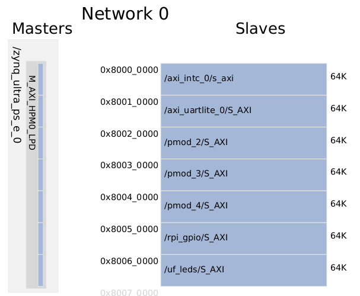

# Agregar soporte de perifericos de comunicación a Kria KR260 usando Vivado 2022.2

## Tutorial paso a paso

Para este proceso seguir el siguiente [tutorial](https://www.hackster.io/LogicTronix/kria-kr260-rpi-sensehat-petalinux-tutorial-part-i-42329b).


Tambien visitar los siguientes links con información importante:

- Configuracion [UARTLite en Linux](https://xilinx-wiki.atlassian.net/wiki/pages/viewpage.action?pageId=63373739)
- Configuracion [SPI en Linux](https://xilinx-wiki.atlassian.net/wiki/spaces/A/pages/18842255/Linux+SPI+Driver)
- Configuracion [I2C en Linux](https://xilinx-wiki.atlassian.net/wiki/spaces/A/pages/18841974/Linux+I2C+Driver)

### Resumen

This post is a follow on to it (using that same Vivado 2022.1 project created in that post) that covers how to add some of the specific hardware IPCores for implementation of UART, SPI and I2C communication in KR260 board.

## Implementación de periferico soporte UART

Para implementar el UART usando la tarjeta Kria Robotics agregaremos el IPCORE `AXI Uartlite`. Lo buscamos en el buscador de IPCORE y lo agregamos al proyecto.


Configuramos el IPCORE dando doble clic en el bloque, en esta seleccion solo modificaremos el `Baud Rate` a `115200` o la velocidad que se requiera para realizar la comunicación.


Luego realizamos la conexión del IPCORE, en este caso solo daremos clic derecho sobre la etiqueta del UART y luego `Make external`. Tambien es necesario conectar la interrupción del UART al PS side del ZYNQ UltraSCALE+.


Para esto utilizaremos dos ploques IPCORE adicionales, en primer lugar el bloque `Concat` para concatenar toas las posibles interrupciones en un unico bus. Como salida del concat colocaremos el bloque `Utility Reduced Logic` configurado como compuestra `OR`. La salida de este bloque se conectará al `AXI Interrupt Controller` que al final ira conectado al PS.


---

## Definición de Constrains

En este ejemplo utilizaremos el conector PMOD1 para realizar la conexion del Uart hacia el exterior de la KRIA.


Luego se crea el archivo de constrains `comm_uart.xdc` usando los siguientes pines

```bash
##################### PMOD 1 Upper ###################################
set_property PACKAGE_PIN H12 [get_ports {kria_uart_rxd}]
set_property IOSTANDARD LVCMOS33 [get_ports {kria_uart_rxd}]

#set_property PACKAGE_PIN E10 [get_ports {pmod1_io_tri_io[1]}]
#set_property IOSTANDARD LVCMOS33 [get_ports {pmod1_io_tri_io[1]}]

#set_property PACKAGE_PIN D10 [get_ports {pmod1_io_tri_io[2]}]
#set_property IOSTANDARD LVCMOS33 [get_ports {pmod1_io_tri_io[2]}]

#set_property PACKAGE_PIN C11 [get_ports {pmod1_io_tri_io[3]}]
#set_property IOSTANDARD LVCMOS33 [get_ports {pmod1_io_tri_io[3]}]

##################### PMOD 1 Lower ###################################
set_property PACKAGE_PIN B10 [get_ports {kria_uart_txd}]
set_property IOSTANDARD LVCMOS33 [get_ports {kria_uart_txd}]

#set_property PACKAGE_PIN E12 [get_ports {pmod1_io_tri_io[5]}]
#set_property IOSTANDARD LVCMOS33 [get_ports {pmod1_io_tri_io[5]}]

#set_property PACKAGE_PIN D11 [get_ports {pmod1_io_tri_io[6]}]
#set_property IOSTANDARD LVCMOS33 [get_ports {pmod1_io_tri_io[6]}]

#set_property PACKAGE_PIN B11 [get_ports {pmod1_io_tri_io[7]}]
#set_property IOSTANDARD LVCMOS33 [get_ports {pmod1_io_tri_io[7]}]

```


Una vez en este punto, se procede a realizar la sintesis, implementacion y generacion de bitstream para ser cargado en el `PL`. esto generará un mapa de direcciones para el AXI por medio de los cuales se realizará la prueba de funcionamiento en la KRIA.



---

## Generacion de Device Tree Overlay para el PL

Se sigue el tutorial 4 para este paso.

The device tree blob containing the overlay nodes needs to be compiled for the design, which is easily done by using the Xilinx Software Command Line Tools (**XSCT**):

```bash
~/Kria_KR260$ source /tools/Xilinx/Vitis/2022.2/settings64.sh
~/Kria_KR260$ xsct
```

Open the exported XSA from Vivado and use the `createdts` command to create the device tree source files for the PL design:

```bash
xsct% hsi::open_hw_design kria_base.xsa

xsct% createdts -hw kria_base.xsa -zocl -platform-name kria_kr260 -git-branch xlnx_rel_v2022.2 -overlay -compile -out ./dtg_kr260_v0

xsct% exit
```

After exiting **XSCT**, use the standard Linux device tree compiler (dtc) to compile the source files into the needed device tree blob:

```bash
~/Kria_KR260$ dtc -@ -O dtb -o ./dtg_kr260_v0/dtg_kr260_v0/kria_kr260/psu_cortexa53_0/device_tree_domain/bsp/pl.dtbo ./dtg_kr260_v0/dtg_kr260_v0/kria_kr260/psu_cortexa53_0/device_tree_domain/bsp/pl.dtsi
```

To visualize the Device Tree file you need to create a copy of `dtbo` file and change the extension for `dtb`, and create a readable file using the follow command

```bash
~/$ dtc -I dtb -O dts pl.dtb > pl.dts
```

---

## Transferir los archivos del PL Design a KR260

I like to create a folder to copy all of the necessary design files to that need to be uploaded to the KR260 for an accelerated application or PL design like this (note: the Kria_KR260 directory is the top level directory of the Vivado project):

```bash
~/Kria_KR260$ mkdir -p comm_file_transfer
~/Kria_KR260$ cd ./comm_file_transfer/
```

It’s here I’ll create the description file, `shell.json`, for the design:

```bash
~/Kria_KR260/comm_file_transfer$ nano shell.json
```

And copy+paste the following to `shell.json`:

```json
{
  "shell_type": "XRT_FLAT",
  "num_slots": "1"
}
```

Then copy the generated device tree blob and .bin file into the folder:

```bash
~/Kria_KR260/comm_file_transfer$ cp ../dtg_kr260_v0/dtg_kr260_v0/kria_kr260/psu_cortexa53_0/device_tree_domain/bsp/pl.dtbo ./
~/Kria_KR260/comm_file_transfer$ cp ../Kria_KR260.runs/impl_1/kria_bd_wrapper.bin ./
```

Rename the device tree blob and .bin file to the same thing (the only difference should be their respect file extensions (also change the.bin extension to `.bit.bin`):

```bash
~/Kria_KR260/comm_file_transfer$ mv kria_bd_wrapper.bin kr260_comm.bit.bin
~/Kria_KR260/comm_file_transfer$ mv pl.dtbo kr260_comm.dtbo
```

Then, with the KR260 booted up and running with the new SD card image generated in the previous steps and connected to the local network, transfer the new PL design files to it:

```bash
~/Kria_KR260/comm_file_transfer$ scp kr260_comm.dtbo kr260_comm.bit.bin shell.json petalinux@<KR260’s IP address>:/home/petalinux
```

---

## Run PL Design on KR260

After the files have been successfully transferred to the KR260, create a directory in the `/lib/firmware/xilinx` directory with the same name as was given to the device tree blob and.bin file and copy them into it:

```bash
xilinx-kr260-starterkit-20222:~$ sudo mkdir /lib/firmware/xilinx/kr260_comm
xilinx-kr260-starterkit-20222:~$ mv kr260_comm.dtbo kr260_comm.bit.bin shell.json /lib/firmware/xilinx/kr260_comm
```

At this point, the PL design will show up just like an accelerated application would using the xmutil commands:

```bash
xilinx-kr260-starterkit-20222:~$ sudo xmutil listapps
```

Unload the default application then load the PL design which flashes the PL design’s bitstream into the PL and loads its device tree overlay:

```bash
xilinx-kr260-starterkit-20222:~$ sudo xmutil unloadapp
xilinx-kr260-starterkit-20222:~$ sudo xmutil loadapp kr260_comm
```

Una vez aqui, ya puede verificar ssi el puerto quedo agregado en PS mediante el siguiente comando:

```bash
xilinx-kr260-starterkit-20222:~$ dmesg | grep serial
```

Debe recibir la siguiente respuesta:

```bash
[    4.217686] ff010000.serial: ttyPS1 at MMIO 0xff010000 (irq = 60, base_baud = 6249999) is a xuartps
[   11.179198] systemd[1]: Created slice Slice /system/serial-getty.
[ 6683.166373] 80010000.serial: ttyUL0 at MMIO 0x80010000 (irq = 74, base_baud = 0) is a uartlite
```

Donde `ttyUL0` corresponde al periferico agregado para controlar el Uartlite desde el PS.

Tambien es necesario darle los permisos necesarios para ejecutar y controlar el periferico

```bash
sudo chmod 777 /dev/ttyUL0
```

---

## Testing Uartlite

Para realizar este test realizaremos la siguiente conexion en forma de Loop entre el `txd` y `rxd` para verificar tanto la escritura como la lectura de datos a traves del canal de comunicaciones.


Para realizar este test utilizaremos el siguiente codigo en `Python`, este codigo utiliza la libreria `pyserial`, en muchas ocasiones será necesario instalar la libreria mediante el siguiente comando.

```python
python -m pip install pyserial
```

### Código de Python

Se creará el archivo `Serial_test.py` con el siguiente script.

```python
# Testing Uartlite with petalinux and python using KRIA
import serial

# configuration of serial port
ser = serial.Serial()
ser.port = "/dev/ttyUL0"
ser.baudrate = 115200

# open the port and begin the test
ser.open()  # open the port
ser.flush()  # clean the buffer

# Send data to Uartlite
n = ser.write('Hi, this is a KRIA test'.encode())
dato = ser.read(n)  # read data from serial
print(dato)

ser.close()  # close the serial port
```

### Configuracion automatica del periferico

Para correr el codigo crearemos el siguiente archivo `serial_config.sh` de bash para configurar, montar y probar el periferico serial.

```bash
echo "################################################"
echo " ------ Configuracion de Uartlite -----"
echo "################################################"

echo petalinux | sudo -S xmutil unloadapp  # despues del echo va el password para el "sudo" y el comando>
echo petalinux | sudo -S xmutil loadapp kr260_comm
echo petalinux | sudo -S chown petalinux:petalinux /dev/ttyUL0
echo petalinux | sudo -S chmod 777 /dev/ttyUL0

echo "################################################"
echo " ------ Inicio de prueba python ------ "
echo "################################################"

python Serial_test.py

echo "################################################"
echo " ------ Finalizacion de prueba ------ "
echo "################################################"
```

---
