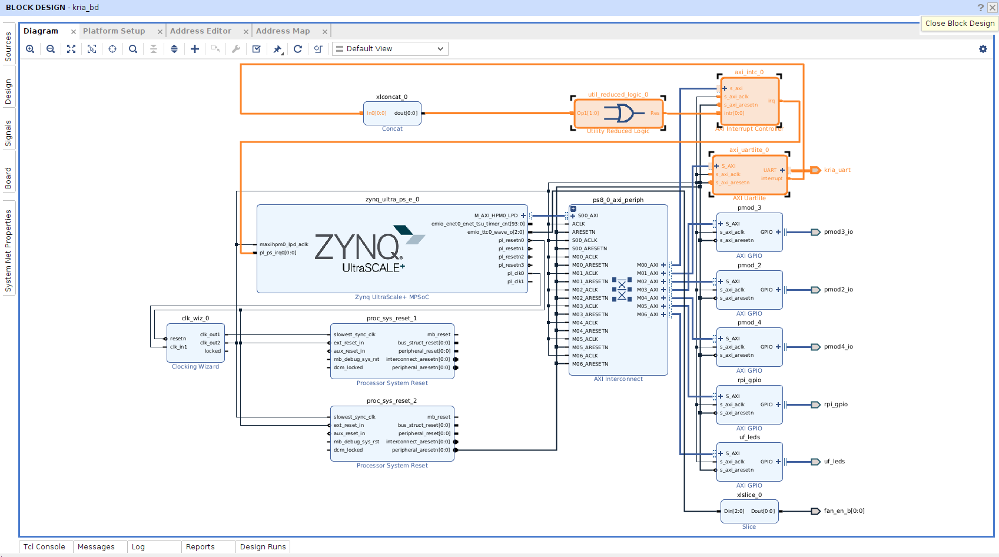

# Agregar soporte de perifericos de comunicación a Kria KR260 usando Vivado 2022.2

## Tutorial paso a paso

Para este proceso seguir el siguiente [tutorial](https://www.hackster.io/LogicTronix/kria-kr260-rpi-sensehat-petalinux-tutorial-part-i-42329b).

Tambien visitar los siguientes links con información importante:
 
 - Configuracion [UARTLite en Linux](https://xilinx-wiki.atlassian.net/wiki/pages/viewpage.action?pageId=63373739)
 - Configuracion [SPI en Linux](https://xilinx-wiki.atlassian.net/wiki/spaces/A/pages/18842255/Linux+SPI+Driver)
 - Configuracion [I2C en Linux](https://xilinx-wiki.atlassian.net/wiki/spaces/A/pages/18841974/Linux+I2C+Driver)

### Resumen

This post is a follow on to it (using that same Vivado 2022.1 project created in that post) that covers how to add some of the specific hardware IPCores for implementation of UART, SPI and I2C communication in KR260 board.

## Implementación de periferico soporte UART

