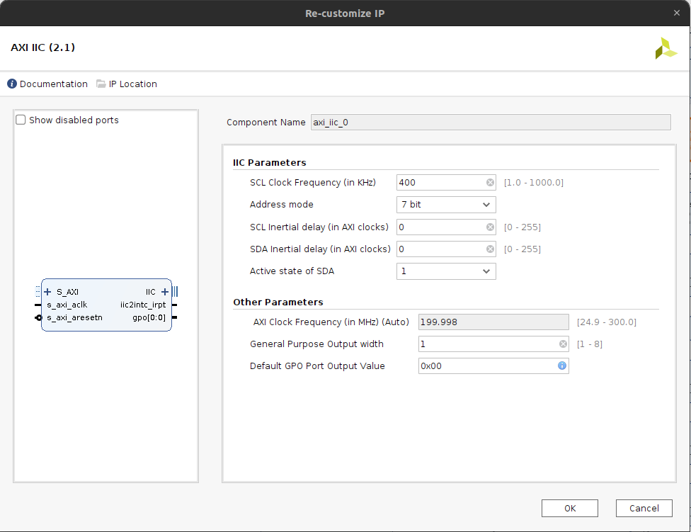
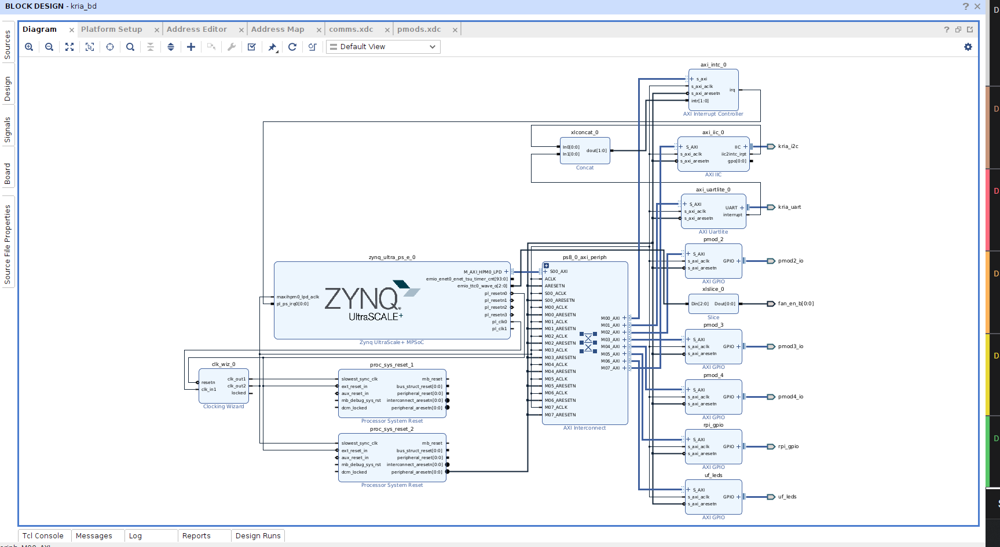
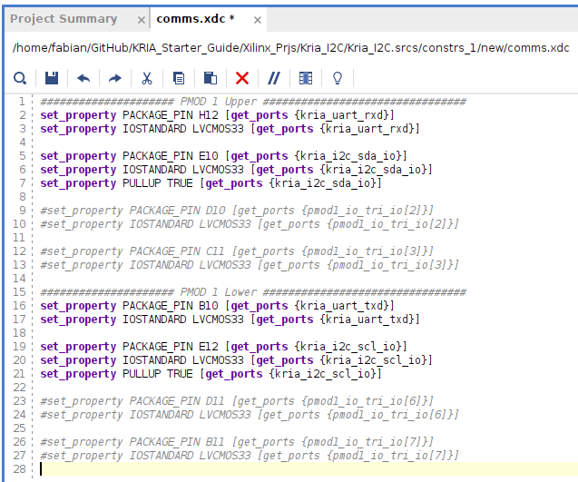
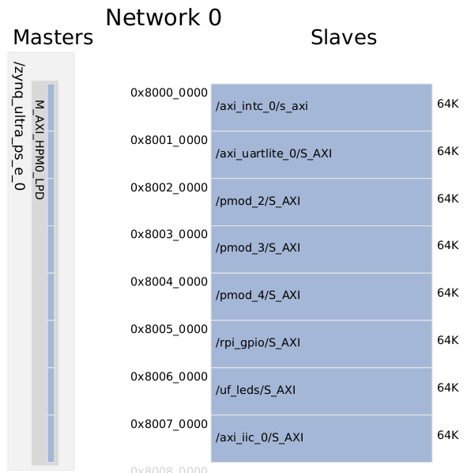
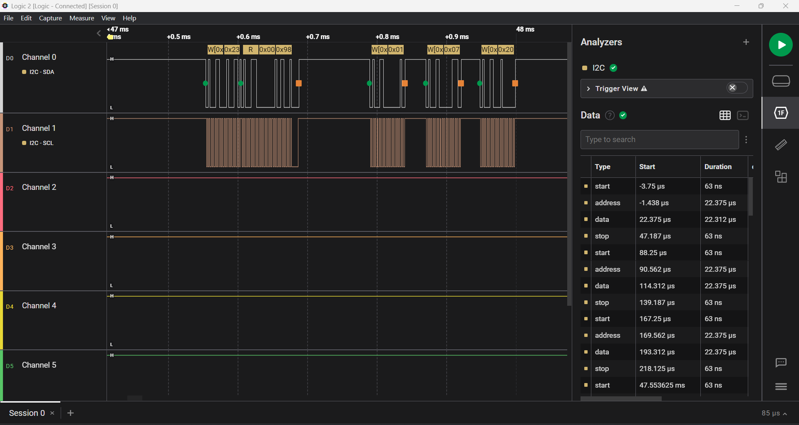
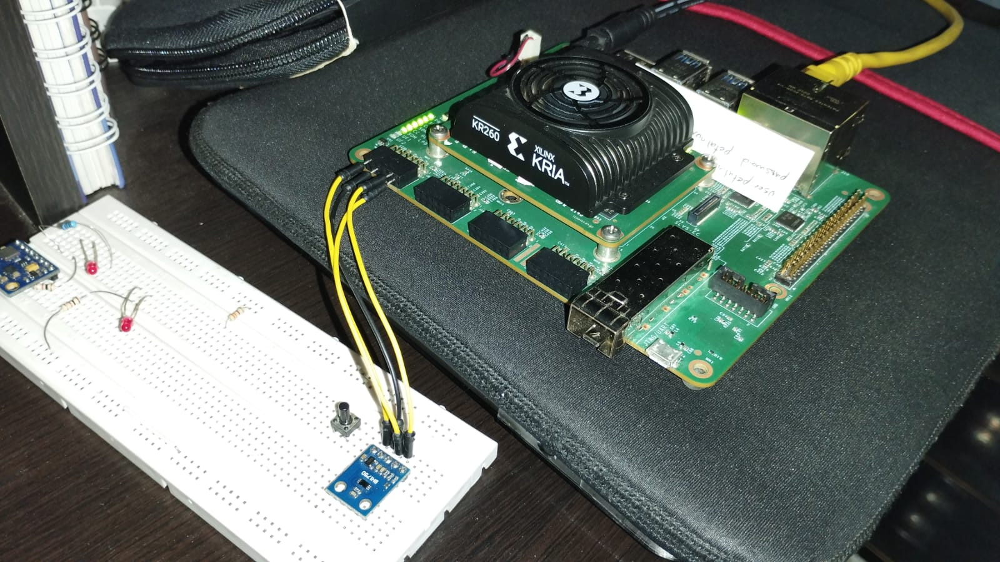

# Agregar soporte de I2C perifericos de comunicación a Kria KR260 usando Vivado 2022.2

## Tutorial paso a paso

Para este proceso seguir el siguiente [tutorial](https://www.hackster.io/LogicTronix/kria-kr260-rpi-sensehat-petalinux-tutorial-part-i-42329b).


Tambien visitar los siguientes links con información importante:

- Configuracion [UARTLite en Linux](https://xilinx-wiki.atlassian.net/wiki/pages/viewpage.action?pageId=63373739)
- Configuracion [SPI en Linux](https://xilinx-wiki.atlassian.net/wiki/spaces/A/pages/18842255/Linux+SPI+Driver)
- Configuracion [I2C en Linux](https://xilinx-wiki.atlassian.net/wiki/spaces/A/pages/18841974/Linux+I2C+Driver)

### Resumen

This post is a follow on to it (using that same Vivado 2022.2 project created in that post) that covers how to add some of the specific hardware IPCores for implementation of I2C communication in KR260 board.

## Implementación de periferico soporte IIC

Para implementar el IIC usando la tarjeta Kria Robotics agregaremos el IPCORE `AXI IIC`. Lo buscamos en el buscador de IPCORE y lo agregamos al proyecto.

Configuramos el IPCORE dando doble clic en el bloque, en esta seleccion solo modificaremos el `SCL Clock` a `400 kHz` o la velocidad que se requiera para realizar la comunicación, ademas el `Address mode` en `7 bits`.



Luego realizamos la conexión del IPCORE, en este caso solo daremos clic derecho sobre la etiqueta del IIC y luego `Make external`. Tambien es necesario conectar la interrupción del IIC al PS side del ZYNQ UltraSCALE+.



En este caso se amplia el tamaño del bloque concat, se puede realizar la conexion directa del `Concat` al `AXI Interrupt Controller` y este se ajusta de forma automatica. Este luego ira al PS.

---

## Definición de Constrains

En este ejemplo utilizaremos el conector PMOD1 para realizar la conexion del Uart hacia el exterior de la KRIA.


Luego se crea el archivo de constrains `comm_iic.xdc` usando los siguientes pines

```bash
##################### PMOD 1 Upper ################################
set_property PACKAGE_PIN H12 [get_ports {kria_uart_rxd}]
set_property IOSTANDARD LVCMOS33 [get_ports {kria_uart_rxd}]

set_property PACKAGE_PIN E10 [get_ports {kria_i2c_sda_io}]
set_property IOSTANDARD LVCMOS33 [get_ports {kria_i2c_sda_io}]
set_property PULLUP TRUE [get_ports {kria_i2c_sda_io}]

#set_property PACKAGE_PIN D10 [get_ports {pmod1_io_tri_io[2]}]
#set_property IOSTANDARD LVCMOS33 [get_ports {pmod1_io_tri_io[2]}]

#set_property PACKAGE_PIN C11 [get_ports {pmod1_io_tri_io[3]}]
#set_property IOSTANDARD LVCMOS33 [get_ports {pmod1_io_tri_io[3]}]

##################### PMOD 1 Lower ################################
set_property PACKAGE_PIN B10 [get_ports {kria_uart_txd}]
set_property IOSTANDARD LVCMOS33 [get_ports {kria_uart_txd}]

set_property PACKAGE_PIN E12 [get_ports {kria_i2c_scl_io}]
set_property IOSTANDARD LVCMOS33 [get_ports {kria_i2c_scl_io}]
set_property PULLUP TRUE [get_ports {kria_i2c_scl_io}]

#set_property PACKAGE_PIN D11 [get_ports {pmod1_io_tri_io[6]}]
#set_property IOSTANDARD LVCMOS33 [get_ports {pmod1_io_tri_io[6]}]

#set_property PACKAGE_PIN B11 [get_ports {pmod1_io_tri_io[7]}]
#set_property IOSTANDARD LVCMOS33 [get_ports {pmod1_io_tri_io[7]}]

```



Una vez en este punto, se procede a realizar la sintesis, implementacion y generacion de bitstream para ser cargado en el `PL`. esto generará un mapa de direcciones para el AXI por medio de los cuales se realizará la prueba de funcionamiento en la KRIA.



---

## Generacion de Device Tree Overlay para el PL

En la carpeta raiz del proyecto agregaremos los siguientes archivos:

- `xsct_config.tcl`

```bash
hsi::open_hw_design kria_i2c_base.xsa
createdts -hw kria_i2c_base.xsa -zocl -platform-name kr260_i2c -git-branch xlnx_rel_v2022.2 -overlay -compile -out ./dtg_kr260_v0
exit
```

Este archivo contiene los comandos que se ejecutaran por el **Xilinx Source Commands Tool** para la creacion del **Device Tree**.

- `DT_generation.sh`

```bash
echo ""
echo ""
echo "#############################################################################"
echo "Creacion del device tree"
echo "#############################################################################"
echo ""
echo ""

source /tools/Xilinx/Vitis/2022.2/settings64.sh
cd /home/fabian/GitHub/KRIA_Starter_Guide/Xilinx_Prjs/Kria_I2C/
xsct xsct_config.tcl

echo ""
echo ""
echo "#############################################################################"
echo "Compilacion del device tree"
echo "#############################################################################"
echo ""
echo ""

dtc -@ -O dtb -o ./dtg_kr260_v0/dtg_kr260_v0/kr260_i2c/psu_cortexa53_0/device_tree_domain/bsp/pl.dtbo ./dtg_kr260_v0/dtg_kr260_v0/kr260_i2c/psu_cortexa53_0/device_tree_domain/bsp/pl.dtsi
cd /home/fabian/GitHub/KRIA_Starter_Guide/Xilinx_Prjs/Kria_I2C/i2c_file_transfer/
cp ../dtg_kr260_v0/dtg_kr260_v0/kr260_i2c/psu_cortexa53_0/device_tree_domain/bsp/pl.dtbo ./ & cp ../Kria_I2C.runs/impl_1/kria_bd_wrapper.bin ./
mv kria_bd_wrapper.bin kr260_i2c.bit.bin
mv pl.dtbo kr260_i2c.dtbo

echo ""
echo ""
echo "#############################################################################"
echo "Envio de archivos a la Kria"
echo "#############################################################################"
echo ""
echo ""

echo petalinux | scp kr260_i2c.bit.bin kr260_i2c.dtbo shell.json petalinux@192.168.1.12:/home/petalinux
```

Este script permite cargar el device tree a la Kria.

---

## Run PL Design on KR260

After the files have been successfully transferred to the KR260, create a directory in the `/lib/firmware/xilinx` directory with the same name as was given to the device tree blob and .bin file and copy them into it:

```bash
xilinx-kr260-starterkit-20222:~$ sudo mkdir /lib/firmware/xilinx/kr260_i2c
xilinx-kr260-starterkit-20222:~$ sudo mv kr260_i2c.dtbo kr260_i2c.bit.bin shell.json /lib/firmware/xilinx/kr260_i2c
```

At this point, the PL design will show up just like an accelerated application would using the xmutil commands:

```bash
xilinx-kr260-starterkit-20222:~$ sudo xmutil listapps
```

Unload the default application then load the PL design which flashes the PL design’s bitstream into the PL and loads its device tree overlay:

```bash
xilinx-kr260-starterkit-20222:~$ sudo xmutil unloadapp
xilinx-kr260-starterkit-20222:~$ sudo xmutil loadapp kr260_i2c
```

Una vez aqui, ya puede verificar el montaje del **ii2c** decive en el PS mediante el siguiente comando:

```bash
xilinx-kr260-starterkit-20222:~$ i2cdetect -l
```

Debe recibir la siguiente respuesta:

```bash
i2c-1   unknown         Cadence I2C at ff030000                 N/A
i2c-2   unknown         ZynqMP DP AUX                           N/A
i2c-3   unknown         i2c-1-mux (chan_id 0)                   N/A
i2c-4   unknown         i2c-1-mux (chan_id 1)                   N/A
i2c-5   unknown         i2c-1-mux (chan_id 2)                   N/A
i2c-6   unknown         i2c-1-mux (chan_id 3)                   N/A
i2c-7   i2c             xiic-i2c 80070000.i2c                   I2C adapter
```

Donde `ttyUL0` corresponde al periferico agregado para controlar el Uartlite desde el PS.

Tambien es necesario darle los permisos necesarios para ejecutar y controlar el periferico

```bash
sudo chmod 777 /dev/i2c-7
```

Para verificar los dispositivos conectados utilizamos el siguiente comando:

```bash
i2cdetect -y -r 7
```

Y obtenemos la siguiente respuesta, en este caso tenemos un dispositivo conectado en la direccion `23`.

```bash
     0  1  2  3  4  5  6  7  8  9  a  b  c  d  e  f
00:                         -- -- -- -- -- -- -- --
10: -- -- -- -- -- -- -- -- -- -- -- -- -- -- -- --
20: -- -- -- 23 -- -- -- -- -- -- -- -- -- -- -- --
30: -- -- -- -- -- -- -- -- -- -- -- -- -- -- -- --
40: -- -- -- -- -- -- -- -- -- -- -- -- -- -- -- --
50: -- -- -- -- -- -- -- -- -- -- -- -- -- -- -- --
60: -- -- -- -- -- -- -- -- -- -- -- -- -- -- -- --
70: -- -- -- -- -- -- -- --
```

Al mismo tiempo podemos observar las señales con ayuda de un Logic Analyzer:



---

## Testing AXI IIC

Para realizar este test realizaremos la siguiente conexion, utilizaremos un modulo `BH1750` de medicion de intensidad de luz para las pruebas.



Realizaremos la instalacion del paquete `SMBus` de `python` utilizando el siguiente comando.

```python
python -m pip install smbus
```

### Código de Python

Se creará el archivo `bh1750_iic.py` con el siguiente script.

```python
#!/usr/bin/env python2
# vim: expandtab ts=4 sw=4
# Inspired by http://www.raspberrypi-spy.co.uk/2015/03/bh1750fvi-i2c-digital-light-intensity-sensor/


import smbus
import time

class BH1750():
    """ Implement BH1750 communication. """
    # Define some constants from the datasheet
    POWER_DOWN = 0x00 # No active state
    POWER_ON   = 0x01 # Power on
    RESET      = 0x07 # Reset data register value
    # Start measurement at 4lx resolution. Time typically 16ms.
    CONTINUOUS_LOW_RES_MODE = 0x13
    # Start measurement at 1lx resolution. Time typically 120ms
    CONTINUOUS_HIGH_RES_MODE_1 = 0x10
    # Start measurement at 0.5lx resolution. Time typically 120ms
    CONTINUOUS_HIGH_RES_MODE_2 = 0x11
    # Start measurement at 1lx resolution. Time typically 120ms
    # Device is automatically set to Power Down after measurement.
    ONE_TIME_HIGH_RES_MODE_1 = 0x20
    # Start measurement at 0.5lx resolution. Time typically 120ms
    # Device is automatically set to Power Down after measurement.
    ONE_TIME_HIGH_RES_MODE_2 = 0x21
    # Start measurement at 1lx resolution. Time typically 120ms
    # Device is automatically set to Power Down after measurement.
    ONE_TIME_LOW_RES_MODE = 0x23

    def __init__(self, bus, addr=0x23):
        self.bus = bus
        self.addr = addr
        self.power_down()
        self.set_sensitivity()

    def _set_mode(self, mode):
        self.mode = mode
        self.bus.write_byte(self.addr, self.mode)

    def power_down(self):
        self._set_mode(self.POWER_DOWN)

    def power_on(self):
        self._set_mode(self.POWER_ON)

    def reset(self):
        self.power_on() #It has to be powered on before resetting
        self._set_mode(self.RESET)

    def cont_low_res(self):
        self._set_mode(self.CONTINUOUS_LOW_RES_MODE)

    def cont_high_res(self):
        self._set_mode(self.CONTINUOUS_HIGH_RES_MODE_1)

    def cont_high_res2(self):
        self._set_mode(self.CONTINUOUS_HIGH_RES_MODE_2)

    def oneshot_low_res(self):
        self._set_mode(self.ONE_TIME_LOW_RES_MODE)

    def oneshot_high_res(self):
        self._set_mode(self.ONE_TIME_HIGH_RES_MODE_1)

    def oneshot_high_res2(self):
        self._set_mode(self.ONE_TIME_HIGH_RES_MODE_2)

    def set_sensitivity(self, sensitivity=69):
        """ Set the sensor sensitivity.
            Valid values are 31 (lowest) to 254 (highest), default is 69.
        """
        if sensitivity < 31:
            self.mtreg = 31
        elif sensitivity > 254:
            self.mtreg = 254
        else:
            self.mtreg = sensitivity
        self.power_on()
        self._set_mode(0x40 | (self.mtreg >> 5))
        self._set_mode(0x60 | (self.mtreg & 0x1f))
        self.power_down()

    def get_result(self):
        """ Return current measurement result in lx. """
        data = self.bus.read_word_data(self.addr, self.mode)
        count = data >> 8 | (data&0xff)<<8
        mode2coeff =  2 if (self.mode & 0x03) == 0x01 else 1
        ratio = 1/(1.2 * (self.mtreg/69.0) * mode2coeff)
        return ratio*count

    def wait_for_result(self, additional=0):
        basetime = 0.018 if (self.mode & 0x03) == 0x03 else 0.128
        time.sleep(basetime * (self.mtreg/69.0) + additional)

    def do_measurement(self, mode, additional_delay=0):
        """
        Perform complete measurement using command
        specified by parameter mode with additional
        delay specified in parameter additional_delay.
        Return output value in Lx.
        """
        self.reset()
        self._set_mode(mode)
        self.wait_for_result(additional=additional_delay)
        return self.get_result()

    def measure_low_res(self, additional_delay=0):
        return self.do_measurement(self.ONE_TIME_LOW_RES_MODE, additional_delay)

    def measure_high_res(self, additional_delay=0):
        return self.do_measurement(self.ONE_TIME_HIGH_RES_MODE_1, additional_delay)

    def measure_high_res2(self, additional_delay=0):
        return self.do_measurement(self.ONE_TIME_HIGH_RES_MODE_2, additional_delay)


def main():

    #bus = smbus.SMBus(0) # Rev 1 Pi uses 0
    bus = smbus.SMBus(7)  # Rev 2 Pi uses 1
    sensor = BH1750(bus)


    print("Sensitivity: {:d}".format(sensor.mtreg))
    for measurefunc, name in [(sensor.measure_low_res, "Low Res "),
                              (sensor.measure_high_res, "HighRes "),
                              (sensor.measure_high_res2, "HighRes2")]:
        print("{} Light Level : {:3.2f} lx".format(name, measurefunc()))
    print("--------")
    sensor.set_sensitivity((sensor.mtreg + 10) % 255)
    time.sleep(1)


if __name__=="__main__":
    main()
```

### Configuracion automatica del periferico

Para correr el codigo crearemos el siguiente archivo `iic_config.sh` de bash para configurar, montar y probar el periferico serial.

```bash
echo "################################################"
echo " ------ Configuracion de Comunicaciones -----"
echo "################################################"

echo petalinux | sudo -S xmutil unloadapp  # despues del echo va el password para el "sudo" y el comando>
echo petalinux | sudo -S xmutil loadapp kr260_i2c
echo petalinux | sudo -S chown petalinux:petalinux /dev/i2c-7
echo petalinux | sudo -S chown petalinux:petalinux /dev/ttyUL0
echo petalinux | sudo -S chmod 777 /dev/i2c-7
echo petalinux | sudo -S chmod 777 /dev/ttyUL0

echo "################################################"
echo " ------ Inicio de prueba serial python ------ "
echo "################################################"

python Serial_test.py

echo "################################################"
echo " ------ Finalizacion de prueba serial ------ "
echo "################################################"


echo "################################################"
echo " ------ Inicio de prueba iic python ------ "
echo "################################################"

python bh1750_iic.py

echo "################################################"
echo " ------ Finalizacion de prueba iic ------ "
echo "################################################"
```

---
