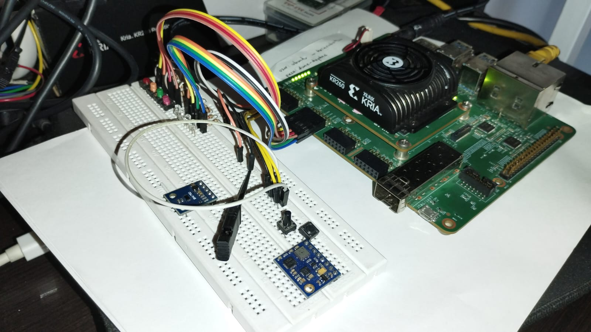

# Creacion de un Custom IP, conexion con Petalinux usando Kria KR260 y Vivado 2022.2

## Tutorial paso a paso



Visitar los siguientes links con información importante:

- Configuracion [Custom IP](https://www.youtube.com/watch?v=B_OHWU6aTmA)

### Resumen

En este post vamos a crear un IPCore Custom con diferentes maquinas de estado las cuales seran activadas desde el `PS` a traves del puerto `AXI`, Luego personalizaremos este IPCore para que contenga el Logo de la UdeA a modo de ejemplo. en este aprenderemos a utilizar diseños logicos y diseños secuenciales de hardware usando VHDL.

## Implementacion de un contador con 4 LEDs

En este diseño implementaremos un contador con 4 LEDs que se muevan de derecha a izquierda, para activar este IP lo haremos desde un pulsador, a continuacion se presenta el codigo en VHDL para este diseño en el archivo `Led_4count.vhd`.

```vhdl
----------------------------------------------------------------------------------
-- Company: 
-- Engineer: Fabian Castano
----------------------------------------------------------------------------------

library IEEE;
use IEEE.STD_LOGIC_1164.ALL;
use IEEE.std_logic_arith.all;
use IEEE.std_logic_unsigned.all;

entity Led_4count is
    Port ( CLK: in  std_logic;
           RST: in  std_logic;
           PUL: in  std_logic;
           LED: out std_logic_vector (3 downto 0));
end Led_4count;

architecture Behavioral of Led_4count is
    type     state_type is (LED_1, LED_2, LED_3, LED_4, L_WAIT);
    signal   state, next_state : state_type;
    signal   counter           : integer range 0 to 999999999 := 0;
    constant MAX_COUNT         : integer := 160000000;  -- 200 ms with 200 MHz clock

begin

     LED_Process: process(CLK, PUL, RST)
     begin
        if PUL = '0' then -- Initialization of state machine
            state <= LED_1;
            counter <= 0;
        end if;
  
        if RST = '0' then -- Reset of the state machine
            state <= L_WAIT;
            counter <= 0;
        elsif rising_edge(CLK) then
            if counter = MAX_COUNT - 1 then 
                counter <= 0;
                state <=  next_state;
            else
                counter <= counter + 1;
            end if;
        end if;
     end process;
   
     State_Transition: process(state)
     begin
         case state is
            when LED_1 =>
                LED <= "0001";
                next_state <= LED_2;
            when LED_2 =>
                LED <= "0010";
                next_state <= LED_3;
            when LED_3 =>
                LED <= "0100";
                next_state <= LED_4;
            when LED_4 =>
                LED <= "1000";
                next_state <= L_WAIT;
            when L_WAIT =>
                LED <= "0000";
                --next_state <= LED_1;
         end case;
     end process;

end Behavioral;

```

Tambien podemos incluir el archivo para hacer la simulacion del IPCore en el archivo `sim_led.vhd`

```vhdl
library IEEE;
use IEEE.STD_LOGIC_1164.ALL;
use IEEE.STD_LOGIC_TEXTIO.ALL;
use std.textio.all;

entity StateMachine_LEDs_TB is
end StateMachine_LEDs_TB;

architecture Behavioral of StateMachine_LEDs_TB is
    constant CLOCK_PERIOD : time := 5 ns; -- Definición del período del reloj de simulación

    signal CLK : std_logic := '0'; -- Señales de reloj y reset
    signal RST : std_logic := '1';
    signal PUL : std_logic := '0';
    signal LED : std_logic_vector(3 downto 0); -- Salida de los LEDs

    component Led_4count is
        Port (
            CLK : in std_logic;
            RST : in std_logic;
            PUL : in std_logic;
            LED : out std_logic_vector(3 downto 0)
        );
    end component;

begin

    UUT: Led_4count
    port map (
        CLK => CLK,
        RST => RST,
        PUL => PUL,
        LED => LED
    );

    -- Proceso de generación de reloj
    CLK_process: process
    begin
        wait for 50 ns;
        PUL <= '1';
        while now < 2000000 us loop -- Simulación de 5000 ns
            CLK <= '0';
            wait for CLOCK_PERIOD / 2;
            CLK <= '1';
            wait for CLOCK_PERIOD / 2;
        end loop;
        wait;
    end process CLK_process;

    -- Proceso de reset
    RST_process: process
    begin
        RST <= '0'; -- Activa el reset
        wait for 50 ns;
        RST <= '1'; -- Desactiva el reset después de 50 ns
        wait;
    end process RST_process;

    -- Proceso para mostrar los cambios en la salida de los LEDs
    LED_process: process
    begin
        wait;
    end process LED_process;

end Behavioral;
```

Y los constrains para este proyecto se agregan en el archivo `constrains.xdc`

```bash
set_property PACKAGE_PIN H11 [get_ports {LED[3]}]
set_property PACKAGE_PIN G10 [get_ports {LED[2]}]
set_property PACKAGE_PIN F12 [get_ports {LED[1]}]
set_property PACKAGE_PIN F11 [get_ports {LED[0]}]
set_property IOSTANDARD LVCMOS33 [get_ports {LED[3]}]
set_property IOSTANDARD LVCMOS33 [get_ports {LED[2]}]
set_property IOSTANDARD LVCMOS33 [get_ports {LED[1]}]
set_property IOSTANDARD LVCMOS33 [get_ports {LED[0]}]

# set_property PACKAGE_PIN A2 [get_ports CLK_IN]
# set_property IOSTANDARD LVCMOS18 [get_ports CLK_IN]
# set_property CLOCK_DEDICATED_ROUTE FALSE [get_nets CLK_IN_IBUF_inst/O]

set_property PACKAGE_PIN J11 [get_ports PUL_IN]
set_property IOSTANDARD LVCMOS33 [get_ports PUL_IN]
# set_property CLOCK_DEDICATED_ROUTE FALSE [get_nets RST_IN_IBUF_inst/O]
```

El diagrama de conexion de este diseño es el siguiente


> **Nota importante:** En la KRIA KR260 carrier board, el reloj para los IPCores con caracteristicas secuenciales debe salir del PS del `Zynq UltraScale+`, pero tambien podria sacarse desde un `Clock_Wizard`.

---

## Imlementacion de una maquida de estado

El segundo codigo implementado hace un bouncing en un LED, el cual esta escrito en el archivo `Led_Bouncing.vhd`

```vhdl

----------------------------------------------------------------------------------
-- Company: 
-- Engineer: Fabian Castano
----------------------------------------------------------------------------------


library IEEE;
use IEEE.STD_LOGIC_1164.ALL;
use IEEE.std_logic_arith.all;
use IEEE.std_logic_unsigned.all;

entity Led_Bouncing is
    Port ( CLK: in  std_logic;
           PUL: in  std_logic;
           LED: out std_logic);
end Led_Bouncing;

architecture Behavioral of Led_Bouncing is
    type     state_type is (GO_UP, GO_DOWN, L_WAIT);
    signal   state, next_state      : state_type;
    signal   counter, counter_rel   : integer range 0 to 999999999 := 0;
    signal   counter_comp           : integer range 0 to 2000 := 0;
    constant MAX_COUNT              : integer := 1000;  -- 1 s at 200 MHz clock
    constant MAX_REL_COUNT          : integer := 200000;     -- 1 ms at 200 MHz clock
  
begin
  
    Bouncing_Process: process(CLK, PUL)
    begin
  
        if PUL = '0' then
            state <= GO_UP; 
            counter_rel <= 0;
            counter <= 0;
        end if;
  
        if rising_edge(CLK) then
            if counter = MAX_REL_COUNT - 1 then
                counter <= 0;
        
                if state = GO_UP then
                    counter_rel <= counter_rel + 1;      
                    -- Restarting counter
                    if counter_rel = MAX_COUNT - 1 then
                        -- counter_rel <= 0;
                        state <= GO_DOWN;
                    end if;
                elsif state = GO_DOWN then
                    counter_rel <= counter_rel - 1;      
                    -- Restarting counter
                    if counter_rel = 0 then
                        -- counter_rel <= 0;
                        state <= L_WAIT;
                    end if;
                end if;
            else 
                counter <= counter + 1;
            end if;
        end if;
  
        -- Creation of on and off states
        counter_comp <= counter / 200;
        if not(state = L_WAIT) then
            if counter_comp < counter_rel then
                LED <= '1';
            else
                LED <= '0';
            end if;  
        else
            LED <= '0';
        end if;
  
    end process;
  
end Behavioral;
```

Adicionalmente se crep un modulo basico de logica de LEDs que dependiendo de la entrada de un pulsador se encienden o se apagan, este se encuentra en el archivo `Led_Logic.vhd`

```vhdl
----------------------------------------------------------------------------------
-- Company: 
-- Engineer: Fabian Andres Castano Usuga
----------------------------------------------------------------------------------


library IEEE;
use IEEE.STD_LOGIC_1164.ALL;
use IEEE.std_logic_arith.all;
use IEEE.std_logic_unsigned.all;

entity Led_Logic is
    Port ( PUL: in  std_logic_vector (1 downto 0);
           LED: out std_logic_vector (1 downto 0));
end Led_Logic;

architecture Behavioral of Led_Logic is

begin

    Inverter_Process: process(PUL)
    begin
        LED(0) <= not PUL(0);
    end process;
  
    Buffer_Process: process(PUL)
    begin
        LED(1) <= PUL(1);
    end process;
  
end Behavioral;

```

---

## Creacion de un contenedor para los tres modulos

Ahora creamos un contenedor para los tres modulos, este contendra la logica para usar los tres modulos y encapsularlos en un unico diseño.

```vhdl

----------------------------------------------------------------------------------
-- Company: 
-- Engineer: Fabian Castano
----------------------------------------------------------------------------------


library IEEE;
use IEEE.STD_LOGIC_1164.ALL;
use IEEE.std_logic_arith.all;
use IEEE.std_logic_unsigned.all;

entity Led_Full is
  Port ( CLK : in  std_logic;
         PUL : in  std_logic_vector (3 downto 0);
         LED : out std_logic_vector (3 downto 0)
  );
end Led_Full;

architecture Behavioral of Led_Full is
    component Led_4count is
    port (
        CLK : in  std_logic;
        PUL : in  std_logic;
        LED : out std_logic
    );
    end component Led_4count;
  
    component Led_Bouncing is
    port (
        CLK : in  std_logic;
        PUL : in  std_logic;
        LED : out std_logic
    );
    end component Led_Bouncing;
  
    component Led_Logic is
    port (
        PUL : in  std_logic_vector (1 downto 0);
        LED : out std_logic_vector (1 downto 0)
    );
    end component Led_Logic;

begin

Led_4count_comp: component Led_4count
    port map (
        CLK => CLK,
        PUL => PUL(0),
        LED => LED(0)
    );
  
Led_Bouncing_comp: component Led_Bouncing
    port map (
        CLK => CLK,
        PUL => PUL(1),
        LED => LED(1)
    );
  
Led_Logic_comp: component Led_Logic
    port map (
        PUL(1 downto 0) => PUL(3 downto 2),
        LED(1 downto 0) => LED(3 downto 2)
    );
```

Tambien el archivo de constrains `constrains.xdc` debe ser modificado para el nuevo enrutamiento

```bash
set_property PACKAGE_PIN H11 [get_ports {LED_OUT[0]}]
set_property IOSTANDARD LVCMOS33 [get_ports {LED_OUT[0]}]

set_property PACKAGE_PIN G10 [get_ports {LED_OUT[1]}]
set_property IOSTANDARD LVCMOS33 [get_ports {LED_OUT[1]}]

set_property PACKAGE_PIN F12 [get_ports {LED_OUT[3]}]
set_property IOSTANDARD LVCMOS33 [get_ports {LED_OUT[3]}]

set_property PACKAGE_PIN F11 [get_ports {LED_OUT[2]}]
set_property IOSTANDARD LVCMOS33 [get_ports {LED_OUT[2]}]

# set_property PACKAGE_PIN A2 [get_ports CLK_IN]
# set_property IOSTANDARD LVCMOS18 [get_ports CLK_IN]
# set_property CLOCK_DEDICATED_ROUTE FALSE [get_nets CLK_IN_IBUF_inst/O]

set_property PACKAGE_PIN J11 [get_ports {PUL_IN[0]}]
set_property IOSTANDARD LVCMOS33 [get_ports {PUL_IN[0]}]

set_property PACKAGE_PIN J10 [get_ports {PUL_IN[1]}]
set_property IOSTANDARD LVCMOS33 [get_ports {PUL_IN[1]}]

set_property PACKAGE_PIN K13 [get_ports {PUL_IN[3]}]
set_property IOSTANDARD LVCMOS33 [get_ports {PUL_IN[3]}]

set_property PACKAGE_PIN K12 [get_ports {PUL_IN[2]}]
set_property IOSTANDARD LVCMOS33 [get_ports {PUL_IN[2]}]

# set_property CLOCK_DEDICATED_ROUTE FALSE [get_nets RST_IN_IBUF_inst/O]
```

Luego de esta implementacion, el archivo de bloque de diseño queda como se muestra a continuacion.


---

## Creacion del Custom IP

Creacion del `Custom_IP` con integracion de puerto `AXI_Lite`. Para esto desde Vivado ingresamos a Tools->Create and Package Custom IP.

Se selecciona creacion de un nuevo IP con interface AXI 4.


Luego se configuran los parametros del IP


Luego presiona en Finalizar.

Cargamos los archivos fuente del IPCore que diseñamos previamente.


A continuacion se agregaran los codigos implementados para el IP, por favor identifique las secciones marcadas como `Agregad por Fabian`.

`Fab_Led_IP_v1_0.vhd`

```vhdl
library ieee;
use ieee.std_logic_1164.all;
use ieee.numeric_std.all;

entity Fab_Led_IP_v1_0 is
	generic (
		-- Users to add parameters here

		-- User parameters ends
		-- Do not modify the parameters beyond this line


		-- Parameters of Axi Slave Bus Interface S00_AXI
		C_S00_AXI_DATA_WIDTH	: integer	:= 32;
		C_S00_AXI_ADDR_WIDTH	: integer	:= 4
	);
	port (
		-- Users to add ports here
		--**************************************************
	    ---- Parte agregada por Fabian
	    --**************************************************
	    -- clk_l  :  in std_logic;
        out_l  :  out std_logic_vector (3 downto 0); 
    	--**************************************************
	    ---- Final Parte agregada por Fabian
	    --**************************************************
		-- User ports ends
		-- Do not modify the ports beyond this line


		-- Ports of Axi Slave Bus Interface S00_AXI
		s00_axi_aclk	: in std_logic;
		s00_axi_aresetn	: in std_logic;
		s00_axi_awaddr	: in std_logic_vector(C_S00_AXI_ADDR_WIDTH-1 downto 0);
		s00_axi_awprot	: in std_logic_vector(2 downto 0);
		s00_axi_awvalid	: in std_logic;
		s00_axi_awready	: out std_logic;
		s00_axi_wdata	: in std_logic_vector(C_S00_AXI_DATA_WIDTH-1 downto 0);
		s00_axi_wstrb	: in std_logic_vector((C_S00_AXI_DATA_WIDTH/8)-1 downto 0);
		s00_axi_wvalid	: in std_logic;
		s00_axi_wready	: out std_logic;
		s00_axi_bresp	: out std_logic_vector(1 downto 0);
		s00_axi_bvalid	: out std_logic;
		s00_axi_bready	: in std_logic;
		s00_axi_araddr	: in std_logic_vector(C_S00_AXI_ADDR_WIDTH-1 downto 0);
		s00_axi_arprot	: in std_logic_vector(2 downto 0);
		s00_axi_arvalid	: in std_logic;
		s00_axi_arready	: out std_logic;
		s00_axi_rdata	: out std_logic_vector(C_S00_AXI_DATA_WIDTH-1 downto 0);
		s00_axi_rresp	: out std_logic_vector(1 downto 0);
		s00_axi_rvalid	: out std_logic;
		s00_axi_rready	: in std_logic
	);
end Fab_Led_IP_v1_0;

architecture arch_imp of Fab_Led_IP_v1_0 is

	-- component declaration
	component Fab_Led_IP_v1_0_S00_AXI is
		generic (
		C_S_AXI_DATA_WIDTH	: integer	:= 32;
		C_S_AXI_ADDR_WIDTH	: integer	:= 4
		);
		port (
		--**************************************************
	    ---- Parte agregada por Fabian
	    --**************************************************
		clk_led  :  in std_logic;
        out_led  :  out std_logic_vector (3 downto 0); 
        --**************************************************
	    ---- Final Parte agregada por Fabian
	    --**************************************************
		S_AXI_ACLK	: in std_logic;
		S_AXI_ARESETN	: in std_logic;
		S_AXI_AWADDR	: in std_logic_vector(C_S_AXI_ADDR_WIDTH-1 downto 0);
		S_AXI_AWPROT	: in std_logic_vector(2 downto 0);
		S_AXI_AWVALID	: in std_logic;
		S_AXI_AWREADY	: out std_logic;
		S_AXI_WDATA	: in std_logic_vector(C_S_AXI_DATA_WIDTH-1 downto 0);
		S_AXI_WSTRB	: in std_logic_vector((C_S_AXI_DATA_WIDTH/8)-1 downto 0);
		S_AXI_WVALID	: in std_logic;
		S_AXI_WREADY	: out std_logic;
		S_AXI_BRESP	: out std_logic_vector(1 downto 0);
		S_AXI_BVALID	: out std_logic;
		S_AXI_BREADY	: in std_logic;
		S_AXI_ARADDR	: in std_logic_vector(C_S_AXI_ADDR_WIDTH-1 downto 0);
		S_AXI_ARPROT	: in std_logic_vector(2 downto 0);
		S_AXI_ARVALID	: in std_logic;
		S_AXI_ARREADY	: out std_logic;
		S_AXI_RDATA	: out std_logic_vector(C_S_AXI_DATA_WIDTH-1 downto 0);
		S_AXI_RRESP	: out std_logic_vector(1 downto 0);
		S_AXI_RVALID	: out std_logic;
		S_AXI_RREADY	: in std_logic
		);
	end component Fab_Led_IP_v1_0_S00_AXI;

begin

-- Instantiation of Axi Bus Interface S00_AXI
Fab_Led_IP_v1_0_S00_AXI_inst : Fab_Led_IP_v1_0_S00_AXI
	generic map (
		C_S_AXI_DATA_WIDTH	=> C_S00_AXI_DATA_WIDTH,
		C_S_AXI_ADDR_WIDTH	=> C_S00_AXI_ADDR_WIDTH
	)
	port map (
	    --**************************************************
	    ---- Parte agregada por Fabian
	    --**************************************************
	    clk_led     => s00_axi_aclk, --clk_l,
        out_led     => out_l, 
        --**************************************************
	    ---- Final Parte agregada por Fabian
	    --**************************************************
		S_AXI_ACLK	=> s00_axi_aclk,
		S_AXI_ARESETN	=> s00_axi_aresetn,
		S_AXI_AWADDR	=> s00_axi_awaddr,
		S_AXI_AWPROT	=> s00_axi_awprot,
		S_AXI_AWVALID	=> s00_axi_awvalid,
		S_AXI_AWREADY	=> s00_axi_awready,
		S_AXI_WDATA	=> s00_axi_wdata,
		S_AXI_WSTRB	=> s00_axi_wstrb,
		S_AXI_WVALID	=> s00_axi_wvalid,
		S_AXI_WREADY	=> s00_axi_wready,
		S_AXI_BRESP	=> s00_axi_bresp,
		S_AXI_BVALID	=> s00_axi_bvalid,
		S_AXI_BREADY	=> s00_axi_bready,
		S_AXI_ARADDR	=> s00_axi_araddr,
		S_AXI_ARPROT	=> s00_axi_arprot,
		S_AXI_ARVALID	=> s00_axi_arvalid,
		S_AXI_ARREADY	=> s00_axi_arready,
		S_AXI_RDATA	=> s00_axi_rdata,
		S_AXI_RRESP	=> s00_axi_rresp,
		S_AXI_RVALID	=> s00_axi_rvalid,
		S_AXI_RREADY	=> s00_axi_rready
	);

	-- Add user logic here
  
	-- User logic ends

end arch_imp;

```

`Fab_Led_IP_v1_0_S00_AXI.vhd`

```vhdl
library ieee;
use ieee.std_logic_1164.all;
use ieee.numeric_std.all;

entity Fab_Led_IP_v1_0_S00_AXI is
	generic (
		-- Users to add parameters here

		-- User parameters ends
		-- Do not modify the parameters beyond this line

		-- Width of S_AXI data bus
		C_S_AXI_DATA_WIDTH	: integer	:= 32;
		-- Width of S_AXI address bus
		C_S_AXI_ADDR_WIDTH	: integer	:= 4
	);
	port (
		-- Users to add ports here
		--**************************************************
	    ---- Parte agregada por Fabian
	    --**************************************************
        clk_led  :  in std_logic;
        out_led  :  out std_logic_vector (3 downto 0); 
        --**************************************************
	    ---- Final Parte agregada por Fabian
	    --**************************************************
		-- User ports ends
		-- Do not modify the ports beyond this line

		-- Global Clock Signal
		S_AXI_ACLK	: in std_logic;
		-- Global Reset Signal. This Signal is Active LOW
		S_AXI_ARESETN	: in std_logic;
		-- Write address (issued by master, acceped by Slave)
		S_AXI_AWADDR	: in std_logic_vector(C_S_AXI_ADDR_WIDTH-1 downto 0);
		-- Write channel Protection type. This signal indicates the
    		-- privilege and security level of the transaction, and whether
    		-- the transaction is a data access or an instruction access.
		S_AXI_AWPROT	: in std_logic_vector(2 downto 0);
		-- Write address valid. This signal indicates that the master signaling
    		-- valid write address and control information.
		S_AXI_AWVALID	: in std_logic;
		-- Write address ready. This signal indicates that the slave is ready
    		-- to accept an address and associated control signals.
		S_AXI_AWREADY	: out std_logic;
		-- Write data (issued by master, acceped by Slave) 
		S_AXI_WDATA	: in std_logic_vector(C_S_AXI_DATA_WIDTH-1 downto 0);
		-- Write strobes. This signal indicates which byte lanes hold
    		-- valid data. There is one write strobe bit for each eight
    		-- bits of the write data bus.  
		S_AXI_WSTRB	: in std_logic_vector((C_S_AXI_DATA_WIDTH/8)-1 downto 0);
		-- Write valid. This signal indicates that valid write
    		-- data and strobes are available.
		S_AXI_WVALID	: in std_logic;
		-- Write ready. This signal indicates that the slave
    		-- can accept the write data.
		S_AXI_WREADY	: out std_logic;
		-- Write response. This signal indicates the status
    		-- of the write transaction.
		S_AXI_BRESP	: out std_logic_vector(1 downto 0);
		-- Write response valid. This signal indicates that the channel
    		-- is signaling a valid write response.
		S_AXI_BVALID	: out std_logic;
		-- Response ready. This signal indicates that the master
    		-- can accept a write response.
		S_AXI_BREADY	: in std_logic;
		-- Read address (issued by master, acceped by Slave)
		S_AXI_ARADDR	: in std_logic_vector(C_S_AXI_ADDR_WIDTH-1 downto 0);
		-- Protection type. This signal indicates the privilege
    		-- and security level of the transaction, and whether the
    		-- transaction is a data access or an instruction access.
		S_AXI_ARPROT	: in std_logic_vector(2 downto 0);
		-- Read address valid. This signal indicates that the channel
    		-- is signaling valid read address and control information.
		S_AXI_ARVALID	: in std_logic;
		-- Read address ready. This signal indicates that the slave is
    		-- ready to accept an address and associated control signals.
		S_AXI_ARREADY	: out std_logic;
		-- Read data (issued by slave)
		S_AXI_RDATA	: out std_logic_vector(C_S_AXI_DATA_WIDTH-1 downto 0);
		-- Read response. This signal indicates the status of the
    		-- read transfer.
		S_AXI_RRESP	: out std_logic_vector(1 downto 0);
		-- Read valid. This signal indicates that the channel is
    		-- signaling the required read data.
		S_AXI_RVALID	: out std_logic;
		-- Read ready. This signal indicates that the master can
    		-- accept the read data and response information.
		S_AXI_RREADY	: in std_logic
	);
end Fab_Led_IP_v1_0_S00_AXI;

architecture arch_imp of Fab_Led_IP_v1_0_S00_AXI is

	-- AXI4LITE signals
	signal axi_awaddr	: std_logic_vector(C_S_AXI_ADDR_WIDTH-1 downto 0);
	signal axi_awready	: std_logic;
	signal axi_wready	: std_logic;
	signal axi_bresp	: std_logic_vector(1 downto 0);
	signal axi_bvalid	: std_logic;
	signal axi_araddr	: std_logic_vector(C_S_AXI_ADDR_WIDTH-1 downto 0);
	signal axi_arready	: std_logic;
	signal axi_rdata	: std_logic_vector(C_S_AXI_DATA_WIDTH-1 downto 0);
	signal axi_rresp	: std_logic_vector(1 downto 0);
	signal axi_rvalid	: std_logic;

	-- Example-specific design signals
	-- local parameter for addressing 32 bit / 64 bit C_S_AXI_DATA_WIDTH
	-- ADDR_LSB is used for addressing 32/64 bit registers/memories
	-- ADDR_LSB = 2 for 32 bits (n downto 2)
	-- ADDR_LSB = 3 for 64 bits (n downto 3)
	constant ADDR_LSB  : integer := (C_S_AXI_DATA_WIDTH/32)+ 1;
	constant OPT_MEM_ADDR_BITS : integer := 1;
	------------------------------------------------
	---- Signals for user logic register space example
	--------------------------------------------------
	---- Number of Slave Registers 4
	signal slv_reg0	:std_logic_vector(C_S_AXI_DATA_WIDTH-1 downto 0);
	signal slv_reg1	:std_logic_vector(C_S_AXI_DATA_WIDTH-1 downto 0);
	signal slv_reg2	:std_logic_vector(C_S_AXI_DATA_WIDTH-1 downto 0);
	signal slv_reg3	:std_logic_vector(C_S_AXI_DATA_WIDTH-1 downto 0);
	signal slv_reg_rden	: std_logic;
	signal slv_reg_wren	: std_logic;
	signal reg_data_out	:std_logic_vector(C_S_AXI_DATA_WIDTH-1 downto 0);
	signal byte_index	: integer;
	signal aw_en	: std_logic;

	--**************************************************
	---- Parte agregada por Fabian
	--**************************************************
	component Led_Full is
	port(
	   CLK : in std_logic;
	   PUL : in  std_logic_vector (3 downto 0);
       LED : out std_logic_vector (3 downto 0)
	);
	end component Led_Full;
	--**************************************************
	---- Final Parte agregada por Fabian
	--**************************************************

begin
	-- I/O Connections assignments

	S_AXI_AWREADY	<= axi_awready;
	S_AXI_WREADY	<= axi_wready;
	S_AXI_BRESP	<= axi_bresp;
	S_AXI_BVALID	<= axi_bvalid;
	S_AXI_ARREADY	<= axi_arready;
	S_AXI_RDATA	<= axi_rdata;
	S_AXI_RRESP	<= axi_rresp;
	S_AXI_RVALID	<= axi_rvalid;
	-- Implement axi_awready generation
	-- axi_awready is asserted for one S_AXI_ACLK clock cycle when both
	-- S_AXI_AWVALID and S_AXI_WVALID are asserted. axi_awready is
	-- de-asserted when reset is low.

	process (S_AXI_ACLK)
	begin
	  if rising_edge(S_AXI_ACLK) then 
	    if S_AXI_ARESETN = '0' then
	      axi_awready <= '0';
	      aw_en <= '1';
	    else
	      if (axi_awready = '0' and S_AXI_AWVALID = '1' and S_AXI_WVALID = '1' and aw_en = '1') then
	        -- slave is ready to accept write address when
	        -- there is a valid write address and write data
	        -- on the write address and data bus. This design 
	        -- expects no outstanding transactions. 
	           axi_awready <= '1';
	           aw_en <= '0';
	        elsif (S_AXI_BREADY = '1' and axi_bvalid = '1') then
	           aw_en <= '1';
	           axi_awready <= '0';
	      else
	        axi_awready <= '0';
	      end if;
	    end if;
	  end if;
	end process;

	-- Implement axi_awaddr latching
	-- This process is used to latch the address when both 
	-- S_AXI_AWVALID and S_AXI_WVALID are valid. 

	process (S_AXI_ACLK)
	begin
	  if rising_edge(S_AXI_ACLK) then 
	    if S_AXI_ARESETN = '0' then
	      axi_awaddr <= (others => '0');
	    else
	      if (axi_awready = '0' and S_AXI_AWVALID = '1' and S_AXI_WVALID = '1' and aw_en = '1') then
	        -- Write Address latching
	        axi_awaddr <= S_AXI_AWADDR;
	      end if;
	    end if;
	  end if;               
	end process; 

	-- Implement axi_wready generation
	-- axi_wready is asserted for one S_AXI_ACLK clock cycle when both
	-- S_AXI_AWVALID and S_AXI_WVALID are asserted. axi_wready is 
	-- de-asserted when reset is low. 

	process (S_AXI_ACLK)
	begin
	  if rising_edge(S_AXI_ACLK) then 
	    if S_AXI_ARESETN = '0' then
	      axi_wready <= '0';
	    else
	      if (axi_wready = '0' and S_AXI_WVALID = '1' and S_AXI_AWVALID = '1' and aw_en = '1') then
	          -- slave is ready to accept write data when 
	          -- there is a valid write address and write data
	          -- on the write address and data bus. This design 
	          -- expects no outstanding transactions.       
	          axi_wready <= '1';
	      else
	        axi_wready <= '0';
	      end if;
	    end if;
	  end if;
	end process; 

	-- Implement memory mapped register select and write logic generation
	-- The write data is accepted and written to memory mapped registers when
	-- axi_awready, S_AXI_WVALID, axi_wready and S_AXI_WVALID are asserted. Write strobes are used to
	-- select byte enables of slave registers while writing.
	-- These registers are cleared when reset (active low) is applied.
	-- Slave register write enable is asserted when valid address and data are available
	-- and the slave is ready to accept the write address and write data.
	slv_reg_wren <= axi_wready and S_AXI_WVALID and axi_awready and S_AXI_AWVALID ;

	process (S_AXI_ACLK)
	variable loc_addr :std_logic_vector(OPT_MEM_ADDR_BITS downto 0); 
	begin
	  if rising_edge(S_AXI_ACLK) then 
	    if S_AXI_ARESETN = '0' then
	      slv_reg0 <= (others => '0');
	      slv_reg1 <= (others => '0');
	      slv_reg2 <= (others => '0');
	      slv_reg3 <= (others => '0');
	    else
	      loc_addr := axi_awaddr(ADDR_LSB + OPT_MEM_ADDR_BITS downto ADDR_LSB);
	      if (slv_reg_wren = '1') then
	        case loc_addr is
	          when b"00" =>
	            for byte_index in 0 to (C_S_AXI_DATA_WIDTH/8-1) loop
	              if ( S_AXI_WSTRB(byte_index) = '1' ) then
	                -- Respective byte enables are asserted as per write strobes               
	                -- slave registor 0
	                slv_reg0(byte_index*8+7 downto byte_index*8) <= S_AXI_WDATA(byte_index*8+7 downto byte_index*8);
	              end if;
	            end loop;
	          when b"01" =>
	            for byte_index in 0 to (C_S_AXI_DATA_WIDTH/8-1) loop
	              if ( S_AXI_WSTRB(byte_index) = '1' ) then
	                -- Respective byte enables are asserted as per write strobes               
	                -- slave registor 1
	                slv_reg1(byte_index*8+7 downto byte_index*8) <= S_AXI_WDATA(byte_index*8+7 downto byte_index*8);
	              end if;
	            end loop;
	          when b"10" =>
	            for byte_index in 0 to (C_S_AXI_DATA_WIDTH/8-1) loop
	              if ( S_AXI_WSTRB(byte_index) = '1' ) then
	                -- Respective byte enables are asserted as per write strobes               
	                -- slave registor 2
	                slv_reg2(byte_index*8+7 downto byte_index*8) <= S_AXI_WDATA(byte_index*8+7 downto byte_index*8);
	              end if;
	            end loop;
	          when b"11" =>
	            for byte_index in 0 to (C_S_AXI_DATA_WIDTH/8-1) loop
	              if ( S_AXI_WSTRB(byte_index) = '1' ) then
	                -- Respective byte enables are asserted as per write strobes               
	                -- slave registor 3
	                slv_reg3(byte_index*8+7 downto byte_index*8) <= S_AXI_WDATA(byte_index*8+7 downto byte_index*8);
	              end if;
	            end loop;
	          when others =>
	            slv_reg0 <= slv_reg0;
	            slv_reg1 <= slv_reg1;
	            slv_reg2 <= slv_reg2;
	            slv_reg3 <= slv_reg3;
	        end case;
	      end if;
	    end if;
	  end if;               
	end process; 

	-- Implement write response logic generation
	-- The write response and response valid signals are asserted by the slave 
	-- when axi_wready, S_AXI_WVALID, axi_wready and S_AXI_WVALID are asserted.  
	-- This marks the acceptance of address and indicates the status of 
	-- write transaction.

	process (S_AXI_ACLK)
	begin
	  if rising_edge(S_AXI_ACLK) then 
	    if S_AXI_ARESETN = '0' then
	      axi_bvalid  <= '0';
	      axi_bresp   <= "00"; --need to work more on the responses
	    else
	      if (axi_awready = '1' and S_AXI_AWVALID = '1' and axi_wready = '1' and S_AXI_WVALID = '1' and axi_bvalid = '0'  ) then
	        axi_bvalid <= '1';
	        axi_bresp  <= "00"; 
	      elsif (S_AXI_BREADY = '1' and axi_bvalid = '1') then   --check if bready is asserted while bvalid is high)
	        axi_bvalid <= '0';                                 -- (there is a possibility that bready is always asserted high)
	      end if;
	    end if;
	  end if;               
	end process; 

	-- Implement axi_arready generation
	-- axi_arready is asserted for one S_AXI_ACLK clock cycle when
	-- S_AXI_ARVALID is asserted. axi_awready is 
	-- de-asserted when reset (active low) is asserted. 
	-- The read address is also latched when S_AXI_ARVALID is 
	-- asserted. axi_araddr is reset to zero on reset assertion.

	process (S_AXI_ACLK)
	begin
	  if rising_edge(S_AXI_ACLK) then 
	    if S_AXI_ARESETN = '0' then
	      axi_arready <= '0';
	      axi_araddr  <= (others => '1');
	    else
	      if (axi_arready = '0' and S_AXI_ARVALID = '1') then
	        -- indicates that the slave has acceped the valid read address
	        axi_arready <= '1';
	        -- Read Address latching 
	        axi_araddr  <= S_AXI_ARADDR;       
	      else
	        axi_arready <= '0';
	      end if;
	    end if;
	  end if;               
	end process; 

	-- Implement axi_arvalid generation
	-- axi_rvalid is asserted for one S_AXI_ACLK clock cycle when both 
	-- S_AXI_ARVALID and axi_arready are asserted. The slave registers 
	-- data are available on the axi_rdata bus at this instance. The 
	-- assertion of axi_rvalid marks the validity of read data on the 
	-- bus and axi_rresp indicates the status of read transaction.axi_rvalid 
	-- is deasserted on reset (active low). axi_rresp and axi_rdata are 
	-- cleared to zero on reset (active low).  
	process (S_AXI_ACLK)
	begin
	  if rising_edge(S_AXI_ACLK) then
	    if S_AXI_ARESETN = '0' then
	      axi_rvalid <= '0';
	      axi_rresp  <= "00";
	    else
	      if (axi_arready = '1' and S_AXI_ARVALID = '1' and axi_rvalid = '0') then
	        -- Valid read data is available at the read data bus
	        axi_rvalid <= '1';
	        axi_rresp  <= "00"; -- 'OKAY' response
	      elsif (axi_rvalid = '1' and S_AXI_RREADY = '1') then
	        -- Read data is accepted by the master
	        axi_rvalid <= '0';
	      end if;        
	    end if;
	  end if;
	end process;

	-- Implement memory mapped register select and read logic generation
	-- Slave register read enable is asserted when valid address is available
	-- and the slave is ready to accept the read address.
	slv_reg_rden <= axi_arready and S_AXI_ARVALID and (not axi_rvalid) ;

	process (slv_reg0, slv_reg1, slv_reg2, slv_reg3, axi_araddr, S_AXI_ARESETN, slv_reg_rden)
	variable loc_addr :std_logic_vector(OPT_MEM_ADDR_BITS downto 0);
	begin
	    -- Address decoding for reading registers
	    loc_addr := axi_araddr(ADDR_LSB + OPT_MEM_ADDR_BITS downto ADDR_LSB);
	    case loc_addr is
	      when b"00" =>
	        reg_data_out <= slv_reg0;
	      when b"01" =>
	        reg_data_out <= slv_reg1;
	      when b"10" =>
	        reg_data_out <= slv_reg2;
	      when b"11" =>
	        reg_data_out <= slv_reg3;
	      when others =>
	        reg_data_out  <= (others => '0');
	    end case;
	end process; 

	-- Output register or memory read data
	process( S_AXI_ACLK ) is
	begin
	  if (rising_edge (S_AXI_ACLK)) then
	    if ( S_AXI_ARESETN = '0' ) then
	      axi_rdata  <= (others => '0');
	    else
	      if (slv_reg_rden = '1') then
	        -- When there is a valid read address (S_AXI_ARVALID) with 
	        -- acceptance of read address by the slave (axi_arready), 
	        -- output the read dada 
	        -- Read address mux
	          axi_rdata <= reg_data_out;     -- register read data
	      end if;   
	    end if;
	  end if;
	end process;


	-- Add user logic here
	--**************************************************
	---- Parte agregada por Fabian
	--**************************************************
	Led_Full_comp: component Led_Full
	port map (
	   CLK => clk_led,
	   LED => out_led,
	   PUL => slv_reg0(3 downto 0) 
	);
    --**************************************************
	---- Final Parte agregada por Fabian
	--**************************************************
	-- User logic ends

end arch_imp;

```

Asi debe quedar al final luego de empaquetar


---

Asi queda la implementacion del IP Custom


# Compilacion del device tree

Para realizar esta compilacion es necesario correr los el script `generateDT.sh` en la maquina virtual con linux, este depende del archivo `xsct_script.tcl`, este proceso necesita que los archivos `design_leds_wrapper.bit`, `design_leds_wrapper.bin` y `design_leds_wrapper.xsa` se encuentren en la carpeta con los scripts, luego se generaran automaticamente los archivos que se exportaran a la KRIA Robotics.

##### Archivo generateDT.sh

```bash
echo ""
echo ""
echo "#############################################################################"
echo "Creacion del device tree"
echo "#############################################################################"
echo ""
echo ""

source /tools/Xilinx/Vitis/2022.2/settings64.sh
cd /home/fabian/Documents/Leds_platform/
xsct xsct_script.tcl

echo ""
echo ""
echo "#############################################################################"
echo "Compilacion del device tree"
echo "#############################################################################"
echo ""
echo ""

dtc -@ -O dtb -o ./dtg_kr260_v0/dtg_kr260_v0/kr260_leds/psu_cortexa53_0/device_tree_domain/bsp/pl.dtbo ./dtg_kr260_v0/dtg_kr260_v0/kr260_leds/psu_cortexa53_0/device_tree_domain/bsp/pl.dtsi
cd /home/fabian/Documents/Leds_platform/file_transfer/
cp ../dtg_kr260_v0/dtg_kr260_v0/kr260_leds/psu_cortexa53_0/device_tree_domain/bsp/pl.dtbo ./ & cp ../design_leds_wrapper.bin ./
mv design_leds_wrapper.bin kr260_leds.bit.bin
mv pl.dtbo kr260_leds.dtbo

echo ""
echo ""
echo "#############################################################################"
echo "Envio de archivos a la Kria"
echo "#############################################################################"
echo ""
echo ""

echo petalinux | scp kr260_leds.bit.bin kr260_leds.dtbo shell.json petalinux@192.168.1.9:/home/petalinux

```

## Archivo xsct_script.tcl

```bash
hsi::open_hw_design design_leds_wrapper.xsa 

createdts -hw design_leds_wrapper.xsa -zocl -platform-name kr260_leds -git-branch xlnx_rel_v2022.2 -overlay -compile -out ./dtg_kr260_v0  

exit
```

### Creacion del overlay en la KRIA

Finalmente en la KRIA se debe crear el overlay, para esto se utiliza el script `compile.sh` dentro de la kria

```bash
echo ""
echo ""
echo "#############################################################################"
echo "Creacion de la carpeta device tree"
echo "#############################################################################"
echo ""
echo ""

mkdir /lib/firmware/xilinx/kr260_leds/
mv kr260_leds.bit.bin kr260_leds.dtbo shell.json /lib/firmware/xilinx/kr260_leds/

echo ""
echo ""
echo "#############################################################################"
echo "Cargar el device tree overlay"
echo "#############################################################################"
echo ""
echo ""

xmutil unloadapp
xmutil loadapp kr260_leds

echo ""
echo ""
echo "#############################################################################"
echo "Final del proceso"
echo "#############################################################################"
echo ""
echo ""

```

---

## Modificacion en el IP Core

Se ajustó el IP para que cada evento de pulsador correspondiera a una direccion diferente del `slv_regX`, asi en el archivo `Fab_Led_IP_v1_0_S00_AXI.vhd`:

```vhdl

--**************************************************
---- Parte agregada por Fabian
--**************************************************
Led_Full_comp: component Led_Full
port map (
   CLK => clk_led,
   LED => out_led,
   PUL(0) => slv_reg0(0),
   PUL(1) => slv_reg1(0),
   PUL(2) => slv_reg2(0),
   PUL(3) => slv_reg3(0) 
);
--**************************************************
---- Final Parte agregada por Fabian
--**************************************************
```

Luego de compilar y regenerar el device tree, se puede utlizar el device tree como sigue

```bash
sudo devmem 0x80010000 64 0x0000000100000001
sudo devmem 0x80010000 64 0x0000000000000000
sudo devmem 0x80010008 64 0x0000000100000001
sudo devmem 0x80010008 64 0x0000000000000000
```

en este, la distribucion de memoria es la siguiente

| Linux Address    | Width  | Value                  | => | IP Address                |
| ---------------- | ------ | ---------------------- | -- | ------------------------- |
| `0x80010000`  | `64` | `0x000000000000000X` |    | `slv_reg0 (4 downto 0)` |
| `0x80010000`   | `64` | `0x0000000X00000000` |    | `slv_reg1 (4 downto 0)` |
| `0x80010008`   | `64` | `0x000000000000000X` |    | `slv_reg2 (4 downto 0)` |
| `0x80010008`   | `64` | `0x0000000X00000000` |    | `slv_reg3 (4 downto 0)` |

#### Prueba de funcionamiento

- Estado IDLE `sudo devmem 0x80010000 64 0x0000000000000000` y `sudo devmem 0x80010008 64 0x0000000000000000`


- Estado LED_0 y LED_1 activos `sudo devmem 0x80010000 64 0x0000000100000001`


- Estado LED_2 y LED_3 activos `sudo devmem 0x80010008 64 0x0000000100000001`


---
