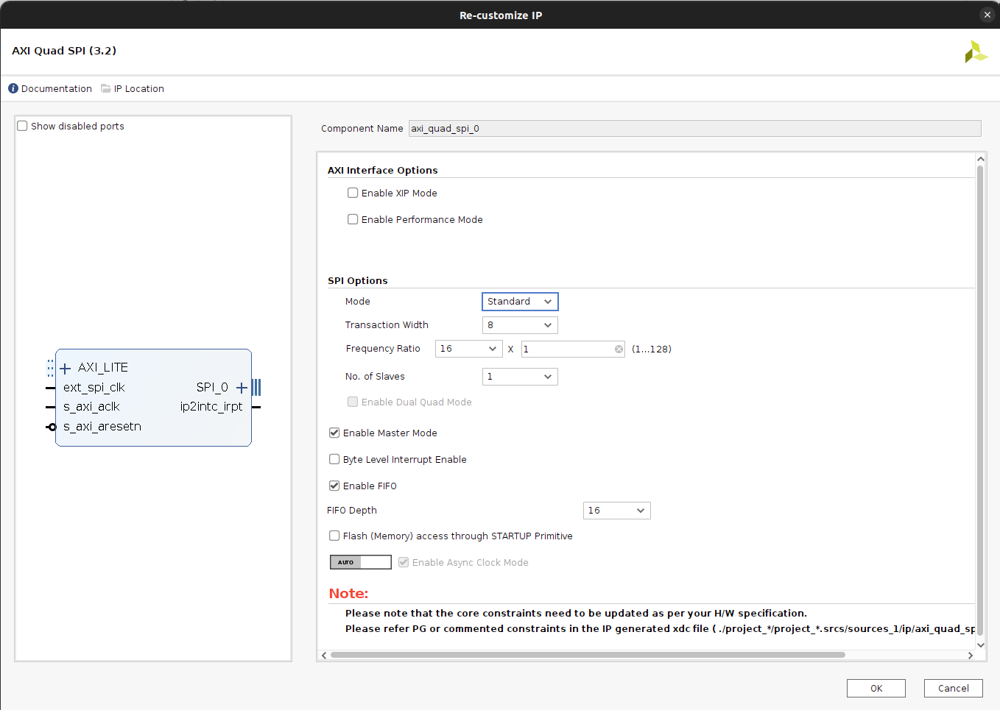
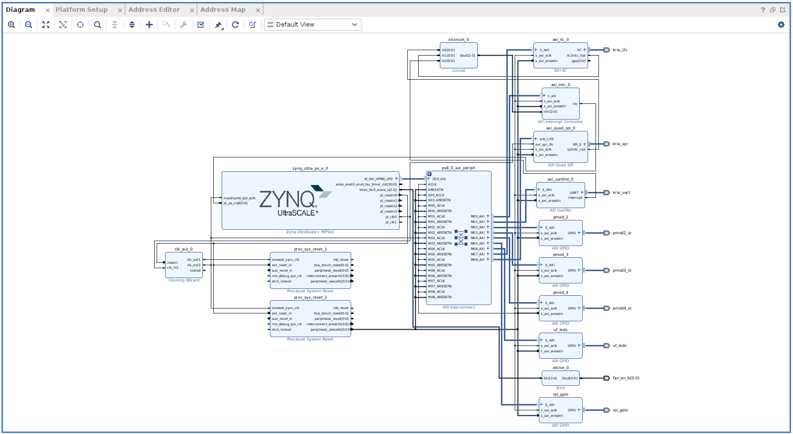
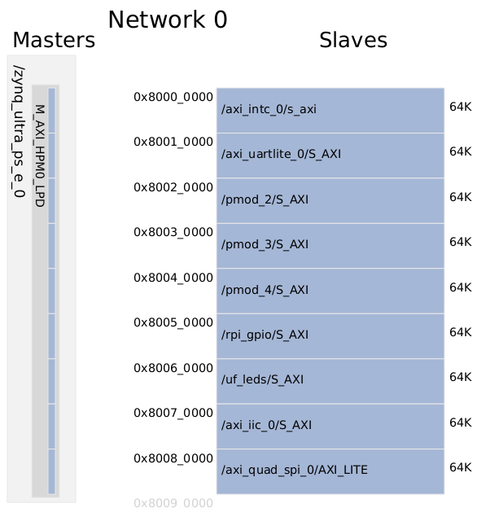
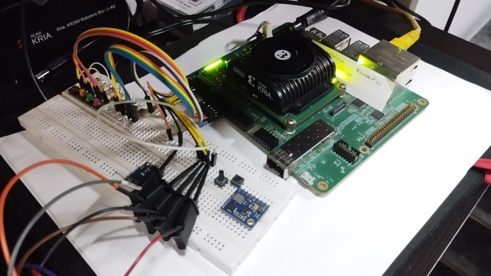
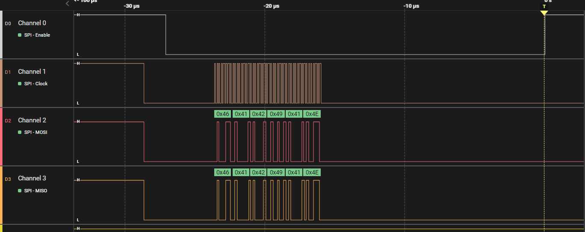
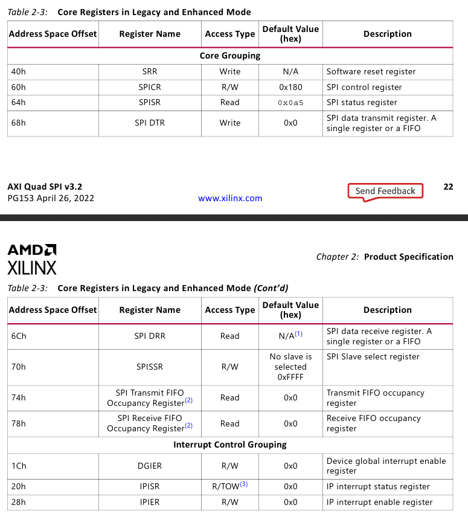

# Agregar soporte de SPI perifericos de comunicación a Kria KR260 usando Vivado 2022.2

## Tutorial paso a paso

Para este proceso seguir el siguiente [tutorial](https://www.hackster.io/LogicTronix/kria-kr260-rpi-sensehat-petalinux-tutorial-part-i-42329b).


Tambien visitar los siguientes links con información importante:

- Configuracion [UARTLite en Linux](https://xilinx-wiki.atlassian.net/wiki/pages/viewpage.action?pageId=63373739)
- Configuracion [SPI en Linux](https://xilinx-wiki.atlassian.net/wiki/spaces/A/pages/18842255/Linux+SPI+Driver)
- Configuracion [I2C en Linux](https://xilinx-wiki.atlassian.net/wiki/spaces/A/pages/18841974/Linux+I2C+Driver)

### Resumen

This post is a follow on to it (using that same Vivado 2022.2 project created in that post) that covers how to add some of the specific hardware IPCores for implementation of SPI communication in KR260 board.

## Implementación de periferico soporte AXI_QUAD_SPI

Para implementar el SPI usando la tarjeta Kria Robotics agregaremos el IPCORE `AXI Quad SPI`. Lo buscamos en el buscador de IPCORE y lo agregamos al proyecto.

Configuramos el IPCORE dando doble clic en el bloque, en esta seleccion solo modificaremos el `Mode` a `Standard` y `Transaction Width` en `8`, tambien seleccionaremos  `Enable Master Mode`.



Luego realizamos la conexión del IPCORE, en este caso solo daremos clic derecho sobre la etiqueta del `SPI_0` y luego `Make external`. Tambien es necesario conectar la interrupción del `SPI `al PS side del ZYNQ UltraSCALE+ a traves del bloque `xlconcat_0`.



En este caso se amplia el tamaño del bloque concat, se puede realizar la conexion directa del `Concat` al `AXI Interrupt Controller` y este se ajusta de forma automatica. Este luego ira al PS.

---

## Definición de Constrains

En este ejemplo utilizaremos el conector PMOD1 para realizar la conexion del SPI hacia el exterior de la KRIA.


Luego se crea el archivo de constrains `comm_spi.xdc` usando los siguientes pines

```bash
##################### PMOD 1 Upper ################################
set_property PACKAGE_PIN H12 [get_ports {kria_uart_rxd}]   
set_property IOSTANDARD LVCMOS33 [get_ports {kria_uart_rxd}] 
                                                             
set_property PACKAGE_PIN E10 [get_ports {kria_i2c_sda_io}]   
set_property IOSTANDARD LVCMOS33 [get_ports {kria_i2c_sda_io}] 
set_property PULLUP TRUE [get_ports {kria_i2c_sda_io}]
                                                             
set_property PACKAGE_PIN D10 [get_ports {kria_spi_io0_io}]   
set_property IOSTANDARD LVCMOS33 [get_ports {kria_spi_io0_io}] 
                                                             
set_property PACKAGE_PIN C11 [get_ports {kria_spi_ss_io[0]}]   
set_property IOSTANDARD LVCMOS33 [get_ports {kria_spi_ss_io[0]}] 
                                                             
##################### PMOD 1 Lower ################################
set_property PACKAGE_PIN B10 [get_ports {kria_uart_txd}]   
set_property IOSTANDARD LVCMOS33 [get_ports {kria_uart_txd}] 
                                                             
set_property PACKAGE_PIN E12 [get_ports {kria_i2c_scl_io}]   
set_property IOSTANDARD LVCMOS33 [get_ports {kria_i2c_scl_io}] 
set_property PULLUP TRUE [get_ports {kria_i2c_scl_io}]
                                                             
set_property PACKAGE_PIN D11 [get_ports {kria_spi_sck_io}]   
set_property IOSTANDARD LVCMOS33 [get_ports {kria_spi_sck_io}] 
                                                             
set_property PACKAGE_PIN B11 [get_ports {kria_spi_io1_io}]   
set_property IOSTANDARD LVCMOS33 [get_ports {kria_spi_io1_io}] 

```

> **Nota**: En este archivo de definiciones de constrains tambien se encuentran las definiciones para el UART y para el IIC.

Una vez en este punto, se procede a realizar la sintesis, implementacion y generacion de bitstream para ser cargado en el `PL`. esto generará un mapa de direcciones para el AXI por medio de los cuales se realizará la prueba de funcionamiento en la KRIA.



Como se puede observar, la direccion asignada al `axi_quad_spi` es la `0x80080000`, nosotros podemos interactuar con esta direccion usando el comando `devmem`, mas adelante en este tutorial se mostrará una forma de hacerlo.

Una vez finalizada la compilacion, generamos el bitstream y exportamos la plataforma con el nombre `kria_spi_base.xsa`

---

## Generacion de Device Tree Overlay para el PL

En la carpeta raiz del proyecto agregaremos los siguientes archivos:

- `xsct_config.tcl`

```bash
hsi::open_hw_design kria_spi_base.xsa
createdts -hw kria_spi_base.xsa -zocl -platform-name kr260_spi -git-branch xlnx_rel_v2022.2 -overlay -compile -out ./dtg_kr260_v0
exit
```

Este archivo contiene los comandos que se ejecutaran por el **Xilinx Source Commands Tool** para la creacion del **Device Tree**.

Luego, en una terminal ejecutaremos los siguientes comandos

```bash
source /tools/Xilinx/Vitis/2022.2/settings64.sh
cd /home/fabian/GitHub/KRIA_Starter_Guide/Xilinx_Prjs/Kria_SPI/
xsct xsct_config.tcl
```

Esto creará el archivo `pl.dtsi` el cual contiene la informacion del device tree, este archivo se encuentra en la direccion `./dtg_kr260_v0/dtg_kr260_v0/kr260_spi/psu_cortexa53_0/device_tree_domain/bsp/pl.dtsi`, nosotros debemos modificar este archivo para incluir el soporte `SPIDev` en el device tree, el archivo originalmente contendra el siguiente bloque de codigo que describe el `axi_quad_spi`.

```bash
axi_quad_spi_0: axi_quad_spi@80080000 {
	bits-per-word = <8>;
	clock-names = "ext_spi_clk", "s_axi_aclk";
	clocks = <&zynqmp_clk 71>, <&misc_clk_0>;
	compatible = "xlnx,axi-quad-spi-3.2", "xlnx,xps-spi-2.00.a";
	fifo-size = <16>;
	interrupt-names = "ip2intc_irpt";
	interrupt-parent = <&axi_intc_0>;
	interrupts = <0 0>;
	num-cs = <0x1>;
	reg = <0x0 0x80080000 0x0 0x10000>;
	xlnx,num-ss-bits = <0x1>;
	xlnx,spi-mode = <0>;
};
```

Luego, debemos modificar este bloque de codigo para agregar el soporte `SPIDev` agregando el siguiente bloque de codigo, este deberia lucir como sigue:

```bash
axi_quad_spi_0: axi_quad_spi@80080000 {
	bits-per-word = <8>;
	clock-names = "ext_spi_clk", "s_axi_aclk";
	clocks = <&zynqmp_clk 71>, <&misc_clk_0>;
	compatible = "xlnx,axi-quad-spi-3.2", "xlnx,xps-spi-2.00.a";
	fifo-size = <16>;
	interrupt-names = "ip2intc_irpt";
	interrupt-parent = <&axi_intc_0>;
	interrupts = <0 0>;
	num-cs = <0x1>;
	reg = <0x0 0x80080000 0x0 0x10000>;
	xlnx,num-ss-bits = <0x1>;
	xlnx,spi-mode = <0>;
	spidev@0x00 {
		status = "okay";
		compatible = "rohm,dh2228fv";
		spi-max-frequency = <25000000>;
		reg = <0>;
	};
};
```

Una vez finalizada esta configuracion, procedemos a creat el device tree `pl.dtbo` usando los siguientes comandos:

- `DT_generation.sh`

```bash
echo ""
echo ""
echo "#############################################################################"
echo "Compilacion del device tree"
echo "#############################################################################"
echo ""
echo ""

source /tools/Xilinx/Vitis/2022.2/settings64.sh
cd /home/fabian/GitHub/KRIA_Starter_Guide/Xilinx_Prjs/Kria_SPI/

dtc -@ -O dtb -o ./dtg_kr260_v0/dtg_kr260_v0/kr260_spi/psu_cortexa53_0/device_tree_domain/bsp/pl.dtbo ./dtg_kr260_v0/dtg_kr260_v0/kr260_spi/psu_cortexa53_0/device_tree_domain/bsp/pl.dtsi
cd /home/fabian/GitHub/KRIA_Starter_Guide/Xilinx_Prjs/Kria_SPI/spi_file_transfer/
cp ../dtg_kr260_v0/dtg_kr260_v0/kr260_spi/psu_cortexa53_0/device_tree_domain/bsp/pl.dtbo ./ & cp ../Kria_SPI.runs/impl_1/kria_bd_wrapper.bin ./
mv kria_bd_wrapper.bin kr260_spi.bit.bin
mv pl.dtbo kr260_spi.dtbo

echo ""
echo ""
echo "#############################################################################"
echo "Envio de archivos a la Kria"
echo "#############################################################################"
echo ""
echo ""

echo petalinux | scp kr260_spi.bit.bin kr260_spi.dtbo shell.json petalinux@192.168.1.12:/home/petalinux
```

Este script permite cargar el device tree a la Kria.

---

## Run PL Design on KR260

After the files have been successfully transferred to the KR260, create a directory in the `/lib/firmware/xilinx` directory with the same name as was given to the device tree blob and .bin file and copy them into it:

```bash
xilinx-kr260-starterkit-20222:~$ sudo mkdir /lib/firmware/xilinx/kr260_spi
xilinx-kr260-starterkit-20222:~$ sudo mv kr260_spi.dtbo kr260_spi.bit.bin shell.json /lib/firmware/xilinx/kr260_spi
```

At this point, the PL design will show up just like an accelerated application would using the xmutil commands:

```bash
xilinx-kr260-starterkit-20222:~$ sudo xmutil listapps
```

Unload the default application then load the PL design which flashes the PL design’s bitstream into the PL and loads its device tree overlay:

```bash
xilinx-kr260-starterkit-20222:~$ sudo xmutil unloadapp
xilinx-kr260-starterkit-20222:~$ sudo xmutil loadapp kr260_spi
```

Una vez aqui, ya puede verificar el montaje del **SPI** decive en el PS mediante el siguiente comando:

```bash
xilinx-kr260-starterkit-20222:~$ ls /dev | grep spi
```

Debe recibir la siguiente respuesta:

```bash
xilinx-kr260-starterkit-20222:~$ ls /dev | grep spi
spidev3.0
```

Donde `spidev3.0` corresponde al periferico agregado para controlar el SPI desde el PS.

Tambien es necesario darle los permisos necesarios para ejecutar y controlar el periferico

```bash
sudo chmod 777 /dev/spidev3.0
```

Con esto ya tenemos acceso a controlar el periferico `AXI_QUAD_SPI` desde el PS.

---

## Testing AXI Quad SPI

Para realizar este test realizaremos la siguiente conexion, realizaremos un loop entre el `MOSI` y el `MISO` para leer los datos enviados desde el PS.



Realizaremos la instalacion del paquete `spidev` de `python` utilizando el siguiente comando.

```python
python -m pip install spidev
```

### Código de Python

Se creará el archivo `spitest.py` con el siguiente script.

```python
#!/usr/bin/env python3
# vim: expandtab ts=4 sw=4

import spidev

# Carga del objeto spi
spi = spidev.SpiDev()   
# Apertura del spi en el Bus 3 y el dispositivo 0   
spi.open(3, 0)  
# Configuracion del reloj a 5 MHz   
spi.max_speed_hz = 5000   
# Configuracion del modo de operacion del spi   
spi.mode = 0b01  

# Codificacion del mensaje a enviar en ASCII
data = 'FABIAN'.encode('utf-8')  
# Transferencia, realiza escritura y lectura del bufer, solo dispara un cs por el mensaje completo 
rec=spi.xfer(data)       
print(rec)  

```

Como respuesta a este codigo se recibe `[70, 65, 66, 73, 65, 78]`, los cuales representan en el codigo ASCII `['F', 'A', 'B', 'I', 'A', 'N']`

Tambien podemos observar los pulsos enviados por el periferico a traves de un Logic Analyzer



---

### Uso del comando devmem para interactura con el SPI

Es posible interactuar con el periferico spi a traves del uso del comando `devmem` de Linux, para esto es necesario conocer la direccion asignada al periferico (en nuestro caso `0x80080000`) y el mapeo de registros del IP, esta informacion se encuentra disponible en la documentacion del IP, a continuacion se muestra el mapa de registros extraido desde la documentacion oficial.



Y asiciado a esto se encuentra un  mapa de bits, el cual los invito a consultarlo en la documentacion oficial para que puedan configurar el SPI como mejor se ajuste a su aplicacion. A continuacion se deja un codigo que muestra la interaccion con el `axi_quad_spi` usando `devmem`.

```bash
#!/bin/sh

# 1. Basic Initialization
echo ""
echo "Read and clear interrupts"
devmem 0x80080020                                # to clear interrupts - 1
devmem 0x80080070 32 0xffffffff                  # clear SS - 1
devmem 0x80080060 32 0x180 # 0x1e6                       # inhibit transaction -1

# 2. Setup for multi-byte
# ~> Default is fine: devmem 0x8008001C 32 0x00000000           # configure DGIER (Device Global Int En Reg) - 2
# ~> Default is fine: devmem 0x80080028 32 0x00000000           # configure IPIER (IP Int En Reg) - 2

# 3. and 4.
devmem 0x80080060 32 0x00000000          # write data to master SPICR

# 5. Select the slave
devmem 0x80080070 32 0xfffffffe          # set SS - 5

# 6. and 7. Send Transaction
devmem 0x80080068 8 0xDE
devmem 0x80080068 8 0xAD
devmem 0x80080068 8 0xBE
devmem 0x80080068 8 0xEF
devmem 0x80080068 8 0x40
devmem 0x80080068 8 0x48

# deactivate SS
# devmem 0x80080070 32 0xffffffff          # set SS - 5

echo "read status"
devmem 0x80080064

echo "read Data"
devmem 0x8008006C
devmem 0x8008006C
devmem 0x8008006C
devmem 0x8008006C
devmem 0x8008006C
devmem 0x8008006C

echo ""
echo "Read out buffer occupancy: x \+ 1 = number of bytes"
devmem 0x80080074                                        # read out fifo - 6 and 7

echo ""
echo "Send buffer"
devmem 0x80080060 32 0x86                                # write data to master SPICR - 8

echo ""
echo "Read and clear interrupts"
devmem 0x80080020

echo ""
echo "Read and clear interrupts"
devmem 0x80080064                                        # Read SPISR reg - 11 and 12

```


---

### Configuracion automatica del periferico

Para correr el codigo crearemos el siguiente archivo `spi_config.sh` de bash para configurar, montar y probar el periferico serial.

```bash
echo "################################################"
echo " ------ Configuracion de Comunicaciones -----"
echo "################################################"

echo petalinux | sudo -S xmutil unloadapp  # despues del echo va el password para el "sudo" y el comando>
echo petalinux | sudo -S xmutil loadapp kr260_spi
echo petalinux | sudo -S chown petalinux:petalinux /dev/spidev3.0
echo petalinux | sudo -S chown petalinux:petalinux /dev/i2c-7
echo petalinux | sudo -S chown petalinux:petalinux /dev/ttyUL0
echo petalinux | sudo -S chmod 777 /dev/spidev3.0
echo petalinux | sudo -S chmod 777 /dev/i2c-7
echo petalinux | sudo -S chmod 777 /dev/ttyUL0

echo "################################################"
echo " ------ Inicio de prueba serial python ------ "
echo "################################################"

python Serial_test.py

echo "################################################"
echo " ------ Finalizacion de prueba serial ------ "
echo "################################################"


echo "################################################"
echo " ------ Inicio de prueba iic python ------ "
echo "################################################"

python bh1750_iic.py

echo "################################################"
echo " ------ Finalizacion de prueba iic ------ "
echo "################################################"


echo "################################################"
echo " ------ Inicio de prueba spi python ------ "
echo "################################################"

python spitest.py

echo "################################################"
echo " ------ Finalizacion de prueba spi ------ "
echo "################################################"
```

---
